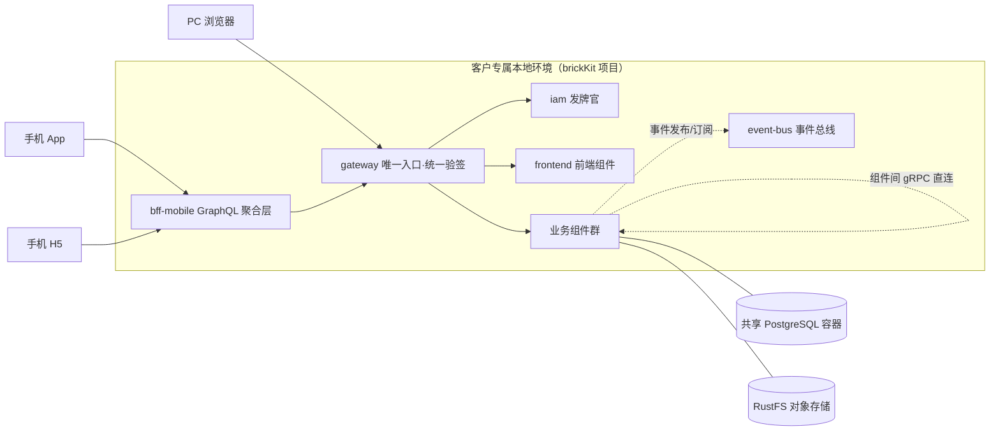
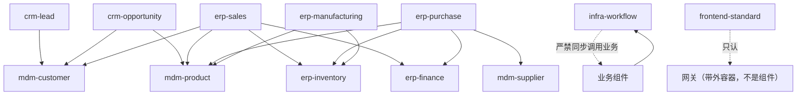
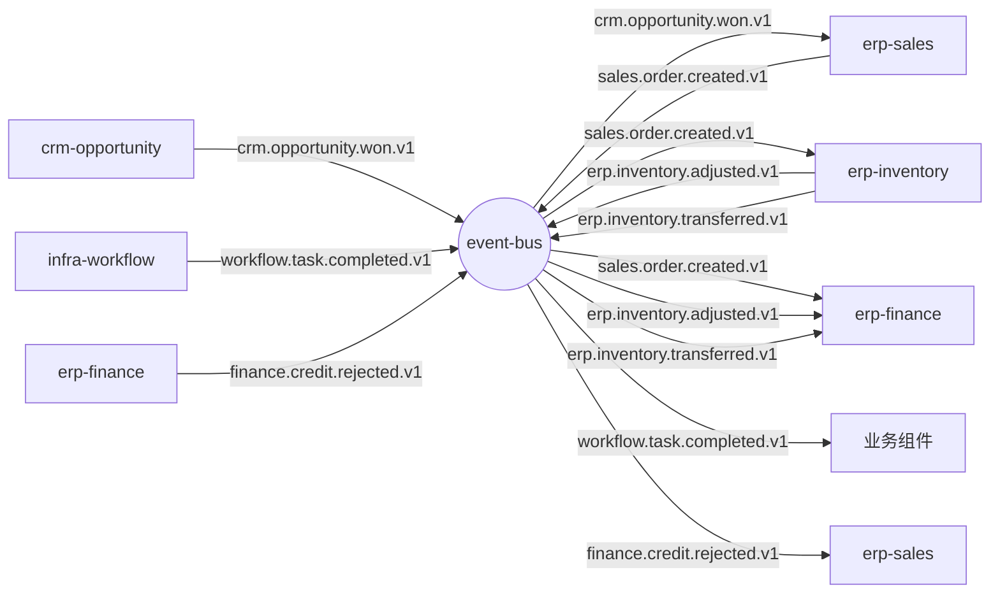
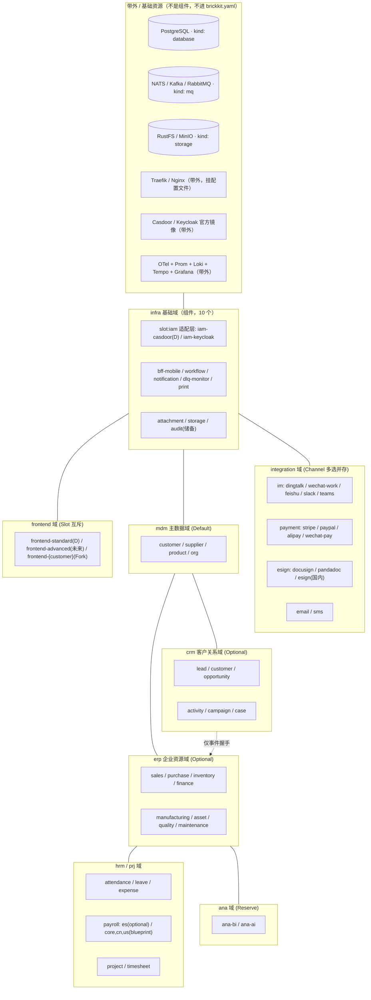
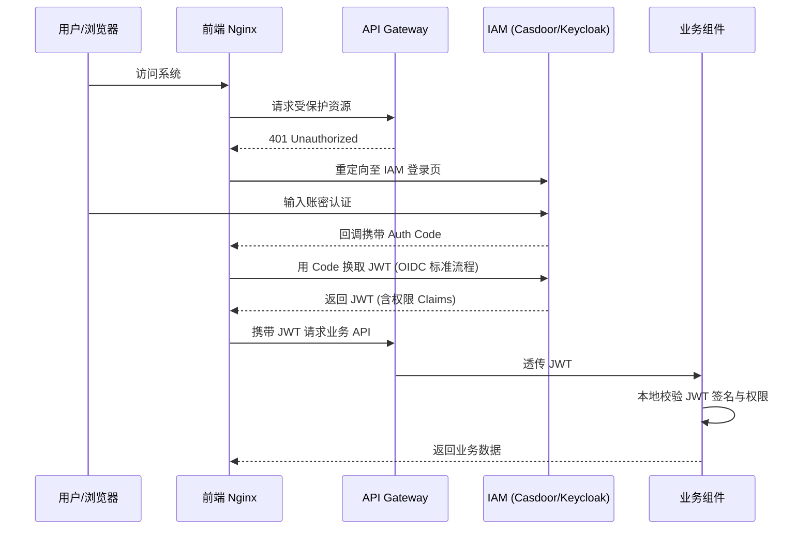
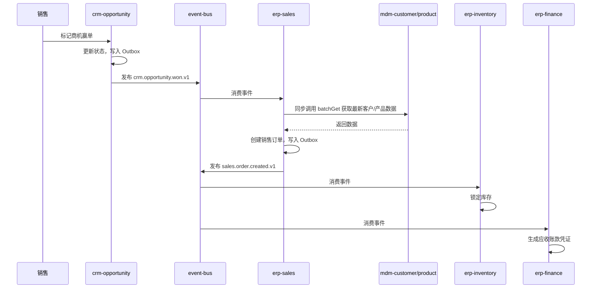
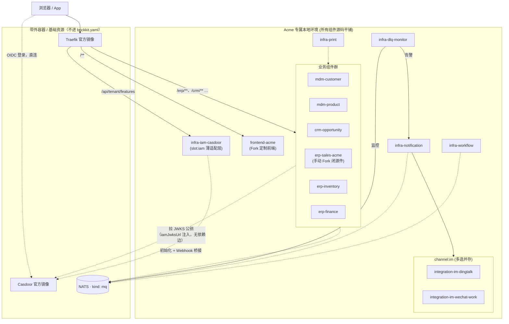

# BrickEnterprise 设计书

基于 brickKit 平台的企业级组件化 ERP/CRM 系统规范性文档。

平台层以 brickKit 平台设计书为准；业务层以本书为准。

`yaml` 字段为语义字段，与平台骨架命名不同时做映射——语义才是契约。

---

## 第 0 章 · 如何阅读本书

第 1 章 为什么 ，第 2 章 形态 ，第 3 章 组件契约与资产规范 ，第 4 章 交通规则 ，第 5 章 全量组件军火库与职责说明 ，第 6 章 基础设施砖细节 ，第 7 章 可观测性与诊断纪律 ，第 8 章 AI-Native 开发样板 ，第 9 章 仓库与交付治理 ，第 10 章 决策总表 ，第 11 章 数据生命周期与冷热分层治理 ，第 12 章 多语言战略与技术栈选型 ，第 13 章 高维合并部署与渐进式微服务演进 ，附录为图与术语。

**只有一处必须先读：§1.5 两条不可让渡的开发原则。** 其余全书都是细节，都可以改；那两条不能。读的人如果只记住一句话，记这个：**先把每块砖当纯组件真做出来并单独跑通（gRPC 一个不省），再用我们自己的外壳合并部署——顺序不能颠倒，合并不能反过来污染开发。**

**四把尺子：**

- **选配测试**：客户愿单独付钱、或永远用不到 → 才独立成砖。
- **三测试**：统一语言 / 变化原因 / 数据所有权，定边界。
- **占用/知道测试**：占用走同步，知道走事件。
- **契约驱动测试**：前后端物理分离，跨边界只传递契约（Types/SDK），不传递 UI 组件。

---

## 第 1 章 · 我们为什么造这个系统

### 1.1 病根与真相

单体 ERP/CRM 功能大而全，单企业 80% 用不到，却付出学习/部署/维护三重成本；定制牵一发而动全身。Odoo、ERPNext 等证明业务可模块化，但其模块同住一个进程/库，边界是软约束，天天被破坏。

而在传统的微服务改造中，前端往往被迫跟随后端进行"组件化拆分+壳应用组装"，这在深度定制的 ToB 项目交付中会导致严重的"胶水代码地狱"与 UI 割裂，扼杀交付敏捷性。

**ToB 交付的终极真相**：80% 的功能是通用的，但 20% 的业务逻辑（如算薪、审批流、特定行业规则）是极度个性化且频繁变动的。试图用一套"通用代码"覆盖所有客户的个性化逻辑，注定失败。

### 1.2 答案：全量军火库 + 按需装配 + 契约锁死 Fork

在 brickKit 之上造全量组件军火库 + 组装方法论：

- **全量开发**：平台方会开发所有主流的基础设施替换件（如 IAM 的多种实现）、多国业务适配件（如西班牙薪资）、多渠道集成件（钉钉/企微/飞书/Slack、多种支付方式、多种电子签）、多套前端组件（标准前端、高级前端等）。所有组件均真实开发、真实测试，而非占位符。
- **按需装配**：最终交付给客户的 ERP，只是从军火库中"勾选"一组 Default 组件拼装而成。
- **契约锁死 Fork**：如果客户的业务逻辑超出 Default 组件能力，我们不修改标准件，而是由主管理员手动 Fork 出一个客户私有仓库。定制件内部逻辑随便改（甚至用 AI 重写），但对外契约（Protobuf/OpenAPI/事件 Schema）必须与标准件保持向后兼容（允许在末尾追加新字段/新接口，严禁删除字段、修改类型或改变 Tag 编号等破坏性变更），从而实现无缝热替换。

**交付物** = 全量组件军火库（后端砖 + 前端砖）+ 每企业专属本地环境（装配结果）+ 本书（规范）。

brickKit 把 DDD 边界从代码规范变成物理墙：独立程序/库/仓库，想跨组件 JOIN 都做不到。

### 1.3 哲学

- **平台只做连接器和翻译官**：业务归组件，前端工程化归前端工具链，brickKit 绝不越界干涉前端构建。
- **【已修改】核心商业逻辑归后端，交互与视图逻辑归前端**：后端组件化沉淀核心资产规则（如价格计算、库存防超卖、信用额度、状态机流转）；前端负责表单 UI 交互、字段联动、本地草稿缓存。对于复杂的跨域表单联动，前端通过 SDK 调用后端的"试算（Dry-Run）API"获取计算结果，严禁前端硬编码核心商业规则。
- **契约先于实现**：后端提供 gRPC/HTTP 契约，前端通过工具链或 AI 编写消费契约。组件可换，契约不变。
- **动态适配，优雅降级**：前端运行时拉取后端组件启停状态（Feature Toggles），动态注册路由与菜单。缺失组件自动隐藏，拒绝构建期硬绑定。
- **全面拥抱 AI-Native 开发**：`brickKit` 保持极致克制。所有样板代码优先使用现有工具链生成，无工具时由 AI 直接编写。定制分支中的复杂业务逻辑由 AI 根据客户需求文档生成，人类审查。契约由 AI 编写，人类审查，业务仓库本地 CI 门禁锁死。三者缺一不可。

### 1.4 六句话宪法

1. 货架按选配测试切。
2. 边界按三测试切。
3. 血管按占用/知道切。
4. 内部通信 gRPC，外部通信 HTTP/GraphQL。
5. 同步图必须无环，且同步失败必有补偿。
6. 三枢纽：mdm=只读枢纽，inventory=物理命令枢纽，finance=事件汇枢纽；CRM 与 ERP 零同步边，仅事件握手，可独立拔插。

### 1.5 两条不可让渡的开发原则

全书其余部分都是细节，可以随时间修改。这两条不行——它们是这套东西存在的理由，也是第 13 章（合并部署）能成立的**前提**而不是它的替代品。

#### 原则一：每个组件都以纯 brickKit 组件形态开发，并独立跑通

**"最终会被合并进外壳"绝不能成为任何一处偷工减料的理由。** 每个组件在写完的那一刻，都必须是一块能单独 `brickkit up` 起来、能被单独调用、能被单独拔掉的砖：

| 要求 | 具体含义 | 为什么不能省 |
| --- | --- | --- |
| **gRPC 服务真实实现** | `extraPorts` 里声明的 gRPC 端口必须真的 `Listen`，`contracts/*.proto` 里的每个 rpc 必须真的能被跨进程调通（含 `batchGet`） | 合并进外壳后，同一个 Go 进程里的两个模块**仍然必须通过 gRPC/HTTP 互相调用**，不许直接函数调用（原则二）。gRPC 是逻辑边界的物理载体，省掉它就等于合并那一刻边界消失，再也拆不回去 |
| **HTTP 主端口真实实现** | `deployment.port` 上的 REST API + `/healthz` | 网关与前端只认它 |
| **迁移真实且幂等** | `migration.command` 能被平台单独调起，也能被外壳串行调起，两条路径下都可重跑 | 13.3 铁律五 |
| **事件真实收发** | Outbox 写库 + 发到 NATS + 消费幂等 | 合并后外壳只是换了个地方跑 Outbox 推送线程，协议一个字不变 |
| **配置只从环境变量来** | `configSchema` + 平台注入，代码里零硬编码地址 | 13.3 铁律一 |
| **能单独 `brickkit up` 起来** | 只装这一个组件（连同它的强依赖树）就能跑起来、能被 curl / grpcurl 打通 | 这是"它是一块砖"的唯一证明 |

**顺带要验的是 brickKit 自己。** 我们既是平台的作者也是它的第一个真实用户；每块砖单独跑通的过程，就是对平台的验收。见 §9.6。

#### 原则二：合并只发生在部署形态上，组件完整性一步不让

合并部署（第 13 章）是**交付期的部署选择**，不是开发期的架构选择。外壳是我们自己造的、平台完全不知道的东西（brickKit 明确不做，`012` §2.21）。它可以做的事只有一件：**把 N 个进程变成 1 个进程**。它不许做的事：

- ❌ 不许让两个组件模块直接互相 `import`（13.3 铁律六）
- ❌ 不许把两个组件的表放进同一个 schema、不许跨 schema JOIN（13.3 铁律二）
- ❌ 不许把 N 个模块的 API 合并成一个端口（13.3 铁律三）
- ❌ 不许在外壳里写任何业务逻辑

判断一次合并做对了没有，只有一个检验动作：**把 `local: true` 去掉，`brickkit up` 一次，本次装配的全部组件各起一个容器、业务闭环照样跑通。** 做不到就说明合并那一刻磨掉了组件性。§13.7 把这个检验固化成一条必须周期性执行的门禁。

---

## 第 2 章 · 总体架构

### 2.1 端云分离与多端策略

手机 App、PC 浏览器是消费者，不是部署单元；App 不进装配清单。

机器之间（后端组件互调）走内网版本化 DNS + gRPC；浏览器走网关公共路径（HTTP/REST），移动端走 BFF（GraphQL）。

⚠️ **地址格式没有 `grpc://` 这种东西。** 平台注入的值**恒为 `http://` 开头**，额外端口也一样：

```
ERP_SALES_ENDPOINT=http://erp-sales-1-0-0:8080        # deployment.port
ERP_SALES_GRPC_ENDPOINT=http://erp-sales-1-0-0:9090   # extraPorts 里那个 name: grpc
```

额外端口的变量名是 `{组件ID推导的前缀}_{额外端口名大写}_ENDPOINT`。**gRPC 客户端拿到这个值必须自己剥掉 scheme**（`strings.TrimPrefix(v, "http://")`）——`grpc.Dial("http://host:9090")` 连不上，而报错信息指向名称解析，非常难联想到是这里。这一条写进每个组件的 SDK/基础库，只做一次。

⚠️⚠️ **但「恒为 `http://` 开头」只对「组件依赖的地址」成立，资源变量不是这样。** 平台注入资源连接信息时用的是另一套值（brickKit `internal/inject`）：

| 变量 | 值的格式 | 例 |
| --- | --- | --- |
| `{组件前缀}_ENDPOINT` / `{组件前缀}_{端口名}_ENDPOINT` | **带 scheme** `http://<版本化服务名>:<端口>` | `http://mdm-customer-1-0-0:9090` |
| **`STORAGE_ENDPOINT`** | **裸 `host:port`，没有 scheme** | `host.docker.internal:9000` |
| `DATABASE_HOST` / `DATABASE_PORT` / `MQ_HOST` / `MQ_PORT` / `SEARCH_HOST` / `SMTP_HOST` … | 主机与端口**分开两个变量** | —— |

**`STORAGE_ENDPOINT` 是唯一一个名字里带 `ENDPOINT`、却不带 scheme 的**。S3 SDK 通常要一个完整 URL，所以基础库里对它的处理与组件地址**正好相反：要加 scheme，不是剥**。两个函数必须分开，不能共用一个（§附录 I「地址格式」）。

**多端分流原则（默认策略 + 例外规则）：**

默认情况下：
- **移动端（App / H5）**：由于弱网和聚合需求，优先经过 GraphQL BFF 层裁剪。采用 Uni-app（Vue3）构建。
- **PC 端（Web）**：直连网关，标准 Vue3 SPA，使用 HTTP/REST。

例外规则：
- 移动端简单页面（如单组件查询、内网 PDA 扫码）也允许直接走 Gateway HTTP/REST，不必强制走 BFF。
- PC 端复杂聚合页面（如经营驾驶舱、客户 360° 视图、跨域 Dashboard）也允许走 BFF/GraphQL。

**真正的铁律**：所有外部流量（无论移动端还是 PC 端）都必须经过 Gateway，严禁让浏览器或 App 直连后端组件。

**REST 与 GraphQL 的划分依据**：不是按"PC/移动端"绝对划分，而是按"简单资源访问/复杂聚合视图"划分。默认情况下，PC 更常见简单资源访问，移动端更常见复杂聚合与裁剪。

**代码共享策略**：PC 端与移动端共享 `packages/shared-types`（TypeScript 接口）和 `packages/api-client`（请求管线）。视图层完全分离，各自独立优化。

### 2.2 运行时拓扑



### 2.3 前端架构：前端也是组件，参与装配

前端不是客户自己写的，而是平台方开发的组件，参与 `brickkit.yaml` 装配。客户提需求，我们在标准前端组件上修改，甚至完全重新设计。

**核心原则：**

- **前端是组件**：前端仓库（如 `frontend-standard`）是一个组件，有 `component.yaml`，参与 `brickkit.yaml` 装配，装配角色为 `slot:frontend`。
- **前端可替换**：我们可以提供多套前端组件（标准前端、高级前端、行业定制前端），客户选择装配。同一环境只能装一套前端（`slot` 互斥）。
- **前端可 Fork**：如果客户需要深度定制前端交互或视觉，主管理员在客户电脑本地复制前端组件目录为定制目录（如 `frontend-standard` → `frontend-acme`），在定制目录中修改前端代码。
- **【已修改】前后端逻辑边界划分**：前端组件负责"展示聚合"、"视图渲染"及"表单交互逻辑"（如正则校验、字段联动显隐、本地草稿缓存、防抖节流）。核心商业计算（如价格计算、防超卖）、跨域事务处理必须在后端组件里。前端可通过 SDK 调用后端的试算（Dry-Run）或预校验 API 实现复杂联动，严禁前端硬编码核心商业规则（如折扣公式）。

**前端组件仓库结构：**

```
frontend-standard/                      # 默认前端组件（平台方开发）
  ├── component.yaml                      # 组件身份证（参与装配）
  ├── apps/
  │   ├── pc-web/                         # PC 端（Vue3 SPA）
  │   │   ├── src/
  │   │   │   ├── modules/                # 每个后端组件对应一个前端模块
  │   │   │   │   ├── erp-sales/          # 订单列表、订单详情、创建订单
  │   │   │   │   ├── erp-inventory/      # 库存台账、出入库单
  │   │   │   │   ├── erp-finance/        # 凭证、应收应付
  │   │   │   │   ├── crm-lead/           # 线索列表、线索详情
  │   │   │   │   ├── crm-opportunity/    # 商机看板、漏斗
  │   │   │   │   ├── mdm-customer/       # 客户列表、客户详情
  │   │   │   │   ├── mdm-product/        # 产品列表、分类管理
  │   │   │   │   ├── hrm-attendance/     # 打卡、排班
  │   │   │   │   ├── workflow/           # 待办列表、审批历史
  │   │   │   │   └── ...                 # 与后端组件一一对应
  │   │   │   ├── layouts/                # 布局（侧边栏、顶栏）
  │   │   │   ├── router/                 # 动态路由（读取 /api/tenant/features）
  │   │   │   └── App.vue
  │   │   └── vite.config.ts
  │   └── mobile/                         # 移动端（Uni-app）
  │       ├── pages/
  │       │   ├── erp-sales/
  │       │   ├── crm-opportunity/
  │       │   └── ...
  │       └── manifest.json
  ├── packages/
  │   ├── shared-types/                   # TypeScript 接口（由契约生成）
  │   ├── api-client/                     # 请求管线（由契约生成）
  │   ├── ui-kit/                         # 基础 UI 组件（按钮、表格、表单）
  │   └── feature-flags/                  # 动态特性路由
  ├── docker/
  │   └── Dockerfile                      # 构建产物打包为 Nginx 镜像
  ├── Makefile
  └── README.md
```

**前端组件与后端组件的对应关系：**

| 后端组件 | 前端模块目录 | 标准页面 |
|---|---|---|
| erp-sales | modules/erp-sales/ | 订单列表、订单详情、创建订单、订单审批 |
| erp-inventory | modules/erp-inventory/ | 库存台账、出入库单、库存盘点 |
| erp-finance | modules/erp-finance/ | 凭证列表、应收应付、对账报表 |
| crm-lead | modules/crm-lead/ | 线索列表、线索详情、线索转化 |
| crm-opportunity | modules/crm-opportunity/ | 商机看板、漏斗分析 |
| mdm-customer | modules/mdm-customer/ | 客户列表、客户详情、联系人管理 |
| mdm-product | modules/mdm-product/ | 产品列表、产品详情、分类管理 |
| hrm-attendance | modules/hrm-attendance/ | 打卡记录、排班表、加班统计 |
| infra-workflow | modules/workflow/ | 待办列表、审批历史 |
| ... | ... | ... |

**动态特性路由（Feature Toggles）**：前端启动时调用 `GET /api/tenant/features`，后端根据 `brickkit.yaml` 装配清单返回启用的组件列表。前端基于该列表动态注册路由和渲染菜单，未启用的组件自动隐藏，实现优雅降级。

**brickKit 视角的极简**：前端组件仓库自带 CI/CD，构建产物打包为 Nginx Docker 镜像。在 `brickkit.yaml` 中，它是一个普通的组件（`port: 80`），参与装配。

### 2.4 部署边界模型

一项目 = 一企业一环境 = 一 namespace；label 管业务房间；依赖图管对话权。前端 Nginx 容器与后端微服务容器同等对待，由 brickKit 统一编排 Ingress/路由。

**本地化部署铁律**：每个客户拥有专属电脑（本地服务器），所有组件（开源标准件和闭源 Fork 件）的源码全部平铺在客户电脑本地，所有构建在本地完成，不涉及任何远程私有 Registry（如 Harbor/ACR）。

### 2.5 域地图与两轴推导

- **轴线一（名词/动词）**：慢变化的存在归 `mdm`，快变化的发生归交易域。
- **轴线二（对外/对内）**：CRM 灵活容忍，ERP 严谨强一致。

得 **九域**：`infra` / `integration` / `mdm` / `crm` / `erp` / `hrm` / `prj` / `ana` / `frontend`。

### 2.6 三枢纽与可拔插性

`mdm` 被所有人读、自己不调任何人；`inventory` 是所有动物命令的唯一写者；`finance` 几乎只被命令+听事件。CRM 与 ERP 无同步边，仅事件握手。

**关键澄清**：`erp-inventory` 与 `erp-finance` 之间没有直接的依赖边（既无同步调用，也无事件订阅）。它们是平行组件，在涉及实物变动的交易场景中，由同一个上游（如 `erp-sales` 或 `erp-purchase`）同时触发。业务上必然同时出现，技术上平行独立。

**核心交易域拆分原则**：逻辑上必须拆分（独立契约、独立事件、独立数据所有权），物理上可以渐进。拆分的核心目的不是"微服务化"，而是为未来所有新组件提供清晰的"数据窗口"和"事件订阅点"。

### 2.7 基础资源清单与环境配置

基础资源是非组件的外部服务，它们不需要我们写业务代码，只需要部署官方镜像。所有组件（无论默认还是选配）都运行在这些基础资源之上。

开发/交付前，必须先把基础资源跑起来。**brickKit 不部署它们，也不做启动前的可达性探测**（`006` §8、§9.1）。

#### 2.7.0 三种形态，先分清楚

本节里的东西不是同一类。混在一张表里读会得出错误结论（"网关是个组件"），所以先分：

| 形态 | 平台怎么看它 | 怎么声明 | 换实现的动作 | 本节里的例子 |
| --- | --- | --- | --- | --- |
| **A. brickKit 基础资源** | 认识它，注入连接变量 | `brickkit.yaml` 的 `resources` | 见 §2.7.3.1（⚠️ **不是「改一个字段」**） | PostgreSQL、NATS/Kafka/RabbitMQ、RustFS/MinIO |
| **B. 带外容器** | **完全不知道它存在** | 我们自己的 `docker-compose.infra.yml` | 改我们那份 compose | Traefik/Nginx、Casdoor/Keycloak、Grafana 全家桶 |
| **C. 组件** | 普通组件 | `brickkit.yaml` 的 `components` | 改装哪一个 | `infra-storage`、`infra-attachment`、`infra-iam-casdoor` 适配层 |

**为什么 Casdoor 和 Traefik 只能是 B**：平台的资源 `kind` 是**封闭清单**——`database` / `cache` / `mq` / `storage` / `search` / `smtp`，没有 `gateway` 也没有 `iam`（`006` §2.1）。平台"认识"一种资源靠的就是知道该注入哪几个变量，不认识的 kind 会被当场拦下。所以这两个东西**在 `brickkit.yaml` 里根本写不出来**。

Traefik 还多一条：平台的 Manifest **没有 volumes 字段**，网关的配置文件挂不进去，它也当不了组件。

#### 2.7.1 基础资源总览

| # | 资源 | 形态 | 官方镜像 | 端口 | 是否默认 | 被谁依赖 | 说明 |
|---|---|---|---|---|---|---|---|
| 1 | PostgreSQL | **A** `kind: database` | postgres:16-alpine | 5432 | ✅ 默认 | 所有组件 | 共享单一 Database + 每组件独立 Schema |
| 2 | NATS | **A** `kind: mq` | nats:2.10-alpine | 4222 / 8222 | ✅ 默认 | 所有需要事件的组件 | 组件读 `MQ_HOST` / `MQ_PORT` |
| 3 | Traefik | **B** 带外 | traefik:v3.0 | 80 / 443 / **28080** | ✅ 默认 | 所有外部流量 | 平台没有 `gateway` 这个 kind，也挂不了配置文件。⚠️ Dashboard 端口从 8080 挪到 28080，理由见本表下方 |
| 4 | Casdoor | **B** 带外 | casbin/casdoor:latest | 8000 | ✅ 默认 | 浏览器（OIDC 直连） | 平台没有 `iam` 这个 kind。适配层 `infra-iam-casdoor` 是形态 C |
| 5 | RustFS | **A** `kind: storage, engine: s3` | rustfs/rustfs:latest | 9000 | ✅ **默认** | infra-attachment / infra-storage | 组件读 `STORAGE_ENDPOINT`（裸 `host:port`，**没有 scheme**，§2.1） |
| 6 | MinIO | **A** 同上（`engine: s3`） | minio/minio:latest | 9000 / 9001 | ❌ 可选 | 同上 | 替换 RustFS。`engine` 两边都是 `s3`，**只改 host/port/凭据，真正零改动**（§2.7.3.1） |
| 7 | Keycloak | **B** 带外 | quay.io/keycloak/keycloak:latest | **28081** | ❌ 可选 | 同上 | 替换 Casdoor，同时换 `slot:iam` 适配层组件。⚠️ 从 8080 挪开，理由见本表下方 |
| 8 | Kafka | **A** `engine: kafka` | confluentinc/cp-kafka:latest | **29092** | ❌ 可选 | 同上 | 替换 NATS。⚠️ **不是「改一个字段」**：`engine` 逐字参与匹配，58 份 `component.yaml` 都要改，且客户端库不同（§2.7.3.1）。端口从 9092 挪开，理由见本表下方 |
| 9 | RabbitMQ | **A** `engine: rabbitmq` | rabbitmq:3.13-management | 5672 / 15672 | ❌ 可选 | 同上 | 同上。RabbitMQ 才有 `MQ_VHOST`，NATS/Kafka 不写这一格 |
| 10 | Nginx | **B** 带外 | nginx:1.25-alpine | 80 / 443 | ❌ 可选 | 同上 | 替换 Traefik |
| 11 | OTel Collector | **B** 带外 | otel/opentelemetry-collector-contrib:latest | 4317 / 4318 | ❌ 可选 | 所有组件（可观测性） | 平台没有 `telemetry` 这个 kind；且它要挂 `config.yaml`。不装时组件走 Blackhole Exporter |
| 12 | Prometheus | **B** 带外 | prom/prometheus:latest | **29090** | ❌ 可选 | OTel Collector | 同上，指标后端。⚠️ 从 9090 挪开，理由见本表下方 |
| 13 | Loki | **B** 带外 | grafana/loki:latest | 3100 | ❌ 可选 | OTel Collector | 同上，日志后端 |
| 14 | Tempo | **B** 带外 | grafana/tempo:latest | 3200 | ❌ 可选 | OTel Collector | 同上，链路追踪后端 |
| 15 | Grafana | **B** 带外 | grafana/grafana:latest | 3000 | ❌ 可选 | 运维人员 | 同上，可观测性展示 |

⚠️ **上表里 Traefik / Keycloak / Kafka / Prometheus 四行的端口，是从各自的官方默认值挪开的。**

原因有两层，**第二层只有读平台代码才能发现**：

**第一层 · 撞组件端口。** 外壳必须把端口发布到宿主机（`extra_hosts` 指向 `host-gateway`，§13.1），于是组件端口与带外容器端口活在**同一个宿主机端口空间**里：Traefik Dashboard 与 Keycloak 的官方默认 `8080` 撞外壳一 `mdm-customer` 的 HTTP；Prometheus 的 `9090` 撞它的 gRPC；Kafka 的 `9092` 撞 `mdm-product` 的 gRPC。

**第二层 · `1xxxx` 整段归平台。** brickKit 给 `local: true` 组件与它们的依赖做宿主机端口映射时，用的是一套固定约定（`internal/compose/local.go`）：

```go
localPortBase  = 8081   // local 组件自己监听端口的起点
hostPortBase   = 18080  // 映射到宿主机时的 fallback 扫描起点
hostPortOffset = 10000  // 首选端口 = 10000 + 容器端口（5432 → 15432、8080 → 18080）
```

所以**我们的组件端口全都对应一个平台会去占的 `1xxxx` 端口**：8080 → **18080**、8081 → **18081**、9090 → **19090**、9092 → **19092**。而那四个数，**恰好就是把带外容器从官方默认端口挪开时最自然的落点**——我第一版就是这么选的，然后正撞在平台头上。撞上时平台报 `CodePortConflict`，或退回从 18080 起递增扫描。

**结论：带外容器一律用 `2xxxx` 段**，既高于 `10000 + 组件端口` 的上界（组件端口最大 9221 → 19221），也远离 `18080` 起的实际扫描范围：

| 官方默认 | 撞谁 | 挪到 |
| --- | --- | --- |
| Traefik Dashboard `8080` | `mdm-customer` HTTP，且 `18080` 是平台给 8080 的首选映射 | **28080** |
| Keycloak `8080` | 同上，且 `18081` 是平台给 8081（`mdm-supplier`）的首选映射 | **28081** |
| Prometheus `9090` | `mdm-customer` gRPC，且 `19090` 是平台给 9090 的首选映射 | **29090** |
| Kafka `9092` | `mdm-product` gRPC，且 `19092` 是平台给 9092 的首选映射 | **29092** |

⚠️ **连带结论：`be-ops` 的全局端口册（§5.10 产出 6）必须同时纳入带外容器端口，并把 `1xxxx` 整段标为平台保留。** 只管 61 个组件的端口册发现不了这些——而它们要到第一次把外壳端口发布到宿主机、或第一次给 local 组件做调试映射的那一刻才炸，那时 gRPC 端口已经写进 61 份 `component.yaml`、改不动了（§3.5.1.1）。

⚠️ **第 11~15 行全部是形态 B，一个组件都没有。** 它们和网关同一个理由：纯官方镜像 + 必须挂配置文件。按 §5.11 的判据（这一层有没有我们自己的代码），答案是没有——所以旧版里的 `infra-otel-collector` 与 `infra-grafana-stack` 两个组件仓库**已删除**，见 5.1 表下的说明。可观测性在 `brickkit.yaml` 里一个字都不写。

#### 2.7.2 必须部署的基础资源（默认环境，5 个容器）

以下 5 个基础资源是任何环境都必须部署的，缺少任何一个系统都无法运行：

**① PostgreSQL — 共享数据库**

| 项目 | 说明 |
|---|---|
| 镜像 | postgres:16-alpine |
| 端口 | 5432 |
| 用途 | 所有组件的数据持久化。全系统共享单一 Database（`brickkit_db`），每个组件拥有独立的 Schema（如 `erp_sales`、`mdm_customer`）和独立的 PG Role。通过 PG RBAC 权限墙实现逻辑隔离，**严禁跨 Schema JOIN** |
| 连接与切换 | ⚠️ **必须用 `SET LOCAL`，不能用 `SET`**：<br>`BEGIN; SET LOCAL ROLE {组件角色}; SET LOCAL search_path TO {组件schema}; … COMMIT;`<br>`SET LOCAL` 在事务结束时自动还原，连接干净地回到池里。用不带 `LOCAL` 的 `SET` 之后把连接还回共享池，**下一个借用者会原样继承它——A 组件的查询打在 B 组件的表上，不报错、不崩，只是悄悄读写了别人的数据**。这是这套写法唯一的雷，也是最难查的一个 |
| 配置要点 | 设置 `POSTGRES_PASSWORD`；每个外壳一个共享登录角色、进程内一个全局连接池，5 大外壳共 5 个池，`max_connections=300` 足够支撑全量组件；数据目录挂载持久卷 |
| 健康检查 | `pg_isready -h localhost -p 5432` |
| 初始化 | ⚠️ **平台不建库、不建 schema、不建 role**（`006` §9.5：建库要 `CREATEDB` 权限，让每个组件的运行期账号都有它是全平台提权；且 PG 不能在一个库内部创建它自己）。`brickkit up` 只会**打印**出本次需要预先创建的库和建库语句。<br>实际动作：由 `be-ops` 产出建置脚本（`CREATE DATABASE brickkit_db` + 每组件 `CREATE SCHEMA` / `CREATE ROLE` / 授权 + 5 个外壳登录角色），运维**执行一次**。<br>⚠️ **另有一件容易漏的**：`brickkit.yaml` 里每个资源的 `bindings` **必须逐组件列出 `componentId`**——声明了资源依赖却没绑定，`up` 会阻断（`006` §4.4）。合并态下这意味着 **5 条 PostgreSQL 资源条目**（同 host、5 个外壳登录角色的不同凭据），每条带着该外壳内组件的 bindings。`DATABASE_NAME` 注入的是 binding 上的 `database` 字段，全系统都写 `brickkit_db`；**schema 不走 binding**，走组件自己 `configSchema` 的 `pgSchema` |
| ⏰ 时序性 | **这个决定必须在建库之前做完。** 库一旦按"一组件一 database"建好、数据进去了，再改成一库多 schema 就是一次数据迁移（brickKit `006` §9.5） |

**② NATS — 事件总线（默认）**

| 项目 | 说明 |
|---|---|
| 镜像 | nats:2.10-alpine |
| 端口 | 4222（客户端）/ 8222（监控） |
| 用途 | 所有异步事件的发布/订阅通道。在 brickKit 里是 `kind: mq, engine: nats` **基础资源**，不是组件——我们一行代码都不写 |
| 配置要点 | 启用 JetStream（`--jetstream`）；数据目录挂载持久卷；设置 `max_payload=8MB` |
| 健康检查 | `curl http://localhost:8222/healthz` |
| 替换件 | 换 Kafka / RabbitMQ **不是「改一个字段」**：`engine` 逐字参与匹配，两边必须同时改；且客户端库不同。完整代价见 §2.7.3.1 |

**③ Traefik — API 网关（默认）**

| 项目 | 说明 |
|---|---|
| 镜像 | traefik:v3.0 |
| 端口 | 80（HTTP）/ 443（HTTPS）/ **28080**（Dashboard，从 8080 挪开，见 2.7.1） |
| 用途 | PC 端与移动端流量的唯一入口。统一验签（401）；组件管鉴权（403）；多端分流（移动端 → BFF，PC 端 → 后端组件） |
| 路由从哪来 | ⚠️ **不是 `brickkit up` 生成的**（平台不做 path 路由）。由 `be-ops` 在生成期聚合各组件 `assembly.yaml` 的 `edge_routes`，产出成容器 labels，Traefik 的 Docker Provider 读取。两个出口见 6.3 |
| 配置要点 | 启用 Docker Provider（读取容器 Labels）；配置 `ForwardAuth` 中间件对接 Casdoor；启用 Dashboard（开发环境）。⚠️ Traefik 自身作为**带外容器**运行，不进 `brickkit.yaml` |
| 健康检查 | `curl http://localhost:8080/api/rawdata` |
| 替换件 | 可换为 Nginx，见 2.7.3 |

**④ Casdoor — IAM 认证（默认）**

| 项目 | 说明 |
|---|---|
| 镜像 | casbin/casdoor:latest |
| 端口 | 8000 |
| 用途 | 统一身份认证与权限分配。全系统只说 OIDC，JWT 携带权限 Claims。**Casdoor 官方镜像是带外容器**；`slot:iam` 说的是它前面那层薄适配层组件 `infra-iam-casdoor` |
| 配置要点 | 需要连接 PostgreSQL（使用自己的 schema `casdoor`）；配置 `origin` 为网关地址；首次部署时通过 `infra-iam-casdoor` 适配层的初始化脚本自动创建默认应用和角色 |
| ⚠️ 依赖边 | **业务组件不对 IAM 声明任何依赖**。它们走 JWT 本地验签（JWKS 地址从各自 `configSchema` 的 `iamJwksUrl` 进来）。这既是决策 16 本来的形状，也是 `slot:iam` 能真正可替换的前提——见 5.11 |
| 健康检查 | `curl http://localhost:8000/api/health` |
| 替换件 | 可换为 Keycloak，见 2.7.3 |

**⑤ RustFS — 对象存储（默认）**

| 项目 | 说明 |
|---|---|
| 镜像 | rustfs/rustfs:latest |
| 端口 | 9000（S3 API） |
| 用途 | 对象存储底座，`infra-attachment` 和 `infra-storage` 的物理存储后端。Rust 实现，内存占用更低，适合本地化部署资源有限的场景 |
| 配置要点 | 设置访问密钥；数据目录挂载持久卷 |
| 健康检查 | `curl http://localhost:9000/health/live` |
| 替换件 | 可换为 MinIO（`minio/minio:latest`，社区更成熟），或云上换为 S3 / 阿里云 OSS。`infra-storage` 通过 S3 SDK 调用，底层换什么代码零改动 |

#### 2.7.3 可选部署的基础资源（替换件 / 储备）

以下基础资源不是必须的，只在特定场景下部署：

**替换件（与默认实现互斥，同一环境只装一个）：**

| 资源 | 镜像 | 替换谁 | 何时使用 |
|---|---|---|---|
| MinIO | minio/minio:latest | RustFS | 客户已有 MinIO 运维经验，或需要 MinIO 管理界面（9001 端口） |
| Keycloak | quay.io/keycloak/keycloak:latest | Casdoor | 需要对接复杂 LDAP/AD 域、或极细粒度 RBAC/ABAC 的大型传统集团 |
| Kafka | confluentinc/cp-kafka:latest | NATS | 每日事件量千万级以上、需要流计算能力 |
| RabbitMQ | rabbitmq:3.13-management | NATS | 客户已有 RabbitMQ 基础设施 |
| Nginx | nginx:1.25-alpine | Traefik | 客户已有 Nginx 运维经验，不需要动态服务发现 |

**可观测性全家桶（形态 B 带外，客户愿付钱才拉起）：**

| 资源 | 镜像 | 用途 | 何时使用 |
|---|---|---|---|
| OTel Collector | otel/opentelemetry-collector-contrib:latest | 可观测性数据统一收集网关 | 客户需要链路追踪、指标监控、日志聚合 |
| Prometheus | prom/prometheus:latest | 指标存储后端 | 同上 |
| Loki | grafana/loki:latest | 日志存储后端 | 同上 |
| Tempo | grafana/tempo:latest | 链路追踪存储后端 | 同上 |
| Grafana | grafana/grafana:latest | 可观测性可视化展示 | 同上 |

这五个一起进 `docker-compose.observability.yml`（与 `docker-compose.infra.yml` 并列的第二份带外 compose），要就整套拉起，不要就整套不拉。

**不拉起可观测性时的行为**：业务组件的 OTel SDK 配置为 Blackhole Exporter，数据静默丢弃，系统正常运行。组件侧的 Collector 地址从各自 `configSchema` 的 **`otelBaseUrl`** 进来，**不声明任何依赖边**——理由与 `slot:iam` 完全相同（§5.11）。

⚠️ **这个配置项不能叫 `otelEndpoint`。** 它会变成环境变量 `OTEL_ENDPOINT`，命中平台保留后缀 `*_ENDPOINT`，被**跳过并只给一条警告**（`004` §5.6.1）——组件拿不到地址，而 `up` 一路绿灯。`_ENDPOINT` 结尾这个坑对所有组件都成立，不只是这一个。

#### 2.7.3.1 ⚠️ 「换实现改一个字段」是错的：`engine` 逐字参与匹配

本书旧版在多处写着「换事件总线只改 `brickkit.yaml` 里 `resources[].engine` 一个字段，组件代码与 Manifest 零改动」。**那句话与平台实现直接矛盾，实现按的是逐字匹配**（brickKit `006` §2.2、§4.4）：

| | 决定注入哪组变量 | 参与匹配 |
| --- | --- | --- |
| `kind` | ✅ `database` → `DATABASE_*`、`mq` → `MQ_*` | ✅ |
| `engine` | ❌ 平台不认识 rabbitmq 与 kafka 有什么不同 | ✅ **逐字相等** |

组件在 `dependencies.resources` 里写 `engine: nats`，项目在 `resources` 里写 `engine: kafka`，平台认为**这不是同一样东西**，`brickkit up` 直接阻断。它不认别名、不做归一化——`postgres` 与 `postgresql` 在它眼里就是两个不同的值。

**这道闸门是平台有意留的**：项目里同时有 postgres 与 mysql 时，它是平台唯一能看出「组件要的和管理员绑的不是同一样东西」的依据。代价是那个词要在**两个人写的两份文件**里逐字相同。

#### `engine` 该写能力名还是产品名：看协议兼容不兼容

既然 `engine` 是自由字符串、平台只做逐字比对，那**这个词写什么就成了一个设计决定**：

| 情形 | `engine` 写什么 | 为什么 |
| --- | --- | --- |
| **协议兼容，换实现代码零改动** | **能力名** | 写能力名，换实现就真的只改 `host`/`port`/凭据，Manifest 一个字不动 |
| **协议不兼容，换实现是一次迁移** | **产品名** | 写产品名，换实现时**平台会主动阻断**——那正是我们要的：它逼人走 runbook，而不是改完配置以为完事、到运行时才发现客户端库连不上 |

**照这条判据，本项目的三个资源分别是：**

| 资源 | `engine` | 默认实现 | 替换件 | 换实现的代价 |
| --- | --- | --- | --- | --- |
| `kind: storage` | **`s3`**（能力名） | **RustFS** | MinIO / AWS S3 / 阿里云 OSS | **零改动**：全都 S3 兼容，`infra-storage` 走 S3 SDK。只改 `host`/`port`/凭据 |
| `kind: mq` | **`nats`**（产品名） | NATS (JetStream) | Kafka / RabbitMQ | 一次迁移。**平台会阻断，这是刻意的** |
| `kind: database` | **`postgresql`**（产品名） | PostgreSQL 16 | 无 | 不在支持范围（决策 3 依赖 PG 特性） |

⚠️ **storage 的 `engine` 写 `s3`，不写 `rustfs` 也不写 `minio`。**

- 写 `rustfs` → 换 MinIO 要改 `brickkit.yaml` **加**所有声明了 storage 的组件，而这两个东西的协议完全一样，那次改动纯属自找
- 写 `minio` → 我们默认跑的是 RustFS，声明里却写着另一个产品的名字，读的人会以为装错了
- 写 `s3` → 名副其实：**我们要的就是「一个 S3 兼容的对象存储」**，RustFS 只是当前选的那一个（决策 73）

（brickKit `006` §2.1 给 storage 举的常见 engine 正是 `minio、s3`，`s3` 是它认得的写法。）

**所以「换实现」的真实代价分三档，差别很大：**

| 换什么 | 真实代价 |
| --- | --- |
| **对象存储**（RustFS ↔ MinIO ↔ S3 ↔ OSS） | **真正零改动。** 两边统一写 **`engine: s3`**（能力名，见上一小节），换实现只改 `host` / `port` / 凭据。`infra-storage` 用 S3 SDK，代码一行不动。**默认实现是 RustFS**（决策 73：Rust 实现、内存占用更低，适合本地化部署） |
| **事件总线**（NATS → Kafka / RabbitMQ） | **要改两处，还要换 driver。** ① `brickkit.yaml` 的 `resources[].engine`；② **所有声明了 `kind: mq` 的组件的 `component.yaml`**（约 50 份）；③ **客户端库不同**（`nats.go` 连不上 Kafka），所以 `be-sdk-{go,python,ts}` 里要有一个 MQ driver 抽象，换引擎 = 换 driver 实现。**这不是配置变更，是一次带 runbook 的迁移** |
| **数据库**（PostgreSQL → 其他） | **不在支持范围内。** 决策 3 已经把「共享单一 Database + 每组件独立 schema + `SET LOCAL ROLE`」钉死，那套写法依赖 PG 的特性（schema、`SET LOCAL`、分区表、`DETACH CONCURRENTLY`）。换库等于重做数据层 |

**连带的三条设计要求：**

1. **`be-sdk-*` 必须有一个 MQ driver 抽象**（`Publish` / `Consume` 接口 + 一个 NATS 实现）。这正是总纲 §4 SOP-P 的策略模式场景：一种引擎一个文件。**默认只实现 NATS**——按选配测试，Kafka 与 RabbitMQ 等第一个客户点名再写（§9.6.1 阶段六）。
2. **`be-ops` 生成 `brickkit.yaml` 时，必须校验「项目 `resources[].engine` 与每个绑定组件声明的 `engine` 逐字相等」**，并在不等时报错点名两个词。平台会拦，但那时已经到 `up` 了；生成期拦掉更早。
3. **换引擎的 runbook 要写进交付文档**，与 `slot` 换砖的 runbook（§5.11）并列。

⚠️ **不要因为这一条就把事件总线包成组件。** 决策 86 的理由仍然成立：那一层我们零代码，包成组件只会让「换实现」从「改两处 + 换 driver」变成「改两处 + 换 driver + 多维护一个空壳仓库」。

#### 2.7.4 明确排除的基础资源（不需要部署）

| 资源 | 为什么不需要 | 替代方案 |
|---|---|---|
| Redis | JWT 无状态（不需要 Session 存储）；本地摘要副本（不需要集中缓存）；PG 行级锁（不需要分布式锁）；Traefik 自带限流（不需要限流中间件） | 以上四项已覆盖 Redis 所有常见用途 |
| Consul / etcd | 路由表生成期聚合（决策 20），不需要运行时服务发现 | `brickkit up` 生成静态路由配置 |
| Zookeeper | NATS 不需要；Kafka 3.x 已支持 KRaft 模式 | 不需要 |
| Elasticsearch | 当前无全文检索需求；审计日志走 PostgreSQL 分区表 | 未来如需搜索，作为 `reserve` 引入 |

#### 2.7.5 开发环境快速启动

**最小可用环境（5 个容器）：**

```yaml
# docker-compose.infra.yml — 基础资源，开发前必须先跑起来
version: "3.9"
services:
  # ① PostgreSQL — 共享数据库
  postgres:
    image: postgres:16-alpine
    ports:
      - "5432:5432"
    environment:
      POSTGRES_PASSWORD: brickkit_dev
    volumes:
      - pg_data:/var/lib/postgresql/data
    healthcheck:
      test: ["CMD-SHELL", "pg_isready -h localhost -p 5432"]
      interval: 5s
      timeout: 3s
      retries: 5

  # ② NATS — 事件总线（默认）
  nats:
    image: nats:2.10-alpine
    ports:
      - "4222:4222"
      - "8222:8222"
    command: --jetstream --store_dir /data
    volumes:
      - nats_data:/data
    healthcheck:
      test: ["CMD", "wget", "-qO-", "http://localhost:8222/healthz"]
      interval: 5s
      timeout: 3s
      retries: 5

  # ③ Traefik — API 网关（默认）
  traefik:
    image: traefik:v3.0
    ports:
      - "80:80"
      - "443:443"
      - "28080:28080"      # Dashboard。原 8080 撞外壳一的 mdm-customer，见 2.7.1
    volumes:
      - /var/run/docker.sock:/var/run/docker.sock:ro
      - ./traefik/traefik.yml:/etc/traefik/traefik.yml:ro
    healthcheck:
      test: ["CMD", "traefik", "healthcheck", "--ping"]
      interval: 5s
      timeout: 3s
      retries: 5

  # ④ Casdoor — IAM 认证（默认）
  casdoor:
    image: casbin/casdoor:latest
    ports:
      - "8000:8000"
    depends_on:
      postgres:
        condition: service_healthy
    environment:
      RUNNING_IN_DOCKER: "true"
    volumes:
      - ./casdoor/conf:/conf
    healthcheck:
      test: ["CMD", "curl", "-f", "http://localhost:8000/api/health"]
      interval: 10s
      timeout: 5s
      retries: 5

  # ⑤ RustFS — 对象存储（默认）
  rustfs:
    image: rustfs/rustfs:latest
    ports:
      - "9000:9000"
    volumes:
      - rustfs_data:/data
    healthcheck:
      test: ["CMD", "curl", "-f", "http://localhost:9000/health/live"]
      interval: 5s
      timeout: 3s
      retries: 5

volumes:
  pg_data:
  nats_data:
  rustfs_data:
```

**启动命令：**

```bash
# 1. 拉起基础资源
docker compose -f docker-compose.infra.yml up -d

# 2. 等待所有健康检查通过
docker compose -f docker-compose.infra.yml ps

# 3. 确认所有服务就绪后，再启动业务组件
brickkit up
```

#### 2.7.6 基础资源与组件的依赖关系

```
形态 A · brickKit 基础资源（写在 brickkit.yaml 的 resources，平台注入连接变量）
  ├── PostgreSQL   kind: database  ←── 所有组件
  ├── NATS         kind: mq        ←── 所有需要事件的组件
  └── RustFS       kind: storage   ←── infra-attachment / infra-storage

形态 B · 带外容器（平台完全不知道它存在，我们自己的 compose 拉起）
  ├── Traefik                      ←── 所有外部流量入口。路由 labels 由 be-ops 产出
  ├── Casdoor                      ←── 浏览器 OIDC 直连；业务组件走 JWT 本地验签，无依赖边
  └── OTel + Prom + Loki + Tempo + Grafana  ←── 可选，组件只认 otelBaseUrl，无依赖边

组件层（我们写的代码）
  ├── 薄适配层（~500 行胶水代码）
  │   └── infra-iam-casdoor 的适配层
  ├── 自研基础设施
  │   ├── infra-workflow
  │   ├── infra-notification
  │   ├── infra-dlq-monitor
  │   └── infra-print
  ├── 主数据
  │   ├── mdm-customer / mdm-supplier / mdm-product / mdm-org
  ├── 业务组件
  │   ├── erp-sales / erp-purchase / erp-inventory / erp-finance
  │   ├── crm-lead / crm-opportunity / ...
  │   └── hrm-attendance / hrm-leave / ...
  └── 前端组件
      └── frontend-standard（或 frontend-advanced 等）
```

一句话：形态 A 与 B 是"地基"，组件是"房子"。先打地基，再盖房子。

⚠️ **注意形态 B 那三行都没有依赖边。** 网关在组件上游（组件不知道它存在）、IAM 与可观测性靠 `configSchema` 注入地址。这不是疏漏——**依赖边一旦建起来，注入的变量名就带上了实现的名字**（`INFRA_IAM_CASDOOR_ENDPOINT`），换实现就从改一个字段变成改几十个仓库。判据见 §5.11。

---

## 第 3 章 · 组件契约与资产规范

### 3.1 身份证四问

【已修改】拥有数据 → 独立 Schema；接受命令 → gRPC/HTTP API；发布事件 → 事件清单；依赖谁 → 强/弱依赖。

### 3.2 资产来源分类（Source Type）

| 资产类型 | 释义 | 示例 |
|---|---|---|
| `open_standard` | 100% 开源的标准组件，作为系统的 "样板间 "和默认底座，包含 80% 通用逻辑 | `erp-sales`、`mdm-customer`、`frontend-standard` |
| `slot_impl` | 针对同一功能，存在多个同等地位的开源实现，装配时互斥选一 | `iam-casdoor` vs `iam-keycloak`；`frontend-standard` vs `frontend-advanced` |
| `channel_adapter` | 针对外部生态（如 IM、支付、电子签），允许多个适配器同时装配并存，由内部统一中心或业务组件按场景调度 | `im-dingtalk` + `im-wechat` 同时装配 |
| `customer_fork` | 基于 `open_standard` 手动 Fork 出来的客户私有仓库，包含特定客户的定制业务逻辑或定制前端，闭源且归客户所有 | `erp-sales-acme`、`frontend-acme` |

#### 3.2.1 参考实现：借鉴逻辑，不是复制代码

**每个组件的业务逻辑都应当先去看现实中成熟的 ERP/CRM 怎么做的。** 理由不是谦虚：ERP 的领域模型是几十年踩坑踩出来的，凭空设计出来的「订单状态机」「库存流水」「会计凭证」几乎必然漏掉边界情形——而那些边界情形要到客户上线三个月后才暴露。

**三步法，顺序不能反：**

| 步 | 做什么 |
| --- | --- |
| **一** | **先自己按本书的四把尺子设计一版**（选配测试 / 三测试 / 占用知道测试 / 契约驱动测试）。带着自己的方案去读别人的，才看得出差别在哪；空着脑袋去读，只会照搬 |
| **二** | **理不清的地方才去看它们怎么实现的**：领域模型怎么切、状态机有哪些状态与迁移边、哪些字段是必须的、边界情形怎么处理 |
| **三** | **回来自己想清楚再写。** 我们的技术栈与它们几乎没有重叠（它们主要是 Java / Python / PHP，我们主要是 Go），组件边界也完全不同（它们同进程同库，我们独立进程独立 schema）——**照搬既不可能也不该** |

这也是每个组件的设计计划必须写明「看了哪个项目的哪个模块」的原因：它不只是给人看的出处，更是**给 AI 的源码指针**——理不清某段逻辑时先去读那个模块，再回来实现。

**闭源产品同样值得参考**（SAP / Oracle NetSuite / Dynamics / 用友 / 金蝶）。看不到源码，但能看到它们**在真实业务里怎么被使用**：哪些功能客户天天用、哪些从来不点、哪些流程被吐槽了二十年。这类信息在选配测试（客户愿不愿单独付钱）上比源码更有价值。

**关于许可证**（一小段，不必紧张）：我们做的是**借鉴逻辑**而非复制代码，跨语言重新实现不构成衍生作品。真正要避免的只有一件事——**打开对方源文件逐行照抄或机械转写**。只要走上面那个三步法（自己先设计、理不清才去读、回来自己写），就不会碰到这条线。若确实要直接使用某段代码，那只限许可证宽松的项目（Apache-2.0 / MIT / BSD，大型 ERP 里只有 Apache OFBiz 属于此类），并在 `NOTICE` 里保留原始声明。

**各域该看哪个项目的哪一块**，以及各自要避开什么，见装配仓库 `docs/plans/00-总纲.md` §4 的 **SOP-R**（那份表会随开工进度补充，放在本书里会立刻过期）。

### 3.3 装配角色分类（Assembly Role）

| 装配角色 | 释义 | 示例 |
|---|---|---|
| `default` | 系统运行的基石，默认必选 | `iam`、`event-bus`、`api-gateway`、`workflow`、`notification`、`print` |
| `optional` | 客户按需选配的增值业务组件 | `erp-sales`、`crm-lead`、`hrm-attendance`、`hrm-payroll-es` |
| `slot` | 族内互斥，同一功能只能装一个实现 | `slot:iam`、`slot:payroll`、`slot:frontend` |
| `channel` | 通道适配器，可多选并存 | `channel:im`、`channel:payment`、`channel:esign`、`channel:email`、`channel:sms` |
| `reserve` | 储备组件，已规划但尚未进入现役，有明确开发计划 | `ana-bi`、`hrm-recruitment` |
| `blueprint` | 蓝图组件，设计书中保留概念定义与契约骨架，但**当前不开发、不构建、不交付**。仅当市场验证（如客户明确要求、业务扩大）后，才激活为 `optional` 进入开发队列 | `hrm-payroll-core`、`hrm-payroll-cn`、`hrm-payroll-us` |

⚠️ **装配角色是我们的概念，不是 brickKit 的概念。** 平台的 Manifest 里没有 `assembly_role` 这类字段，也不会为它做任何事——它记在组件的 `assembly.yaml` 里（见 3.5），由 `be-ops` 在生成 `brickkit.yaml` 时消费：`default` 全装、`optional` 按勾选、`slot` 做互斥校验、`channel` 允许多选、`reserve` / `blueprint` 不进装配。

⚠️ **不是所有"可替换"都是 `slot`。** 事件总线、对象存储这类**没有我们自己代码**的东西，在 brickKit 里是**基础资源**（`resources[].engine`），根本不进组件清单。⚠️ 但「换实现」并不像字面那么便宜——`engine` 逐字参与匹配，代价见 §2.7.3.1。判据见 5.11。

### 3.4 业务组件的"可替换"铁律

- **基础资源级替换**：事件总线（NATS / Kafka / RabbitMQ）、对象存储（RustFS / MinIO / S3）在 brickKit 里是**基础资源**，不是组件。组件通过平台注入的 `MQ_*` / `STORAGE_*` 连接。
  ⚠️ **但换实现的代价分两种，差别很大**：对象存储换实现**真正零改动**（`engine` 写能力名 `s3`，默认实现 RustFS，只改 host/port/凭据）；事件总线换实现要改**所有组件的 `component.yaml`**（`engine` 写产品名 `nats`，逐字参与匹配）**加换 SDK driver**（客户端库不同）。判据与完整说明见 §2.7.3.1。
- **基础设施（强 Slot，代码级替换）**：如 IAM，Casdoor 和 Keycloak 代码完全不同，但都实现了 OIDC 协议。装配时互斥选一，换砖走 runbook。
  ⚠️ **前提是业务组件不能对它有依赖边。** 平台的依赖只能写精确组件 ID，注入的变量名由 ID 推导（依赖 `infra/iam-casdoor` 拿到的是 `INFRA_IAM_CASDOOR_ENDPOINT`）——变量名里带着实现的名字。所以业务组件一律走 **JWT 本地验签**（公钥从 `configSchema` 进来），对 IAM **不声明任何依赖**。这不是将就，这正是决策 16「JWT 携带权限 Claims，本地鉴权」本来就要的形状。
- **外部集成（Channel，多选并存）**：如 IM、支付、电子签。一个系统完全可以同时装配钉钉+企微、支付宝+微信+Stripe、e签宝+DocuSign。它们不是互斥关系，而是并行通道，由 `infra-notification`（IM 场景）或业务组件（支付/电子签场景）按场景调度。
- **前端组件（Slot，可替换可 Fork）**：前端组件也是 `slot` 族（`slot:frontend`），同一环境只能装一套前端。可以提供多套前端（标准、高级、行业定制），客户选择。如果需要深度定制，Fork 标准前端为客户私有前端（如 `frontend-acme`）。
- **业务组件（契约级替换，Git Fork）**：如 `erp-sales`、`hrm-payroll`。我们不在代码层面拆分 Core/Impl（避免微服务粒度失控），而是维护一个 100% 开源的标准仓库。当客户有定制需求时：
  1. 主管理员在客户电脑本地，复制标准组件目录为客户私有目录（如 `erp-sales` → `erp-sales-acme`），并修改 `git remote` 指向。
  2. 在 Fork 目录中，利用 AI 重写 `backend/` 里的业务代码。
  3. **铁律**：`contracts/` 目录（Protobuf/OpenAPI/事件 Schema）被业务仓库本地 CI 门禁死死锁住，严禁任何破坏性变更（如删字段、改类型、改 Tag 编号）。允许在末尾追加新字段，但新增字段在业务逻辑上须保持可选兼容。
  4. 在客户的 `brickkit.yaml` 中，把 Fork 目录声明成一个 `type: local` 安装源并**排在标准源前面**，系统即可无缝组装。前端和其他组件完全感知不到底层逻辑被改了。

#### 3.4.1 Fork 铁律（决定 Fork 机制成不成立的那一条）

> **Fork 件的 `component.yaml` 里，`metadata.id` 与 `version` 必须与标准件完全一致。**

仓库名、目录名随便改（`erp-sales-acme` 只是目录名，不是组件身份）。**但 `metadata.id` 一旦改成 `erp/sales-acme`，所有依赖方拿到的 `ERP_SALES_ENDPOINT` 会整个消失**——平台注入的变量名是从组件 ID 推导的。那一刻整条 Fork 机制垮掉：每个依赖方都要改 Manifest 和源码，正是我们要避免的东西。

**遮蔽机制**：brickKit 按 `brickkit.yaml` 里 `sources` 的**声明顺序**查找组件，同一个 ID 时靠前的赢。

```yaml
sources:
  - { id: acme-fork, type: local, path: ./components-acme }   # 定制件，排前面
  - { id: standard,  type: local, path: ./components }        # 标准件，兜底
```

依赖方零感知：Manifest 不动、变量名不动、源码不动。

**要付的账**：同一个 id + 同一个 version 对应了两份不同产物。在全本地源、无市场分发的交付模型下这是可接受的，但因此——

> **主管理员维护的「客户 → 组件仓库」映射表是唯一真相源，不是可选项。** 半年后接手的人，只有这张表能告诉他这个客户的 `erp/sales@1.0.0` 到底是哪一份代码。

**顺带**：`brickkit remove` 会**连同已归档的源码目录一起删除**。动 Fork 目录前必须先 commit & push，否则是数据丢失。

### 3.5 组件的两份 yaml：平台读的那份，和我们读的那份

> **brickKit 的 `component.yaml` 没有扩展字段机制，不认识的键会被当场拒绝并报错**（`002` §2.2.1）——不是静默忽略。所以本书里所有"语义字段"（`asset` / `slot_name` / `edge_routes` / `menus` / `labels`…）**一个都不能写进 `component.yaml`**。
>
> 它们放在同目录的 `assembly.yaml` 里，由 `artifacts` 声明成 `type: metadata` 随组件分发（brickKit `002` §2.2.1 已把这条约定写进规范）。平台只负责搬运，从不打开；打开它的是 `be-ops`。

**这样拆是更好的，不是将就**：平台永远不读这些字段，也就永远校验不了它们；放在 `assembly.yaml` 里，`be-ops` 可以用严格 schema 卡住拼写错误。

#### 3.5.1 后端组件（`erp/sales`）

**① `component.yaml` —— 平台读的那份，字段名一个字都不能自创**

```yaml
apiVersion: brickkit/v1
kind: Component

metadata:
  id: erp/sales                      # 组件身份。Fork 件必须与标准件一致（3.4.1）
  name: 销售管理
  version: 1.0.0                     # 精确版本，不接受 ^ / ~ / latest
  description: 销售报价、订单生命周期、防超卖校验与定价策略

tags: [erp, sales, order]

artifacts:
  - type: api-contract
    format: protobuf
    files: [contracts/sales.proto, contracts/events/sales.events.json]
  - type: metadata                   # ← assembly.yaml 靠这条随组件分发
    files: [assembly.yaml]

dependencies:
  components:
    - mdm/customer@1.0.0             # 强依赖：同步 gRPC 调用
    - mdm/product@1.0.0
    - erp/inventory@1.0.0
    - erp/finance@1.0.0
    - id: infra/workflow@1.0.0       # 弱依赖：缺失时警告但继续
      optional: true
  resources:
    - { kind: database, engine: postgresql }
    - { kind: mq,       engine: nats }      # 事件总线是资源，不是依赖组件

configSchema:
  type: object
  properties:
    pgSchema:                        # 本组件的 PG schema（不能叫 DATABASE_SCHEMA，
      type: string                   # DATABASE_ 是平台保留前缀，会被跳过）
      default: erp_sales
    iamJwksUrl:                      # JWT 本地验签的公钥来源。不对 IAM 建依赖边
      type: string
    defaultPageSize: { type: integer, default: 20 }

deployment:
  type: container
  image: brickenterprise/erp-sales:1.0.0
  port: 8084                         # HTTP 主端口。见下方「端口全局唯一」
  extraPorts:
    - { name: grpc, port: 9094 }     # → ERP_SALES_GRPC_ENDPOINT（值仍是 http:// 开头）
  labels:                            # 平台透传给底层引擎，它不解释键值
    prometheus.io/scrape: "true"     # 值必须是字符串，布尔/数字要带引号
    prometheus.io/port: "8084"
  resources:
    requests: { cpu: "100m", memory: "128Mi" }

migration:
  command: ["./migrate", "up"]

healthCheck:
  type: http
  path: /healthz                     # 只查本进程存活，严禁查库或查依赖组件
  # startPeriodSeconds 不写：默认就是 60，Go 组件够用。Python 写 120、Node 写 90（12.3.5）
```

##### 3.5.1.1 ⚠️ 端口全局唯一——而且 HTTP 与 gRPC 的可挽回程度完全不同

`deployment.port` 与 `extraPorts[].port` **在全部 61 个组件里必须两两不重复**，由 `be-ops` 维护一张全局端口册（§5.10 产出 6）。原因是合并部署：一个进程不能监听两个 8080。

⚠️ **端口册还必须纳入带外容器的宿主机端口**（Traefik / Casdoor / Prometheus / Kafka…）。外壳要把端口发布到宿主机（§13.1），于是组件端口与带外容器端口活在**同一个宿主机端口空间**里。§2.7.1 那四处撞车就是这么发现的——只管 61 个组件的端口册看不见它们。

**唯一的复用例外是 `slot:frontend` 族共用 80**：4 个前端组件槽位互斥、永不共存，且各自是独立 Nginx 容器不进外壳。这一条要写进端口册的校验逻辑，否则校验会误报。

但两类端口的**事后可挽回程度差得很远**，这一点旧版没写清楚：

| 端口 | 装配期能不能改 | 怎么改 |
| --- | --- | --- |
| **HTTP 主端口** | ✅ 能 | `brickkit.yaml` 写 `localPort: 8084`，平台会把依赖方拿到的 `ERP_SALES_ENDPOINT` 里的端口换成它 |
| **gRPC 等额外端口** | ❌ **完全不能** | 平台**没有** `localPort` 的额外端口版本。改写地址时它明确跳过额外端口（"额外端口不改：宿主机上的进程仍然监听 Manifest 里声明的那些端口"）。而且两个 `local: true` 的组件声明了同一个额外端口，`brickkit up` **在生成阶段硬报错** |

**结论：gRPC 端口只能在 `component.yaml` 里一次写对。** 所以端口册要在第一块砖之前建好，且 HTTP 与 gRPC 两段一起分配：`8080+n` 配 `9090+n`，n 是端口册里的序号。§13.2 各外壳的端口区间就是照这张册切的。

**这条不影响 K8s 全拆（阶段三）**：那时每个组件一个 Service，端口撞不撞都无所谓。它是为了合并部署付的账，而账在写第一个 `component.yaml` 时就要付。

**② `assembly.yaml` —— 只有 `be-ops` 读，平台永不解析**

```yaml
id: erp/sales                        # 必须与 component.yaml 一致，be-ops 校验
version: 1.0.0                       # 同上

asset:
  source_type: open_standard
  assembly_role: optional
  contract_lock: strict
  customization_guide: |
    客户的销售审批流/价格计算规则超出标准版时：
    1. 主管理员在客户电脑本地复制本目录为定制目录（如 erp-sales-acme），改 git remote。
    2. 用 AI 在 backend/ 生成定制业务代码。
    3. 严禁对 contracts/ 做破坏性变更；只允许在末尾追加新字段、使用新 Tag。
    4. 把定制目录声明成 local 安装源并排在标准源前面（3.4.1）。
    ⚠️ metadata.id 与 version 一个字都不能改。

domain: erp                          # 九域之一，原 labels.brickkit.domain
tier: backend

edge_routes:                         # be-ops 聚合成网关路由，两个出口见 6.3
  - { path: /erp/sales/**, auth: required }

menus:                               # 前端动态菜单，经 /api/tenant/features 下发
  - { key: erp.sales, title: 销售订单, permission: erp.sales.view }

data:
  schema: erp_sales                  # 本组件独占的 PG schema
  role:   erp_sales_rw               # 本组件的 PG 角色（只用于 SET LOCAL ROLE 切换，
                                     # 从不用于登录，因此不出现在 brickkit.yaml）
shell: go-core                       # 合并部署时进哪个外壳（13.2）
```

#### 3.5.2 前端组件（`frontend/standard`）

```yaml
# component.yaml
apiVersion: brickkit/v1
kind: Component
metadata:
  id: frontend/standard
  name: 标准前端
  version: 1.0.0
  description: PC（Vue3 SPA）+ 移动端（Uni-app）标准前端，支持动态特性路由
artifacts:
  - { type: metadata, files: [assembly.yaml] }
dependencies:
  components: []                     # 前端不依赖任何后端组件：它只认网关
  resources: []
configSchema:
  type: object
  properties:
    gatewayBaseUrl: { type: string, default: "/" }
    iamIssuerUrl:   { type: string }
deployment:
  type: container                    # 平台里没有 static 类型，前端就是 nginx 容器
  image: brickenterprise/frontend-standard:1.0.0
  port: 80
healthCheck: { type: http, path: / }
```

```yaml
# assembly.yaml
id: frontend/standard
version: 1.0.0
asset:
  source_type: open_standard
  assembly_role: slot
  slot_name: frontend                # 同一环境只能装一个 slot_name: frontend
  contract_lock: strict
  customization_guide: |
    深度定制前端交互或视觉时：复制目录为 frontend-acme，改 git remote，
    在定制目录中改代码。若完全重新设计，必须保持动态特性路由机制
    （启动时读 /api/tenant/features）。metadata.id 与 version 不能改。
domain: frontend
tier: frontend
edge_routes:
  - { path: /**, auth: none }        # 兜底路由，be-ops 产出时排在所有业务路由之后
menus: []
```

#### 3.5.3 语义字段落在哪一份：对照表

| 本书里的语义 | 落在哪 | 平台会不会读 |
| --- | --- | --- |
| 身份、版本、依赖、端口、迁移、健康检查 | `component.yaml` | ✅ 平台的全部工作依据 |
| 网关路由、监控抓取（键值形态） | `component.yaml` 的 `deployment.labels` | ⚠️ **只搬运，不解释** |
| `asset` / `assembly_role` / `slot_name` / `contract_lock` | `assembly.yaml` | ❌ 平台永不打开 |
| `edge_routes` / `menus` / `domain` / `tier` / `shell` | `assembly.yaml` | ❌ 同上 |
| 组件的 schema / 角色名 | `assembly.yaml`（真相源）+ `configSchema.pgSchema`（注入给组件自己） | ❌ / ✅ |
| 强依赖 / 弱依赖 | `component.yaml` 的 `dependencies.components`（弱依赖写 `optional: true`） | ✅ |
| 资源需求（库、消息队列、对象存储） | `component.yaml` 的 `dependencies.resources` | ✅ |

⚠️ **`requirements` / `expose` / `dependencies.strong|weak` / `labels`（顶层）/ `menus` 这些写法本书旧版用过，平台一律不认识，写了就是 `brickkit up` 当场报错。**

### 3.6 依赖语义

- **强依赖** = 我要同步调它的 gRPC/HTTP API。写 `mdm/customer@1.0.0`，缺失时 CLI **报错阻断启动**。
- **弱依赖** = 事件或可选能力。写 `{ id: ..., optional: true }`，缺失时警告但继续，**并且完全不注入那个 `*_ENDPOINT`**（不是注入空字符串）。
  ⚠️ 组件代码必须用 `os.environ.get()` / `os.Getenv()` 安全读取。用 `os.environ["X"]` 会在启动时崩溃——这是平台刻意的设计。
- **没有 `role:{slot}` 这种写法。** 平台的依赖只能是精确的组件 ID + 精确版本，且**同一个组件 ID 在一份 `dependencies` 里只能出现一次**（变量名不带版本号，写两个版本会静默互相覆盖，CLI 在解析时就报错）。
- **槽位不进依赖边**。可替换族靠的是"业务组件对它根本没有依赖边"：事件总线/对象存储走资源注入，IAM 走 JWT 本地验签，网关是带外部署，前端没有下游。判据见 5.11。

**启停跟着上层走**：顶层组件默认跑；下层只要还有一个上层在跑就跑；写了 `enabled` 就按写的来。强弱依赖一视同仁。收窄启动范围只有一条路——改 `brickkit.yaml` 的 `enabled`，没有 `--only` 之类的参数。

### 3.7 统一命名法

事件/权限键/路由前缀共用 `{domain}.{aggregate}.{action}` 模式，事件再加版本后缀 `.v{n}`。

**第一段恒为九域之一**（`infra` / `integration` / `mdm` / `crm` / `erp` / `hrm` / `prj` / `ana` / `frontend`）**或组件的短名**，三段一个不少。本书用到的全部事件名如下，`be-ops` 拿它当校验基准：

| 事件 | 生产者 |
| --- | --- |
| `mdm.customer.created.v1` / `.updated.v1` / `.disabled.v1` | `mdm-customer` |
| `mdm.product.created.v1` / `.updated.v1` / `.disabled.v1` | `mdm-product` |
| `mdm.supplier.created.v1` / `.updated.v1` / `.disabled.v1` | `mdm-supplier` |
| `crm.opportunity.won.v1` / `.lost.v1` / `.stage_changed.v1` | `crm-opportunity` |
| `sales.order.created.v1` / `.confirmed.v1` / `.cancelled.v1` / `.shipped.v1` | `erp-sales` |
| `erp.inventory.reserved.v1` / `.adjusted.v1` / `.transferred.v1` | `erp-inventory` |
| `finance.voucher.created.v1` / `finance.credit.rejected.v1` / `finance.period.closed.v1` | `erp-finance` |
| `workflow.task.created.v1` / `.completed.v1` / `.rejected.v1` | `infra-workflow` |

⚠️ **`crm.opportunity.won.v1` 曾经写作 `opportunity.won.v1`（只有两段）。** 已统一。之所以专门记一笔：它在附录 E 的沙盘和 §4.3 的事件图里都出现，改名会打断 `erp-sales` 的消费者——**改名的时机只有"还没有消费者"这一个**。

⚠️ **`erp-sales` 与 `erp-finance` 的事件第一段用的是组件短名（`sales` / `finance`）而不是域名（`erp`）**，与 `erp-inventory` 的 `erp.inventory.*` 不同。这是**已知的不一致**，记在这里是为了防止有人"顺手统一"——事件 Schema 演进铁律是只增不删不改（决策 19），改名等于删掉旧 subject，所有消费者当场断掉。要统一就必须在第一个消费者出现之前做完。

### 3.8 数据消费范式（强制）

本地只存外键+摘要副本。列表页渲染摘要；详情页调真相源。

每个聚合根必须提供 gRPC/HTTP 的 `batchGet` 接口（通过工具链或 AI 生成骨架），这是 BFF 层 GraphQL Resolver 避免 N+1 性能陷阱的唯一合法调用方式。

**摘要一致性四层防线**：Outbox、版本号跳变、定时对账、死信队列。

### 3.9 前后端契约与代码编写范式（强制）

摒弃跨组件共享 UI 组件的幻想，前后端边界只传递数据契约。

- **真相源封装**：后端组件维护 `contracts/` 目录（Protobuf 或 OpenAPI）。
- **代码生成/编写**：通过现有工具链（如 Go 的 `protoc`、`sqlc`；TypeScript 的 `openapi-typescript`）或 AI，根据契约变更生成/编写 TypeScript Interface、React Query Hooks，并提交至前端组件仓库的 `packages/` 下。严禁为了代码生成而自研工具链。
- **消费约束**：前端开发者严禁手写 `fetch('/api/sales')`，必须使用生成的 SDK。

### 3.10 事件纪律

`at-least-once` + 消费者幂等；Schema 演进铁律（只增不删不改）；消费者宽容反序列化。生产者必须使用 Outbox Pattern。

- **事件分级**：区分核心交易事件（如 `order.created`，必须持久化、幂等、进死信队列）和旁路分析事件（如 `user.tracked`，允许丢弃、不进死信队列）。
- **背压保护**：消费者在消息积压超过阈值时，必须自动降速或触发告警，严禁无脑重试导致雪崩。
- **因果链追踪与防环**：生产者发布事件时，必须将当前的 `trace_id` 和 `causation_id` 注入事件 Header；消费者必须提取并恢复 Trace Context。事件 Header 中必须包含 `hop_count`（跳数），若 `hop_count > 5` 或检测到 `causation_id` 形成环，直接丢弃并打入 DLQ，物理斩断无限循环。
- **状态单向演进防抖**：消费者处理状态变更时，必须校验事件的 `version`。只有当目标状态严格大于本地当前状态时才执行更新，免疫乱序和重复事件。

### 3.11 CI 门禁（每组件仓库）

每个组件仓库的 `Makefile` 必须提供以下目标，全绿才允许打 tag：

| # | 门禁 | 命令 | 守的是 |
| --- | --- | --- | --- |
| 1 | `version == tag` | `make check-version` | `component.yaml` 的版本与 git tag 不许分叉（§9.1 两个真相源） |
| 2 | 单测 race-clean | `make test` | —— |
| 3 | Docker 构建 | `make image` | 镜像里必须有 `/bin/sh` + `wget`（§12.3.7） |
| 4 | 迁移幂等 | `make migrate-idempotent` | 同一份迁移连跑两次必须都成功——合并态由外壳跑、全拆态由平台跑，两条路径都要能重跑（§13.3 铁律五） |
| 5 | 强依赖图无环 | `make dag-check` | §4.2 |
| 6 | **契约向后兼容** | `make contract-check` → `buf breaking` / `oasdiff` | 平台**不内置**契约校验命令（决策 47）。严禁破坏性变更，放行兼容性追加 |
| 7 | **组件间无 import**（铁律六） | `make import-check` | Go 用 `go list -deps` / Python 用 `grimp`，发现任何一条指向**另一个组件仓库**的边就红。这是阶段三还拆得回去的唯一保障（§13.3 铁律六） |
| 8 | **单砖能独立起来**（原则一） | `make smoke` | 只装这一个组件（连同强依赖树）`brickkit up`，然后 `curl` 打 HTTP、**`grpcurl` 打 gRPC**、`/healthz` 转 healthy。跑不通就不是一块砖（§1.5 原则一、§9.6 档 0） |

第 7、8 条是这一版新增的，也是两条不可让渡原则（§1.5）在机器上的落点——**没有它们，那两条原则只是口号**。


## 第 4 章 · 交通规则：同步与事件

### 4.1 口诀

内部 gRPC，外部 HTTP/GraphQL。占用同步，知道异步，展示上推，同步失败必补偿。

### 4.2 同步图

同步图必须无环。所有业务组件间的 gRPC/HTTP 同步调用链路构成 DAG（有向无环图）。



### 4.3 事件图

事件图允许环但必须收敛。所有业务组件间的异步事件发布/订阅链路经 event-bus 中转。



### 4.4 分布式事务与补偿机制（双轨制）

短事务（同步 gRPC/HTTP 链）：TCC 变种，上游在 `catch` 块中同步调用下游的 Cancel API。长事务（异步事件）：Saga 补偿。ERP 库存防超卖：利用数据库行级锁与条件更新实现物理级防超卖。

#### 4.4.1 超时处理机制（防"薛定谔的超时"）

同步调用下游超时后，严禁直接调用 Cancel API 补偿。必须先调用下游的 `GetStatus` 接口查询真实状态：

- 若状态为"已成功" → 继续后续流程或走补偿。
- 若状态为"未成功" → 安全取消。
- 若状态未知 → 进入重试/对账队列，等待定时对账兜底，避免"误杀"或"漏杀"。

#### 4.4.2 幂等性要求

所有跨组件写操作接口（如 `Reserve`、`Cancel`、`Confirm`）必须基于业务单号（如 `order_id`）实现严格幂等。即使上游因超时重试了多次，下游也只执行一次。

#### 4.4.3 定时对账兜底

无论中间过程多么复杂，必须存在定时对账机制作为最终一致性保障。对账组件周期性调用真相源 `batchGet` 比对本地摘要，发现不一致时自动生成差异单或触发自动修复。

#### 4.4.4 补偿失败降级机制

当 Saga 补偿执行时，如果下游 `Cancel` 接口也超时或失败了（即"补偿的补偿"也失败了），系统绝对不能无限期自动重试。

- 超过 3 次补偿失败后，自动将该事务标记为 `SUSPENDED`。
- 调用 `infra-workflow` 创建一个 `type: exception` 的待办任务，指派给系统管理员。
- 管理员在 DLQ Monitor 或业务界面人工核查数据后，手动触发修复或强制终结。防止"死循环补偿风暴"。

### 4.5 超时与重试的"薛定谔"难题

**核心铁律**：同步调用超时后，严禁直接补偿，必须先查询下游状态。

**原因**：网络超时不等于下游失败。存在"上游认为超时，下游其实已成功"的薛定谔状态。如果上游盲目调用 Cancel API，会导致已成功的订单/库存被误删。

**正确做法**：

1. 上游捕获超时异常。
2. 调用下游的 `QueryStatus` 接口，确认下游操作是否真正完成。
3. 如果下游返回"已完成"，则上游继续后续流程。
4. 如果下游返回"未完成"或"失败"，则上游调用 Cancel API 进行补偿。
5. 如果 `QueryStatus` 也超时，则写入本地"待对账"表，由定时任务兜底修复。

### 4.6 幂等性铁律

所有跨组件写操作接口（如 `ReserveInventory`、`CreateVoucher`）必须实现严格幂等。

实现方式：调用方在请求中携带 `idempotency_key`（如 `{order_id}_{action}_{timestamp}`），被调用方在数据库中使用唯一约束去重。

### 4.7 跨域数据展示的"展示上推"原则

跨域聚合展示（如"客户 360° 视图"需要同时展示客户信息 + 最近订单 + 待办审批）不在后端组件之间建立同步调用边，而是由前端或 BFF 层分别调用各域 API 后在展示层聚合。

**铁律**：展示聚合不构成后端依赖边。后端同步图的纯洁性不能被"展示需求"污染。

---

## 第 5 章 · 全量组件军火库与职责说明

本章是系统的"货架全景"。以下所有组件平台方均会全量开发（`blueprint` 组件除外），最终交付时根据客户环境从军火库中勾选装配。

### 5.0 命名规约

组件仓库 = `{domain}-{name}`，无前缀；非组件资产带 `be-` 前缀。

### 5.1 infra 基础域（系统水电煤）

| 组件 | 仓库名 | 资产属性 / 装配角色 | 职责简述与替换逻辑 |
|---|---|---|---|
| IAM (Casdoor) | infra-iam-casdoor | `open_standard` / `slot:iam` (Default) | 发牌官（轻量）。统一身份认证与权限分配。全系统只说 OIDC，JWT 携带权限 Claims。自带美观登录页，适合中小型或 SaaS 化交付。提供 `/api/tenant/features` 供前端拉取启用的组件清单。依赖基础资源：Casdoor 官方镜像 + PostgreSQL。 |
| IAM (Keycloak) | infra-iam-keycloak | `slot_impl` / `slot:iam` (替换件) | 发牌官（重型）。企业级老牌 IAM。适合需要对接极其复杂的老旧 LDAP/AD 域、或需要极细粒度 RBAC/ABAC 模型的大型传统集团。可替换 Casdoor，两者契约面一致（均暴露 OIDC 端点）。依赖基础资源：Keycloak 官方镜像 + PostgreSQL。 |
| BFF Mobile | infra-bff-mobile | `open_standard` / default | 复杂展示聚合层。GraphQL 实现，默认服务移动端，也服务 PC 端复杂聚合页面（如经营驾驶舱、客户 360° 视图）。严禁业务逻辑，严禁直连 DB。强制使用 DataLoader 绑定后端 `batchGet` 防 N+1。强制启用 Persisted Queries 优化弱网体验。 |
| Workflow | infra-workflow | `open_standard` / default | 轻量级审批任务聚合与分发中心。⚠️ 不含业务流转规则。只负责：全局待办聚合、统一审批历史、任务状态流转、异常任务处理。复杂的业务审批路由由业务组件在标准代码或 Fork 中实现。详见 6.6 节。 |
| Notification | infra-notification | `open_standard` / default | 统一通知中心。接收业务组件的"通知意图"和系统告警，查询用户通道偏好，并发路由给下层所有已装配的 IM/邮件/短信 `channel_adapter`。详见 6.7 节。 |
| Attachment | infra-attachment | `open_standard` / default | 纯附件管理。提供文件上传/下载/URL 生成/元数据管理，对接底层对象存储。支持常见格式轻量预览。依赖基础资源：RustFS（默认）或 MinIO（替换件）。 |
| Storage | infra-storage | `open_standard` / default | 对象存储底座。对接 RustFS / MinIO / S3 / 阿里云 OSS 等物理存储。底层存储服务通过部署配置替换，`infra-storage` 代码不感知具体实现（S3 SDK 兼容）。为 `attachment` 提供底层读写能力。依赖基础资源：RustFS（默认）或 MinIO（替换件）。 |
| Print | infra-print | `open_standard` / default | 打印模板与条码管理中心。提供 HTML→PDF 渲染引擎与条码/标签指令生成（如斑马打印机 ZPL）。管理各类单据打印模板。业务组件只传数据（JSON）与模板 ID，不碰渲染逻辑。详见 6.11 节。 |
| Audit | infra-audit | `open_standard` / reserve | 基于事件的关键审计。通过监听业务组件发布的特定 Domain Events 实现审计落盘。 |
| DLQ Monitor | infra-dlq-monitor | `open_standard` / default | 死信队列监控与人工干预中心。实时监控死信队列积压，分级告警，提供管理界面供管理员手动重新投递或丢弃死信消息。 |
⚠️ **本表里没有 event-bus、api-gateway、otel-collector 和 grafana-stack，这是有意的。**

| 原设想的组件 | 实际形态 | 为什么 |
| --- | --- | --- |
| `infra-event-bus-{nats,kafka,rabbitmq}` | **基础资源** `kind: mq` | 我们一行代码都不写，包这一层只是为了套一个"组件"的壳。平台已经注入 `MQ_HOST` / `MQ_PORT` / `MQ_USER` / `MQ_PASSWORD`，换实现改 `engine` 一个字段。包成组件反而让换实现变成改几十个 Manifest |
| `infra-api-gateway-{traefik,nginx}` | **带外容器**（`docker-compose.infra.yml`） | 两个物理原因：① 平台的 Manifest **没有 volumes 字段**，网关配置文件挂不进去；② 平台**不做 path 路由**，Ingress 只生成 `host + path: /`。所以它当不了 brickKit 组件。详见 6.3 |
| `infra-otel-collector`<br>`infra-grafana-stack` | **带外容器**（`docker-compose.observability.yml`） | 同网关：纯官方镜像 + 必须挂 `config.yaml`，而 Manifest 没有 volumes。按 §5.11 的判据这一层没有我们的代码，包成组件只是套壳。可观测性纪律本身不变（第 7 章），变的只是这五个容器从哪来 |

对象存储（RustFS / MinIO / S3）同理是 `kind: storage` 资源；`infra-storage` 作为 S3 SDK 门面**仍然是组件**——那一层有我们自己的代码。

### 5.2 integration 域（外部生态适配器）

设计说明：此域所有组件均为纯粹的"协议翻译官"和"消息搬运工"，严禁包含任何业务逻辑。

#### 5.2.1 IM 通道（`channel:im`，多选并存）

| 组件 | 仓库名 | 资产属性 / 装配角色 | 职责简述 |
|---|---|---|---|
| IM (钉钉) | integration-im-dingtalk | `open_standard` / `channel:im` | 监听 notification 指令，调用钉钉 API 发送审批卡片/消息通知；接收回调转化为 gRPC 调用。 |
| IM (企业微信) | integration-im-wechat-work | `open_standard` / `channel:im` | 同上，适配企业微信协议。**可与钉钉同时装配**。 |
| IM (飞书) | integration-im-feishu | `open_standard` / `channel:im` | 同上，适配飞书协议。**可与钉钉/企微同时装配**。 |
| IM (Slack) | integration-im-slack | `open_standard` / `channel:im` | 同上，适配 Slack 协议（海外生态）。 |
| IM (Teams) | integration-im-teams | `open_standard` / `channel:im` | 同上，适配 Microsoft Teams 协议（海外生态）。 |

#### 5.2.2 支付通道（`channel:payment`，多选并存）

| 组件 | 仓库名 | 资产属性 / 装配角色 | 职责简述 |
|---|---|---|---|
| 支付 (Stripe) | integration-payment-stripe | `open_standard` / `channel:payment` | 适配 Stripe 信用卡支付协议。 |
| 支付 (PayPal) | integration-payment-paypal | `open_standard` / `channel:payment` | 适配 PayPal 协议。**可与 Stripe 同时装配**。 |
| 支付 (支付宝) | integration-payment-alipay | `open_standard` / `channel:payment` | 适配支付宝协议（国内生态）。 |
| 支付 (微信支付) | integration-payment-wechat-pay | `open_standard` / `channel:payment` | 适配微信支付协议（国内生态）。 |

#### 5.2.3 电子签通道（`channel:esign`，多选并存）

| 组件 | 仓库名 | 资产属性 / 装配角色 | 职责简述 |
|---|---|---|---|
| 电子签 (DocuSign) | integration-esign-docusign | `open_standard` / `channel:esign` | 适配 DocuSign 协议（海外生态）。 |
| 电子签 (PandaDoc) | integration-esign-pandadoc | `open_standard` / `channel:esign` | 适配 PandaDoc 协议。 |
| 电子签 (e签宝) | integration-esign-esign | `open_standard` / `channel:esign` | 适配 e签宝协议（国内生态）。 |

#### 5.2.4 通知通道（`channel:email` / `channel:sms`，多选并存）

| 组件 | 仓库名 | 资产属性 / 装配角色 | 职责简述 |
|---|---|---|---|
| 邮件通道 | integration-email | `open_standard` / `channel:email` | 对接 SMTP / SES / SendGrid 等邮件服务，接收 `infra-notification` 的通知意图，发送邮件通知。 |
| 短信通道 | integration-sms | `open_standard` / `channel:sms` | 对接阿里云短信 / 腾讯云短信等短信服务商，接收 `infra-notification` 的通知意图，发送短信验证码与通知。 |

#### 5.2.5 外部薪资适配（`channel:payroll-ext`，概念）

设计说明：当客户使用外部专业薪资软件（如 ADP、北森、Meta4）而非本系统内置薪资组件时，需要通过适配器将外部算薪结果导入 `erp-finance` 生成会计凭证。此类适配器当前为 `blueprint`，仅保留概念定义，待市场验证后按需激活。

| 组件 | 仓库名 | 资产属性 / 装配角色 | 职责简述 |
|---|---|---|---|
| 外部薪资适配 | integration-payroll-{provider} | `open_standard` / blueprint | 接收外部薪资软件的算薪结果，发布 `payroll.result.imported.v1` 事件，由 `erp-finance` 消费生成会计凭证。 |

#### 5.2.6 其他集成

| 组件 | 仓库名 | 资产属性 / 装配角色 | 职责简述 |
|---|---|---|---|
| EDI | integration-edi | `open_standard` / reserve | 电子数据交换，对接传统供应链 EDI 协议。 |

### 5.3 mdm 主数据域（只读枢纽）

| 组件 | 仓库名 | 职责简述 |
|---|---|---|
| 客户主数据 | mdm-customer | 客户名称、信用额度、状态、联系人、开票信息。 |
| 供应商主数据 | mdm-supplier | 供应商名称、资质、评级、结算方式。 |
| 产品/物料主数据 | mdm-product | SKU、分类、基础属性、条码。**强制包含** `base_uom`（基本计量单位）与 `uom_conversion`（转换因子），支持"买箱卖个"等跨单位换算。**强制包含** `tracking_type` 枚举（`none` / `batch` / `serial`），控制是否启用批次/序列号追踪。包含 `standard_cost`（标准成本）字段供财务核算。 |
| 组织架构 | mdm-org | 部门、岗位、员工主数据、汇报线。为 `workflow` 的审批人路由提供组织数据。 |

### 5.4 crm 客户关系域（灵活容忍）

| 组件 | 仓库名 | 职责简述 |
|---|---|---|
| 线索管理 | crm-lead | 线索录入、清洗、评分、转化为客户/商机。 |
| 客户关系 | crm-customer | 管理客户在销售流程中的**归属关系**（公海/私海/负责人）和**跟进状态**、360°视图。客户的基础主数据（名称、税号、信用额度）由 `mdm-customer` 拥有，本组件仅存外键 + 摘要副本。 |
| 商机管理 | crm-opportunity | 商机跟进、阶段推进、赢单预测、漏斗分析。 |
| 跟进记录 | crm-activity | 拜访记录、电话记录、日程、任务。 |
| 市场营销 | crm-campaign | 营销活动管理、渠道 ROI 分析、线索归因。 |
| 客户工单 | crm-case | 客户投诉、售后工单、SLA 管理。 |
| 佣金计算 | crm-commission | reserve。销售提成规则与佣金结算。 |

### 5.5 erp 企业资源域（严谨强一致）

| 组件 | 仓库名 | 职责简述 |
|---|---|---|
| 销售管理 | erp-sales | 销售报价、订单生命周期、防超卖校验。**内部包含价格表/定价策略（Pricelist）模块**，根据客户和产品自动计算单价与折扣。前端/BFF 严禁自行算钱，必须调用 `erp-sales` 的价格计算接口。 |
| 采购管理 | erp-purchase | 采购申请、采购订单、供应商协同、到货验收。**内部包含采购价格策略模块**，与 `erp-sales` 的价格表逻辑对称。 |
| 库存管理 | erp-inventory | 物理命令枢纽。库存台账、出入库单据、库位管理、防超卖物理锁。库存流水（`inventory_movements`）强制包含 `batch_no` 和 `serial_no` 字段。 |
| 财务管理 | erp-finance | 事件汇枢纽 / 会计引擎。应收/应付台账、总账、凭证生成、对账、成本核算。**核心职责包含会计日历（Accounting Calendar）与期间控制（Period Lock）**：已关账期间严禁修改历史单据，其他组件在修改/删除单据时必须校验期间状态。**标准版仅支持单币种（本位币）**，多币种需求通过 `customer_fork` 定制。 |
| 生产制造 | erp-manufacturing | BOM 管理、生产工单、工序汇报、MRP 运算。 |
| 固定资产 | erp-asset | 资产台账、折旧计算、资产盘点、报废处置。 |
| 质量管理 | erp-quality | 质检标准、质检单、不合格品处理。 |
| 设备维护 | erp-maintenance | 设备巡检计划、维修工单、备件管理。 |

### 5.6 hrm 人力资源域

#### 5.6.1 标准 HRM 组件

| 组件 | 仓库名 | 资产属性 / 装配角色 | 职责简述 |
|---|---|---|---|
| 考勤管理 | hrm-attendance | `open_standard` / optional | 考勤打卡、排班管理、加班/调休统计。 |
| 请假管理 | hrm-leave | `open_standard` / optional | 请假申请、假期类型配置、余额扣减。 |
| 费用报销 | hrm-expense | `open_standard` / optional | 报销单、发票验真、费用审批。 |
| 招聘管理 | hrm-recruitment | `open_standard` / reserve | 职位发布、简历筛选、面试安排。 |
| 绩效考评 | hrm-appraisal | `open_standard` / reserve | KPI/OKR 设定、360°评估、绩效校准。 |

#### 5.6.2 薪资管理族（`slot:payroll`，按国家互斥）

| 组件 | 仓库名 | 资产属性 / 装配角色 | 职责简述 |
|---|---|---|---|
| 薪资引擎 (Core) | hrm-payroll-core | `open_standard` / blueprint | **蓝图组件，当前不开发。** 通用算薪框架。定义薪资项字典、算薪周期、工资单数据结构。不包含具体国家的算税公式。当前阶段其功能内嵌于 `hrm-payroll-es`；未来开发第二个国家薪资时，再从国家实现中提取为独立引擎。 |
| 薪资 (中国) | hrm-payroll-cn | `open_standard` / blueprint | **蓝图组件，当前不开发。** 内置中国五险一金、个税累进税率、专项附加扣除规则。待市场验证后激活。 |
| 薪资 (美国) | hrm-payroll-us | `open_standard` / blueprint | **蓝图组件，当前不开发。** 内置 Federal/State Tax、FICA、401k、Unemployment 规则。待市场验证后激活。 |
| 薪资 (西班牙) | hrm-payroll-es | `open_standard` / optional | **当前唯一真实开发的薪资组件。** 内置西班牙 IRPF 个人所得税、Seguridad Social 社保规则。**内嵌薪资引擎功能**（薪资项字典、算薪周期、工资单数据结构），不依赖独立的 `hrm-payroll-core`。 |

### 5.7 prj 项目管理域

| 组件 | 仓库名 | 职责简述 |
|---|---|---|
| 项目管理 | prj-project | 项目立项、WBS 分解、里程碑、进度甘特图。 |
| 工时管理 | prj-timesheet | 员工工时填报、项目成本核算、工时审批。 |

### 5.8 ana 数据分析域（储备）

| 组件 | 仓库名 | 职责简述 |
|---|---|---|
| BI 报表 | ana-bi | reserve。事件溯源报表、跨组件数据汇总、可视化仪表盘。 |
| AI 预测 | ana-ai | reserve。基于历史数据的打分预测（如客户流失预警、销量预测）。 |

### 5.9 frontend 前端域（可替换的视图层组件）

前端组件是平台方开发的、可替换的、参与装配的组件。前端组件不写业务逻辑，只负责展示聚合与视图渲染。

| 组件 | 仓库名 | 资产属性 / 装配角色 | 职责简述 |
|---|---|---|---|
| 标准前端 | frontend-standard | `open_standard` / `slot:frontend` (Default) | 基础前端，包含所有标准页面模块（与后端组件一一对应）。采用 Vue3（PC）+ Uni-app（移动端）。支持动态特性路由。 |
| 高级前端 | frontend-advanced | `slot_impl` / `slot:frontend` (替换件) | 🔜 未来开发。更丰富的交互、更美观的可视化（如 3D 仓库看板、拖拽式审批流、经营驾驶舱）。 |
| 行业前端 | frontend-{industry} | `slot_impl` / `slot:frontend` (替换件) | 🔜 未来开发。特定行业的定制前端（如制造业工单看板、零售业门店大屏）。 |
| 客户定制前端 | frontend-{customer} | `customer_fork` / `slot:frontend` (Fork) | 📋 按需。基于标准前端 Fork，客户专属定制。主管理员在客户电脑本地复制 `frontend-standard` 目录，修改前端代码。 |

**前端组件与后端组件的对应关系：**

| 后端组件 | 前端模块目录 | 标准页面 |
|---|---|---|
| erp-sales | modules/erp-sales/ | 订单列表、订单详情、创建订单、订单审批 |
| erp-inventory | modules/erp-inventory/ | 库存台账、出入库单、库存盘点 |
| erp-finance | modules/erp-finance/ | 凭证列表、应收应付、对账报表 |
| crm-lead | modules/crm-lead/ | 线索列表、线索详情、线索转化 |
| crm-opportunity | modules/crm-opportunity/ | 商机看板、漏斗分析 |
| mdm-customer | modules/mdm-customer/ | 客户列表、客户详情、联系人管理 |
| mdm-product | modules/mdm-product/ | 产品列表、产品详情、分类管理 |
| hrm-attendance | modules/hrm-attendance/ | 打卡记录、排班表、加班统计 |
| infra-workflow | modules/workflow/ | 待办列表、审批历史 |

**前端组件的逻辑铁律：**

1. **严禁硬编码核心商业逻辑**：如算钱、扣库存、核心状态机流转。核心资产校验、数据持久化、跨域事务必须在后端组件里，防止前端被篡改导致资损。
2. **全权接管表单交互逻辑**：前端负责 UI 联动、正则校验、防抖、本地草稿缓存（断网保护），以保障极致的用户体验，拒绝"为了一个字段显隐去调后端接口"的乌托邦设计。
3. **Dry-Run（试算）模式**：对于复杂的联动计算（如根据客户等级和产品实时计算预估总价），前端必须通过调用后端提供的 `Dry-Run`（试算/预校验）API 获取结果，不得在前端复写后端计算逻辑。
4. 前端组件只做"展示聚合"和"视图渲染"。

### 5.10 非组件资产仓库

| 仓库名 | 用途 |
|---|---|
| brickKit | 平台本身 |
| be-assembly-standard | 产品根（标准装配模板） |
| be-assembly-{customer} | 客户后端装配清单（`brickkit.yaml`） |
| **be-sdk-go**<br>**be-sdk-python**<br>**be-sdk-ts** | **必需（交付关键路径）**，三种语言各一份的**横切基础库**。见下方说明 |
| **be-acceptance** | **必需（交付关键路径）**，验收测试：平台验收清单（9.6.2）+ 业务闭环用例 + §13.7 拆回门禁 + 铁律六 import 扫描 |
| **be-ops** | **必需（交付关键路径）**，装配生成器。见下 |

**`be-sdk-*`：三个"最难查的雷"只许在一个地方处理**

这一层原本设想成 `be-sdk-events-go`（reserve、只管事件）。实际不够——本书点名"最难查"的几处，事件只占一部分：

| 能力 | 不放基础库会怎样 |
| --- | --- |
| `endpoint()` 读 `*_ENDPOINT` 并**剥掉 scheme** | `grpc.Dial("http://host:9094")` 连不上，而报错指向名称解析，极难联想（§2.1） |
| `withTx()` 用 **`SET LOCAL`** 切 ROLE 与 search_path | 用不带 `LOCAL` 的 `SET` 之后连接还回共享池，**下一个借用者原样继承——跨组件串数据且不报错**（决策 3、§13.3 铁律二） |
| OTel 初始化：`otelBaseUrl` 为空 → Blackhole Exporter | 连不上时阻塞业务线程或抛异常，把"监控是锦上添花"变成单点故障（§7.5） |
| Outbox 写入 + 推送线程 | §3.10 |
| 事件 Header 注入/提取 + `hop_count > 5` 防环丢弃 | 决策 42 |
| 消费幂等 + `version` 单调校验 | 决策 43 |
| List 自动注入时间窗口（默认 90 天）+ Cursor 分页 | §11.4，业务代码里永远只写 `SELECT * FROM sales_orders` |
| `batchGet` 冷热自动路由（热表 → `{schema}_archive`） | §11.6.1、决策 56，业务代码里不写 `if archived` |
| 结构化 JSON 日志 + trace 上下文 + PII 脱敏 + 2KB 截断 | §7.3 |
| RED 指标自动暴露，采集间隔 15s | §7.4 |

**每个组件各写一遍，必然有人写错；而写错的前两处恰好是本书自己点名的"最难查的雷"。**

⚠️ **它不是"公共 model 包"**（§13.3 铁律六禁的那个）：**零业务逻辑、零组件 model、零组件间引用**。`be-acceptance` 的 import 扫描把 `be-sdk-*` 显式列入白名单，其他一律红。

⚠️ **`be-sdk-ts` 只有一半**：`infra-bff-mobile` 严禁直连 DB（§6.5），`frontend-*` 更没有库，所以 TS 版没有 `withTx` / 冷热路由，多一条 GraphQL 侧的深度与复杂度限制（§11.4.3）。

**`be-ops`：平台明确不做、而活又不会消失的那些，全在这里**

brickKit 是刻意极简的：不做网关、不做路由聚合、不建库建 schema、不知道"当前装配了什么"。这些活不会因为平台不做就消失，只是没有人认领——`be-ops` 就是认领它们的那一个。它不是 brickKit 组件（不进 `brickkit.yaml`），是我们自己的命令行工具，读全部组件的 `assembly.yaml`，产出：

| # | 产出 | 替代了平台的什么 |
| --- | --- | --- |
| 1 | **网关路由表（两个出口）**：进外壳的组件 → 我们那份 shell-compose 的 service `labels`；独立容器组件 → `brickkit.yaml` 的 `components[].labels`；K8s → 带外 Ingress 清单 | 平台不做 path 路由（6.3） |
| 2 | **数据库建置脚本**：`CREATE SCHEMA` + `CREATE ROLE` + 授权 + 每外壳一个登录角色 | 平台只打印 `CREATE DATABASE`，不建库不建 schema 不建 role（2.7.2） |
| 3 | **Feature 清单**：装配结果 → 写进 IAM 适配层的 `config`，供 `/api/tenant/features` 下发 | 平台不给组件"当前装配了什么"的视图（6.1） |
| 4 | **外壳合并配置**：哪些组件进哪个外壳、端口分配、迁移执行顺序 | 平台不提供合并部署支持（13.6） |
| 5 | **`brickkit.yaml` 生成**：含 `assembly.yaml` 的 schema 校验、`slot` 互斥校验、`channel` 多选校验 | 平台没有装配角色的概念（3.3） |
| 6 | **全局端口册**：61 个组件的 HTTP + gRPC 端口**外加全部带外容器的宿主机端口**，两两不重复，`component.yaml` 由它校验 | 平台只在 `local: true` 撞车时报错，不给全局视图（3.5.1.1）。带外容器平台根本不知道它存在，更不会管（2.7.1） |
| 7 | **每外壳的环境变量表**：外壳里每个模块的完整 env，跨外壳的 `*_ENDPOINT` 指向宿主机网关 | **平台只往它自己生成的容器里注入。合并后没有那些容器**（13.8） |
| 8 | **shell-compose 的 `depends_on`**：外壳之间的启动顺序 | 平台只排它生成的那些；外壳之间它一个都不排（13.8） |

⚠️ **生成器铁律一：`labels` 的值必须是字符串。** Docker labels 与 K8s annotations 两边都只收字符串，平台**不做自动转换**。布尔与数字一律带引号产出：`"true"` / `"8080"`。

⚠️ **连带一条：有三组 label 键归平台所有，写了当场报错**（不是静默丢弃，brickKit `internal/manifest/labels.go`）：

| 键 | 为什么不能碰 |
| --- | --- |
| `brickkit.io/*` | 平台自己的命名空间（组件 ID、版本、项目名都记在这里） |
| `com.docker.compose.*` | docker compose 自己写的标签，覆盖后 compose 认不出自己生成的容器 |
| `app` | K8s 下 Deployment 找到自己 Pod 的唯一依据，也是 NetworkPolicy 的匹配依据 |

我们实际要产出的 `prometheus.io/*`（第 7 章）与 `traefik.http.*`（6.3.2）都不在这三组里，安全。**但 `be-ops` 的生成器要显式拦住这三组**——将来有人想加一条 `app: erp-sales` 时，报错来自平台会比来自我们晚一步。

⚠️ **生成器铁律二：没买的组件要从 `brickkit.yaml` 里整条删掉，不能写 `enabled: false`。** 两者不等价：

| 写法 | 平台行为 |
| --- | --- |
| 条目**不存在** | 强依赖它的组件 → 解析期报错；弱依赖它的组件 → 警告后继续，且**不注入**那个 `*_ENDPOINT` |
| `enabled: false` | 它不启动，**它下面那一串跟着不启动**（级联）；但它仍在依赖图里 |

所以"Acme 不买 hrm"的正确产出是**不生成那几条**。写成 `enabled: false` 会把它的下游主数据一起关掉，而那不是想要的（§9.5）。

⚠️ **生成器铁律三：聚合型组件的依赖必须全部 `optional: true`。** `infra-bff-mobile` 要对各业务组件调 `batchGet`，`infra-notification` 要调各 `channel` 适配器——它们的依赖清单会长到几十条。而平台的依赖只能写精确 ID：**一条写成强依赖，客户没买那个组件时整个 BFF 起不来**。全写 `optional: true` 之后，缺的那个只警告、不注入 `*_ENDPOINT`，BFF 自己按变量在不在决定要不要挂那个 resolver。

⚠️ 连带的一条组件侧要求：**读 `*_ENDPOINT` 必须用 `os.Getenv()` / `os.environ.get()`**，不能用 `os.environ["X"]`。弱依赖缺失时那个变量是**根本不存在**，不是空字符串——这是平台刻意的设计（§3.6）。

### 5.11 可替换族规则

**先判"它到底是不是组件"，再谈怎么替换。** 判据只有一条：**这一层有没有我们自己的代码。**

| 情形 | 形态 | 换实现的动作 | 例子 |
| --- | --- | --- | --- |
| 纯官方镜像，我们零代码 | **基础资源** | 改 `brickkit.yaml` 的 `resources[].engine`，**并同步改所有组件 `component.yaml` 里的同一个词**（§2.7.3.1） | 事件总线、对象存储底座 |
| 需要挂配置文件 / 需要 path 路由 | **带外容器** | 改 `docker-compose.infra.yml` | 网关（Traefik / Nginx） |
| 有我们的代码，且**没有任何组件依赖它** | **组件 · slot** | 改 `brickkit.yaml` 里装哪一个 | `slot:iam`、`slot:frontend`、`slot:payroll` |
| 有我们的代码，且**有组件依赖它** | 不允许做成 slot | —— | 见下 |

**最后一行是硬约束，不是偏好。** 平台的依赖只能写精确组件 ID，注入的变量名由 ID 推导（`INFRA_IAM_CASDOOR_ENDPOINT`）——**变量名里带着实现的名字**。一旦业务组件对某个 slot 建了依赖边，换实现就从"改配置"变成"改几十个仓库的 Manifest 加源码"。

所以现存的三个组件级 slot 全部满足"没有依赖边"：

- `slot:iam` —— 业务组件走 JWT 本地验签，公钥从 `configSchema` 进来，**不声明依赖**
- `slot:frontend` —— 前端没有下游，它只认网关
- `slot:payroll` —— 按国家互斥，同一环境只装一个国家实现

**族内契约面必须一致**（gRPC/HTTP API + 事件 Schema 完全相同）。`slot` 每槽位恰好一个实现；`channel` 可装配多个。换砖走 runbook，确保数据迁移与契约兼容。

#### 5.11.1 什么时候该**新增**一个槽位族（本书最重要的一条演进规则）

上面那张表回答的是"已经有多个实现时，它该做成什么形态"。**它没有回答"什么时候该有多个实现"——而那个判断才是这套货架长出来的方式。**

⚠️ **判据不是"我们想支持多种"，而是：**

> **参考多个成熟 ERP 时发现——它们对同一个功能给出了不同的实现，而且每一种都合理，差别只在于适配的客户不同。**

这一条比"我们觉得应该可配置"硬得多。**"每一种都合理"是关键**：如果读下来发现其中一种明显更好，那就是我们的默认实现，不需要族；只有当好几种都各有道理、只是服务的客户画像不同，才说明这里存在真实的**选配需求**，而不是我们的犹豫。

**几个例子（都还没开工，只是判据的示范）：**

| 功能 | 现实中的分歧 | 结论 |
| --- | --- | --- |
| 成本核算 | 移动加权平均 / 先进先出 / 标准成本 + 差异 / 分批实际成本。四种在不同行业都是正解，且**客户的会计师往往指定其中一种** | 真实的槽位族信号。`slot:costing` |
| 库存拣货策略 | 先到期先出 / FIFO / 就近库位 / 波次拣货。制造业与零售业的最优解不同 | 槽位族信号 |
| 审批路由 | 组织层级逐级 / 金额分级 / 矩阵式（职能线 + 行政线）/ 规则引擎 | 槽位族信号，但要**先确认它不违反 §6.6**（`infra-workflow` 严禁含业务规则，所以族要建在业务侧或独立组件，不能塞进 workflow） |
| 单据编号规则 | 流水号 / 按年月分段 / 按组织+类型分段 | **不是**槽位族——这是一个配置项，不值得一个组件 |
| 客户主数据的字段集 | 各家差别很大，但差别都在"多几个字段少几个字段" | **不是**槽位族——那是 `customer_fork` 的活（§3.4） |

**发现之后要做什么（顺序不能反）：**

1. **先回本书新增这个族**：族名、槽位语义、族内契约面（**必须完全一致**，否则换砖时依赖方要改代码）、每个成员适配什么客户画像、默认装哪一个。
2. **同步更新 §5.13 组件总数**与附录 H 仓库速查表；**去装配仓库的 `registry/ports.tsv` 与 `schemas.tsv` 追加条目**（只增不改）。
3. **确认它满足 §5.11 那条硬约束**：没有任何组件对它建依赖边。做不到就不能做成 slot——那时的正确形态是**一个组件 + 内部策略**（总纲 §4 SOP-P），或者干脆是 Fork。
4. 再写该族成员的设计计划与实现。

⚠️ **严禁的做法：在一个组件里写 `if costingMethod == "fifo"`。** 那等于把"多客户的不同需求"塞进一个仓库，最后每个客户的需求都在同一份代码里互相牵制——正是第 1 章说的"牵一发而动全身"。**这一条的例外只有一种：分歧小到只是几个分支、且看得见的未来不会长出第五种**（判据见总纲 §4 SOP-P 的 P-3）。

**这就是"客户可以基于最接近他需求的组件做闭源二次开发"能成立的物理前提**：族越贴合真实分歧，客户 Fork 的起点就越接近他要的东西，我们后期的二次开发时间就越少。

### 5.12 行业扩展指导原则

当系统需要扩展到新的行业时，遵循：核心复用（跨行业通用能力不重复建设）、行业扩展层（新增独立组件通过事件协作）、极端定制（通过 Fork 机制定制核心组件，契约锁死）。

### 5.13 组件总数统计

| 域 | 数量 | 需构建 | 蓝图 | 其中在档 0~2 的垂直切片里 |
|---|---|---|---|---|
| infra | 10 | 10 | 0 | 5（iam-casdoor / workflow / notification / print / bff-mobile） |
| integration | 15 | 15 | 0 | 1（任选一个 IM 通道） |
| mdm | 4 | 4 | 0 | 2（customer / product） |
| crm | 7 | 7 | 0 | 1（opportunity） |
| erp | 8 | 8 | 0 | 3（sales / inventory / finance） |
| hrm | 9 | 6 | 3 | 0 |
| prj | 2 | 2 | 0 | 0 |
| ana | 2 | 2 | 0 | 0 |
| frontend | 4 | 4 | 0 | 1（standard，只做上面这些模块的页面） |
| **总计** | **61** | **58** | **3** | **13** |

注 1：前端域中 `frontend-advanced` 和 `frontend-{industry}` 标记为"🔜 未来开发"，当前只开发 `frontend-standard`。但为了保持组件清单的完整性，此处将 4 个前端组件全部计入总数。

注 2：infra 域从 17 降到 10——**事件总线 3 个、网关 2 个、可观测性 2 个都不再是组件**（5.1 表下的说明）。**这不是砍功能，是把它们放回正确的形态**：事件总线与对象存储成了基础资源，换实现从"改几十个 Manifest"变成"改一个字段"；网关与可观测性全家桶成了带外容器，因为它们要挂配置文件而平台的 Manifest 没有 volumes。判据统一在 §5.11：**这一层有没有我们自己的代码。**

注 3：`be-ops` 与 `be-acceptance` 不在这 61 个里——它们不是 brickKit 组件，但两个都在交付关键路径上（5.10）。

⚠️ **注 4：这张表是军火库的最终形态，不是开工令。** 最后一列才是现在要做的东西。开工顺序与出档条件见 §9.6——**档 3（做外壳、验拆回）必须排在档 4（铺满军火库）之前**。

---

## 第 6 章 · 基础设施砖设计细节

### 6.1 iam（发牌官）

全系统只说 OIDC；JWT 携带权限 Claims；提供 `/api/tenant/features` 接口供前端拉取当前环境启用的组件清单。权限定义在业务组件，分配在 iam。JWT 本地鉴权，消除同步网络调用。

实现方式：官方镜像（Casdoor/Keycloak）作为**带外容器** + 薄适配层**组件**（~500 行代码，这一层才是 `slot:iam`）。适配层负责 `/api/tenant/features`、Webhook 事件桥接、首次部署初始化。日常认证流（用户登录）不经过适配层，浏览器直接走 OIDC 标准协议与官方镜像通信。

**⚠️ `/api/tenant/features` 的数据从哪来**

平台**不给任何组件"当前装配了什么"的视图**，Manifest 也没有 volumes、挂不进 `brickkit.yaml`。所以这份清单只能从外面喂进来：

> `be-ops` 在生成 `brickkit.yaml` 时，把本次启用的组件清单写进 `infra-iam-casdoor` 的 `config.enabledComponents`，适配层读环境变量 `ENABLED_COMPONENTS` 后原样下发。

⚠️ **必须是逗号分隔的字符串，不能写成 YAML 数组。** 平台把 config 值转成环境变量时只对字符串/布尔/数字做处理，**数组会被渲染成 `[a b c]` 而不是 JSON**，组件那边解析不出来。

⚠️ 配置项**键名**写错平台会警告（"config 里有配置项不会生效"）并猜出你想写的那个，但**值**不校验——喂错内容不会有任何运行时失败，只会让前端少显示几个菜单。所以 `be-ops` 自己要对这份清单做校验。

**⚠️ 业务组件不对 iam 声明依赖。** 权限校验走 JWT 本地验签，JWKS 地址从各组件 `configSchema` 的 `iamJwksUrl` 注入。这既是决策 16 要的形状，也是 `slot:iam` 能真正可替换的物理前提（5.11）。

### 6.2 event-bus（水电）

NATS/Kafka/RabbitMQ 三选一。按聚合根划分通道，避免 Topic 爆炸。平台 SDK 统一重试与死信队列。event-bus 只跑业务事件，严禁混入日志流量。

**实现方式：纯官方镜像，零代码——因此它是基础资源，不是组件。**

组件在 `component.yaml` 里声明 `dependencies.resources: [{ kind: mq, engine: nats }]`，平台注入 `MQ_HOST` / `MQ_PORT` / `MQ_USER` / `MQ_PASSWORD`。

⚠️ **换 Kafka 或 RabbitMQ 不是「改一个字段」**——`engine` 在平台里**逐字参与匹配**，组件写 `nats` 而项目写 `kafka` 时 `up` 直接阻断。完整代价与 runbook 见 §2.7.3.1。

⚠️ `MQ_VHOST` 是 RabbitMQ 的概念，NATS 与 Kafka 没有 vhost——绑定里不写这一格即可（空值不注入）。

⚠️ 曾经设想的 `infra-event-bus-nats` / `-kafka` / `-rabbitmq` 三个组件已删除。把零代码的东西包成组件，唯一的效果是让"换实现"从改一个字段变成改几十个 Manifest。

### 6.3 api-gateway（门卫）

生成期聚合路由表（静态可审计，无额外依赖）；统一验签（401）；组件管鉴权（403）；所有外部流量唯一入口（移动端 + PC 端）。BFF 透传用户 JWT，业务组件能识别操作用户。

**实现方式：官方镜像（Traefik/Nginx）作为带外容器 + `be-ops` 生成期聚合路由。**

⚠️ **网关不是 brickKit 组件，路由也不是 `brickkit up` 生成的。** 两个物理原因：

1. 平台的 Manifest **没有 volumes 字段**——网关配置文件挂不进容器
2. 平台**不做 path 路由**。K8s 下每个 `expose: true` 的组件只生成一条 `host: <hostname>` + `path: /` 的 Ingress 规则，一个域名一个组件——`example.com/erp/sales` → A、`example.com/` → B 这种分流平台不表达。

   ⚠️ **更正旧版说法**：两个组件写同一个 `hostname` **不是**静默打架，CLI 在生成阶段就硬报错（`checkHostnameUnique`），`expose: true` 却漏写 `hostname` 也一样报错。平台在这件事上守得很紧——它拒绝的不是"发现冲突"，而是"按路径分流"这个语义本身。所以结论不变：网关当不了组件，路由表归 `be-ops`。

#### 6.3.1 路由表的**三个**出口

> ⚠️ **本节旧版写的是「两个出口」，其中「独立容器 → `brickkit.yaml` 的 `components[].labels`，平台透传进 compose service」这一条是行不通的。** 原因见下方 ⚠️⚠️。

`be-ops` 读各组件 `assembly.yaml` 的 `edge_routes`，按**组件跑在哪一份 compose 里**分流：

| 组件形态 | 在哪一份 compose | 产出到哪 | Traefik 怎么发现它 |
| --- | --- | --- | --- |
| 被合并进外壳（`local: true`） | 第 3 份 `shell-compose.yml`（我们的） | shell-compose 的 service **`labels`** | **Docker Provider**（同在 `be-net` 上） |
| **平台生成的独立容器**（`infra-bff-mobile`、`frontend-standard`） | 第 2 份 `.brickkit/` 下的 compose（**平台的**） | **Traefik 的 file provider 动态配置**，`url` 指向 `http://<宿主机地址>:<exposePort>` | **File Provider**（Docker Provider 看不到它，见下） |
| K8s 全拆（阶段三） | —— | **带外 Traefik Ingress / IngressRoute 清单** | Kubernetes Provider |

⚠️⚠️ **为什么第二行不能用 `components[].labels`：平台生成的 compose 自己建一个 bridge 网络，而且没有任何配置项能让它接进外部网络。**

实测 brickKit `internal/compose/compose.go`：

```go
networks := map[string]any{
    networkAlias: map[string]any{           // networkAlias = "brickkit-net"
        "name":   networkName(cfg.Project),  // 项目名派生，非 external
        "driver": "bridge",
    },
}
```

`brickkit.yaml` 里**没有** `networks` / `externalNetworks` 这类字段（`config.Config` 只有 `project` / `deploy` / `sources` / `components` / `resources` / `installer`）。所以：

- Traefik 在第 1 份 compose 里、挂 `be-net`；平台生成的容器在它自己的 `brickkit_<项目名>` 网络上
- **Traefik 的 Docker Provider 只能看到与它同网络的容器** → 平台生成的容器上挂 labels，Traefik **一条都读不到**
- 症状：**容器全 healthy，网关 404**。而 `components[].labels` 明明写对了、`docker inspect` 也看得见——最难查的一类

**正确做法（三步）：**

1. 那两个组件在 `brickkit.yaml` 里写 **`expose: true` + `exposePort`**，平台把 `<exposePort>:<deployment.port>` 发布到宿主机（实测 `internal/compose/local.go` 的 `hostPortsOf`）
2. `be-ops` 产出一份 **Traefik file provider 的动态配置**（不是 labels），`service.loadBalancer.servers[].url` 写 `http://<宿主机地址>:<exposePort>`
3. Traefik 的静态配置里**同时**启用 `docker` 与 `file` 两个 provider

**`exposePort` 因此必须进全局端口册**（§3.5.1.1）：它是宿主机端口，和外壳发布的端口、带外容器的端口活在同一个空间里。

⚠️ **这一条应当作为平台改进请求提给 brickKit**：`deploy.docker` 下加一个 `externalNetworks: [be-net]`，让生成的 compose 能接进已有网络。那样第二行就能回退成简单的 `components[].labels`。**按 §9.6.2 的纪律，先在 `be-acceptance` 记一条用例（现在是红的），再回 brickKit 仓库提。**

⚠️ **`local: true` 的组件不生成容器，没有可以挂标签的对象**——产出到那些条目上的 labels 一行都不会出现在生成物里。平台会警告并点名那几个键（不是静默失效），但 `be-ops` 不能靠这个警告过日子，必须自己分流。

⚠️ **K8s 下平台的 labels 落在 `annotations`，Traefik 不读它。** 阶段三的路由走带外 Ingress；那时 `components[].labels` 的用途是 `prometheus.io/*`（第 7 章），不是路由。

#### 6.3.2 外壳侧的两个坑（`be-ops` 必须处理）

1. **router 名全局唯一**：Traefik 的 router name 跨 provider 全局。外壳三那个 service 上要挂 21 组规则，名字必须带组件前缀去重（`erp-sales` 而不是 `sales`）。
2. **必须显式声明 service 端口**：外壳容器同时监听 8080~8087 等多个端口，**Traefik 猜不出该转发到哪个，会直接放弃**。每个模块要成套产出三条标签：

```yaml
traefik.http.routers.erp-sales.rule: "PathPrefix(`/erp/sales`)"
traefik.http.routers.erp-sales.service: "erp-sales"
traefik.http.services.erp-sales.loadbalancer.server.port: "8080"
```

⚠️ **值必须带引号。** Docker labels 与 K8s annotations 两边都只收字符串，平台不做自动转换，`traefik.enable: true` 会被当场拦下。

Traefik 使用 `ForwardAuth` 中间件对接 Casdoor 实现统一验签。

### 6.4 前端组件

**核心定位**：前端组件是平台方开发的、可替换的、参与装配的组件，不是客户专属的"交付容器"。

**职责边界**：

- 前端组件负责"展示聚合"、"视图渲染"以及"表单交互逻辑"（联动、校验、缓存）。
- 核心商业逻辑（如价格、库存、财务凭证）严禁放在前端，必须下沉至后端组件。
- 前端组件包含所有标准页面模块（与后端组件一一对应）。
- 前端组件通过 `GET /api/tenant/features` 动态获取启用的组件列表，动态注册路由和菜单。
- 前端组件构建产物打包为 Nginx Docker 镜像，暴露 80 端口。
- 前端容器内部的 Nginx：只托管构建好的静态文件（HTML/JS/CSS/图片），不处理业务逻辑。所有"动态"需求（打印、文件上传、实时通知）都由后端组件处理，前端只展示结果。

### 6.5 bff-mobile（复杂展示聚合层）

默认服务移动端，也服务 PC 端复杂聚合页面。严禁业务逻辑，严禁直连 DB。强制使用 DataLoader 绑定后端组件的 `batchGet` 接口防 N+1。强制启用 Persisted Queries 优化弱网体验。

### 6.6 workflow（轻量级审批任务聚合与分发中心）

**铁律**：严禁包含业务规则判断；严禁直接查询业务数据库；严禁反向同步调用业务组件。

**职责边界**：接收业务组件注册的审批任务/异常处理任务；维护全局待办列表；处理审批动作；记录审批历史；发布事件。

**异常任务交互**：当业务规则校验失败时，不暴露"重试"按钮，而是创建异常待办任务，通知用户修正数据后重新提交。

### 6.7 notification（统一通知中心）

接收业务组件的"通知意图"和系统告警，根据用户通道偏好，并发路由给下层所有已装配的 `channel_adapter`。解决密钥管理混乱、重试逻辑重复、无法实现用户级通道偏好等问题。

### 6.8 storage / attachment

`storage` 是纯底座，对接物理存储（RustFS / MinIO / S3 / OSS）。`attachment` 是业务组件，提供文件上传/下载/元数据管理。底层存储服务通过部署配置替换，`infra-storage` 代码不感知（S3 SDK 兼容）。

### 6.9 适配器（IM / Payment / ESign / Email / SMS）

所有 `integration-*` 适配器职责一致：只监听事件 + 调外部 API + 发回调事件。严禁包含业务逻辑。

实现方式：纯代码（调用官方 SDK / 支付库），不需要启动外部服务。

### 6.10 dlq-monitor（死信队列监控与人工干预中心）

死信队列的"急诊室"。负责监控积压、发送告警，并提供界面供管理员手动重新投递死信。严禁业务用户直接操作。

### 6.11 print（打印模板与条码管理中心）

**核心定位**：业务组件的"打印渲染引擎"。业务组件不关心渲染细节，只传数据与模板。

**职责边界**：

- 管理各类单据的打印模板（HTML 模板），如：A4 送货单、增值税发票、斑马打印机条码标签（ZPL 指令）。
- 提供渲染接口：业务组件传入 `template_id` + 数据（JSON），返回 PDF 文件流或打印机指令流。
- 模板版本管理：支持模板的上传、预览、版本回滚。
- **严禁**：包含任何业务逻辑（如"订单金额大于 10 万才打印"之类的判断）。业务组件自己决定是否调用打印，`infra-print` 只管渲染。

---

## 第 7 章 · 可观测性与诊断纪律

在复杂的分布式 ERP/CRM 系统中，可观测性是排查"薛定谔的超时"和"事件丢失"的唯一手段。本章定义可观测性组件的装配与使用纪律。

### 7.1 核心哲学：OpenTelemetry 唯一真神与"零侵入"

- **OTel 统一标准**：全系统严禁在业务组件中直接引入特定监控后端的 SDK（如直接引入 `prometheus-client` 或 `jaeger-client`）。所有组件必须且只能使用 OpenTelemetry (OTel) SDK 暴露 Metrics、Traces 和 Logs。
- **后端可替换（Slot 化）**：监控数据的存储与展示后端作为 `reserve` 或 `optional` 存在（如 Prometheus/VictoriaMetrics, Tempo/Jaeger, Loki）。业务组件只认 OTel 协议，底层存储随意拔插。
- **业务代码零侵入**：业务开发者严禁在代码中手动编写"调用 XX 组件成功/失败"的日志或 Span。所有的 RPC 拦截、事件发布/消费、数据库操作，必须由平台层 SDK 自动注入 Trace 和 Metrics。

### 7.2 链路追踪（Tracing）：打通同步与异步

- **同步链路**：网关在入口处生成或提取 `traceparent`，通过 gRPC Metadata / HTTP Headers 逐层透传。
- **异步链路（Event-Bus 核心纪律）**：
  - 业务组件在通过 `event-bus` 发布事件时，必须将当前的 `trace_id` 和 `span_id` 写入事件的 Header 中。
  - 消费者在拉取事件时，必须从 Header 中提取 `trace_id`，并恢复当前的 Trace Context，创建一个名为 `consume.{event_name}` 的 Span。
- **收益**：在 Grafana Tempo 中，可以直接看到从 PC 端发起 -> 网关 -> `erp-sales` -> 发布事件 -> `erp-inventory` 消费事件的完整全链路瀑布图。
- **Span 命名规范**：统一使用 `{domain}.{aggregate}.{action}`。

### 7.3 日志（Logging）：结构化、关联与脱敏

- **强制 JSON 结构化**：所有组件的 stdout 日志必须输出为 JSON 格式。
- **强制注入 Trace 上下文**：每一行日志必须自动包含 `trace_id`, `span_id`, `service_name`。
- **脱敏铁律**：平台层 SDK 必须提供日志脱敏拦截器。严禁在日志中明文打印 PII、密钥、Token。
- **日志分级与降噪**：`ERROR` 必须伴随 Stack 并触发告警；`INFO/DEBUG` 严禁在循环体内打印，框架层自动截断超过 2KB 的 Payload。

### 7.4 指标（Metrics）：RED 方法与资源克制

- **RED 方法**：所有暴露的 gRPC/HTTP 接口，框架层必须自动暴露 Rate、Errors、Duration。
- **本地部署的资源克制**：由于是本地部署，Metrics 的采集间隔默认设为 `15s`，Histogram 的 Bucket 数量严格限制，防止监控组件本身吃光客户服务器的内存。

### 7.5 可观测性的部署形态与优雅降级

- **形态：五个带外容器，零个组件。** OTel Collector + Prometheus + Loki + Tempo + Grafana 一起放进 `docker-compose.observability.yml`（§2.7.3）。旧版这里写的 `slot:metrics-backend` / `slot:log-backend` / `slot:trace-backend` 三个槽位**不存在**——`slot` 是组件级概念（§3.3），而这一层没有我们的代码，换后端就是改我们那份 compose。
- **组件侧只有两样东西**：① OTel SDK；② `configSchema` 里一个 `otelBaseUrl`。**不声明依赖边**，理由与 `slot:iam` 相同（§5.11）。
- **优雅降级（核心底线）**：可观测性容器宕机或网络不通，绝对不能影响业务组件运行。OTel SDK 必须配置为异步批量导出、极小内存 Buffer；Collector 连不上就静默丢弃，严禁阻塞业务线程，严禁抛异常导致业务请求失败。
- **不拉起就是零成本**：`otelBaseUrl` 留空 → Blackhole Exporter → 数据进 `/dev/null`，系统完美运行。这一档不需要动 `brickkit.yaml` 的任何一行。

#### 7.5.1 不装 Collector 时的另一条路：被动抓取

OTel Collector 是"组件主动推"。还有一条零成本的路是"Prometheus 主动抓"，靠平台的 `labels` 透传：

```yaml
# component.yaml —— 由组件作者声明，因为只有他知道自己在哪个端口暴露指标
deployment:
  labels:
    prometheus.io/scrape: "true"
    prometheus.io/port: "8080"
    prometheus.io/path: "/metrics"
```

平台**不解释这些键值，只搬运**：Docker 下写进 service 的 `labels`，K8s 下写进 Deployment **与 Pod 模板**的 `annotations`。

⚠️ **两处必须知道的事**：

1. **Pod 上也要有一份**——`prometheus.io/scrape` 抓的是 Pod，只写在 Deployment 上等于没写。平台已经两边都写。
2. **K8s 下改 labels 会触发一次滚动重启**（Pod 模板的哈希变了）。这是想要的行为，但要写进变更流程：改一条抓取规则或路由规则，会滚一次 Pod。

⚠️ 值必须是字符串，布尔和数字要带引号（`"true"` / `"8080"`）——平台不做自动转换。


## 第 8 章 · AI-Native 开发样板

### 8.0 开发流程总纲（AI-Native 全链路）

- **开发工具策略**：工具优先，AI 兜底。有现成工具就用工具，没有就由 AI 直接编写代码。严禁为了"代码生成"而自研工具链。
- **契约治理铁律**：契约由 AI 编写，由人类审查，由业务仓库本地 CI 门禁锁死。三者缺一不可。
- **基于属性的测试（Property-based Testing）**：对于核心交易组件（如 `erp-inventory`、`hrm-payroll-*`），不能仅靠 AI 写几个 Example 测试。必须强制引入基于属性的测试框架（如 Go 的 `gopter` / `rapid`）。人类开发者定义"不变量"（如"库存总数不能为负"），测试框架自动生成随机边界输入去"攻击" AI 生成的代码，防范 AI 逻辑漏洞。

### 8.1 标准砖样板 A：mdm/customer（只读枢纽）

- 拥有：`customers` / `contacts` / `billing_infos`。
- 命令：`Create` / `Update` / `SetStatus` / `AddContact`。
- 读：`Get` / `List` / `batchGet` / `GetSummary`。
- 事件：`mdm.customer.created.v1` / `updated.v1` / `disabled.v1`。

### 8.2 标准砖样板 B：erp/sales（交易组件，含同步调用与 Saga 补偿）

- 拥有：`sales_orders` / `sales_order_items`。
- 命令：`CreateOrder` / `ConfirmOrder` / `CancelOrder` / `ShipOrder`。
- 强依赖：`mdm/customer`、`mdm/product`、`erp/inventory`、`erp/finance`。
- 同步调用链：校验客户与产品 → 预留库存 → 本地缓存校验信用额度 → 创建订单 + Outbox 发布事件。任一步失败同步调用 Cancel API。

### 8.3 AI 生成文件清单（后端组件）

```
erp-sales/
├── component.yaml
├── contracts/
│   ├── sales.proto          # gRPC 契约
│   └── events/
├── backend/                 # Go/Python 业务代码（AI 生成，Fork 中可魔改）
├── migrations/
├── Dockerfile
└── Makefile                 # 包含 contract-check 等本地校验脚本
```

### 8.4 前端样板（组件级）

前端组件仓库中的 `packages/api-client` 和 `packages/shared-types` 由工具链或 AI 根据后端 `contracts/` 生成/编写，开发者只需在 `apps/pc-web` 和 `apps/mobile` 中调用生成的 SDK 编写页面逻辑。

**【已修改】联动与试算规范**：对于需要实时反馈的复杂表单（如订单创建），后端必须在契约中提供对应的 `DryRun` 或 `Validate` 接口（如 `CalculateOrderPriceDryRun`）。前端开发者在 `apps/pc-web` 中编写页面逻辑时，通过防抖（Debounce）调用该 SDK 接口获取联动结果（如预估总价、可用库存），而非在前端手写计算公式。

**【已修改】前端交互逻辑规范**：前端组件全权负责表单交互逻辑（正则校验、字段联动显隐、防抖节流、本地草稿缓存），保障极致的用户体验。核心商业逻辑（如价格计算、库存防超卖、信用额度校验）严禁放在前端，必须下沉至后端组件。

### 8.5 AI 自动化工具链与规范

- **契约编写与校验**：AI 根据业务需求生成 `contracts/`。人类审查。校验下沉：在 ERP/组件仓库的 `Makefile` 中配置 `make contract-check`，调用 `buf breaking` 进行本地拦截，`brickKit` 平台不内置此命令。
- **骨架生成/编写**：通过现有工具链或 AI，根据契约生成后端的 `batchGet`、事件 Outbox 发送代码、前端的 TS SDK。
- **定制代码生成**：对于 `customer_fork`，AI 根据客户的 Excel 规则/需求文档，直接生成硬编码的业务逻辑。
- **AI 代码的"可解释性"强制规范**：在 `customer_fork` 中，任何由 AI 生成的超过 50 行的复杂业务函数（如定制算薪公式、奇葩审批路由），必须在函数头部包含：
  - 自然语言决策树（例如："若 城市=深圳 且 基数>30000，则 费率=0.08"）。
  - Mermaid 流程图代码块。
  - 若缺少此类注释，本地 Code Review 直接打回。这迫使 AI 在生成代码的同时"解释"其逻辑，极大降低人类审查的认知负荷。

---

## 第 9 章 · 仓库与交付治理

### 9.1 两个真相源

后端组件 `git tag`；装配仓库 `brickkit.yaml`。

### 9.2 仓库物理分离

- **后端仓库**：只包含后端代码、DB 迁移、契约。
- **前端仓库**：独立的组件仓库（如 `frontend-standard`），包含前端代码、构建脚本、Dockerfile。

### 9.3 本地开发闭环

- **后端**：`brickkit up` 拉起所有后端微服务、网关、BFF。
- **前端**：进入前端组件仓库（如 `frontend-standard`），配置 `.env.local` 将 API 地址指向本地网关，运行 `pnpm dev`。彻底告别 `fe-link`。
- **开发前置条件**：必须先通过 `docker compose -f docker-compose.infra.yml up -d` 拉起基础资源（见 2.7.5 节），确认所有健康检查通过后，再执行 `brickkit up`。

### 9.4 企业定制交付链路（本地化与私有化）

**部署模型铁律**：每个客户拥有专属电脑。所有组件源码全部平铺在客户电脑本地。全部本地部署，不涉及任何远程私有 Registry。

**交付四步法**：

1. **基座拉取**：从军火库拉取所需 `open_standard` 组件源码到本地（包括后端组件和前端组件）。
2. **需求定制（手动 Fork）**：配置级改 yaml；代码级复制目录为私有目录，AI 修改业务逻辑或前端代码，确保契约向后兼容。
3. **仓库映射维护**：主管理员维护"客户 → 组件仓库"映射表。
4. **本地验证与交付**：`brickkit up` 在本地拉起全量环境进行 UAT。本地构建镜像并运行。

#### 9.4.1 ⚠️ 这套交付模型下，签名整体不生效

两条都成立，而且都是刻意的：

| | 说明 |
| --- | --- |
| **全本地源** | 我们所有组件都走 `type: local` 安装源。brickKit 明确**不对本地源强制签名**（`008` §8.5.2：若一并强制，所有用本地源开发的项目会当场瘫痪，结果只会是大家把它关掉，那才是真正的安全损失） |
| **外壳镜像不在覆盖范围内** | 签名覆盖的是"含 `deployment.image` 的 Manifest"，而我们跑的是自己本地构建的外壳镜像——平台校验的是"我该跑哪个镜像"，跑的是另一个 |

**所以不要以为 `requireSignature: true` 在保护我们。** 供应链保证必须由别的东西承担，且要写进交付文档：

1. **来源可追**：每个组件目录对应一个 git remote + 一个 tag，主管理员的"客户 → 组件仓库"映射表是唯一真相源（3.4.1）
2. **构建可复现**：所有镜像在客户电脑本地构建，构建脚本进版本控制
3. **外壳镜像的责任明确**：谁构建、用谁的密钥签、客户怎么验——私有化交付恰恰是"签名本该强制生效"的唯一场景，合并部署把它换成了我们自己的流程，那就必须写下来

#### 9.4.2 运维禁令

⚠️ **`brickkit remove` 会连同已归档的源码目录一起删除。** Fork 目录里有未提交的改动时，这是**数据丢失**。主管理员执行 `remove` 前必须确认目录干净（先 commit & push）。

⚠️ **`brickkit sync` 会按启停判定双向归档/激活源码目录**。它是独立命令，不会被 `up` 自动触发；但在交付现场手滑跑一次，会把不启动的组件源码移进 `components/.archived/`（以 `.` 开头，文件管理器默认隐藏）。

### 9.5 定制深度三级分层

- **配置级**：改主题色、默认语言。
- **组件级**：Acme 不装 `hrm`（前端动态路由自动隐藏）；Acme 选择 `frontend-advanced` 替代 `frontend-standard`。
  ⚠️ **选配粒度受强依赖图约束**：`brickkit add erp/sales` 会**递归拉下整棵强依赖树**——`mdm/customer`、`mdm/product`、`erp/inventory`、`erp/finance` 一个都跑不掉。"买销售模块"在物理上就是"买这 5 个组件"，销售口径必须对齐，别承诺按单个组件计价。
  ⚠️ **"客户没买"和"临时不跑"是两件事，写法不同，混了会出事：**

  | 意图 | 写法 | 平台行为 |
  | --- | --- | --- |
  | **客户没买这个组件** | `be-ops` 生成时**整条不写进 `brickkit.yaml`** | 强依赖它的组件解析期报错（说明它其实不该被卖掉）；弱依赖它的只警告，且不注入那个 `*_ENDPOINT` |
  | **买了但这次不跑**（演示、省资源、排障） | 顶层写 `enabled: false` | 它不启动，**它下面那一串跟着不启动**（级联） |

  把"没买"写成 `enabled: false` 会连它的下游主数据一起关掉——那不是想要的。反过来，把"临时不跑"写成删条目，下次要跑还得重新 `add`。详见 §5.10 生成器铁律二。

  ⚠️ 临时收窄启动范围**唯一的路是改 `enabled`**，没有 `--only` 之类的参数。
- **代码级（Fork）**：西班牙税务规则定制、Acme 专属算薪逻辑、Acme 专属前端交互。主管理员在本地复制后端仓库目录为 `erp-sales-acme`，或复制前端仓库目录为 `frontend-acme`。标准仓库保持绝对纯净。

### 9.6 推进顺序：先验平台，再铺军火库，最后做外壳

这一节把 §1.5 的两条原则落成时间表。**顺序不能改**——每一档都是下一档的前提。

#### 9.6.0 为什么不能一上来就铺满军火库

我们既是 brickKit 的作者，也是它的第一个真实用户。61 个组件同时开工时，任何一条平台假设出错，代价就要乘以 61。而平台的全部假设**可以被一条垂直切片打穿**——那才是先做切片的理由。

#### 9.6.1 档位

| 档 | 目标 | 范围 | 出档条件（必须全绿才往下走） |
| --- | --- | --- | --- |
| **档 0**<br>单砖 | 一块砖能独立活 | `mdm/customer` 一个组件 | 单独 `brickkit up` 起来；`curl` 打通 HTTP；**`grpcurl` 打通 gRPC 的 `Get` / `List` / `batchGet`**；迁移能被平台单独调起且可重跑；`/healthz` 只查本进程；镜像里有 shell + wget |
| **档 1**<br>验平台 | brickKit 的每条承诺都真的成立 | 加 `mdm/product`、`erp/inventory`、`erp/finance`、`erp/sales` 共 5 个 | 见 §9.6.2 的平台验收清单，逐条打勾 |
| **档 2**<br>闭环 | 一条业务链真的跑通 | 加 `crm/opportunity`、`infra-iam-casdoor`、`infra-workflow`、`infra-notification`、1 个 IM 通道、**`infra-print`（Python，档 3 要靠它验 Python 外壳）**、`infra-bff-mobile`、`frontend-standard`（只做这几个模块的页面），**共 13 个组件**（= 附录 H 里「切片」列打勾的那些） | 「CRM 赢单 → 建单 → 锁库存 → 生成应收 → 审批 → 钉钉通知 → 打印送货单 PDF」全链路跑通（附录 E）；Saga 补偿与超时查询走一遍；DLQ 进得去出得来（⚠️ `infra-dlq-monitor` 在档 4a，不在这 13 个里——**档 2 验的是平台 SDK 层的死信通道本身**：重试耗尽后消息进 DLQ、`hop_count > 5` 被丢弃、能被重新投递。管理界面与积压告警留到档 4a） |
| **档 3**<br>做外壳 | 验"合并不磨掉组件性" | 把档 2 的 13 个组件合成 **2 个外壳**：Go 外壳装 10 个模块，Python 外壳装 `infra-print`；TS 的 `infra-bff-mobile` 与 `frontend-standard` 保持独立容器（§13.5：跨语言合不进来，Nginx 也合不进来） | 合并态业务闭环全绿；**§13.7 的拆回门禁全绿**；铁律六的 import 扫描全绿；13.8 那三份 compose 一条命令启停 |
| **档 4a**<br>补齐 default | 凑齐最小可交付形态 | `infra-storage`、`infra-attachment`、`infra-dlq-monitor`、`mdm-supplier`、`mdm-org` 共 5 个 | 每加一个组件，档 0 的六项 + 拆回门禁重跑 |
| **档 4b**<br>铺货 | 军火库补齐 | 其余组件按客户订单优先级排队 | 同上 |

⚠️ **档 3 必须在档 4 之前。** 外壳的坑（环境变量表、跨外壳顺序、端口册、import 边界）是**结构性**的，13 个组件时踩到只要改 `be-ops`；61 个组件时踩到，要改 61 份 `component.yaml` 的端口，还要拆开一堆已经互相 import 了的代码。

⚠️ **档 4a 不等客户点名。** 那 5 个组件的装配角色都是 `default`——按 §3.3 的定义，`default` 是"系统运行的基石，默认必选"，任何一次真实交付都必须有它们。它们没进档 2 的切片，是因为**切片只为验平台**，不是因为它们可选：

| 组件 | 谁需要它 |
| --- | --- |
| `infra-storage` | `infra-attachment` 的底座 |
| `infra-attachment` | ERP 单据的附件上传下载 |
| `infra-dlq-monitor` | 决策 40：DLQ 必须配套告警与人工介入，否则变成"坟墓" |
| `mdm-supplier` | `erp-purchase` 的强依赖 |
| `mdm-org` | `infra-workflow` 审批人路由的组织数据来源 |

顺序上 `infra-storage` 必须排在 `infra-attachment` 前面（后者强依赖前者）。

⚠️ **附录 H 里那 61 个"✅ 开发"是军火库的最终形态，不是开工令。** 按第 1 章的**选配测试**（客户愿单独付钱才独立成砖），5 个 IM、4 个支付、3 个电子签、2 套 IAM、3 套额外前端里，绝大多数应当停在档 4b 的队列里，等第一个客户点名再动。现在就全开工，等于用选配测试的反面在花钱。

#### 9.6.2 档 1 的平台验收清单（`be-acceptance` 的第一批用例）

这批用例的被测对象**是 brickKit，不是我们的业务**。每一条都对应本书某处的断言，跑一次就知道那处断言还成不成立——平台升级后重跑，就是回归测试。

| # | 验什么 | 怎么验 | 对应本书 |
| --- | --- | --- | --- |
| 1 | 未知键当场报错 | 往 `component.yaml` 塞一个 `assembly_role: optional`，期望 `up` 失败 | §3.5 |
| 2 | `assembly.yaml` 靠 `artifacts` 随组件分发 | 声明 `type: metadata`，`up` 后检查 `.brickkit/artifacts/<服务名>/metadata/assembly.yaml` 在 | §3.5 |
| 3 | 地址变量名由 ID 推导、不带版本号 | 断言 `MDM_CUSTOMER_ENDPOINT=http://mdm-customer-1-0-0:8080` | §2.1、§3.4 |
| 4 | **额外端口地址是 `http://` 而不是 `grpc://`** | 断言 `MDM_CUSTOMER_GRPC_ENDPOINT` 的值以 `http://` 开头，且组件的 gRPC 客户端剥掉 scheme 后能连上 | §2.1 |
| 5 | 弱依赖缺失时**不注入**那个变量 | 把可选依赖从 `brickkit.yaml` 删掉，断言容器里 `env` 里根本没有那个键（不是空串） | §3.6 |
| 6 | 保留变量会被跳过 | 故意起一个 `otelEndpoint` 配置项，断言 `up` 给警告且容器里拿不到值 | §2.7.3 |
| 7 | config 数组会被渲染成 `[a b c]` | 断言 `ENABLED_COMPONENTS` 必须写成逗号分隔字符串才可用 | §6.1 |
| 8 | 启停跟着上层走 | 顶层写 `enabled: false`，断言下层跟着不启动；再验"删条目"与"`enabled: false`"不等价 | §3.6、§5.10 |
| 9 | Fork 遮蔽按 `sources` 顺序 | 同 id 同 version 两份源，断言靠前的赢；再验改了 `metadata.id` 之后 `*_ENDPOINT` 消失 | §3.4.1 |
| 10 | 默认启动宽限是 **60** 秒 | 造一个冷启动 45 秒的组件，不写 `startPeriodSeconds`，断言它能起来 | §12.3.5 |
| 11 | `local: true` 的三件事 | 断言不生成 service、依赖方有 `extra_hosts: <服务名>:host-gateway`、注入端口换成 `localPort` | §13.1 |
| 12 | `local: true` 的额外端口**不被改写** | 断言依赖方拿到的 gRPC 地址仍是 Manifest 里声明的端口；再验两个 local 组件撞同一额外端口时 `up` 报错 | §3.5.1.1 |
| 13 | `local: true` 不生成迁移容器 | 断言 `up` 给警告，且库里表没建 | §13.3 铁律五 |
| 14 | `local: true` + `k8s` 直接报错 | 断言生成阶段失败 | 决策 88 |
| 15 | K8s 下 labels 落在 Deployment **与 Pod** 的 annotations | `--dry-run` 出清单，两处都断言 | §7.5.1 |
| 16 | K8s 下 hostname 必填且唯一 | 两个组件写同一个 hostname，断言**硬报错**（不是静默） | §6.3 |
| 17 | `up` 只打印建库语句，不建库 | 断言输出里有 `CREATE DATABASE`，而库并没有被创建 | §2.7.2 |
| 18 | `remove` 连 `.archived/` 一起删 | 先 `sync` 归档，再 `remove`，断言归档目录也没了 | §9.4.2 |
| 19 | 精确版本 | 写 `^1.2`，断言报错 | 四条铁律之一 |
| 20 | 本地源不受签名约束 | 开 `requireSignature: true`，断言本地源组件照装 | §9.4.1 |

**发现平台真有问题时的动作**：先在这里记一条用例（哪怕是红的），再回 brickKit 仓库修——**不许在业务侧绕过去**。绕过去的那一条，会在 61 个组件时变成 61 处绕法。

---

## 第 10 章 · 决策与反模式总表

| # | 决策 | 为什么 | 避免的坑 |
|---|---|---|---|
| 1 | 域是 label 不是组件 | 域无运行期实体 | 管家组件单点瓶颈 |
| 2 | 一项目一 namespace | 地址契约/主数据不分裂 | 按域拆项目 |
| 3 | 共享 PostgreSQL 单一 Database + 每组件独立 Schema；**每外壳一个共享登录角色 + 借出连接时 `SET LOCAL ROLE` 切到组件角色**；外壳进程内一个全局连接池 | PG 的连接绑死"一个 database + 一个认证角色"，所以想合池就必须同库同账号；`SET LOCAL` 在事务结束自动还原，让权限墙和单一池同时成立（60+ 组件的池数从 ~50 降至 5）。取代原决策 82/83 里"每组件用自己的账号登录"的写法——那与单一池物理矛盾 | ① 独立 Database → 池合不了；② 用不带 `LOCAL` 的 `SET` → 连接还回池后被下一个借用者继承，**跨组件串数据且不报错**；③ 跨 Schema JOIN 靠 PG RBAC 物理阻断 |
| 4 | 前端**不按后端组件拆成 npm 包**：一个前端组件 = 一个仓库 = 一个镜像，仓库内部是 monorepo（`apps/` + `packages/`） | ToB 深度定制需要全局 UX 把控；平台侧一个组件一个仓库，前端也不例外 | npm 发包地狱、胶水代码、UI 割裂。⚠️ 这条**不**意味着"前端不是组件"——见决策 74 |
| 5 | 前后端物理分离，契约驱动 | 前后端职责边界清晰 | 前后端同仓导致版本错位 |
| 6 | 动态特性路由（Feature Toggles） | 前端运行时适配后端启停 | 构建期硬绑定导致缺组件就白屏 |
| 7 | 内部 gRPC，外部 HTTP/GraphQL | gRPC 保证内网高性能，GraphQL 解决移动端弱网 | 全 HTTP 导致内网序列化开销 |
| 8 | 菜单不等于安全 | 纵深防御 | 靠隐藏菜单鉴权 |
| 9 | 拿不准不拆 | 胶水成本实打实 | 过早拆分 |
| 10 | 业务只说 OIDC | 协议解耦 | 组件直连第三方登录 |
| 11 | 同步环零容忍 | 雪崩/重启地狱 | 手动启动顺序贴膏药 |
| 12 | 废弃 Module Federation | 运行时复杂度无收益 | 依赖冲突、调试地狱 |
| 13 | brickKit 不做前端构建 | 坚守平台克制边界 | Go 内置 Node.js 的臃肿 |
| 14 | 摘要更新必须走 Outbox + 定时对账 | 事件丢失不可避免 | 摘要静默过期 |
| 15 | 权限定义在业务组件，分配在 iam | 保证安全审计统一 | 各组件自带 RBAC 管理地狱 |
| 16 | JWT 携带权限 Claims，本地鉴权 | 消除同步网络调用 | 每次 API 查 iam 性能瓶颈 |
| 17 | 通道按聚合根划分 | 避免 Kafka Topic 爆炸 | 细粒度 Topic 元数据膨胀 |
| 18 | event-bus 只跑业务事件 | 职责单一 | 混入日志流量导致延迟 |
| 19 | Schema 只增不删不改 | 事件结构变更不击穿已有消费者 | 删字段导致消费者崩溃 |
| 20 | 路由表生成期聚合，**由 `be-ops` 做，不是 `brickkit up`**；两个出口：进外壳的组件 → 我们那份 shell-compose 的 service labels，独立容器 → `brickkit.yaml` 的 `components[].labels`，K8s → 带外 Ingress | 静态可审计、无额外依赖。平台明确不做 path 路由，也没有 volumes 字段挂网关配置——这两件是物理限制，不是取舍（6.3） | Consul 引入运维复杂度；以及"以为平台会生成路由"导致交付现场网关空转 |
| 21 | BFF 透传用户 JWT | 业务组件能识别操作用户 | 服务账号导致审计丢失操作人 |
| 22 | 强制启用 Persisted Queries | 弱网请求体降至数十字节 | 浪费带宽 |
| 23 | DataLoader 绑定 `batchGet` | 防 N+1 的唯一合法路径 | Resolver 循环调 Get 瀑布流 |
| 24 | 代码级定制走本地复制 + 改 remote，契约锁死 | 标准仓库纯净可复用 | 直接改标准仓库导致客户间污染 |
| 25 | 业务组件不拆 Core/Impl，走整仓 Fork | 代码级替换成本最低 | 微服务粒度失控，Core 库变屎山 |
| 26 | IM/支付/电子签为 channel 多选并存 | 满足多渠道并发触达和多支付方式并存 | slot 互斥导致客户无法同时使用多渠道 |
| 27 | workflow 严禁包含业务规则，只做任务聚合 | 保持工作流纯粹与高性能 | 工作流与业务组件严重耦合 |
| 28 | 薪资组件按国家拆分为 slot 族 | 税法极度本地化，无法通用 | 一个组件里写满 if country |
| 29 | 废弃重度文档协作，降级为 attachment | 聚焦核心业务 | 自研协同编辑器巨大维护成本 |
| 30 | 全量本地部署，所有组件源码平铺在客户电脑 | 客户专属电脑本地闭环，简化运维 | 私有 Registry 运维成本和安全风险 |
| 31 | Fork 由主管理员手动操作 | 仓库地址需一一匹配，自动化风险高 | 自动 Fork 导致仓库映射混乱 |
| 32 | 开发工具策略：工具优先，AI 兜底 | 有现成工具就用，没有就 AI 写 | 为代码生成自研工具链的维护成本 |
| 33 | 契约由 AI 编写，人类审查，本地 CI 锁死 | 契约是唯一真相源，必须三重保障 | AI 手滑改坏契约导致全链路崩溃 |
| 34 | 核心交易域逻辑必须拆分，物理可渐进 | 为未来新组件提供清晰的"数据窗口" | 大组件导致未来扩展无从下手 |
| 35 | 行业扩展走"核心复用+扩展层" | 核心能力跨行业通用 | 每个行业重写一套核心逻辑 |
| 36 | 契约允许向后兼容的追加，严禁破坏性变更 | 满足定制需求，保证老组件忽略新字段不崩溃 | 一刀切锁死导致定制件无法加字段 |
| 37 | 同步调用超时后严禁直接补偿，必须先查询下游状态 | 避免"薛定谔的超时" | 上游盲目 Cancel 导致下游其实已成功的数据被误删 |
| 38 | 跨组件写操作接口必须实现严格幂等 | 配合超时重试机制 | 网络重试导致库存被重复扣减 |
| 39 | 事件图允许环，但必须通过因果链与跳数限制防环 | 复杂的业务流转必然产生环 | 运行时出现无限循环事件，导致消息队列雪崩 |
| 40 | 死信队列必须配套告警与人工介入机制 | 系统级错误需要管理员修复 | 死信队列变成"坟墓" |
| 41 | 业务级失败不暴露"重试"按钮，而是创建"异常待办任务" | 用户需要知道失败原因并修正业务数据 | 用户疯狂点击"重试"但问题依旧 |
| 42 | 事件 Header 强制注入因果链与跳数，超阈值丢弃 | 物理斩断异步事件无限循环 | 事件环导致 NATS/Kafka 雪崩 |
| 43 | 消费者强制校验 version，状态单向演进 | 免疫乱序和重复事件 | 旧事件覆盖新事件导致状态回滚 |
| 44 | Saga 补偿失败超限后降级为异常待办任务，拒绝无限重试 | 防止"补偿的补偿"也失败导致的死循环 | 补偿风暴拖垮系统 |
| 45 | 可观测性统一使用 OpenTelemetry，后端 Slot 化 | 业务代码零侵入，监控后端随意拔插 | 绑定特定监控 SDK 导致换后端时全量改代码 |
| 46 | 可观测性组件宕机必须静默降级，严禁阻塞业务 | 监控是锦上添花，不能成为单点故障 | 监控组件连不上导致核心业务请求超时 |
| 47 | 契约校验下沉至业务仓库 Makefile，brickKit 不内置 | 坚守 brickKit 平台克制边界，不越界 | 平台内置业务命令导致职责混乱 |
| 48 | AI 生成的复杂业务函数强制包含自然语言决策树与 Mermaid 图 | 消除 AI 代码黑盒，降低人类审查认知负荷 | AI 幻觉写出无法维护的奇葩逻辑 |
| 49 | 核心组件强制引入基于属性的测试（Property-based Testing） | 用随机边界输入攻击 AI 代码，防范逻辑漏洞 | AI 生成的单测只覆盖快乐路径，漏掉并发/边界 Bug |
| 50 | 数据生命周期策略写在组件内部代码中，不写入 `component.yaml` | `component.yaml` 是给平台读的装配清单，平台不管数据归档；数据治理是组件自己的事 | 死配置造成混淆；平台越界管业务 |
| 51 | 分区表的建表与初始分区在 migration 中完成 | migration 是数据库版本管理的本职工作，不需要额外声明式配置 | 重复描述导致配置与 migration 不一致 |
| 52 | List API 强制时间窗口，框架层自动注入默认值（如最近 90 天） | 业务代码无感，防止全表扫描 | 用户无条件查询拖垮数据库 |
| 53 | 禁止深 Offset，强制 Cursor Pagination | 深分页越翻越慢 | 用户翻到第 1000 页导致超时 |
| 54 | 分区创建由组件内置定时任务自动完成 | 业务无感，不需要 DBA 干预 | 跨月时分区不存在导致写入崩溃 |
| 55 | 归档前必须校验"无活跃业务"，通过状态机终态判断 | 防止归档未完结的单据 | 归档了还在走审批的订单 |
| 56 | `batchGet` 自动冷热路由，业务代码不感知 | 契约层屏蔽存储细节 | 业务代码里写满 `if archived` |
| 57 | 归档执行走 `infra-workflow` 待办，支持半自动确认 | 私有化部署客户需要知情权；防止误归档 | 客户不知道数据被移走了 |
| 58 | 前端默认查询最近 90 天，查历史需显式选择时间范围 | 防止用户无意识全表扫描 | 一个"查询所有订单"按钮拖垮系统 |
| 59 | 分区表主键必须包含分区键 | PostgreSQL 分区表强制要求 | 建表失败 |
| 60 | 归档必须使用 `DETACH CONCURRENTLY`（PG 14+） | 避免锁表影响热数据写入 | 归档动作导致新订单无法写入 |
| 61 | 报表查询不得直接扫交易明细表，必须走汇总表或 `ana-bi` | 交易库服务 CRUD，不服务重分析 | BI 查询拖垮 ERP 核心业务 |
| 62 | Outbox/Inbox/通知/审计日志必须设置保留周期 | 基础设施表也会无限膨胀 | 系统没被业务表拖垮，反而被日志表拖垮 |
| 63 | 标准版财务组件仅支持单币种（本位币），多币种通过 `customer_fork` 定制 | 纯内贸客户不需要多币种，强行引入会导致财务复杂度指数级上升 | 多币种/汇兑损益拖垮轻量级客户的使用体验 |
| 64 | 薪资引擎（`hrm-payroll-core`）当前不独立存在，功能内嵌于国家实现组件 | 只有一个国家实现时，"引擎"和"国家实现"是同一个东西，独立拆分是过早设计 | 两个容器、两个数据库、一条依赖边的过度设计 |
| 65 | 新增 `blueprint` 装配角色：设计书保留概念，但不排入开发队列 | 与 `reserve`（有明确开发计划）区分；避免为不确定的市场需求提前投入开发资源 | 开发了没人用的组件，浪费资源 |
| 66 | 打印模板与条码管理（`infra-print`）为 `default` 组件 | 所有 ERP 都需要打印单据和条码标签，这是业务闭环的最后一公里 | 每个业务组件自己写渲染逻辑，重复建设 |
| 67 | 邮件和短信作为独立的通知通道适配器（`channel:email` / `channel:sms`） | 与 IM 通道对称，客户只用其中一两种；每个通道的协议和密钥完全独立 | 邮件/短信逻辑硬编码在 `infra-notification` 中，无法独立替换 |
| 68 | `mdm-product` 强制包含 UOM 转换因子和追踪方式（`tracking_type`） | 多计量单位换算和批次/序列号追踪是所有实物 ERP 的物理法则 | 库存台账对不上；无法追溯批次 |
| 69 | 价格计算由业务组件（`erp-sales` / `erp-purchase`）内部完成，前端严禁自行算钱 | 价格策略是核心商业逻辑，必须由后端控制 | 前端算错价格导致财务损失 |
| 70 | 会计期间控制（Period Lock）是 `erp-finance` 的核心职责 | 已关账期间严禁修改历史单据，这是 ERP 区别于普通进销存的灵魂 | 月结后数据被篡改，财务报表不可信 |
| 71 | 不引入 Redis：JWT 无状态 + 本地摘要副本 + PG 行级锁 + 网关限流已覆盖所有场景 | 减少运维复杂度，本地化部署资源有限 | 引入 Redis 增加一个必须维护的基础资源，违背克制哲学 |
| 72 | 不引入 Consul/etcd/Zookeeper：路由表生成期聚合，不需要运行时服务发现 | 静态可审计，无额外依赖 | 引入服务发现增加运维复杂度 |
| 73 | 对象存储底座默认使用 **RustFS**（Rust 实现，内存占用更低），可替换为 MinIO / S3 / OSS，`infra-storage` 代码零改动。**`engine` 一律写能力名 `s3`，不写产品名**（§2.7.3.1） | 两者均兼容 S3 API，底层替换对上层透明；本地化部署资源有限，RustFS 更轻量。`engine` 参与逐字匹配，写产品名会让「换实现」白白多改几十份 Manifest | 为换存储而改业务代码；以及把 `engine` 写成 `rustfs`/`minio`，换实现时才发现要改 58 份 `component.yaml` |
| 74 | 前端是可替换的组件，参与 `brickkit.yaml` 装配，装配角色为 `slot:frontend` | 前端由平台方开发，客户提需求我们修改；可以提供多套前端让客户选择 | 前端由客户从零开始写，重复劳动且质量不一致 |
| 75 | 【已修改】核心商业逻辑归后端，表单交互归前端 | 价格/库存等核心资产校验必须在后端防资损；表单联动在前端保体验 | 前端硬编码算钱导致资损，或所有联动都发请求导致网络延迟与后端接口爆炸 |
| 76 | 多端分流采用"默认策略 + 例外规则"：移动端默认走 BFF/GraphQL，PC 端默认走 REST；但允许移动端简单页面走 REST，PC 端复杂聚合页走 BFF/GraphQL | 按"简单资源访问/复杂聚合视图"划分，而非按"PC/移动端"绝对划分 | 一刀切导致简单页面也走 BFF 增加复杂度 |
| 77 | 所有外部流量（移动端 + PC 端）必须经过 Gateway，严禁让浏览器或 App 直连后端组件 | Gateway 负责统一验签、安全边界、多端分流、组件解耦 | 前端直连后端导致验签分散、安全边界模糊、后端地址泄露 |
| 78 | 多语言战略：Go 保底、Python 攻坚、TS 触达 | 兼顾本地部署资源限制、复杂业务可读性与 AI 生成质量 | 单一语言导致复杂逻辑难维护或资源消耗过大 |
| 79 | 前端坚决采用 Vue3 + Uni-app，放弃 React | ToB 复杂表单双向绑定优势、多端统一降维打击、AI 生成代码结构清晰 | React 多端割裂、JSX 嵌套深导致 AI 幻觉与审查困难 |
| 80 | 初期采用"5 大业务外壳"高维合并部署 | 解决信任初期单机资源受限与运维灾难，保留微服务逻辑边界 | 强行推行 60+ 容器导致内存枯竭与交付失败 |
| 81 | 合并部署依靠"环境变量+DNS别名"欺骗，不改业务代码 | 保证未来向 K8s 完全体演进时无缝拆分 | 硬编码地址导致未来拆分需重构代码 |
| 82 | **已并入决策 3**（原写法"每组件独立 Role"与"单一全局池"物理矛盾，见 13.3 铁律二） | — | — |
| 83 | **已并入决策 3** | — | — |
| 84 | 组件的两份 yaml：`component.yaml` 只写平台认识的字段，装配语义全部放 `assembly.yaml`，靠 `artifacts: type: metadata` 随组件分发 | 平台的 Manifest 没有扩展字段机制，未知键**当场报错**；而平台永远不读的字段放在平台文件里也校验不了，放我们自己的文件里 `be-ops` 能严格卡 | 照旧版 §3.5 写出来的 `component.yaml` 一个都跑不起来 |
| 85 | Fork 件的 `metadata.id` 与 `version` **必须与标准件一致**，靠 `sources` 声明顺序遮蔽 | 平台注入的变量名由组件 ID 推导。改 id = 所有依赖方的 `*_ENDPOINT` 整个消失 | 改 id 导致整条 Fork 机制垮掉，每个依赖方都要改 Manifest 和源码 |
| 86 | 事件总线与对象存储底座降级为**基础资源**（`kind: mq` / `kind: storage`），网关降级为**带外容器** | 我们零代码的东西不该包成组件：包了之后除了原本的代价还要多维护一个空壳仓库。网关另有物理限制（无 volumes、无 path 路由） | infra 域凭空多出 5 个只有壳的仓库。⚠️ **本条旧版的理由写的是「换实现从改一个字段变成改几十个 Manifest」，那句话是错的**——`engine` 逐字参与匹配，换事件总线本来就要改所有组件的 Manifest（§2.7.3.1）。结论不变，理由要按新的那条说 |
| 87 | 业务组件对 `slot:iam` **不建依赖边**，一律 JWT 本地验签 | 平台的依赖变量名带着实现的名字（`INFRA_IAM_CASDOOR_ENDPOINT`）。一旦建了依赖边，slot 就名存实亡 | 换 IAM 要改几十个仓库的 Manifest 加源码 |
| 88 | 合并部署只用于 Docker 单机交付，**上 K8s 就是全拆** | `local: true` 只能配 `deploy.target: docker`，K8s 目标下 CLI 在生成阶段直接报错；K8s 上做部分合并就用不了 `brickkit up` | 承诺一条不存在的中间态，交付现场才发现 |
| 89 | `be-ops` 是交付关键路径上的必需件，不是 `reserve` | 平台不做的那**八**件事（路由聚合、建库脚本、features 清单、外壳编排、`brickkit.yaml` 生成、全局端口册、每外壳环境变量表、外壳间启动顺序）活不会消失，只是没人认领 | 设计书把这些活默认成"brickKit 会做"，到现场没人干 |
| 90 | **两条不可让渡的原则**：① 每个组件以纯 brickKit 组件形态开发、gRPC 一个不省、能单独 `brickkit up` 起来；② 合并只发生在部署形态上（§1.5） | 合并是交付期的省钱手段，不是架构。gRPC 是逻辑边界的物理载体——省掉它，合并那一刻边界就消失了 | "反正最后要合并，同进程直接调函数不就完了"——这么想一次，阶段三永远到不了 |
| 91 | **铁律六：组件模块之间绝不互相 `import`**，由 `be-acceptance` 的 import 扫描守（§13.3） | 外壳工程把 N 个模块引进同一个 `go.work`，物理隔离退化成纪律，而纪律会烂。brickKit 自己把这条列为合并代价里最贵的一条 | 前五条铁律破了当场起不来，一小时能修；这条破了**没有任何症状**，直到要全拆才发现拆不动，那时的代价是重写 |
| 92 | **拆回门禁**：每周把 `local: true` 全去掉、`brickkit up` 全拆一次、业务闭环全绿（§13.7） | 原则二如果不能被机器检验，半年后一定不成立。磨掉组件性的改动在合并态下**全都是正确的**，只有全拆才让它们变成错误 | "先把全拆用例注掉，回头再修"——那等于宣布阶段三不做了 |
| 93 | **`be-ops` 还要产出：全局端口册、每外壳的环境变量表、外壳之间的 `depends_on`**（产出 6/7/8） | 平台只往它自己生成的容器里注入，合并后那些容器不存在；平台也不排它不认识的外壳之间的顺序 | 交付现场外壳里的模块拿着 `http://localhost:8080` 去调另一个外壳的组件，打到自己身上——而两边配置看上去都没毛病 |
| 94 | **gRPC 等额外端口必须在 `component.yaml` 里一次写对**，没有 `localPort` 那种事后补救（§3.5.1.1） | 平台改写地址时明确跳过额外端口；两个 `local: true` 组件撞同一额外端口直接硬报错 | 以为 gRPC 端口也能在装配期挪，写到第 30 个组件才发现要回头改前 29 份 Manifest |
| 95 | **推进顺序档 0→4，档 3（做外壳、验拆回）必须早于档 4（铺满军火库）**（§9.6） | 外壳的坑是结构性的，13 个组件时踩到改 `be-ops` 就行，61 个组件时踩到要改 61 份 Manifest 加拆代码 | 先铺 61 个组件再合并，等于把最贵的重构留到最后 |
| 96 | **`be-acceptance` 升为必需件**，第一批用例的被测对象是 **brickKit 本身**（§9.6.2） | 我们既是平台作者又是它第一个真实用户；平台升级后重跑这批用例就是回归测试 | 平台某条断言悄悄变了，而 61 个组件已经照旧版写完了 |
| 97 | **可观测性全家桶降为带外容器**，`infra-otel-collector` / `infra-grafana-stack` 两个组件仓库删除（§2.7.3、§7.5） | 与网关同一个判据（§5.11）：纯官方镜像 + 必须挂 `config.yaml`，而 Manifest 没有 volumes。这一层没有我们的代码 | infra 域凭空多出两个只有壳的仓库；以及旧版 §7.5 那三个不存在的 `slot:*-backend` |
| 98 | **聚合型组件（BFF / notification）的依赖全部 `optional: true`；客户没买的组件整条不写进 `brickkit.yaml`，而不是 `enabled: false`** | 一条写成强依赖，客户没买那个组件时整个 BFF 起不来；`enabled: false` 会把下游主数据一起级联关掉 | "客户只买 5 个组件"在物理上做不到，或者关掉 hrm 顺带把 mdm 关了 |
| 99 | **全局端口册纳入带外容器的宿主机端口**，不只管 61 个组件（§2.7.1、§3.5.1.1、§5.10 产出 6） | 外壳要把端口发布到宿主机（§13.1），组件端口与带外容器端口活在同一个宿主机端口空间里。按官方默认值有四处真撞：Traefik Dashboard 8080 ⚔ `mdm-customer` HTTP、Keycloak 8080 ⚔ 同上、Prometheus 9090 ⚔ `mdm-customer` gRPC、Kafka 9092 ⚔ `mdm-product` gRPC。已分别挪到 28080 / 28081 / 29090 / 29092 | 只管组件的端口册看不见这四处，而它们要到第一次把外壳端口发布到宿主机才炸——那时 gRPC 端口已写进 61 份 Manifest、改不动了 |
| 100 | **`be-sdk-{go,python,ts}` 是必需件**，不是 `reserve`，也不只管事件（§5.10） | 本书点名"最难查"的两处——`grpc.Dial("http://…")` 连不上、不带 `LOCAL` 的 `SET` 跨组件串数据——都是**每个组件各写一遍就必然有人写错**的那种。它不是公共 model 包：零业务逻辑、零组件 model，是 import 扫描的唯一白名单 | 58 个组件里只要有一个把 `SET LOCAL` 写成 `SET`，就会悄悄读写别人的数据，不报错不崩 |
| 101 | **档 4 拆成 4a / 4b：`default` 角色的 5 个组件不等客户点名**（§9.6.1） | `infra-storage` / `infra-attachment` / `infra-dlq-monitor` / `mdm-supplier` / `mdm-org` 的装配角色都是 `default`——"系统运行的基石，默认必选"（§3.3）。它们没进档 2 切片是因为切片只为验平台，不是因为它们可选 | 把 `default` 组件排进"等客户点名"的队列，交付时才发现附件传不了、DLQ 没人看、采购没有供应商主数据 |
| 102 | **参考实现三步法**：先自己按四把尺子设计一版 → 理不清的地方才去看现实 ERP 怎么实现 → 回来自己想清楚再写（§3.2.1）。闭源产品看不到源码，但它们「哪些功能客户天天用、哪些从来不点」的信息在选配测试上比源码更有价值 | 凭空设计的领域模型漏掉的边界情形，要到客户上线三个月后才暴露。但顺序反了也不行——空着脑袋去读别人的实现只会照搬，而我们的技术栈（Go vs Java/Python/PHP）与组件边界（独立进程独立 schema vs 同进程同库）都完全不同，照搬既不可能也不该 | ① 自己发明一套订单状态机，半年后发现漏了「部分发货 + 部分退货」；② 反过来，照着 Odoo 的模块划分抄一遍，把「所有模块同进程同库」这个我们要避开的通病一起搬进来 |
| 103 | **设计模式不强制、但适合就必须用**；判据是「让这段逻辑更容易被读懂和扩展，还是更难」。已确定要用的九处（定价链、订单状态表、单据类型策略、凭证翻译器、通道注册表、渲染后端、薪资项拓扑、Saga 命令、`be-ops` 产出）见总纲 §4 SOP-P | 一个长文件变成结构化的多个短文件之后，只要有设计模式基础就能快速理解并扩展——对人如此，对每次新开会话的 AI 更是如此 | ① 一条 `if-elif` 链长到 20 个分支，加一种折扣要改一个 800 行的函数；② 反过来，纯 CRUD 也套三层抽象，读的人要多翻四个文件才看到一句 `INSERT` |
| 104 | **组件清单是活的**：本书是"在还没实现任何组件的情况下"尽力做出的划分，实现反馈会新增组件、改组件边界、甚至改组件结构。**发现"多个成熟 ERP 各给一种实现且都合理、只是适配客户不同"时，那是新槽位族的信号——先回本书新增族，再实现**（§5.11.1） | 最终目标是"我们自己有一套默认 ERP，但每个功能组件都可以有多种实现，客户按需选择，甚至基于最接近的那个做闭源二次开发"。族越贴合真实分歧，客户 Fork 的起点越接近他要的东西，我们后期二次开发的时间越少 | ① 把四种成本核算法塞进一个组件写 `if costingMethod ==`，最后每个客户的需求在同一份代码里互相牵制；② 反过来，把"单据编号规则"这种本该是配置项的东西也做成族，凭空多出三个仓库 |
| 105 | **`resources[].engine` 逐字参与匹配**，所以这个词写什么是个设计决定：**协议兼容的写能力名**（storage → `s3`，换 RustFS↔MinIO↔S3 零改动），**协议不兼容的写产品名**（mq → `nats`，换 Kafka 时让平台主动阻断，因为那本来就是一次迁移）。数据库写 `postgresql`，不在替换范围（§2.7.3.1） | 平台靠 `kind` 决定注入哪组变量，靠 `engine` 逐字相等判断「组件要的和管理员绑的是不是同一样东西」。它不认别名——`postgres` 与 `postgresql` 是两个不同的值 | 照旧版那句「改一个字段、组件代码与 Manifest 零改动」去换 Kafka，`brickkit up` 当场阻断；而报错说的是「engine 写的不一样」，与「零改动」的预期完全对不上 |
| 106 | **带外容器的宿主机端口一律用 `2xxxx` 段**，`1xxxx` 整段留给平台（§2.7.1） | brickKit 给 `local: true` 组件及其依赖做宿主机映射时首选 `10000 + 容器端口`、fallback 从 `28080` 起递增扫描。我们的组件端口 8080/8081/9090/9092 恰好对应 28080/28081/29090/29092，而那正是带外容器官方默认端口挪开后最自然的落点 | 把 Traefik Dashboard 放 28080，等到第一次给 local 组件做调试映射时才发现平台也要这个端口——那时报的是 `CodePortConflict`，而两边配置看上去都没毛病 |
| 107 | **平台生成的 compose 接不进外部网络**，所以路由表有**三个**出口：进外壳的走 shell-compose 的 `labels`（Docker Provider）、**平台生成的独立容器走 `expose: true` + `exposePort` + Traefik file provider**、K8s 走带外 Ingress（§6.3.1） | 平台生成的 compose 自建一个非 external 的 bridge 网络，`brickkit.yaml` 里没有任何字段能改。Traefik 的 Docker Provider 只看得见同网络的容器，所以 `components[].labels` 上的路由标签它一条都读不到 | 照旧版「独立容器 → `components[].labels`」去做：labels 写对了、`docker inspect` 也看得见，而**网关 404、容器全 healthy**——最难查的一类。连带：`exposePort` 必须进全局端口册；`resources[].host` 只能写 `host.docker.internal` |

## 第 11 章 · 数据生命周期与冷热分层治理

### 11.1 核心哲学：业务零侵入，契约永不变

- **组件自治**：数据生命周期是业务组件自己的事。每个组件管自己数据库里的冷热分层，平台不越界。
- **migration 管建表**：分区表的建表、初始分区、索引，全部在 migration 中完成。这是 migration 的本职工作。
- **代码管策略**：生命周期策略（分区粒度、保留时长、终态列表）直接定义在组件内部代码中，不写入 `component.yaml`，不引入额外配置文件。
- **框架管查询**：时间范围限制、分页限制、冷热路由，全部由框架层/中间件自动完成。业务代码里永远只写 `SELECT * FROM sales_orders`。
- **定时任务管归档**：建分区、扫描归档条件、执行 Detach、移入 Archive，全部由组件内置定时任务自动完成。
- **契约不变**：`batchGet` 和 List API 的契约不变，底层存储怎么换，调用方无感知。

**业务开发者唯一要做的事**：在建表时声明分区键（写在 migration 里），在状态机中定义"终态"（写在代码里）。其他一切由框架和定时任务完成。

### 11.2 表设计规范（建表时定死，永不修改）

#### 11.2.1 强制字段

所有可能无限增长的业务表，必须包含以下字段：

```sql
created_at TIMESTAMPTZ NOT NULL DEFAULT now(),
updated_at TIMESTAMPTZ NOT NULL DEFAULT now(),
version    BIGINT      NOT NULL DEFAULT 1,
status     TEXT        NOT NULL
```

#### 11.2.2 分区表建表规范（在 migration 中完成）

```sql
-- migrations/001_create_sales_orders.sql
CREATE TABLE sales_orders (
    id           BIGSERIAL,
    order_no     TEXT           NOT NULL,
    customer_id  BIGINT         NOT NULL,
    status       TEXT           NOT NULL,
    total_amount NUMERIC(18,2)  NOT NULL,
    created_at   TIMESTAMPTZ    NOT NULL DEFAULT now(),
    updated_at   TIMESTAMPTZ    NOT NULL DEFAULT now(),
    version      BIGINT         NOT NULL DEFAULT 1,
    PRIMARY KEY (id, created_at)
) PARTITION BY RANGE (created_at);

CREATE TABLE sales_orders_2026_01 PARTITION OF sales_orders
  FOR VALUES FROM ('2026-01-01') TO ('2026-02-01');
CREATE TABLE sales_orders_2026_02 PARTITION OF sales_orders
  FOR VALUES FROM ('2026-02-01') TO ('2026-03-01');
```

#### 11.2.3 ⚠️ 迁移状态表必须落在各自的 schema 里

全系统共用一个 database，而**迁移工具默认把 `schema_migrations` 建在 `public` 里**。61 个组件全挤在同一张表上，迁移记录会互相顶掉——症状是"某个组件的迁移莫名其妙不跑了"或"跑了两遍"。

两条都要做：

1. 迁移工具显式配置目标 schema（golang-migrate 的 `x-migrations-table` + `search_path`，Alembic 的 `version_table_schema`）
2. 迁移状态表的**主键或表名必须含组件标识**（brickKit `002` §8.11 对"两个组件共用一个库"的硬性要求）

⚠️ 合并部署时这条更要紧：平台不为 `local: true` 的组件生成迁移容器，迁移由外壳启动器自己跑（13.3 铁律五），没有平台兜底。

#### 11.2.4 子表跟随主表分区

主表与子表必须一起归档，不能只归档主表不归档明细表。

#### 11.2.5 需要分区的典型大表

| 组件 | 表 | 分区键 | 分区粒度 |
|---|---|---|---|
| erp-sales | `sales_orders` / `sales_order_items` | `created_at` | 月 |
| erp-inventory | `inventory_movements`（库存流水） | `created_at` | 月 |
| erp-finance | `finance_journal_entries`（分录明细） | `accounting_period` | 会计期间 |
| crm-activity | `crm_activities` | `created_at` | 月 |
| infra-audit | `audit_logs` | `created_at` | 月 |
| infra-notification | `notification_records` | `created_at` | 月 |
| 所有组件 | `event_outbox` / `event_inbox` | `created_at` | 周 |

注意：`erp-inventory` 的当前库存余额表（`inventory_balances`）不需要分区，它必须永远小而快。只有库存流水（`inventory_movements`）才需要分区。

### 11.3 生命周期策略定义（组件内部代码）

策略直接定义在组件内部代码中，不写入 `component.yaml`，不引入额外配置文件。

### 11.4 查询规范（框架层强制，业务无感）

- **11.4.1** List API 强制时间窗口，框架自动注入默认值（最近 90 天）。
- **11.4.2** 禁止深 Offset，强制 Cursor Pagination。
- **11.4.3** GraphQL BFF 层限制：`max_depth: 5`，`max_complexity: 100`，`persisted_queries_only: true`。
- **11.4.4** 前端默认行为：所有日期选择器默认选中"最近 90 天"。

### 11.5 归档规范（组件自动执行，业务无感）

- **11.5.1** 自动创建未来分区（组件内置定时任务）。
- **11.5.2** 自动扫描归档条件（校验终态）。
- **11.5.3** 执行归档走 `infra-workflow` 待办，支持半自动确认。必须使用 `DETACH CONCURRENTLY`（PG 14+）。
- **11.5.4** 归档后分区移入**本组件专属的归档 schema**（`{组件schema}_archive`，如 `erp_sales_archive`），不直接 Drop。
  ⚠️ **不能共用一个全局 `archive` schema**——那会在权限墙上开一个洞：`erp_sales` 的角色为了写自己的归档分区必须拿到该 schema 的写权限，于是它也就能读到 `crm_activity` 归档过去的数据。归档 schema 的授权与主 schema 一一对应：`erp_sales_rw` 只对 `erp_sales` 和 `erp_sales_archive` 有权限。
  ⚠️ 归档 schema 由 `be-ops` 的建置脚本一次性创建，与主 schema 同批（2.7.2 ①）。

### 11.6 历史查询规范（契约层屏蔽，业务无感）

- **11.6.1** `batchGet` 自动冷热路由：先查热表，缺失再查 `archive`。
- **11.6.2** List API 历史查询：默认查热数据，显式传时间范围查历史。

### 11.7 各组件具体建议

| 组件 | 热数据 | 温/冷数据 | 特殊说明 |
|---|---|---|---|
| erp-sales | 草稿、审批中、已确认、部分发货、部分开票 | 已完成、已取消、已关闭，且超过 12 个月 | 按 `created_at` 分区 |
| erp-inventory | 库存余额表永远热 | 库存流水按月分区 | 余额表不分区，流水表分区 |
| erp-finance | 未关账期间的凭证 | 已关账期间的凭证 | 按会计期间分区，只有已关账期间才能归档 |
| crm-activity | 最近 12 个月 | 超过 12 个月 | 可更激进归档 |
| infra-audit | 最近 12 个月 | 超过 12 个月，根据合规保留 3~10 年 | 审计数据不删除，只归档 |
| 所有组件 | `event_outbox` 已发布成功超过 30 天 | 超过 30 天可清理 | 不让 outbox 无限增长 |

### 11.8 业务开发者视角：他需要做什么？

答案：几乎什么都不需要做。

✅ 建表时在 migration 中声明分区表结构和初始分区。
✅ 定义状态机时明确哪些状态是"终态"。
✅ 正常写 `SELECT * FROM sales_orders`。
❌ 不需要写建分区、归档、冷热路由、`if archived` 的任何代码。

### 11.9 总结：这套规范为什么"任何修改也不碍事"

核心逻辑：业务代码只依赖"契约"（表名、字段名、API 签名），不依赖"实现"（分区策略、归档策略、存储位置）。契约不变，实现随便换。

---

## 第 12 章 · 多语言战略与技术栈选型

### 12.0 战略总纲

结合本地化部署资源受限、AI-Native 开发、契约驱动、20% 极度个性化定制的核心哲学，我们确立 **"三足鼎立"** 的语言战略：

| 语言 | 定位 | 适用场景 |
|---|---|---|
| Go (Golang) | 系统的 "骨骼与血管 " | 高并发、强一致、I/O 密集、基础 CRUD、核心交易 |
| Python | 系统的 "大脑与复杂器官 " | 复杂规则、AI、数据分析、渲染、算薪、佣金 |
| TypeScript (Node.js) | 系统的 "皮肤与神经 " | 前端、BFF、GraphQL |

**坚决排除的语言**：
- **Java / C#**：JVM 内存占用大、启动慢。在客户本地电脑跑几十个微服务会导致资源灾难。设计书强调"本地化部署铁律：资源有限"，JVM 与这一哲学根本冲突。
- **Rust（业务层）**：学习曲线陡峭，AI 生成代码质量不稳定，维护成本极高。仅在底层存储（如 RustFS 官方镜像）中使用，业务层坚决不用。

**核心原则：复杂逻辑向 Python 妥协。**
对于算薪、算税、打印渲染、MRP 运算、AI 预测等复杂业务，即使 Go 性能更好，也选择 Python。理由：
1. **Python 生态碾压**（`WeasyPrint`、`NumPy`、`Pandas`、`reportlab`）。
2. **代码可读性**：业务人员甚至能看懂 `if city == 'Shenzhen' and base > 30000`。
3. **AI 生成质量**：大模型生成 Python 业务逻辑的准确率和可解释性远高于 Go。设计书第 8 章要求"AI 生成的复杂业务函数强制包含自然语言决策树与 Mermaid 图"，Python 的 Docstring + Type Hints 天然适配。

### 12.1 各域组件语言分配矩阵

#### 12.1.1 基础设施域 (infra) & 集成域 (integration)

| 组件 | 推荐语言 | 核心理由 |
|---|---|---|
| `bff-mobile` (GraphQL BFF) | TypeScript (Node.js) | GraphQL 在 Node 生态最成熟（Apollo Server），DataLoader 防 N+1 模式在 TS 中实现最优雅。前端团队可无缝接手。 |
| `workflow` / `notification` / `dlq-monitor` | Go | 典型的高并发 I/O 密集型服务。Go 的 Goroutine 内存占用极小，完美契合 "本地部署资源有限 "的铁律。 |
| `api-gateway` / `event-bus` / `iam` | 无需开发 / 脚本 | 纯官方镜像（Traefik/NATS/Casdoor），仅需少量 Python/Go 脚本做初始化和 Webhook 桥接。 |
| `print` (打印与条码) | Python 🌟 | **复杂逻辑选 Python 的典型**。涉及 HTML→PDF 渲染、复杂排版、斑马打印机 ZPL 指令生成。Python 拥有 `WeasyPrint`、`ReportLab` 等碾压级生态，用 Go 写这些简直是折磨。 |
| `storage` / `attachment` / `audit` | Go | 纯 S3 SDK 调用和文件流转发，Go 处理并发 I/O 性能极佳且内存极低。 |
| IM / 支付 / 电子签 / 邮件 / 短信 | Go (默认) | 纯粹的 "协议翻译官 "，主要是 HTTP 回调和 API 调用。Go 处理高并发 Webhook 性能最好，部署体积极小。 |
| `EDI` / 复杂外部薪资适配 | Python 🌟 | 涉及极其陈旧复杂的协议映射、数据清洗，Python 的字符串处理和字典操作能让代码可读性提升数倍。 |

#### 12.1.2 主数据域 (mdm) & 核心交易域 (erp)

| 组件 | 推荐语言 | 核心理由 |
|---|---|---|
| `mdm-*` (customer/product 等) | Go | "只读枢纽 "，面临极高并发的读取请求。Go 配合 `sqlc` 或 `GORM`，性能极高，完美支撑全系统调用。 |
| `erp-sales` / `purchase` / `inventory` / `finance` | Go | "严谨强一致 "，涉及防超卖物理锁、Saga 补偿、高精度 Decimal 计算。需要强类型和极致的执行效率。 |
| `erp-asset` / `quality` / `maintenance` | Go | 常规 CRUD 与状态机流转，保持与主系统技术栈一致。 |
| `erp-manufacturing` (MRP 运算) | Python 🌟 | MRP 涉及复杂的树形 BOM 遍历和矩阵运算，Python (借助 NumPy/Pandas) 能让算法逻辑更清晰，AI 生成代码的准确率远高于 Go。 |

#### 12.1.3 客户关系 (crm) & 项目管理 (prj) & 人力资源 (hrm)

| 组件 | 推荐语言 | 核心理由 |
|---|---|---|
| `crm-lead` / `customer` / `opportunity` / `activity` / `campaign` / `case` | Go (默认) | 业务逻辑中等，灵活容忍。默认用 Go 以保持技术栈统一。 |
| `crm-commission` (佣金计算) | Python 🌟 | 复杂的阶梯提成、团队分润规则，Python 的表达能力远胜 Go。 |
| `prj-project` / `timesheet` | Go | 常规 CRUD。 |
| `hrm-attendance` / `leave` / `expense` | Go | 常规 CRUD 业务，保持与主系统技术栈一致。 |
| `hrm-recruitment` / `appraisal` | Go | 储备组件，常规 CRUD。 |
| `hrm-payroll-es` (及未来所有国家薪资) | Python 🌟 | 完美契合 "复杂逻辑向 Python 妥协 "的铁律。算薪算税规则极度个性化、频繁变动。用 Python 写 "若 城市=深圳 且 基数 >30000，则 费率=0.08 "，业务人员甚至都能看懂。配合 AI 生成，Python 的可解释性和维护性无敌。 |

#### 12.1.4 数据分析 (ana) & 前端 (frontend)

| 组件 | 推荐语言 | 核心理由 |
|---|---|---|
| `ana-bi` / `ana-ai` | Python 🌟 | 毫无争议。数据清洗、ETL、机器学习模型推理、预测算法，Python 是绝对霸主。 |
| `frontend-*` | TypeScript (Vue3) | 详见 12.2 前端技术栈深度评判。 |

### 12.2 前端技术栈深度评判：为什么坚决选 Vue3 + Uni-app，而放弃 React？

设计书中明确规定了 "PC 端采用 Vue3，移动端采用 Uni-app (基于 Vue3)"。这是一个极其懂 ToB 交付痛点的架构决策。如果换成 React，将会给项目的交付、维护和 AI 生成带来灾难性的后果。

- **理由一：多端统一的"降维打击"（Uni-app 的统治力）**
  ToB 的移动端不是用来"刷"的，而是用来扫码、打卡、审批、看报表的。客户经常要求同时提供 App、H5、甚至微信/钉钉小程序。
  - Vue 阵营 (Uni-app)：基于 Vue3 语法，一套代码，多端编译。前端团队只需维护一套业务逻辑。
  - React 阵营：Web 端用 React，移动端必须用 React Native。这两者 UI 组件库、路由、状态管理完全割裂。在本地化部署、资源有限的 ToB 项目中，你根本养不起同时精通 React Web 和 React Native 的顶尖团队。

- **理由二：ToB 业务特性——表单地狱与双向绑定**
  ERP/CRM 的页面本质：80% 的页面是极其复杂的表单（多级联动、动态校验、表格内嵌表单）和数据表格。
  - Vue 的优势：Vue 的 `v-model` 双向绑定和模板语法（Template），在处理复杂表单时是"降维打击"。数据怎么变，视图就怎么变，代码极其直观。
  - React 的痛点：React 推崇单向数据流和 Hooks。在 ToB 复杂的表单联动中，React 开发者需要写大量的 `useCallback`、处理闭包陷阱、手动同步状态，代码量通常是 Vue 的 1.5 倍以上，且极易产生"幽灵 Bug"。

- **理由三：AI-Native 开发的"幻觉"控制（设计书核心哲学）**
  设计书第 8 章强调："复杂业务逻辑由 AI 生成，人类审查"。
  - Vue 的物理隔离：Vue 单文件组件 (SFC) 将 `<template>` (HTML)、`<script setup>` (TS 逻辑)、`<style scoped>` (CSS) 物理隔离。AI 在生成 Vue 代码时，结构极其清晰，人类审查时一眼就能看出 HTML 结构和 JS 逻辑，认知负荷极低。
  - React 的 JSX 混合：React 将 HTML 和 JS 混合在 JSX 中。当 AI 生成一个包含 5 层嵌套、复杂条件渲染的 ToB 表单时，JSX 代码会变成一坨难以阅读的"意大利面条"，括号匹配错误、Hook 依赖数组遗漏等"AI 幻觉"层出不穷，人类审查极其痛苦。

- **理由四：国内 ToB 生态与组件库的"接地气"程度**
  - Vue 生态：`Element Plus`、`vxe-table`（国内 ToB 表格神器）、`Ant Design Vue` 等组件库，在复杂表格和表单的处理上，远比 React 的 `Ant Design` 更接地气，更符合国内客户的审美和操作习惯。

### 12.3 多语言治理纪律

既然引入了 Go、Python、TS 三种语言，为防止系统变成"屎山"，必须依靠以下铁律：

1. **契约是唯一真相源（跨语言通信铁律）**：Go 和 Python 之间严禁直接调用对方的内部函数。必须通过 `contracts/` 目录下的 Protobuf (gRPC) 或 OpenAPI (HTTP) 进行通信。
2. **事件总线是异步解耦的基石**：Go 写的 `erp-sales` 发布 `order.created.v1` 事件到 NATS，Python 写的 `ana-bi` 订阅该事件。双方只依赖 JSON Schema，彻底解耦。
3. **统一可观测性（OpenTelemetry）**：无论是 Go 还是 Python，都必须引入官方的 OTel SDK。在 Grafana Tempo 中，可以看到一个请求从 TS (BFF) → Go (ERP) → Python (Print) 的完整跨语言链路追踪。
4. **本地 CI 门禁锁死**：无论用什么语言，组件仓库根目录必须有 `Makefile`，`make contract-check` 必须调用 `buf breaking` 或 `oasdiff`。

5. **⚠️ 冷启动超过 60 秒的组件必须写 `healthCheck.startPeriodSeconds`。**

   ⚠️ **更正旧版的数字。** 旧版说"默认启动预算只有 30 秒"，那是错的：

   | 平台把哪些参数写死 | 值 |
   | --- | --- |
   | `interval` / `timeout` / `retries` | 10s / 3s / 3 → 宽限期之后还有 30 秒的重试预算 |
   | `startPeriodSeconds` **默认值** | **60**（不写就是 60，平台总会往生成物里写 `start_period`） |

   所以默认的启动宽限是 **60 秒**，不是 30。连带后果：**旧版建议的"Go 单体组件写 60"是个空操作**，删掉即可。

   超了会怎样：

   | 部署目标 | 症状 |
   | --- | --- |
   | Docker | 判 `unhealthy` → `up -d --wait` 失败；依赖方卡在 `service_healthy` |
   | K8s | Pod 被 kill 重启 → 再走一遍同样的宽限期 → **永久 CrashLoopBackOff，而容器日志一路正常** |

   我们三种语言里**两种在射程内**：Python（`WeasyPrint` / `NumPy` / `Pandas` 的 import 本身就要好几秒，`hrm-payroll-es`、`infra-print`、`ana-*` 全都要预加载）、Node（BFF 的 GraphQL schema 构建 + Persisted Queries 预热）。Go 通常几百毫秒，**但外壳启动器要串行跑完 8~21 个模块的迁移再启动，必然超**。

   `startPeriodSeconds` **只推迟"判死"，不推迟"判活"**——两秒就绪的组件照样两秒转 healthy。所以**写大一点没有代价**：

   | 谁 | 写多少 |
   | --- | --- |
   | Python 组件（`hrm-payroll-es`、`infra-print`、`ana-*`） | `120` |
   | Node 组件（`infra-bff-mobile`） | `90` |
   | Go 单体组件 | 不写（默认 60 够用） |
   | **外壳镜像**（在我们自己那份 shell-compose 里，不经平台） | `300`：21 个模块的迁移串行跑，60 秒远远不够 |

6. **健康检查禁令（三种语言一视同仁）**：`/healthz` **只检查本进程存活**，严禁在里面查数据库、查依赖组件、查 NATS。一个下游抖动会让所有上游同时被判不健康并重启——合并部署下更狠：一个模块把探针拖挂，**整组 21 个组件一起重启**。

7. **镜像里必须有 `/bin/sh` 加 `wget` 或 `curl`。**

   平台生成的健康检查是 `CMD-SHELL`，两个命令都试一遍：

   ```
   test: ["CMD-SHELL", "wget -q --spider http://localhost:8080/healthz || curl -fsS http://localhost:8080/healthz || exit 1"]
   ```

   ⚠️ **更正旧版说法**：旧版给了"在镜像里塞一个静态编译的探针二进制"这条出路，**它不成立**——`CMD-SHELL` 要先有 `/bin/sh` 才谈得上执行，而 `FROM scratch` / `distroless` 连 shell 都没有；`healthCheck.type: tcp` 走的 `nc -z` 同样是 `CMD-SHELL`。塞进去的二进制平台根本不会去调（它只会调 `wget` / `curl` 这两个名字）。

   真正的出路只有两条：

   | 出路 | 代价 |
   | --- | --- |
   | **换带 shell 的基底**（`alpine` / `debian-slim`，装 `wget`）——推荐，我们全部组件统一走这条 | 镜像大几 MB |
   | `healthCheck: { type: none }` | 平台不生成健康检查，依赖方的 `depends_on` 退化成"容器起来就算好"，启动顺序失去保障。**只在实在没办法时用** |

   症状长什么样：**组件日志写着"已就绪"，而平台说它不健康**，依赖方永远等不到它。

---

## 第 13 章 · 高维合并部署与渐进式微服务演进

### 13.0 为什么需要合并部署

在客户初期（信任度低、预算紧、单机部署），强行推行 60 多个微服务容器是资源的灾难：
- 光 Docker 守护进程和基础内存开销就能吃掉一台 16G 的服务器。
- 60 个容器的运维复杂度对初期客户是不可接受的。
- 有些客户可能只购买 5-10 个组件，但基础设施容器一个都不能少。

`brickKit` 平台在设计之初就预留了 **"模块化单体（Modular Monolith）"** 的退路。正如 `brickKit` 官方文档《组件合并部署.md》中断言：
> "调用方本来就不知道对面是什么。只要 `<版本化服务名>:<端口>` 这个地址能被解析、能被连上，你的外壳就是透明的。"

### 13.1 核心哲学：模块化单体与"不改代码"的欺骗术

为什么可以"不改代码"直接合并？三个机制：

1. **机制一：调用方无感知（环境变量铁律）**
   `erp-sales` 调用 `mdm-customer` 时，代码里永远只读环境变量：`MDM_CUSTOMER_ENDPOINT=http://mdm-customer-1-0-0:8080`。它不知道对面是独立的 Pod，还是同一个进程里的另一个线程。
2. **机制二：端口隔离（唯一拦路石）**
   一个进程不能监听 60 个 8080 端口。合并外壳（Shell）必须在进程内启动多个 HTTP/gRPC Server，分别监听 8080, 8081, 8082...（端口从各自的 `component.yaml` 读取）。
3. **机制三：`local: true` + `extra_hosts`（障眼法）**

   平台没有"这几个组件我自己接管"的开关，唯一能借用的是 `local: true`。它恰好做了三件我们要的事：**不为该组件生成 service**、在**每个依赖方容器里写 `extra_hosts`** 把版本化服务名指到宿主机网关、并把注入地址里的端口换成 `localPort`。

```yaml
# brickkit.yaml —— 被合并进外壳的组件（by be-ops 生成）
components:
  - { id: mdm/customer,  version: 1.0.0, local: true, localPort: 8080 }
  - { id: mdm/supplier,  version: 1.0.0, local: true, localPort: 8081 }
  - { id: erp/sales,     version: 1.0.0, local: true, localPort: 8084 }
  # …外壳一的 8 个组件，端口来自各自 component.yaml 的 deployment.port
```

⚠️ **不要用 Docker 网络别名（`aliases`）。** `extra_hosts` 落在 `/etc/hosts`，而 glibc 与 musl 的解析顺序都是 `hosts: files dns`——**先查文件，查到就不问 DNS 了**。所以一旦 `local: true` 生效，网络别名一行都不会起作用，留着只会把排障引向完全错误的方向。

⚠️ **连带要求：外壳必须从宿主机可达。** `extra_hosts` 指向 `host-gateway`（= 宿主机 IP），所以外壳跑在容器里也行，但**必须把端口发布到宿主机**。

⚠️ **`local: true` 的语义是"这个组件跑在开发者的 IDE 里"**，拿它做交付是借用。交付现场的 `brickkit.yaml` 里会写着一串 `local: true`，读的人会以为有人正在调试——**必须在同一个文件里写注释说明**，`be-ops` 生成时自动加。

### 13.2 高维合并分组方案（60+ 组件 ➔ 5 大业务外壳）

按 **"语言阵营 + 业务亲密度"** 合并为 5 个超级外壳（Shell）。加上必须独立的基础资源容器，初期单机只需部署 12 个容器。

#### 🟢 外壳一：Go 核心交易与主数据 (The Core ERP Shell)
将 ERP 的心脏合并，解决最频繁的内部同步调用，消除网络 I/O 开销。

| 项目 | 说明 |
|---|---|
| 包含组件 (8个) | `mdm-customer`, `mdm-supplier`, `mdm-product`, `mdm-org`, `erp-sales`, `erp-purchase`, `erp-inventory`, `erp-finance` |
| 合并理由 | 这 8 个组件构成核心交易链路（创建订单 → 查主数据 → 锁库存 → 记账）。合并后省去了 8 个容器的内存开销，且事务补偿（Saga）链路更短更稳定 |
| 端口规划 | HTTP 8080~8087 / gRPC 9090~9097 |
| 外壳实现 | Go 外壳启动器读取合并清单，在同一个进程内启动 8 个 `http.Server` + 8 个 `gRPC.Server` |

#### 🟢 外壳二：Go 大后方与支撑 (The Backoffice Shell)
将灵活容忍、并发量中等的 CRUD 组件打包。

| 项目 | 说明 |
|---|---|
| 包含组件 (16个) | `crm-lead`, `crm-customer`, `crm-opportunity`, `crm-activity`, `crm-campaign`, `crm-case`, `hrm-attendance`, `hrm-leave`, `hrm-expense`, `hrm-recruitment`, `hrm-appraisal`, `prj-project`, `prj-timesheet`, `erp-asset`, `erp-quality`, `erp-maintenance` |
| 合并理由 | 这些组件属于 "旁路业务 "，极少与核心交易发生强同步依赖。合并为一个 "大后方单体 "，极大节省资源 |
| 端口规划 | HTTP 8100~8115 / gRPC 9100~9115 |

⚠️ `hrm-recruitment` 与 `hrm-appraisal` 是 `reserve` 组件，但**端口必须现在就分配**——gRPC 端口没有事后补救手段（§3.5.1.1）。等它们激活时再挤进这个区间，前面 14 个的 Manifest 就要全改。

#### 🟢 外壳三：Go 基建与外部通道 (The Infra & Integration Shell)
将所有"协议翻译官"和后台任务合并。

| 项目 | 说明 |
|---|---|
| 包含组件 (21个) | `infra-iam-casdoor`, `infra-workflow`, `infra-notification`, `infra-dlq-monitor`, `infra-attachment`, `infra-storage`, `infra-audit`（7 个 infra）+ **14 个** `integration-*` 适配器（15 个里 `integration-edi` 是 Python，归外壳五） |
| 合并理由 | 集成适配器全是 "调外部 API + 发回调事件 "的 I/O 密集型任务。将它们与通知中心、工作流合并，形成一个统一的 "系统总线与外部网关 " |
| 端口规划 | HTTP 8200~8220 / gRPC 9200~9220（`infra-iam-keycloak` 作为 `slot:iam` 替换件另占 8221/9221） |

⚠️ **`infra-iam-casdoor` 属于本外壳，容易被漏掉。** 它是 Go 写的 ~500 行薄适配层（§6.1），Casdoor 官方镜像才是带外容器。§9.6.1 档 3 说「Go 外壳装 10 个模块」时算的就是含它的那 10 个。7 个 infra + 14 个 integration = 21，这个数字才对得上。

#### 🔵 外壳四：Python 复杂大脑 (The Brain & AI Shell)
将烧脑的、需要强大生态库的组件合并。

| 项目 | 说明 |
|---|---|
| 包含组件 (5个) | `hrm-payroll-es` (算薪), `crm-commission` (佣金), `erp-manufacturing` (MRP), `ana-bi`, `ana-ai` |
| 合并理由 | Python 进程内存占用较大。将算薪、MRP 矩阵运算、AI 预测合并为一个 Python 进程，共享数据库连接池和内存缓存 |
| 端口规划 | HTTP 8300~8304 |

#### 🔵 外壳五：Python 渲染与 EDI (The Rendering Shell)

| 项目 | 说明 |
|---|---|
| 包含组件 (2个) | `infra-print` (PDF/斑马条码渲染), `integration-edi` (复杂 XML 映射) |
| 合并理由 | 都依赖特定的重型库（如 `WeasyPrint`），且都是异步导出任务，合并部署非常轻量 |
| 端口规划 | HTTP 8400~8401 |

#### ⚪ 必须独立的"钉子户" (7个容器)

| 容器         | 理由                                               |
| ---------- | ------------------------------------------------ |
| PostgreSQL | **形态 A** brickKit 基础资源（`kind: database`），官方镜像       |
| NATS       | **形态 A** brickKit 基础资源（`kind: mq`），官方镜像             |
| Traefik    | **形态 B** 带外容器 —— 平台没有 `gateway` 这个 kind（§2.7.0）    |
| Casdoor    | **形态 B** 带外容器 —— 平台没有 `iam` 这个 kind（§2.7.0）        |
| RustFS     | **形态 A** brickKit 基础资源（`kind: storage`），官方镜像        |
| BFF-Mobile | Node.js GraphQL 聚合层，作为移动端唯一入口，建议独立以便未来针对弱网环境单独调优 |
| Frontend   | Nginx 静态资源容器                                     |

🎯 **结果**：初期单机部署 **12 个容器**（5 基础资源 + 5 业务外壳 + 2 前端/BFF），完美跑通全量 60+ 组件的业务闭环！

### 13.3 前期规范：为未来"无缝拆分"锁死铁律

为了让客户未来购买 K8s 集群后，能一键拆分回 60 个微服务，开发时必须死守以下 4 条铁律：

**铁律一：严禁硬编码地址（环境变量铁律）**
- ❌ 错误写法：`http_client.get("http://localhost:8081/api/v1/customers")`
- ✅ 正确写法：`http_client.get(os.Getenv("MDM_CUSTOMER_ENDPOINT") + "/api/v1/customers")`
- **原理**：合并时，环境变量指向外壳内部的 `127.0.0.1:8081`；拆分时，`brickKit` 自动将其注入为 K8s 的 DNS。代码一行不用改。

**铁律二：单 Database + 独立 Schema + 外壳级连接池共享（防爆铁律）**

- 全系统共享单一 PostgreSQL Database，每个组件使用独立的 Schema（`erp_sales`、`mdm_customer`…）和独立的 PG Role（权限墙）。
- **连接池共享**：外壳启动器在进程内只创建**一个**全局连接池。严禁组件模块私自 `sql.Open()`。
- 严禁跨 Schema JOIN，关联数据必须走 gRPC/HTTP 的 `batchGet`。

**⚠️ "每组件独立 Role" 与 "一个全局连接池" 怎么同时成立**

PG 的连接绑死两样东西：**一个 database、一个认证角色**。所以 8 个组件用 8 个账号登录，就是 8 个池，一个都省不掉——独立 Role 和单一池看起来是矛盾的。解法是**把"登录"和"权限"分开**：

```
每个外壳一个共享登录角色（这个才写进 brickkit.yaml 的 resources）
    ↓
借出连接 → BEGIN
         → SET LOCAL ROLE erp_sales_rw          ← 组件角色，只用于切换，从不登录
         → SET LOCAL search_path TO erp_sales
         → 跑该模块的 SQL
         → COMMIT                                ← SET LOCAL 自动还原，连接干净地回池
```

每个模块的权限边界保住了，池还是一个。**组件角色因此不出现在 `brickkit.yaml` 里**——`brickkit.yaml` 里只有 5 个外壳登录角色（5 个 `resources` 条目，同一个 host、不同凭据；账号密码属于资源条目，`bindings` 里没有 `username` 这一格）。

**⚠️⚠️ 绝不能用不带 `LOCAL` 的 `SET`。** `SET search_path` / `SET ROLE` 之后把连接还回池子，下一个借用者会**原样继承**它——A 模块的查询打在 B 模块的表上，**不报错、不崩，只是悄悄读写了别人的数据**。这是这套写法唯一的雷，也是最难查的一个。要么全用 `SET LOCAL`，要么 SQL 里全用限定名（`erp_sales.orders`）。

**要付的账**：池是共享的，**没有舱壁**。一个模块连接泄漏或跑了个长事务，整组一起等。分池至少还能各自撑住——这是在合并那一刻就已经付掉的故障隔离，共享池只是把它推深一层。

**⏰ 时序性**：库一旦按"一组件一 database"建好、数据进去了，再改成一库多 schema 就是一次数据迁移。**这个决定必须在第一条链建库之前做完**（brickKit `006` §9.5）。

**铁律三：端口声明式管理（Manifest 铁律）**
- 每个组件的 `component.yaml` 必须明确声明自己的 `deployment.port`。外壳启动器在启动时，读取合并清单，为每个模块分配并绑定独立端口。严禁所有组件默认抢占 8080 端口。

**铁律四：Outbox 模式兜底（事件铁律）**
- 所有组件产生的事件，必须先写入自己数据库的 `event_outbox` 表。外壳内运行一个统一的"事件推送线程池"，轮询各个组件的 Outbox 表，发往独立的 NATS 容器。这样即使进程内某个模块崩溃，事件依然不会丢失。

**铁律五：迁移由外壳自己跑（合并后平台不再管）**
- ⚠️ **`local: true` 的组件，平台不生成迁移容器 / Job**。外壳一（8 个）、外壳二（14 个）、外壳三（21 个）的迁移全部由外壳启动器按拓扑顺序执行，失败即中止启动。
- ⚠️ 多个模块共用一个 database 时，**各自的 `schema_migrations` 表必须落在各自的 schema 里**。迁移工具默认往 `public` 写，不配就会全挤在一起互相顶掉。
- 拆分回独立容器时（去掉 `local: true`），平台重新接管迁移——迁移脚本必须是**幂等**的，两种执行路径下都能安全重跑。

**铁律六：组件模块之间绝不互相 `import`（这是最贵的一条）**

外壳工程会把 8~21 个组件的模块引进同一个 `go.work` / 同一个 Python 包空间。那一刻，"组件之间不共享代码"从物理隔离退化成**纪律**——而纪律会烂。brickKit 自己的《组件合并部署.md》把这一条列为合并部署代价里最贵的：

> **外壳工程里可以引各个组件的模块，但组件之间绝不能互相 import——一旦破了，你就再也拆不回微服务态了。**

所以：

- ✅ 外壳 `main` 可以 `import` 每个组件的 `NewServer()`
- ❌ `erp-sales` 的代码里**绝不许出现** `import ".../mdm-customer/..."`。要客户数据就走 gRPC，和拆开时一模一样（§1.5 原则一）
- ❌ 也不许抽一个"公共 model 包"给两个组件共用。契约在 `contracts/`，代码不共享

**必须有机器来守这一条，人守不住。** 在 `be-acceptance` 里加一条门禁：对每个组件目录跑一次 import 扫描（Go 用 `go list -deps`，Python 用 `grimp` / 自写 AST 扫描），发现任何一条指向另一个组件仓库的边就红。这条门禁进 §3.11 的 CI 清单，和 `contract-check` 同级。

**为什么它值得单列一条铁律**：前五条铁律破了，症状是当场起不来（端口撞、迁移不跑、地址连不上），改起来是一小时的事。第六条破了没有任何症状——系统跑得更快了，直到某天要上 K8s 全拆，才发现拆不动。那时的代价是重写。

### 13.4 演进路线：从"省钱单体"到"K8s 完全体"

这套方案最迷人的地方在于它的可逆性与渐进性：

| 阶段 | 客户状态 | 部署目标 | 部署形态 | 容器数 |
|---|---|---|---|---|
| 阶段一（初创/信任期） | 只买了一台 16C32G 服务器，预算紧，信任度低 | **Docker** | 5 基础/带外 + 5 外壳 + 2（前端/BFF） | 12 |
| 阶段二（业务爆发期） | `erp-sales` 流量暴增，需要独立扩容 | **Docker** | 把 `erp-sales` 从 Go-Core 外壳里剔除，成为独立容器 | 13 |
| 阶段三（K8s 完全体） | 全面上云，购买 K8s 集群 | **K8s** | 本次装配的组件全部独立，一个组件一个 Deployment/Service | 装了多少个就是多少个 |

> **⚠️ 铁律：合并部署只用于 Docker 单机交付。上 K8s 就是全拆，没有中间态。**
>
> 物理原因：`local: true` **只能配 `deploy.target: docker`**，K8s 目标下 CLI 在生成阶段直接报错（`003` §4.4、`005` §5.3.1）。K8s 上想做部分合并，`brickkit up` 那一键就用不了，只能 `--dry-run` 生成清单后手工挑着 `kubectl apply`——那不是一条能交付的路。brickKit 已把这处空缺如实写在文档里并声明不补（`012` §2.21）。
>
> 好消息是这条铁律和上面的路线图本来就一致：阶段一、二都在 Docker，阶段三是全拆。

**阶段二操作细节**（把一个组件从外壳里拆出来）：

1. 修改 `brickkit.yaml`，**删掉 `erp-sales` 那一条的 `local: true` 和 `localPort` 两行**（平台没有 `standalone: true` 这种字段，而且 `brickkit.yaml` 同样拒绝未知字段——写了会当场报错）。
2. `brickkit up` 自动为它生成独立容器与 service DNS，其他组件的 `ERP_SALES_ENDPOINT` 自动从"宿主机网关 + localPort"变回"版本化服务名 + 8080"。
3. 从外壳的合并清单里去掉这个模块，重建外壳镜像；把它的迁移交还给平台（平台会重新为它生成迁移容器）。
4. `be-ops` 重新产出路由：这个组件的 `edge_routes` 从**外壳的 shell-compose labels** 迁到 **`brickkit.yaml` 的 `components[].labels`**（6.3.1）。
5. 全程无需重新编译业务代码，只需重启相关外壳。

### 13.5 合并部署的代价（必须清醒认识）

| 代价 | 说明 |
|---|---|
| 只能合并同语言同框架的组件 | 一个 Go 进程装不进 Python 模块。前端组件（Nginx 静态资源）也进不来 |
| 一起升级 | 合并那一组从此是一个发布单元，不能独立发布回滚 |
| 不能独立扩缩容 | 8 个组件共享一个进程的 CPU/内存，无法单独给 `erp-sales` 加资源 |
| 故障域扩大 | 外壳进程崩溃 = 8 个组件同时不可用（但 Go 进程极稳定，实际风险很低） |

这些代价在初期是完全可接受的。一旦客户成长到需要这些能力，一键拆分即可恢复。

### 13.6 与 `brickKit` 平台的对接

**先说清楚：平台对合并部署"不挡路，也不帮忙"。** 它不提供 `--consolidated` 之类的命令、不提供外壳基础镜像或工程模板、不做进程管理与健康检查聚合、不做合并后的迁移编排，**端口撞了、别名漏了它一个字都不说**。这是被论证过后拒绝的（`012` §2.21），不是还没做。

合并之所以可行，靠的是平台的克制：
- 平台没有注册中心（DNS 就是注册中心）。
- 平台不做 API 代理与路由——**调用链上没有任何中间层需要同步**。
- 平台不做配置中心（环境变量注入，改配置就重启）。
- 调用方只读环境变量 `*_ENDPOINT`，不硬编码任何地址。

**我们要接手的六件事**（平台原来做、合并后不再做）：

| 事项 | 平台原来做什么 | 合并后归谁 |
| --- | --- | --- |
| 健康检查 | 每组件一份 probe | 一个容器一个 probe。**任何一个模块把进程拖死，整组一起重启**——故障隔离是第一样付掉的东西。`/healthz` 里**仍然禁止**检查别的模块 |
| 数据库迁移 | 生成一次性 service / Job，跑完才起主服务 | 外壳按序自己跑（铁律五） |
| 外壳**内部**启动顺序 | 拓扑排序 + `depends_on` | 外壳启动器 |
| 外壳**之间**启动顺序 | ——（平台只排它生成的那些，而外壳它一个都不认识） | `be-ops` 产出 shell-compose 的 `depends_on`（§13.8） |
| **每个模块的环境变量** | 注入进它生成的容器 | **合并后那些容器不存在了。归 `be-ops`（§13.8）——这是最容易被漏掉的一件** |
| 签名 | 生产强制校验 Manifest 签名 | 外壳镜像是本地构建的，**不在任何签名覆盖范围内**（见 9.4） |

正因为平台的克制，你才可以在只改 DNS 指向的前提下把对端换成任何东西。换个说法：**平台的克制，正是你能自己动手的原因。**

### 13.7 拆回门禁：合并做对了没有，只有一个检验动作

§1.5 原则二说合并只发生在部署形态上。这句话如果不能被机器检验，半年后一定不成立。**检验动作只有一个**：

> 把全部 `local: true` / `localPort` 去掉，`brickkit up` 一次，本次装配的每个组件各起一个容器、全部 healthy，`be-acceptance` 的业务闭环用例全绿。

这条门禁的纪律：

| 项 | 规定 |
| --- | --- |
| **频率** | 每次合并组关系变动时必跑；平时**每周一次**，进 `be-acceptance` 的定时任务 |
| **跑在哪** | 开发机 / CI 上跑全拆态（要 60 容器的内存）。客户现场只跑合并态 |
| **失败意味着什么** | 不是"全拆有 bug"，是**合并那一刻磨掉了组件性**。八成命中铁律六（有人 import 了别人）或铁律二（有人跨 schema 查了） |
| **不许怎么处理** | 不许"先把全拆态用例注掉，回头再修"。那等于宣布阶段三不做了 |

**为什么必须是"全拆"而不是"抽查"**：磨掉组件性的那些改动，在合并态下全都是**正确的**——同进程直调当然通、跨 schema JOIN 当然查得出来。只有全拆才会让它们变成错误。

### 13.8 ⚠️ 合并态下的环境变量与启动顺序（旧版整块缺失）

这一节补的是上一版设计里**真正会在交付现场炸的那个洞**。

#### 13.8.1 平台不会给外壳环境变量

平台的注入只发生在**它自己生成的容器**上。`local: true` 的组件没有容器，它拿到的是一份 `local-debug.<版本化服务名>.env` 文件。那份文件**不能直接喂给外壳**，因为里面的依赖地址被改写成了 `http://localhost:<端口>`：

| 调用关系 | `local-debug` 里写的 | 在外壳容器里对不对 |
| --- | --- | --- |
| 同外壳：`erp-sales` → `mdm-customer` | `http://localhost:8080` | ✅ 对，同一个进程同一个 localhost |
| **跨外壳**：外壳二的 `crm-lead` → 外壳一的 `mdm-customer` | `http://localhost:8080` | ❌ **错。** 打到外壳二自己的 8080 上去了 |

那份文件的语义是"这个组件跑在开发者的 IDE 里，其他东西在容器里"——**它假设只有一个 local 进程**。我们有五个。

顺带一条：brickKit 明确**不注入"我该监听哪个端口"**。环境变量表里只有"别人在哪"（`*_ENDPOINT`），没有"我该监听哪"。外壳启动器要从每个模块自己的 `component.yaml` 读 `deployment.port` 与 `extraPorts`，**不许在外壳里另写一份端口表**——Manifest 才是权威，抄一份必然过期。

#### 13.8.2 `be-ops` 产出 7：每外壳一份环境变量表

规则：

| 变量 | 值怎么定 |
| --- | --- |
| 依赖在**同一个外壳** | `http://127.0.0.1:<对方的端口>` |
| 依赖在**另一个外壳**或独立容器 | `http://<宿主机地址>:<对方的端口>`（外壳把端口发布到宿主机，见 §13.1） |
| 资源变量（`DATABASE_*` / `MQ_*` / `STORAGE_*`） | 照 `brickkit.yaml` 的 `resources` 原样，本外壳的登录角色 |
| 组件自身 config | 照各自 `configSchema` 的默认值 + `brickkit.yaml` 的覆盖 |
| `COMPONENT_ID` / `COMPONENT_VERSION` | 每个模块一份，外壳启动器按模块设进各自的上下文 |

⚠️ **这些变量不能拍平成一份 `.env` 给整个外壳进程。** 21 个模块各有一份 `DATABASE_*`、各有一个 `COMPONENT_ID`，拍平就互相顶掉。外壳启动器必须**按模块持有各自的 env map**，模块代码读的是它自己那一份——这是"合并不改代码"能成立的最后一环。

⚠️ **`be-ops` 应当把平台的注入结果当输入，而不是自己另算一遍。** `brickkit up --dry-run` 会把每个 local 组件的完整变量表写进 `local-debug.*.env`；`be-ops` 读它、只重写依赖地址那几行（按上表），其余原样。自己另算的那份，早晚和平台的算法分叉。

#### 13.8.3 三份 compose，一条启动链

合并态下现场有**三份互不相干的 compose 文件**，`brickkit up` 只管中间那一份：

| # | 文件 | 谁生成 | 里面有什么 | 谁拉起 |
| --- | --- | --- | --- | --- |
| 1 | `docker-compose.infra.yml` | 我们手写 | PostgreSQL / NATS / Traefik / Casdoor / RustFS（+ 可选的可观测性那份） | `docker compose` |
| 2 | `.brickkit/` 下的 compose | **`brickkit up`** | 阶段一只有 **2 个 service**（`infra-bff-mobile`、`frontend-standard`）——其余 45 个都是 `local: true`，不生成 service | `brickkit up` |
| 3 | `shell-compose.yml` | **`be-ops`** | 5 个外壳容器 + 路由 labels + 环境变量表 + 端口发布 | `docker compose` |

⚠️ **`brickkit down` 停不了外壳。** 它只管第 2 份。交付文档里必须给出成套的启停脚本（`make up` / `make down` 包住三条命令），否则现场一定会出现"以为关干净了，其实外壳还在跑着占着端口"。

**启动顺序（`be-ops` 产出 8）：**

```
① docker-compose.infra.yml        基础资源健康后再往下
② be-ops 的建置脚本               CREATE DATABASE / SCHEMA / ROLE，执行一次
③ shell-compose.yml               外壳一（主数据+核心交易）
                                    ↓ depends_on: service_healthy
                                  外壳二、外壳三、外壳四、外壳五（可并行）
④ brickkit up                     bff-mobile + frontend
```

外壳一必须最先起：主数据在里面，其余四个外壳的模块启动时要对它做校准对账（`batchGet`）。这层顺序**平台一个字都不会排**——它不认识外壳。

⚠️ **第 1 份与第 3 份必须挂同一个 external network `be-net`；第 2 份（平台产物）做不到。**

Traefik 的 Docker Provider 只能看到与它同网络的容器。外壳在第 3 份、Traefik 在第 1 份，不显式声明共享网络的话，`be-ops` 产出的路由 labels **Traefik 一条都读不到**——症状是网关返回 404 而容器全是 healthy。做法：`docker network create be-net`，第 1、3 份都声明 `external: true` 接进来。

⚠️ **但第 2 份接不进来：平台生成的 compose 自己建一个非 external 的 bridge 网络，`brickkit.yaml` 里没有任何字段能改这件事**（实测 `internal/compose/compose.go`）。所以第 2 份里那两个容器（`infra-bff-mobile`、`frontend-standard`）只能靠 **`expose: true` + `exposePort` 把端口发布到宿主机**，再由 `be-ops` 产出一份 **Traefik file provider 动态配置**指向 `http://<宿主机地址>:<exposePort>`。完整说明见 §6.3.1。

⚠️ **同理，`brickkit.yaml` 的 `resources[].host` 只能写 `host.docker.internal`**（而不是 `be-postgres` 这种容器名）——平台生成的容器不在 `be-net` 上，解析不到我们那些容器的名字。这也正是 brickKit `006` §10.4 的建议。

---

## 附录

### 附录 A · 全量组件货架全景图



### 附录 B · 同步依赖图（DAG）


### 附录 C · 事件神经图（经 event-bus，允许环但收敛）


### 附录 D · 登录流（OIDC 示例）



### 附录 E · 事件沙盘（CRM 赢单转 ERP 订单）



### 附录 F · 企业装配图（Acme 视角）



### 附录 G · 基础资源部署速查表

> **形态**：**A** = brickKit 基础资源（写在 `brickkit.yaml` 的 `resources`，平台注入连接变量）；
> **B** = 带外容器（平台完全不知道它存在，由我们的 `docker-compose.infra.yml` 拉起）。判据见 2.7.0。

| # | 资源 | 形态 | 声明为 | 镜像 | 端口 | 默认? | 健康检查 | 数据卷 |
|---|---|---|---|---|---|---|---|---|
| 1 | PostgreSQL | **A** | `kind: database, engine: postgresql` | postgres:16-alpine | 5432 | ✅ | pg_isready | pg_data:/var/lib/postgresql/data |
| 2 | NATS | **A** | `kind: mq, engine: nats` | nats:2.10-alpine | 4222, 8222 | ✅ | curl :8222/healthz | nats_data:/data |
| 3 | Traefik | **B** | —（带外） | traefik:v3.0 | 80, 443, **28080** | ✅ | traefik healthcheck --ping | 无（配置挂载） |
| 4 | Casdoor | **B** | —（带外） | casbin/casdoor:latest | 8000 | ✅ | curl :8000/api/health | 配置挂载 |
| 5 | RustFS | **A** | `kind: storage, engine: s3` | rustfs/rustfs:latest | 9000 | ✅ **默认** | curl :9000/health/live | rustfs_data:/data |
| 6 | MinIO | **A** | 同上（`engine: s3` 不变） | minio/minio:latest | 9000, 9001 | ❌ | curl :9000/minio/health/live | minio_data:/data |
| 7 | Keycloak | **B** | —（带外） | quay.io/keycloak/keycloak:latest | **28081** | ❌ | curl :9000/health/ready | 配置挂载 |
| 8 | Kafka | **A** | `kind: mq, engine: kafka` | confluentinc/cp-kafka:latest | **29092** | ❌ | kafka-topics --list | kafka_data |
| 9 | RabbitMQ | **A** | `kind: mq, engine: rabbitmq` | rabbitmq:3.13-management | 5672, 15672 | ❌ | rabbitmq-diagnostics -q ping | rmq_data |
| 10 | Nginx | **B** | —（带外） | nginx:1.25-alpine | 80, 443 | ❌ | curl -f :80 | 配置挂载 |
| 11 | OTel Collector | **B** | —（带外） | otel/opentelemetry-collector-contrib:latest | 4317, 4318 | ❌ | curl :13133/ | 无 |
| 12 | Prometheus | **B** | —（带外） | prom/prometheus:latest | **29090** | ❌ | curl :9090/-/healthy | prom_data:/prometheus |
| 13 | Loki | **B** | —（带外） | grafana/loki:latest | 3100 | ❌ | curl :3100/ready | loki_data |
| 14 | Tempo | **B** | —（带外） | grafana/tempo:latest | 3200 | ❌ | curl :3200/ready | tempo_data |
| 15 | Grafana | **B** | —（带外） | grafana/grafana:latest | 3000 | ❌ | curl :3000/api/health | grafana_data:/var/lib/grafana |

⚠️ **平台不部署这里的任何一个，也不做启动前的可达性探测**（`006` §8、§9.1）。`brickkit up` 只会把本次需要预先创建的数据库连同建库语句**打印**出来。

### 附录 H · 仓库名称速查表（用于创建 Git 仓库）

> **61 个组件仓库。** 事件总线（NATS/Kafka/RabbitMQ）、网关（Traefik/Nginx）、可观测性全家桶
> （OTel Collector / Prometheus / Loki / Tempo / Grafana）都已从本表移出——它们不是组件：
> 事件总线是 `kind: mq` 基础资源，另两类是带外容器。判据见 §5.11，理由见 5.1 表下的说明。
>
> ⚠️ **「✅ 开发」是军火库的最终形态，不是开工令。** 现在要动的只有「切片」列打勾的那 13 个，
> 其余按客户订单优先级排队（§9.6 档 4）。按第 1 章的**选配测试**，5 个 IM、4 个支付、
> 3 个电子签里的绝大多数应当等第一个客户点名再动——现在全开工等于用选配测试的反面花钱。

| # | 仓库名 | 域 | 装配角色 | 开发状态 | 切片 |
|---|---|---|---|---|---|
| 1 | infra-iam-casdoor | infra | slot:iam (Default) | ✅ 开发 | ✅ |
| 2 | infra-iam-keycloak | infra | slot:iam (替换件) | ✅ 开发 |  |
| 3 | infra-bff-mobile | infra | default | ✅ 开发 | ✅ |
| 4 | infra-workflow | infra | default | ✅ 开发 | ✅ |
| 5 | infra-notification | infra | default | ✅ 开发 | ✅ |
| 6 | infra-attachment | infra | default | ✅ 开发 |  |
| 7 | infra-storage | infra | default | ✅ 开发 |  |
| 8 | infra-print | infra | default | ✅ 开发 | ✅ |
| 9 | infra-audit | infra | reserve | ✅ 开发 |  |
| 10 | infra-dlq-monitor | infra | default | ✅ 开发 |  |
| 11 | integration-im-dingtalk | integration | channel:im | ✅ 开发 | ✅ |
| 12 | integration-im-wechat-work | integration | channel:im | ✅ 开发 |  |
| 13 | integration-im-feishu | integration | channel:im | ✅ 开发 |  |
| 14 | integration-im-slack | integration | channel:im | ✅ 开发 |  |
| 15 | integration-im-teams | integration | channel:im | ✅ 开发 |  |
| 16 | integration-payment-stripe | integration | channel:payment | ✅ 开发 |  |
| 17 | integration-payment-paypal | integration | channel:payment | ✅ 开发 |  |
| 18 | integration-payment-alipay | integration | channel:payment | ✅ 开发 |  |
| 19 | integration-payment-wechat-pay | integration | channel:payment | ✅ 开发 |  |
| 20 | integration-esign-docusign | integration | channel:esign | ✅ 开发 |  |
| 21 | integration-esign-pandadoc | integration | channel:esign | ✅ 开发 |  |
| 22 | integration-esign-esign | integration | channel:esign | ✅ 开发 |  |
| 23 | integration-email | integration | channel:email | ✅ 开发 |  |
| 24 | integration-sms | integration | channel:sms | ✅ 开发 |  |
| 25 | integration-edi | integration | reserve | ✅ 开发 |  |
| 26 | mdm-customer | mdm | default | ✅ 开发 | ✅ |
| 27 | mdm-supplier | mdm | default | ✅ 开发 |  |
| 28 | mdm-product | mdm | default | ✅ 开发 | ✅ |
| 29 | mdm-org | mdm | default | ✅ 开发 |  |
| 30 | crm-lead | crm | optional | ✅ 开发 |  |
| 31 | crm-customer | crm | optional | ✅ 开发 |  |
| 32 | crm-opportunity | crm | optional | ✅ 开发 | ✅ |
| 33 | crm-activity | crm | optional | ✅ 开发 |  |
| 34 | crm-campaign | crm | optional | ✅ 开发 |  |
| 35 | crm-case | crm | optional | ✅ 开发 |  |
| 36 | crm-commission | crm | reserve | ✅ 开发 |  |
| 37 | erp-sales | erp | optional | ✅ 开发 | ✅ |
| 38 | erp-purchase | erp | optional | ✅ 开发 |  |
| 39 | erp-inventory | erp | optional | ✅ 开发 | ✅ |
| 40 | erp-finance | erp | optional | ✅ 开发 | ✅ |
| 41 | erp-manufacturing | erp | optional | ✅ 开发 |  |
| 42 | erp-asset | erp | optional | ✅ 开发 |  |
| 43 | erp-quality | erp | optional | ✅ 开发 |  |
| 44 | erp-maintenance | erp | optional | ✅ 开发 |  |
| 45 | hrm-attendance | hrm | optional | ✅ 开发 |  |
| 46 | hrm-leave | hrm | optional | ✅ 开发 |  |
| 47 | hrm-expense | hrm | optional | ✅ 开发 |  |
| 48 | hrm-recruitment | hrm | reserve | ✅ 开发 |  |
| 49 | hrm-appraisal | hrm | reserve | ✅ 开发 |  |
| 50 | hrm-payroll-core | hrm | blueprint | ❌ 不开发 |  |
| 51 | hrm-payroll-cn | hrm | blueprint | ❌ 不开发 |  |
| 52 | hrm-payroll-us | hrm | blueprint | ❌ 不开发 |  |
| 53 | hrm-payroll-es | hrm | optional | ✅ 开发 |  |
| 54 | prj-project | prj | optional | ✅ 开发 |  |
| 55 | prj-timesheet | prj | optional | ✅ 开发 |  |
| 56 | ana-bi | ana | reserve | ✅ 开发 |  |
| 57 | ana-ai | ana | reserve | ✅ 开发 |  |
| 58 | frontend-standard | frontend | slot:frontend (Default) | ✅ 开发 | ✅ |
| 59 | frontend-advanced | frontend | slot:frontend (替换件) | 🔜 未来 |  |
| 60 | frontend-{industry} | frontend | slot:frontend (替换件) | 🔜 未来 |  |
| 61 | frontend-{customer} | frontend | slot:frontend (Fork) | 📋 按需 |  |

**非组件资产仓库：**

| #   | 仓库名                    | 用途                |
| --- | ---------------------- | ----------------- |
| 69  | brickKit               | 平台本身              |
| 70  | be-assembly-standard   | 产品根（标准装配模板）       |
| 71  | be-assembly-{customer} | 客户后端装配清单          |
| 72  | **be-sdk-go**<br>**be-sdk-python**<br>**be-sdk-ts** | **必需（交付关键路径）**，三种语言各一份的横切基础库（endpoint 剥 scheme / `SET LOCAL` / Outbox / 事件防环 / OTel 降级 / 查询窗口 / 冷热路由 / 日志 / 指标）。零业务逻辑、零组件 model，是 import 扫描的唯一白名单（5.10） |
| 73  | be-acceptance          | **必需（交付关键路径）**，验收测试：平台验收清单（9.6.2）+ 业务闭环 + 拆回门禁 + import 扫描 |
| 74  | **be-ops**             | **必需（交付关键路径）**，装配生成器：路由表 / 建库脚本 / feature 清单 / 外壳配置 / `brickkit.yaml` 生成（5.10） |

### 附录 I · 术语表

| 术语 | 释义 |
|---|---|
| 限界上下文 | 组件边界 |
| 族/槽位 (slot) | 可替换家族，装配时互斥选一 |
| 通道适配器 (channel) | 外部生态适配器，可多选并存，由统一中心或业务组件调度 |
| 蓝图 (blueprint) | 设计书中保留概念定义与契约骨架，但当前不开发、不构建、不交付的组件。仅当市场验证后才激活 |
| 基础资源 | 非组件的外部服务（如 PostgreSQL、NATS、Traefik、Casdoor、RustFS），通过官方镜像部署，不需要写业务代码 |
| 前端组件 | 平台方开发的、可替换的、参与装配的视图层组件（如 `frontend-standard`），装配角色为 `slot:frontend` |
| BOM | 装配仓库精确版本清单 |
| 摘要副本 | 外键 + name / status / version |
| 校准协议 | 启动 `batchGet` 对账 |
| 生成期聚合 | `up` 时把组件声明翻译成网关配置 |
| 选配测试 / 三测试 / 占用知道测试 | 全书四把尺子 |
| 前端仓库内 monorepo | 一个前端组件 = 一个仓库 = 一个镜像，仓库内部含 `apps/pc-web`、`apps/mobile`、`packages/{shared-types,api-client,ui-kit}`。**不是**按后端组件拆 npm 包（决策 4），也**不是**"前端不是组件"（决策 74） |
| 契约驱动 | 前后端物理分离，跨边界只传递 TypeScript Interface / Protobuf |
| 动态特性路由 | 前端运行时拉取后端启停状态，动态注册路由与菜单 |
| GraphQL BFF | 复杂展示聚合层，默认服务移动端，也服务 PC 端复杂聚合页面 |
| Persisted Queries | 持久化查询，前端发 hash 而非完整 query 字符串 |
| DataLoader | GraphQL Resolver 中批量合并请求的模式，防 N+1 |
| Uni-app | 基于 Vue3 的跨端框架，编译为 iOS/Android/H5/小程序 |
| Saga 补偿模式 | 跨组件同步调用失败时，上游发布补偿事件回滚状态，严禁 XA/2PC |
| Outbox Pattern | 本地事务中先写事件到 outbox 表，后台线程异步发布，保证事件不丢 |
| 版本号跳变检测 | 消费者通过比较事件 version 与本地 version 发现丢失事件 |
| 定时对账 | 周期性调真相源 `batchGet` 比对本地摘要，修复不一致 |
| 死信队列 (DLQ) | 消费失败重试耗尽后进入的队列，触发告警与人工介入 |
| TCC 变种 | 短事务中同步调用下游的 Cancel API 进行即时回滚 |
| 展示上推 | 数据聚合展示由前端/BFF 完成，不构成后端依赖边 |
| 双轨制补偿 | 短事务走同步 API 回滚，长事务走异步事件补偿 |
| 全量组件军火库 | 平台方开发的所有组件的集合，包含各种替换件、国家适配件、渠道适配器、前端组件 |
| customer_fork | 基于标准版手动 Fork 出的客户私有闭源定制组件（包括后端和前端） |
| 契约锁死 | 定制组件（Fork）严禁对 `contracts/` 进行破坏性变更；允许向后兼容的追加 |
| 向后兼容 (Backward Compatibility) | 契约演进的铁律。允许在末尾追加新字段/新接口，老版本消费者遇到不认识的字段会自动忽略 |
| 统一通知中心 | `infra-notification`，负责接收通知意图和系统告警，并并发路由给底层 IM/邮件/短信适配器 |
| 任务聚合中心 | `infra-workflow` 的新定位，不含业务规则，只负责全局待办聚合与状态流转 |
| 异常待办任务 (Exception Task) | 当业务规则校验失败或 Saga 补偿失败时，由 workflow 创建的挂起任务。通知用户/管理员修正数据，而非盲目重试 |
| 主管理员 | 负责手动 Fork 仓库、维护客户仓库映射关系、管理本地部署的核心角色 |
| 工具优先，AI 兜底 | 开发工具策略：有现成工具就用工具，没有就由 AI 直接编写代码 |
| 契约三重保障 | 契约由 AI 编写，人类审查，业务仓库本地 CI 门禁锁死 |
| 核心复用+扩展层 | 行业扩展策略：核心能力跨行业复用，行业特有逻辑通过新增组件扩展 |
| 会计引擎 | `erp-finance` 的定位：不是业务计算器，只把业务数据 "翻译 "成会计凭证 |
| 会计期间控制 (Period Lock) | `erp-finance` 的核心职责：已关账期间严禁修改历史单据，是 ERP 区别于普通进销存的灵魂 |
| DLQ Monitor | `infra-dlq-monitor` 组件，死信队列的 "急诊室 " |
| 薛定谔的超时 | 分布式系统中，同步调用超时时，下游可能已成功但响应包丢失。此时严禁直接补偿，必须通过 `GetStatus` 查询真实状态 |
| 事件分级 | 区分核心交易事件（必须持久化、幂等、进死信）和旁路分析事件（允许丢弃、不进死信） |
| 背压保护 | 消费者在消息积压超过阈值时自动降速或触发告警，防止重试风暴导致雪崩 |
| 因果链追踪 (Causation & Hop Limit) | 事件 Header 中注入 `trace_id` / `causation_id` 和 `hop_count`，超阈值或成环直接丢弃，物理防环 |
| 状态单向演进 (State Monotonicity) | 消费者校验 version，只允许状态单向演进，免疫乱序事件 |
| OpenTelemetry (OTel) | 可观测性数据的统一标准（Traces + Metrics + Logs），CNCF 开源项目，业务代码零侵入 |
| 基于属性的测试 (Property-based Testing) | 定义不变量，由框架生成随机边界输入攻击代码，防范 AI 逻辑漏洞 |
| AI 可解释性规范 | AI 生成的复杂函数必须包含自然语言决策树与 Mermaid 流程图注释 |
| 冷热分层 (Hot/Warm/Cold) | 数据按访问频率分为热（在线交易）、温（历史查询）、冷（审计归档）三层，分别存放在不同位置 |
| 分区表 (Partition Table) | PostgreSQL 原生分区机制，将大表按时间范围拆分为多个物理分区，查询时自动裁剪 |
| DETACH CONCURRENTLY | PostgreSQL 14+ 的无锁分区脱离命令，归档时不阻塞热表写入 |
| 终态 (Terminal State) | 业务状态机中不可再变更的状态（如 COMPLETED、CANCELLED），只有终态数据才能被归档 |
| Cursor Pagination | 游标分页，用上一页最后一条记录的位置作为下一页起点，替代 OFFSET 深分页 |
| archive schema | 同库中的归档 schema，存放已脱离主表的历史分区，保证历史数据可查 |
| 打印模板中心 | `infra-print`，业务组件只传数据与模板 ID，由它负责渲染为 PDF 或打印机指令 |
| 多语言战略 | Go 保底（高并发/强一致）、Python 攻坚（复杂逻辑/AI/算薪）、TS 触达（前端/BFF）。坚决排除 Java（JVM 内存灾难），克制使用 Rust（维护成本过高） |
| 模块化单体 (Modular Monolith) | 将多个微服务合并到一个外壳进程中部署，依靠 DNS 别名和环境变量欺骗调用方，保留微服务逻辑边界。未来可无缝拆分回独立容器 |
| 业务外壳 (Shell) | 合并部署的载体。一个外壳进程内运行多个组件模块，各模块监听不同端口，通过 DNS 别名对调用方透明。外壳按语言阵营划分（Go 外壳 / Python 外壳） |
| 前端技术栈锁定 | PC 端 Vue3 SPA + 移动端 Uni-app（Vue3），TypeScript 贯穿，坚决排除 React。理由：ToB 表单双向绑定优势、多端统一、AI 生成代码结构清晰、国内生态接地气 |
| `component.yaml` | brickKit 的 Manifest，**平台读的那一份**。字段是封闭的，未知键当场报错。见 3.5.1 |
| `assembly.yaml` | 我们的装配元数据，**只有 `be-ops` 读**。靠 `artifacts: type: metadata` 随组件分发，平台只搬运不打开 |
| `be-ops` | 装配生成器。认领平台明确不做的四件事：路由表聚合、数据库建置脚本、features 清单、外壳合并配置。交付关键路径（5.10） |
| 形态 A / B / C | 基础设施的三种形态：A = brickKit 基础资源（写在 `resources` 里，平台注入连接变量）、B = 带外容器（平台完全不知道它存在）、C = 组件。判据见 2.7.0 与 5.11。⚠️ A 类「换实现」的真实代价见 2.7.3.1 |
| 带外容器 | 不在 `brickkit.yaml` 里、由我们自己的 `docker-compose.infra.yml` 拉起的容器。网关与 IAM 官方镜像属于此类——平台的资源 kind 是封闭清单，没有 `gateway` / `iam` |
| labels 透传 | 平台把 `deployment.labels` / `components[].labels` 原样搬进生成物（Docker → service labels，K8s → Deployment 与 Pod 的 annotations），**不解释键值**。网关路由与 Prometheus 抓取靠它落地。值必须是字符串 |
| 版本化服务名 | 组件 ID 转换 + 精确版本：`/` 和 `.` → `-`、全小写、接版本号。`erp/sales@1.0.0` → `erp-sales-1-0-0`。Docker 与 K8s 完全一样 |
| 地址格式 | 平台注入的 `*_ENDPOINT` **恒为 `http://<版本化服务名>:<端口>`**。额外端口是 `{前缀}_{端口名大写}_ENDPOINT`，值同样以 `http://` 开头——**没有 `grpc://`**，gRPC 客户端必须自己剥掉 scheme（§2.1） |
| 平台保留变量 | `COMPONENT_ID` / `COMPONENT_VERSION`、任何以 `_ENDPOINT` 结尾的、以及 `DATABASE_` / `REDIS_` / `MQ_` / `STORAGE_` / `SEARCH_` / `SMTP_` 开头的。`configSchema` 里起同名项会被平台跳过——所以 schema 名要叫 `pgSchema` 而不是 `databaseSchema` |
| `SET LOCAL` | 事务级设置，`COMMIT` 时自动还原。共享连接池下切 `ROLE` 与 `search_path` **必须**用它；用不带 `LOCAL` 的 `SET` 会让下一个借用者继承设置，跨组件串数据且不报错（13.3 铁律二） |
| Fork 铁律 | 定制件的 `metadata.id` 与 `version` 必须与标准件一致，靠 `sources` 声明顺序遮蔽。改 id = 所有依赖方的 `*_ENDPOINT` 消失（3.4.1） |
| 启停跟着上层走 | 顶层组件默认跑；下层只要还有一个上层在跑就跑；写了 `enabled` 就按写的来。强弱依赖一视同仁。收窄范围唯一的路是改 `enabled` |
| 高维合并分组 | 按 "语言阵营 + 业务亲密度 "将 60+ 组件合并为 5 大业务外壳的分组策略：Go-Core（核心交易）、Go-Backoffice（大后方）、Go-Infra（基建与集成）、Python-Brain（复杂计算与 AI）、Python-Render（渲染与 EDI） |
| 两条不可让渡的原则 | ① 每个组件以纯 brickKit 组件形态开发、gRPC 一个不省、能单独 `brickkit up` 起来；② 合并只发生在部署形态上，组件完整性一步不让。全书唯二不能改的东西（§1.5） |
| 铁律六 | 组件模块之间绝不互相 `import`。外壳 `main` 可以引每个模块的 `NewServer()`，模块之间只能走 gRPC/HTTP。由 `be-acceptance` 的 import 扫描守（§13.3） |
| 拆回门禁 | 检验"合并有没有磨掉组件性"的唯一动作：把全部 `local: true` 去掉、`brickkit up` 全拆一次、业务闭环全绿。每周一次（§13.7） |
| 全局端口册 | `be-ops` 维护的 61 个组件的 HTTP + gRPC 端口分配表，**外加全部带外容器的宿主机端口**（外壳要把端口发布到宿主机，两边活在同一个端口空间里）。**gRPC 端口没有事后补救手段**，必须一次写对（§3.5.1.1、§2.7.1） |
| 每外壳的环境变量表 | `be-ops` 产出 7。平台只往它自己生成的容器里注入，合并后那些容器不存在；同外壳的依赖指 `127.0.0.1`，**跨外壳的指宿主机**（§13.8） |
| 三份 compose | 带外基础资源（我们手写）+ 平台产物（`brickkit up`）+ 外壳（`be-ops`）。三份必须挂同一个 external network，`brickkit down` 只停中间那份（§13.8.3） |
| 档 0~4 | 推进顺序：单砖 → 验平台 → 业务闭环 → **做外壳验拆回** → 铺满军火库。档 3 必须早于档 4（§9.6） |