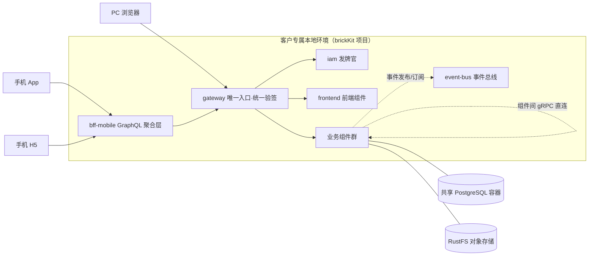
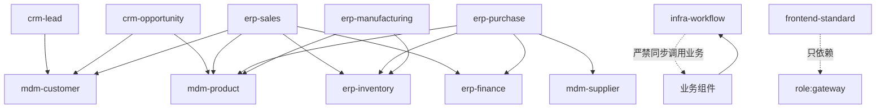
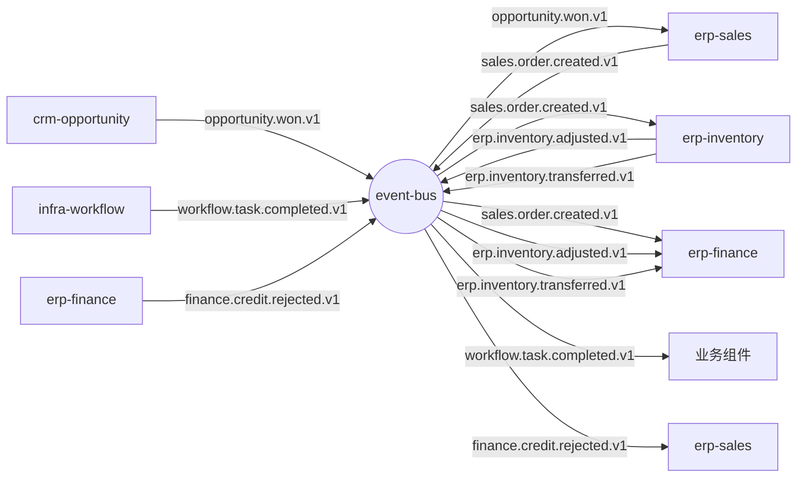
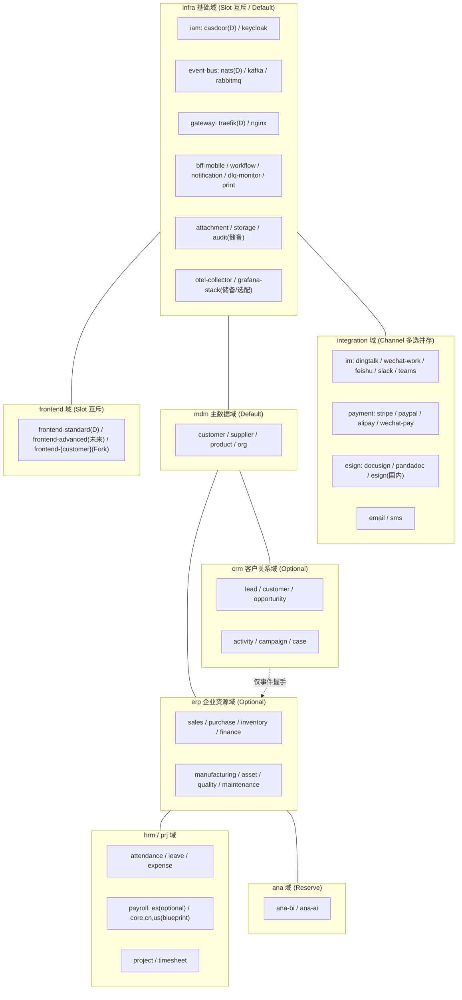
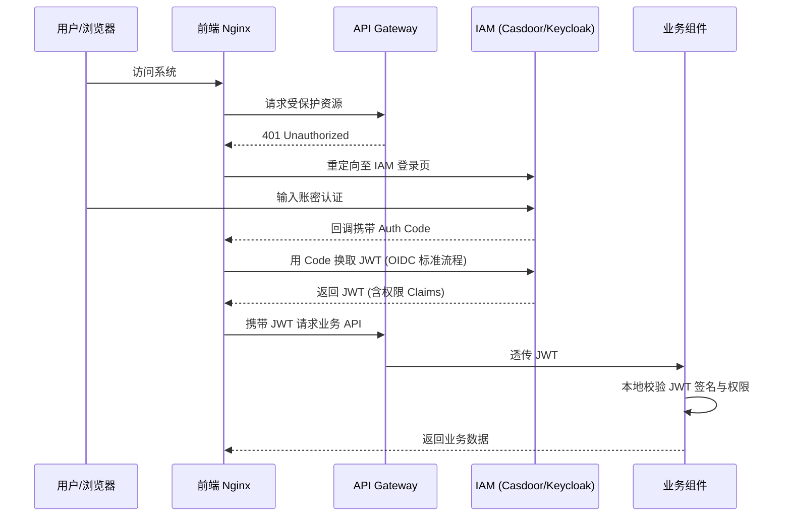
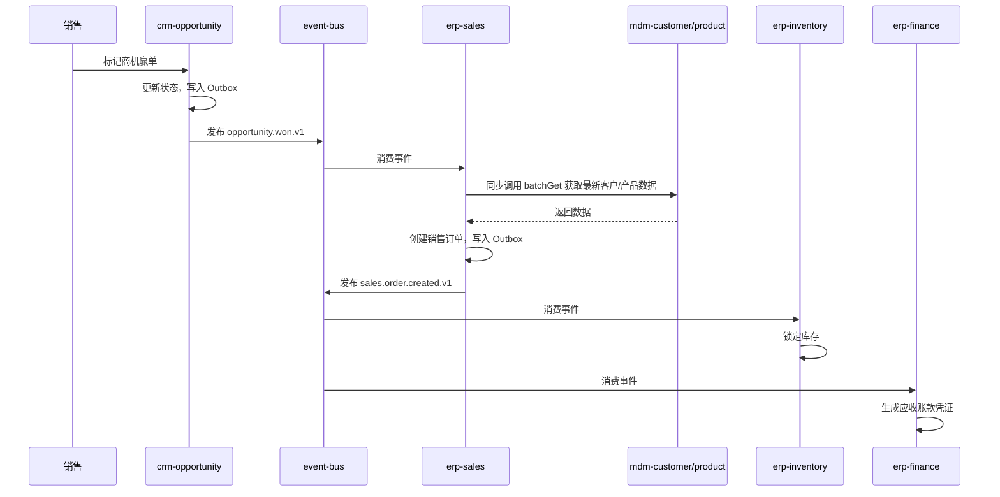
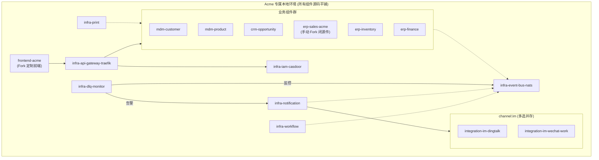

# BrickEnterprise 设计书

基于 brickKit 平台的企业级组件化 ERP/CRM 系统规范性文档。

平台层以 brickKit 平台设计书为准；业务层以本书为准。

`yaml` 字段为语义字段，与平台骨架命名不同时做映射——语义才是契约。

---

## 第 0 章 · 如何阅读本书

第 1 章 为什么 ，第 2 章 形态 ，第 3 章 组件契约与资产规范 ，第 4 章 交通规则 ，第 5 章 全量组件军火库与职责说明 ，第 6 章 基础设施砖细节 ，第 7 章 可观测性与诊断纪律 ，第 8 章 AI-Native 开发样板 ，第 9 章 仓库与交付治理 ，第 10 章 决策总表 ，第 11 章 数据生命周期与冷热分层治理 ，第 12 章 多语言战略与技术栈选型 ，第 13 章 高维合并部署与渐进式微服务演进 ，附录为图与术语。

**四把尺子：**

- **选配测试**：客户愿单独付钱、或永远用不到 → 才独立成砖。
- **三测试**：统一语言 / 变化原因 / 数据所有权，定边界。
- **占用/知道测试**：占用走同步，知道走事件。
- **契约驱动测试**：前后端物理分离，跨边界只传递契约（Types/SDK），不传递 UI 组件。

---

## 第 1 章 · 我们为什么造这个系统

### 1.1 病根与真相

单体 ERP/CRM 功能大而全，单企业 80% 用不到，却付出学习/部署/维护三重成本；定制牵一发而动全身。Odoo、ERPNext 等证明业务可模块化，但其模块同住一个进程/库，边界是软约束，天天被破坏。

而在传统的微服务改造中，前端往往被迫跟随后端进行"组件化拆分+壳应用组装"，这在深度定制的 ToB 项目交付中会导致严重的"胶水代码地狱"与 UI 割裂，扼杀交付敏捷性。

**ToB 交付的终极真相**：80% 的功能是通用的，但 20% 的业务逻辑（如算薪、审批流、特定行业规则）是极度个性化且频繁变动的。试图用一套"通用代码"覆盖所有客户的个性化逻辑，注定失败。

### 1.2 答案：全量军火库 + 按需装配 + 契约锁死 Fork

在 brickKit 之上造全量组件军火库 + 组装方法论：

- **全量开发**：平台方会开发所有主流的基础设施替换件（如 IAM 的多种实现）、多国业务适配件（如西班牙薪资）、多渠道集成件（钉钉/企微/飞书/Slack、多种支付方式、多种电子签）、多套前端组件（标准前端、高级前端等）。所有组件均真实开发、真实测试，而非占位符。
- **按需装配**：最终交付给客户的 ERP，只是从军火库中"勾选"一组 Default 组件拼装而成。
- **契约锁死 Fork**：如果客户的业务逻辑超出 Default 组件能力，我们不修改标准件，而是由主管理员手动 Fork 出一个客户私有仓库。定制件内部逻辑随便改（甚至用 AI 重写），但对外契约（Protobuf/OpenAPI/事件 Schema）必须与标准件保持向后兼容（允许在末尾追加新字段/新接口，严禁删除字段、修改类型或改变 Tag 编号等破坏性变更），从而实现无缝热替换。

**交付物** = 全量组件军火库（后端砖 + 前端砖）+ 每企业专属本地环境（装配结果）+ 本书（规范）。

brickKit 把 DDD 边界从代码规范变成物理墙：独立程序/库/仓库，想跨组件 JOIN 都做不到。

### 1.3 哲学

- **平台只做连接器和翻译官**：业务归组件，前端工程化归前端工具链，brickKit 绝不越界干涉前端构建。
- **【已修改】核心商业逻辑归后端，交互与视图逻辑归前端**：后端组件化沉淀核心资产规则（如价格计算、库存防超卖、信用额度、状态机流转）；前端负责表单 UI 交互、字段联动、本地草稿缓存。对于复杂的跨域表单联动，前端通过 SDK 调用后端的"试算（Dry-Run）API"获取计算结果，严禁前端硬编码核心商业规则。
- **契约先于实现**：后端提供 gRPC/HTTP 契约，前端通过工具链或 AI 编写消费契约。组件可换，契约不变。
- **动态适配，优雅降级**：前端运行时拉取后端组件启停状态（Feature Toggles），动态注册路由与菜单。缺失组件自动隐藏，拒绝构建期硬绑定。
- **全面拥抱 AI-Native 开发**：`brickKit` 保持极致克制。所有样板代码优先使用现有工具链生成，无工具时由 AI 直接编写。定制分支中的复杂业务逻辑由 AI 根据客户需求文档生成，人类审查。契约由 AI 编写，人类审查，业务仓库本地 CI 门禁锁死。三者缺一不可。

### 1.4 六句话宪法

1. 货架按选配测试切。
2. 边界按三测试切。
3. 血管按占用/知道切。
4. 内部通信 gRPC，外部通信 HTTP/GraphQL。
5. 同步图必须无环，且同步失败必有补偿。
6. 三枢纽：mdm=只读枢纽，inventory=物理命令枢纽，finance=事件汇枢纽；CRM 与 ERP 零同步边，仅事件握手，可独立拔插。

---

## 第 2 章 · 总体架构

### 2.1 端云分离与多端策略

手机 App、PC 浏览器是消费者，不是部署单元；App 不进装配清单。

机器之间（后端组件互调）走内网版本化 DNS + gRPC，格式 `grpc://{版本化服务名}:{端口}`；浏览器走网关公共路径（HTTP/REST），移动端走 BFF（GraphQL）。

**多端分流原则（默认策略 + 例外规则）：**

默认情况下：
- **移动端（App / H5）**：由于弱网和聚合需求，优先经过 GraphQL BFF 层裁剪。采用 Uni-app（Vue3）构建。
- **PC 端（Web）**：直连网关，标准 Vue3 SPA，使用 HTTP/REST。

例外规则：
- 移动端简单页面（如单组件查询、内网 PDA 扫码）也允许直接走 Gateway HTTP/REST，不必强制走 BFF。
- PC 端复杂聚合页面（如经营驾驶舱、客户 360° 视图、跨域 Dashboard）也允许走 BFF/GraphQL。

**真正的铁律**：所有外部流量（无论移动端还是 PC 端）都必须经过 Gateway，严禁让浏览器或 App 直连后端组件。

**REST 与 GraphQL 的划分依据**：不是按"PC/移动端"绝对划分，而是按"简单资源访问/复杂聚合视图"划分。默认情况下，PC 更常见简单资源访问，移动端更常见复杂聚合与裁剪。

**代码共享策略**：PC 端与移动端共享 `packages/shared-types`（TypeScript 接口）和 `packages/api-client`（请求管线）。视图层完全分离，各自独立优化。

### 2.2 运行时拓扑



### 2.3 前端架构：前端也是组件，参与装配

前端不是客户自己写的，而是平台方开发的组件，参与 `brickkit.yaml` 装配。客户提需求，我们在标准前端组件上修改，甚至完全重新设计。

**核心原则：**

- **前端是组件**：前端仓库（如 `frontend-standard`）是一个组件，有 `component.yaml`，参与 `brickkit.yaml` 装配，装配角色为 `slot:frontend`。
- **前端可替换**：我们可以提供多套前端组件（标准前端、高级前端、行业定制前端），客户选择装配。同一环境只能装一套前端（`slot` 互斥）。
- **前端可 Fork**：如果客户需要深度定制前端交互或视觉，主管理员在客户电脑本地复制前端组件目录为定制目录（如 `frontend-standard` → `frontend-acme`），在定制目录中修改前端代码。
- **【已修改】前后端逻辑边界划分**：前端组件负责"展示聚合"、"视图渲染"及"表单交互逻辑"（如正则校验、字段联动显隐、本地草稿缓存、防抖节流）。核心商业计算（如价格计算、防超卖）、跨域事务处理必须在后端组件里。前端可通过 SDK 调用后端的试算（Dry-Run）或预校验 API 实现复杂联动，严禁前端硬编码核心商业规则（如折扣公式）。

**前端组件仓库结构：**

```
frontend-standard/                      # 默认前端组件（平台方开发）
  ├── component.yaml                      # 组件身份证（参与装配）
  ├── apps/
  │   ├── pc-web/                         # PC 端（Vue3 SPA）
  │   │   ├── src/
  │   │   │   ├── modules/                # 每个后端组件对应一个前端模块
  │   │   │   │   ├── erp-sales/          # 订单列表、订单详情、创建订单
  │   │   │   │   ├── erp-inventory/      # 库存台账、出入库单
  │   │   │   │   ├── erp-finance/        # 凭证、应收应付
  │   │   │   │   ├── crm-lead/           # 线索列表、线索详情
  │   │   │   │   ├── crm-opportunity/    # 商机看板、漏斗
  │   │   │   │   ├── mdm-customer/       # 客户列表、客户详情
  │   │   │   │   ├── mdm-product/        # 产品列表、分类管理
  │   │   │   │   ├── hrm-attendance/     # 打卡、排班
  │   │   │   │   ├── workflow/           # 待办列表、审批历史
  │   │   │   │   └── ...                 # 与后端组件一一对应
  │   │   │   ├── layouts/                # 布局（侧边栏、顶栏）
  │   │   │   ├── router/                 # 动态路由（读取 /api/tenant/features）
  │   │   │   └── App.vue
  │   │   └── vite.config.ts
  │   └── mobile/                         # 移动端（Uni-app）
  │       ├── pages/
  │       │   ├── erp-sales/
  │       │   ├── crm-opportunity/
  │       │   └── ...
  │       └── manifest.json
  ├── packages/
  │   ├── shared-types/                   # TypeScript 接口（由契约生成）
  │   ├── api-client/                     # 请求管线（由契约生成）
  │   ├── ui-kit/                         # 基础 UI 组件（按钮、表格、表单）
  │   └── feature-flags/                  # 动态特性路由
  ├── docker/
  │   └── Dockerfile                      # 构建产物打包为 Nginx 镜像
  ├── Makefile
  └── README.md
```

**前端组件与后端组件的对应关系：**

| 后端组件 | 前端模块目录 | 标准页面 |
|---|---|---|
| erp-sales | modules/erp-sales/ | 订单列表、订单详情、创建订单、订单审批 |
| erp-inventory | modules/erp-inventory/ | 库存台账、出入库单、库存盘点 |
| erp-finance | modules/erp-finance/ | 凭证列表、应收应付、对账报表 |
| crm-lead | modules/crm-lead/ | 线索列表、线索详情、线索转化 |
| crm-opportunity | modules/crm-opportunity/ | 商机看板、漏斗分析 |
| mdm-customer | modules/mdm-customer/ | 客户列表、客户详情、联系人管理 |
| mdm-product | modules/mdm-product/ | 产品列表、产品详情、分类管理 |
| hrm-attendance | modules/hrm-attendance/ | 打卡记录、排班表、加班统计 |
| infra-workflow | modules/workflow/ | 待办列表、审批历史 |
| ... | ... | ... |

**动态特性路由（Feature Toggles）**：前端启动时调用 `GET /api/tenant/features`，后端根据 `brickkit.yaml` 装配清单返回启用的组件列表。前端基于该列表动态注册路由和渲染菜单，未启用的组件自动隐藏，实现优雅降级。

**brickKit 视角的极简**：前端组件仓库自带 CI/CD，构建产物打包为 Nginx Docker 镜像。在 `brickkit.yaml` 中，它是一个普通的组件（`port: 80`），参与装配。

### 2.4 部署边界模型

一项目 = 一企业一环境 = 一 namespace；label 管业务房间；依赖图管对话权。前端 Nginx 容器与后端微服务容器同等对待，由 brickKit 统一编排 Ingress/路由。

**本地化部署铁律**：每个客户拥有专属电脑（本地服务器），所有组件（开源标准件和闭源 Fork 件）的源码全部平铺在客户电脑本地，所有构建在本地完成，不涉及任何远程私有 Registry（如 Harbor/ACR）。

### 2.5 域地图与两轴推导

- **轴线一（名词/动词）**：慢变化的存在归 `mdm`，快变化的发生归交易域。
- **轴线二（对外/对内）**：CRM 灵活容忍，ERP 严谨强一致。

得 **九域**：`infra` / `integration` / `mdm` / `crm` / `erp` / `hrm` / `prj` / `ana` / `frontend`。

### 2.6 三枢纽与可拔插性

`mdm` 被所有人读、自己不调任何人；`inventory` 是所有动物命令的唯一写者；`finance` 几乎只被命令+听事件。CRM 与 ERP 无同步边，仅事件握手。

**关键澄清**：`erp-inventory` 与 `erp-finance` 之间没有直接的依赖边（既无同步调用，也无事件订阅）。它们是平行组件，在涉及实物变动的交易场景中，由同一个上游（如 `erp-sales` 或 `erp-purchase`）同时触发。业务上必然同时出现，技术上平行独立。

**核心交易域拆分原则**：逻辑上必须拆分（独立契约、独立事件、独立数据所有权），物理上可以渐进。拆分的核心目的不是"微服务化"，而是为未来所有新组件提供清晰的"数据窗口"和"事件订阅点"。

### 2.7 基础资源清单与环境配置

基础资源是非组件的外部服务，它们不需要我们写业务代码，只需要部署官方镜像。所有组件（无论默认还是选配）都运行在这些基础资源之上。

开发/交付前，必须先把基础资源跑起来。

#### 2.7.1 基础资源总览

| # | 资源 | 官方镜像 | 端口 | 是否默认 | 被谁依赖 | 说明 |
|---|---|---|---|---|---|---|
| 1 | PostgreSQL | postgres:16-alpine | 5432 | ✅ 默认 | 所有组件 | 【已修改】共享数据库，单 Database + 多 Schema |
| 2 | NATS | nats:2.10-alpine | 4222 / 8222 | ✅ 默认 | 所有需要事件的组件 | `slot:event-bus` 默认实现 |
| 3 | Traefik | traefik:v3.0 | 80 / 443 / 8080 | ✅ 默认 | 所有外部流量 | `slot:gateway` 默认实现 |
| 4 | Casdoor | casbin/casdoor:latest | 8000 | ✅ 默认 | 所有需要认证的组件 | `slot:iam` 默认实现 |
| 5 | RustFS | rustfs/rustfs:latest | 9000 | ✅ 默认 | infra-attachment / infra-storage | 对象存储底座（Rust 实现，内存占用更低） |
| 6 | MinIO | minio/minio:latest | 9000 / 9001 | ❌ 可选 | 同上 | `slot:storage` 替换件，适合已有 MinIO 运维经验的团队 |
| 7 | Keycloak | quay.io/keycloak/keycloak:latest | 8080 | ❌ 可选 | 同上 | `slot:iam` 替换件 |
| 8 | Kafka | confluentinc/cp-kafka:latest | 9092 | ❌ 可选 | 同上 | `slot:event-bus` 替换件 |
| 9 | RabbitMQ | rabbitmq:3.13-management | 5672 / 15672 | ❌ 可选 | 同上 | `slot:event-bus` 替换件 |
| 10 | Nginx | nginx:1.25-alpine | 80 / 443 | ❌ 可选 | 同上 | `slot:gateway` 替换件 |
| 11 | OTel Collector | otel/opentelemetry-collector-contrib:latest | 4317 / 4318 | ❌ 可选 | 所有组件（可观测性） | `reserve`，不装时走 Blackhole |
| 12 | Prometheus | prom/prometheus:latest | 9090 | ❌ 可选 | infra-otel-collector | `reserve`，指标后端 |
| 13 | Loki | grafana/loki:latest | 3100 | ❌ 可选 | infra-otel-collector | `reserve`，日志后端 |
| 14 | Tempo | grafana/tempo:latest | 3200 | ❌ 可选 | infra-otel-collector | `reserve`，链路追踪后端 |
| 15 | Grafana | grafana/grafana:latest | 3000 | ❌ 可选 | 运维人员 | `reserve`，可观测性展示 |

#### 2.7.2 必须部署的基础资源（默认环境，5 个容器）

以下 5 个基础资源是任何环境都必须部署的，缺少任何一个系统都无法运行：

**① PostgreSQL — 共享数据库**

| 项目 | 说明 |
|---|---|
| 镜像 | postgres:16-alpine |
| 端口 | 5432 |
| 用途 | 【已修改】所有组件的数据持久化。全系统共享单一 Database（`brickkit_db`），每个组件拥有独立的 Schema（如 `erp_sales`、`mdm_customer`）和独立的 PG Role。组件连接后执行 `SET search_path TO {schema_name}`，通过 PG RBAC 权限墙实现逻辑隔离，严禁跨 Schema JOIN |
| 配置要点 | 【已修改】设置 `POSTGRES_PASSWORD`；由于采用单 Database + 外壳级连接池共享，5 大外壳只需 5 个连接池，建议设置 `max_connections=300` 即可支撑全量 60+ 组件的并发；数据目录挂载持久卷 |
| 健康检查 | `pg_isready -h localhost -p 5432` |
| 初始化 | 【已修改】`brickkit up` 时自动创建 `brickkit_db` 数据库，为每个组件创建独立 Schema 和 Role |

**② NATS — 事件总线（默认）**

| 项目 | 说明 |
|---|---|
| 镜像 | nats:2.10-alpine |
| 端口 | 4222（客户端）/ 8222（监控） |
| 用途 | 所有异步事件的发布/订阅通道。`slot:event-bus` 的默认实现 |
| 配置要点 | 启用 JetStream（`--jetstream`）；数据目录挂载持久卷；设置 `max_payload=8MB` |
| 健康检查 | `curl http://localhost:8222/healthz` |
| 替换件 | 可换为 Kafka（高吞吐）或 RabbitMQ（传统），见 2.7.3 |

**③ Traefik — API 网关（默认）**

| 项目 | 说明 |
|---|---|
| 镜像 | traefik:v3.0 |
| 端口 | 80（HTTP）/ 443（HTTPS）/ 8080（Dashboard） |
| 用途 | PC 端与移动端流量的唯一入口。生成期聚合路由表；统一验签（401）；组件管鉴权（403）；多端分流（移动端 → BFF，PC 端 → 后端组件） |
| 配置要点 | 启用 Docker Provider（读取容器 Labels）；配置 `ForwardAuth` 中间件对接 Casdoor；启用 Dashboard（开发环境） |
| 健康检查 | `curl http://localhost:8080/api/rawdata` |
| 替换件 | 可换为 Nginx，见 2.7.3 |

**④ Casdoor — IAM 认证（默认）**

| 项目 | 说明 |
|---|---|
| 镜像 | casbin/casdoor:latest |
| 端口 | 8000 |
| 用途 | 统一身份认证与权限分配。全系统只说 OIDC，JWT 携带权限 Claims。`slot:iam` 的默认实现 |
| 配置要点 | 【已修改】需要连接 PostgreSQL（使用自己的 schema `casdoor`）；配置 `origin` 为网关地址；首次部署时通过 `infra-iam-casdoor` 适配层的初始化脚本自动创建默认应用和角色 |
| 健康检查 | `curl http://localhost:8000/api/health` |
| 替换件 | 可换为 Keycloak，见 2.7.3 |

**⑤ RustFS — 对象存储（默认）**

| 项目 | 说明 |
|---|---|
| 镜像 | rustfs/rustfs:latest |
| 端口 | 9000（S3 API） |
| 用途 | 对象存储底座，`infra-attachment` 和 `infra-storage` 的物理存储后端。Rust 实现，内存占用更低，适合本地化部署资源有限的场景 |
| 配置要点 | 设置访问密钥；数据目录挂载持久卷 |
| 健康检查 | `curl http://localhost:9000/health/live` |
| 替换件 | 可换为 MinIO（`minio/minio:latest`，社区更成熟），或云上换为 S3 / 阿里云 OSS。`infra-storage` 通过 S3 SDK 调用，底层换什么代码零改动 |

#### 2.7.3 可选部署的基础资源（替换件 / 储备）

以下基础资源不是必须的，只在特定场景下部署：

**替换件（与默认实现互斥，同一环境只装一个）：**

| 资源 | 镜像 | 替换谁 | 何时使用 |
|---|---|---|---|
| MinIO | minio/minio:latest | RustFS | 客户已有 MinIO 运维经验，或需要 MinIO 管理界面（9001 端口） |
| Keycloak | quay.io/keycloak/keycloak:latest | Casdoor | 需要对接复杂 LDAP/AD 域、或极细粒度 RBAC/ABAC 的大型传统集团 |
| Kafka | confluentinc/cp-kafka:latest | NATS | 每日事件量千万级以上、需要流计算能力 |
| RabbitMQ | rabbitmq:3.13-management | NATS | 客户已有 RabbitMQ 基础设施 |
| Nginx | nginx:1.25-alpine | Traefik | 客户已有 Nginx 运维经验，不需要动态服务发现 |

**储备件（`reserve`，客户愿付钱才装配）：**

| 资源 | 镜像 | 用途 | 何时使用 |
|---|---|---|---|
| OTel Collector | otel/opentelemetry-collector-contrib:latest | 可观测性数据统一收集网关 | 客户需要链路追踪、指标监控、日志聚合 |
| Prometheus | prom/prometheus:latest | 指标存储后端 | 同上 |
| Loki | grafana/loki:latest | 日志存储后端 | 同上 |
| Tempo | grafana/tempo:latest | 链路追踪存储后端 | 同上 |
| Grafana | grafana/grafana:latest | 可观测性可视化展示 | 同上 |

**不装可观测性组件时的行为**：业务组件的 OTel SDK 配置为 Blackhole Exporter，数据静默丢弃，系统正常运行。

#### 2.7.4 明确排除的基础资源（不需要部署）

| 资源 | 为什么不需要 | 替代方案 |
|---|---|---|
| Redis | JWT 无状态（不需要 Session 存储）；本地摘要副本（不需要集中缓存）；PG 行级锁（不需要分布式锁）；Traefik 自带限流（不需要限流中间件） | 以上四项已覆盖 Redis 所有常见用途 |
| Consul / etcd | 路由表生成期聚合（决策 20），不需要运行时服务发现 | `brickkit up` 生成静态路由配置 |
| Zookeeper | NATS 不需要；Kafka 3.x 已支持 KRaft 模式 | 不需要 |
| Elasticsearch | 当前无全文检索需求；审计日志走 PostgreSQL 分区表 | 未来如需搜索，作为 `reserve` 引入 |

#### 2.7.5 开发环境快速启动

**最小可用环境（5 个容器）：**

```yaml
# docker-compose.infra.yml — 基础资源，开发前必须先跑起来
version: "3.9"
services:
  # ① PostgreSQL — 共享数据库
  postgres:
    image: postgres:16-alpine
    ports:
      - "5432:5432"
    environment:
      POSTGRES_PASSWORD: brickkit_dev
    volumes:
      - pg_data:/var/lib/postgresql/data
    healthcheck:
      test: ["CMD-SHELL", "pg_isready -h localhost -p 5432"]
      interval: 5s
      timeout: 3s
      retries: 5

  # ② NATS — 事件总线（默认）
  nats:
    image: nats:2.10-alpine
    ports:
      - "4222:4222"
      - "8222:8222"
    command: --jetstream --store_dir /data
    volumes:
      - nats_data:/data
    healthcheck:
      test: ["CMD", "wget", "-qO-", "http://localhost:8222/healthz"]
      interval: 5s
      timeout: 3s
      retries: 5

  # ③ Traefik — API 网关（默认）
  traefik:
    image: traefik:v3.0
    ports:
      - "80:80"
      - "443:443"
      - "8080:8080"
    volumes:
      - /var/run/docker.sock:/var/run/docker.sock:ro
      - ./traefik/traefik.yml:/etc/traefik/traefik.yml:ro
    healthcheck:
      test: ["CMD", "traefik", "healthcheck", "--ping"]
      interval: 5s
      timeout: 3s
      retries: 5

  # ④ Casdoor — IAM 认证（默认）
  casdoor:
    image: casbin/casdoor:latest
    ports:
      - "8000:8000"
    depends_on:
      postgres:
        condition: service_healthy
    environment:
      RUNNING_IN_DOCKER: "true"
    volumes:
      - ./casdoor/conf:/conf
    healthcheck:
      test: ["CMD", "curl", "-f", "http://localhost:8000/api/health"]
      interval: 10s
      timeout: 5s
      retries: 5

  # ⑤ RustFS — 对象存储（默认）
  rustfs:
    image: rustfs/rustfs:latest
    ports:
      - "9000:9000"
    volumes:
      - rustfs_data:/data
    healthcheck:
      test: ["CMD", "curl", "-f", "http://localhost:9000/health/live"]
      interval: 5s
      timeout: 3s
      retries: 5

volumes:
  pg_data:
  nats_data:
  rustfs_data:
```

**启动命令：**

```bash
# 1. 拉起基础资源
docker compose -f docker-compose.infra.yml up -d

# 2. 等待所有健康检查通过
docker compose -f docker-compose.infra.yml ps

# 3. 确认所有服务就绪后，再启动业务组件
brickkit up
```

#### 2.7.6 基础资源与组件的依赖关系

```
基础资源层（非组件，纯官方镜像）
  ├── PostgreSQL ←──── 所有组件的 requirements
  ├── NATS ←────────── 所有需要事件的组件
  ├── Traefik ←─────── 所有外部流量入口
  ├── Casdoor ←─────── 所有需要认证的组件
  └── RustFS ←──────── infra-attachment / infra-storage

组件层（我们写的代码）
  ├── 薄适配层（~500 行胶水代码）
  │   └── infra-iam-casdoor 的适配层
  ├── 自研基础设施
  │   ├── infra-workflow
  │   ├── infra-notification
  │   ├── infra-dlq-monitor
  │   └── infra-print
  ├── 主数据
  │   ├── mdm-customer / mdm-supplier / mdm-product / mdm-org
  ├── 业务组件
  │   ├── erp-sales / erp-purchase / erp-inventory / erp-finance
  │   ├── crm-lead / crm-opportunity / ...
  │   └── hrm-attendance / hrm-leave / ...
  └── 前端组件
      └── frontend-standard（或 frontend-advanced 等）
```

一句话：基础资源是"地基"，组件是"房子"。先打地基，再盖房子。

---

## 第 3 章 · 组件契约与资产规范

### 3.1 身份证四问

【已修改】拥有数据 → 独立 Schema；接受命令 → gRPC/HTTP API；发布事件 → 事件清单；依赖谁 → 强/弱依赖。

### 3.2 资产来源分类（Source Type）

| 资产类型 | 释义 | 示例 |
|---|---|---|
| `open_standard` | 100% 开源的标准组件，作为系统的 "样板间 "和默认底座，包含 80% 通用逻辑 | `erp-sales`、`mdm-customer`、`frontend-standard` |
| `slot_impl` | 针对同一功能，存在多个同等地位的开源实现，装配时互斥选一 | `iam-casdoor` vs `iam-keycloak`；`frontend-standard` vs `frontend-advanced` |
| `channel_adapter` | 针对外部生态（如 IM、支付、电子签），允许多个适配器同时装配并存，由内部统一中心或业务组件按场景调度 | `im-dingtalk` + `im-wechat` 同时装配 |
| `customer_fork` | 基于 `open_standard` 手动 Fork 出来的客户私有仓库，包含特定客户的定制业务逻辑或定制前端，闭源且归客户所有 | `erp-sales-acme`、`frontend-acme` |

### 3.3 装配角色分类（Assembly Role）

| 装配角色 | 释义 | 示例 |
|---|---|---|
| `default` | 系统运行的基石，默认必选 | `iam`、`event-bus`、`api-gateway`、`workflow`、`notification`、`print` |
| `optional` | 客户按需选配的增值业务组件 | `erp-sales`、`crm-lead`、`hrm-attendance`、`hrm-payroll-es` |
| `slot` | 族内互斥，同一功能只能装一个实现 | `slot:iam`、`slot:event-bus`、`slot:payroll`、`slot:frontend` |
| `channel` | 通道适配器，可多选并存 | `channel:im`、`channel:payment`、`channel:esign`、`channel:email`、`channel:sms` |
| `reserve` | 储备组件，已规划但尚未进入现役，有明确开发计划 | `ana-bi`、`hrm-recruitment` |
| `blueprint` | 蓝图组件，设计书中保留概念定义与契约骨架，但**当前不开发、不构建、不交付**。仅当市场验证（如客户明确要求、业务扩大）后，才激活为 `optional` 进入开发队列 | `hrm-payroll-core`、`hrm-payroll-cn`、`hrm-payroll-us` |

### 3.4 业务组件的"可替换"铁律

- **基础设施（强 Slot，代码级替换）**：如 IAM，Casdoor 和 Keycloak 代码完全不同，但都实现了 OIDC 协议。装配时互斥选一，换砖走 runbook。
- **外部集成（Channel，多选并存）**：如 IM、支付、电子签。一个系统完全可以同时装配钉钉+企微、支付宝+微信+Stripe、e签宝+DocuSign。它们不是互斥关系，而是并行通道，由 `infra-notification`（IM 场景）或业务组件（支付/电子签场景）按场景调度。
- **前端组件（Slot，可替换可 Fork）**：前端组件也是 `slot` 族（`slot:frontend`），同一环境只能装一套前端。可以提供多套前端（标准、高级、行业定制），客户选择。如果需要深度定制，Fork 标准前端为客户私有前端（如 `frontend-acme`）。
- **业务组件（契约级替换，Git Fork）**：如 `erp-sales`、`hrm-payroll`。我们不在代码层面拆分 Core/Impl（避免微服务粒度失控），而是维护一个 100% 开源的标准仓库。当客户有定制需求时：
  1. 主管理员在客户电脑本地，复制标准组件目录为客户私有目录（如 `erp-sales` → `erp-sales-acme`），并修改 `git remote` 指向。
  2. 在 Fork 目录中，利用 AI 重写 `backend/` 里的业务代码。
  3. **铁律**：`contracts/` 目录（Protobuf/OpenAPI/事件 Schema）被业务仓库本地 CI 门禁死死锁住，严禁任何破坏性变更（如删字段、改类型、改 Tag 编号）。允许在末尾追加新字段，但新增字段在业务逻辑上须保持可选兼容。
  4. 在客户的 `brickkit.yaml` 中，将该组件的 `source` 指向 Fork 目录，系统即可无缝组装。前端和其他组件完全感知不到底层逻辑被改了。

### 3.5 `component.yaml` 全量语义示例

**后端组件示例（`erp/sales`）：**

```yaml
name: erp/sales
version: 1.0.0
labels: { brickkit.domain: erp, brickkit.tier: backend }
asset:
  source_type: open_standard
  assembly_role: optional
  contract_lock: strict
  customization_guide: |
    如果客户的销售审批流/价格计算规则超出标准版支持范围：
    1. 由主管理员在客户电脑本地复制本目录为定制目录 (如 erp-sales-acme)，并修改 git remote。
    2. 使用 AI 在 backend/ 目录生成定制业务代码。
    3. 严禁对 contracts/ 进行破坏性变更；允许向后兼容的追加（在末尾追加新字段，使用新 Tag）。
    4. 在客户 brickkit.yaml 中替换 source 路径。
expose:
  - port: 8080
    protocol: http
    edge_routes:
      - { path: /erp/sales/**, auth: required }
  - port: 9090
    protocol: grpc
    internal_only: true
dependencies:
  strong: [mdm/customer@1.0.0, mdm/product@1.0.0, erp/inventory@1.0.0]
  weak: [role:event-bus, role:iam]
requirements: [{ kind: database, type: postgres, purpose: 订单 }]
menus: [{ key: erp.sales, title: 销售订单, permission: erp.sales.view }]
```

**前端组件示例（`frontend/standard`）：**

```yaml
name: frontend/standard
version: 1.0.0
labels: { brickkit.domain: frontend, brickkit.tier: frontend }
asset:
  source_type: open_standard
  assembly_role: slot
  slot_name: frontend
  contract_lock: strict
  customization_guide: |
    如果客户需要深度定制前端交互或视觉：
    1. 由主管理员在客户电脑本地复制本目录为定制目录
       (如 frontend-standard → frontend-acme)，并修改 git remote。
    2. 在定制目录中修改前端代码（AI 辅助或人工）。
    3. 若客户要求完全重新设计，可基于本目录重写，
       但必须保持动态特性路由机制（读取 /api/tenant/features）。
    4. 在客户 brickkit.yaml 中替换 source 路径。
expose:
  - port: 80
    protocol: http
    edge_routes:
      - { path: /**, auth: none }
dependencies:
  strong: [role:gateway]
  weak: [role:iam]
requirements: []
```

### 3.6 依赖语义

强依赖 = 同步 gRPC/HTTP API；弱依赖 = 事件/可选。`role:{slot}` = 槽位绑定。

### 3.7 统一命名法

事件/权限键/路由前缀共用 `{domain}.{aggregate}.{action}` 模式。

### 3.8 数据消费范式（强制）

本地只存外键+摘要副本。列表页渲染摘要；详情页调真相源。

每个聚合根必须提供 gRPC/HTTP 的 `batchGet` 接口（通过工具链或 AI 生成骨架），这是 BFF 层 GraphQL Resolver 避免 N+1 性能陷阱的唯一合法调用方式。

**摘要一致性四层防线**：Outbox、版本号跳变、定时对账、死信队列。

### 3.9 前后端契约与代码编写范式（强制）

摒弃跨组件共享 UI 组件的幻想，前后端边界只传递数据契约。

- **真相源封装**：后端组件维护 `contracts/` 目录（Protobuf 或 OpenAPI）。
- **代码生成/编写**：通过现有工具链（如 Go 的 `protoc`、`sqlc`；TypeScript 的 `openapi-typescript`）或 AI，根据契约变更生成/编写 TypeScript Interface、React Query Hooks，并提交至前端组件仓库的 `packages/` 下。严禁为了代码生成而自研工具链。
- **消费约束**：前端开发者严禁手写 `fetch('/api/sales')`，必须使用生成的 SDK。

### 3.10 事件纪律

`at-least-once` + 消费者幂等；Schema 演进铁律（只增不删不改）；消费者宽容反序列化。生产者必须使用 Outbox Pattern。

- **事件分级**：区分核心交易事件（如 `order.created`，必须持久化、幂等、进死信队列）和旁路分析事件（如 `user.tracked`，允许丢弃、不进死信队列）。
- **背压保护**：消费者在消息积压超过阈值时，必须自动降速或触发告警，严禁无脑重试导致雪崩。
- **因果链追踪与防环**：生产者发布事件时，必须将当前的 `trace_id` 和 `causation_id` 注入事件 Header；消费者必须提取并恢复 Trace Context。事件 Header 中必须包含 `hop_count`（跳数），若 `hop_count > 5` 或检测到 `causation_id` 形成环，直接丢弃并打入 DLQ，物理斩断无限循环。
- **状态单向演进防抖**：消费者处理状态变更时，必须校验事件的 `version`。只有当目标状态严格大于本地当前状态时才执行更新，免疫乱序和重复事件。

### 3.11 CI 门禁（每组件仓库）

`version == tag`；单测 race-clean；Docker 构建；迁移幂等；强依赖图无环校验。

**契约向后兼容性校验（下沉至业务仓库）**：`brickKit` 平台不内置契约校验命令。各 ERP/组件仓库必须在根目录提供 `Makefile` 或 Git `pre-commit` hook，直接调用开源工具 `buf breaking`（Protobuf）或 `oasdiff`（OpenAPI）进行本地轻量级拦截。严禁破坏性变更，放行兼容性追加。


## 第 4 章 · 交通规则：同步与事件

### 4.1 口诀

内部 gRPC，外部 HTTP/GraphQL。占用同步，知道异步，展示上推，同步失败必补偿。

### 4.2 同步图

同步图必须无环。所有业务组件间的 gRPC/HTTP 同步调用链路构成 DAG（有向无环图）。



### 4.3 事件图

事件图允许环但必须收敛。所有业务组件间的异步事件发布/订阅链路经 event-bus 中转。



### 4.4 分布式事务与补偿机制（双轨制）

短事务（同步 gRPC/HTTP 链）：TCC 变种，上游在 `catch` 块中同步调用下游的 Cancel API。长事务（异步事件）：Saga 补偿。ERP 库存防超卖：利用数据库行级锁与条件更新实现物理级防超卖。

#### 4.4.1 超时处理机制（防"薛定谔的超时"）

同步调用下游超时后，严禁直接调用 Cancel API 补偿。必须先调用下游的 `GetStatus` 接口查询真实状态：

- 若状态为"已成功" → 继续后续流程或走补偿。
- 若状态为"未成功" → 安全取消。
- 若状态未知 → 进入重试/对账队列，等待定时对账兜底，避免"误杀"或"漏杀"。

#### 4.4.2 幂等性要求

所有跨组件写操作接口（如 `Reserve`、`Cancel`、`Confirm`）必须基于业务单号（如 `order_id`）实现严格幂等。即使上游因超时重试了多次，下游也只执行一次。

#### 4.4.3 定时对账兜底

无论中间过程多么复杂，必须存在定时对账机制作为最终一致性保障。对账组件周期性调用真相源 `batchGet` 比对本地摘要，发现不一致时自动生成差异单或触发自动修复。

#### 4.4.4 补偿失败降级机制

当 Saga 补偿执行时，如果下游 `Cancel` 接口也超时或失败了（即"补偿的补偿"也失败了），系统绝对不能无限期自动重试。

- 超过 3 次补偿失败后，自动将该事务标记为 `SUSPENDED`。
- 调用 `infra-workflow` 创建一个 `type: exception` 的待办任务，指派给系统管理员。
- 管理员在 DLQ Monitor 或业务界面人工核查数据后，手动触发修复或强制终结。防止"死循环补偿风暴"。

### 4.5 超时与重试的"薛定谔"难题

**核心铁律**：同步调用超时后，严禁直接补偿，必须先查询下游状态。

**原因**：网络超时不等于下游失败。存在"上游认为超时，下游其实已成功"的薛定谔状态。如果上游盲目调用 Cancel API，会导致已成功的订单/库存被误删。

**正确做法**：

1. 上游捕获超时异常。
2. 调用下游的 `QueryStatus` 接口，确认下游操作是否真正完成。
3. 如果下游返回"已完成"，则上游继续后续流程。
4. 如果下游返回"未完成"或"失败"，则上游调用 Cancel API 进行补偿。
5. 如果 `QueryStatus` 也超时，则写入本地"待对账"表，由定时任务兜底修复。

### 4.6 幂等性铁律

所有跨组件写操作接口（如 `ReserveInventory`、`CreateVoucher`）必须实现严格幂等。

实现方式：调用方在请求中携带 `idempotency_key`（如 `{order_id}_{action}_{timestamp}`），被调用方在数据库中使用唯一约束去重。

### 4.7 跨域数据展示的"展示上推"原则

跨域聚合展示（如"客户 360° 视图"需要同时展示客户信息 + 最近订单 + 待办审批）不在后端组件之间建立同步调用边，而是由前端或 BFF 层分别调用各域 API 后在展示层聚合。

**铁律**：展示聚合不构成后端依赖边。后端同步图的纯洁性不能被"展示需求"污染。

---

## 第 5 章 · 全量组件军火库与职责说明

本章是系统的"货架全景"。以下所有组件平台方均会全量开发（`blueprint` 组件除外），最终交付时根据客户环境从军火库中勾选装配。

### 5.0 命名规约

组件仓库 = `{domain}-{name}`，无前缀；非组件资产带 `be-` 前缀。

### 5.1 infra 基础域（系统水电煤）

| 组件 | 仓库名 | 资产属性 / 装配角色 | 职责简述与替换逻辑 |
|---|---|---|---|
| IAM (Casdoor) | infra-iam-casdoor | `open_standard` / `slot:iam` (Default) | 发牌官（轻量）。统一身份认证与权限分配。全系统只说 OIDC，JWT 携带权限 Claims。自带美观登录页，适合中小型或 SaaS 化交付。提供 `/api/tenant/features` 供前端拉取启用的组件清单。依赖基础资源：Casdoor 官方镜像 + PostgreSQL。 |
| IAM (Keycloak) | infra-iam-keycloak | `slot_impl` / `slot:iam` (替换件) | 发牌官（重型）。企业级老牌 IAM。适合需要对接极其复杂的老旧 LDAP/AD 域、或需要极细粒度 RBAC/ABAC 模型的大型传统集团。可替换 Casdoor，两者契约面一致（均暴露 OIDC 端点）。依赖基础资源：Keycloak 官方镜像 + PostgreSQL。 |
| Event Bus (NATS) | infra-event-bus-nats | `open_standard` / `slot:event-bus` (Default) | 事件总线（轻量）。极速、支持 JetStream 持久化。适合 90% 的常规业务场景。按聚合根划分通道，平台 SDK 统一重试与死信队列。依赖基础资源：NATS 官方镜像。 |
| Event Bus (Kafka) | infra-event-bus-kafka | `slot_impl` / `slot:event-bus` (替换件) | 事件总线（高吞吐）。适合每日事件量千万级以上、需要极强日志回溯和流计算能力的超大客户。可替换 NATS。依赖基础资源：Kafka 官方镜像。 |
| Event Bus (RabbitMQ) | infra-event-bus-rabbitmq | `slot_impl` / `slot:event-bus` (替换件) | 事件总线（传统）。适合已有 RabbitMQ 基础设施的客户。可替换 NATS。依赖基础资源：RabbitMQ 官方镜像。 |
| API Gateway (Traefik) | infra-api-gateway-traefik | `open_standard` / `slot:gateway` (Default) | 门卫。生成期聚合路由表；统一验签（401）；组件管鉴权（403）；所有外部流量唯一入口（移动端 + PC 端）。依赖基础资源：Traefik 官方镜像。 |
| API Gateway (Nginx) | infra-api-gateway-nginx | `slot_impl` / `slot:gateway` (替换件) | 门卫（传统）。适合已有 Nginx 运维经验的团队。可替换 Traefik。依赖基础资源：Nginx 官方镜像。 |
| BFF Mobile | infra-bff-mobile | `open_standard` / default | 复杂展示聚合层。GraphQL 实现，默认服务移动端，也服务 PC 端复杂聚合页面（如经营驾驶舱、客户 360° 视图）。严禁业务逻辑，严禁直连 DB。强制使用 DataLoader 绑定后端 `batchGet` 防 N+1。强制启用 Persisted Queries 优化弱网体验。 |
| Workflow | infra-workflow | `open_standard` / default | 轻量级审批任务聚合与分发中心。⚠️ 不含业务流转规则。只负责：全局待办聚合、统一审批历史、任务状态流转、异常任务处理。复杂的业务审批路由由业务组件在标准代码或 Fork 中实现。详见 6.6 节。 |
| Notification | infra-notification | `open_standard` / default | 统一通知中心。接收业务组件的"通知意图"和系统告警，查询用户通道偏好，并发路由给下层所有已装配的 IM/邮件/短信 `channel_adapter`。详见 6.7 节。 |
| Attachment | infra-attachment | `open_standard` / default | 纯附件管理。提供文件上传/下载/URL 生成/元数据管理，对接底层对象存储。支持常见格式轻量预览。依赖基础资源：RustFS（默认）或 MinIO（替换件）。 |
| Storage | infra-storage | `open_standard` / default | 对象存储底座。对接 RustFS / MinIO / S3 / 阿里云 OSS 等物理存储。底层存储服务通过部署配置替换，`infra-storage` 代码不感知具体实现（S3 SDK 兼容）。为 `attachment` 提供底层读写能力。依赖基础资源：RustFS（默认）或 MinIO（替换件）。 |
| Print | infra-print | `open_standard` / default | 打印模板与条码管理中心。提供 HTML→PDF 渲染引擎与条码/标签指令生成（如斑马打印机 ZPL）。管理各类单据打印模板。业务组件只传数据（JSON）与模板 ID，不碰渲染逻辑。详见 6.11 节。 |
| Audit | infra-audit | `open_standard` / reserve | 基于事件的关键审计。通过监听业务组件发布的特定 Domain Events 实现审计落盘。 |
| DLQ Monitor | infra-dlq-monitor | `open_standard` / default | 死信队列监控与人工干预中心。实时监控死信队列积压，分级告警，提供管理界面供管理员手动重新投递或丢弃死信消息。 |
| OTel Collector | infra-otel-collector | `open_standard` / reserve | 可观测性统一收集网关。所有业务组件将 OTel 数据发给它，由它负责过滤、批处理并转发给后端存储。异步批量导出，静默降级。依赖基础资源：OTel Collector 官方镜像。 |
| Grafana Stack | infra-grafana-stack | `open_standard` / reserve | 可观测性展示后端（包含 Prometheus/Loki/Tempo/Grafana）。作为选配组件，客户愿付钱才装配。依赖基础资源：Prometheus + Loki + Tempo + Grafana 官方镜像。 |

### 5.2 integration 域（外部生态适配器）

设计说明：此域所有组件均为纯粹的"协议翻译官"和"消息搬运工"，严禁包含任何业务逻辑。

#### 5.2.1 IM 通道（`channel:im`，多选并存）

| 组件 | 仓库名 | 资产属性 / 装配角色 | 职责简述 |
|---|---|---|---|
| IM (钉钉) | integration-im-dingtalk | `open_standard` / `channel:im` | 监听 notification 指令，调用钉钉 API 发送审批卡片/消息通知；接收回调转化为 gRPC 调用。 |
| IM (企业微信) | integration-im-wechat-work | `open_standard` / `channel:im` | 同上，适配企业微信协议。**可与钉钉同时装配**。 |
| IM (飞书) | integration-im-feishu | `open_standard` / `channel:im` | 同上，适配飞书协议。**可与钉钉/企微同时装配**。 |
| IM (Slack) | integration-im-slack | `open_standard` / `channel:im` | 同上，适配 Slack 协议（海外生态）。 |
| IM (Teams) | integration-im-teams | `open_standard` / `channel:im` | 同上，适配 Microsoft Teams 协议（海外生态）。 |

#### 5.2.2 支付通道（`channel:payment`，多选并存）

| 组件 | 仓库名 | 资产属性 / 装配角色 | 职责简述 |
|---|---|---|---|
| 支付 (Stripe) | integration-payment-stripe | `open_standard` / `channel:payment` | 适配 Stripe 信用卡支付协议。 |
| 支付 (PayPal) | integration-payment-paypal | `open_standard` / `channel:payment` | 适配 PayPal 协议。**可与 Stripe 同时装配**。 |
| 支付 (支付宝) | integration-payment-alipay | `open_standard` / `channel:payment` | 适配支付宝协议（国内生态）。 |
| 支付 (微信支付) | integration-payment-wechat-pay | `open_standard` / `channel:payment` | 适配微信支付协议（国内生态）。 |

#### 5.2.3 电子签通道（`channel:esign`，多选并存）

| 组件 | 仓库名 | 资产属性 / 装配角色 | 职责简述 |
|---|---|---|---|
| 电子签 (DocuSign) | integration-esign-docusign | `open_standard` / `channel:esign` | 适配 DocuSign 协议（海外生态）。 |
| 电子签 (PandaDoc) | integration-esign-pandadoc | `open_standard` / `channel:esign` | 适配 PandaDoc 协议。 |
| 电子签 (e签宝) | integration-esign-esign | `open_standard` / `channel:esign` | 适配 e签宝协议（国内生态）。 |

#### 5.2.4 通知通道（`channel:email` / `channel:sms`，多选并存）

| 组件 | 仓库名 | 资产属性 / 装配角色 | 职责简述 |
|---|---|---|---|
| 邮件通道 | integration-email | `open_standard` / `channel:email` | 对接 SMTP / SES / SendGrid 等邮件服务，接收 `infra-notification` 的通知意图，发送邮件通知。 |
| 短信通道 | integration-sms | `open_standard` / `channel:sms` | 对接阿里云短信 / 腾讯云短信等短信服务商，接收 `infra-notification` 的通知意图，发送短信验证码与通知。 |

#### 5.2.5 外部薪资适配（`channel:payroll-ext`，概念）

设计说明：当客户使用外部专业薪资软件（如 ADP、北森、Meta4）而非本系统内置薪资组件时，需要通过适配器将外部算薪结果导入 `erp-finance` 生成会计凭证。此类适配器当前为 `blueprint`，仅保留概念定义，待市场验证后按需激活。

| 组件 | 仓库名 | 资产属性 / 装配角色 | 职责简述 |
|---|---|---|---|
| 外部薪资适配 | integration-payroll-{provider} | `open_standard` / blueprint | 接收外部薪资软件的算薪结果，发布 `payroll.result.imported.v1` 事件，由 `erp-finance` 消费生成会计凭证。 |

#### 5.2.6 其他集成

| 组件 | 仓库名 | 资产属性 / 装配角色 | 职责简述 |
|---|---|---|---|
| EDI | integration-edi | `open_standard` / reserve | 电子数据交换，对接传统供应链 EDI 协议。 |

### 5.3 mdm 主数据域（只读枢纽）

| 组件 | 仓库名 | 职责简述 |
|---|---|---|
| 客户主数据 | mdm-customer | 客户名称、信用额度、状态、联系人、开票信息。 |
| 供应商主数据 | mdm-supplier | 供应商名称、资质、评级、结算方式。 |
| 产品/物料主数据 | mdm-product | SKU、分类、基础属性、条码。**强制包含** `base_uom`（基本计量单位）与 `uom_conversion`（转换因子），支持"买箱卖个"等跨单位换算。**强制包含** `tracking_type` 枚举（`none` / `batch` / `serial`），控制是否启用批次/序列号追踪。包含 `standard_cost`（标准成本）字段供财务核算。 |
| 组织架构 | mdm-org | 部门、岗位、员工主数据、汇报线。为 `workflow` 的审批人路由提供组织数据。 |

### 5.4 crm 客户关系域（灵活容忍）

| 组件 | 仓库名 | 职责简述 |
|---|---|---|
| 线索管理 | crm-lead | 线索录入、清洗、评分、转化为客户/商机。 |
| 客户关系 | crm-customer | 管理客户在销售流程中的**归属关系**（公海/私海/负责人）和**跟进状态**、360°视图。客户的基础主数据（名称、税号、信用额度）由 `mdm-customer` 拥有，本组件仅存外键 + 摘要副本。 |
| 商机管理 | crm-opportunity | 商机跟进、阶段推进、赢单预测、漏斗分析。 |
| 跟进记录 | crm-activity | 拜访记录、电话记录、日程、任务。 |
| 市场营销 | crm-campaign | 营销活动管理、渠道 ROI 分析、线索归因。 |
| 客户工单 | crm-case | 客户投诉、售后工单、SLA 管理。 |
| 佣金计算 | crm-commission | reserve。销售提成规则与佣金结算。 |

### 5.5 erp 企业资源域（严谨强一致）

| 组件 | 仓库名 | 职责简述 |
|---|---|---|
| 销售管理 | erp-sales | 销售报价、订单生命周期、防超卖校验。**内部包含价格表/定价策略（Pricelist）模块**，根据客户和产品自动计算单价与折扣。前端/BFF 严禁自行算钱，必须调用 `erp-sales` 的价格计算接口。 |
| 采购管理 | erp-purchase | 采购申请、采购订单、供应商协同、到货验收。**内部包含采购价格策略模块**，与 `erp-sales` 的价格表逻辑对称。 |
| 库存管理 | erp-inventory | 物理命令枢纽。库存台账、出入库单据、库位管理、防超卖物理锁。库存流水（`inventory_movements`）强制包含 `batch_no` 和 `serial_no` 字段。 |
| 财务管理 | erp-finance | 事件汇枢纽 / 会计引擎。应收/应付台账、总账、凭证生成、对账、成本核算。**核心职责包含会计日历（Accounting Calendar）与期间控制（Period Lock）**：已关账期间严禁修改历史单据，其他组件在修改/删除单据时必须校验期间状态。**标准版仅支持单币种（本位币）**，多币种需求通过 `customer_fork` 定制。 |
| 生产制造 | erp-manufacturing | BOM 管理、生产工单、工序汇报、MRP 运算。 |
| 固定资产 | erp-asset | 资产台账、折旧计算、资产盘点、报废处置。 |
| 质量管理 | erp-quality | 质检标准、质检单、不合格品处理。 |
| 设备维护 | erp-maintenance | 设备巡检计划、维修工单、备件管理。 |

### 5.6 hrm 人力资源域

#### 5.6.1 标准 HRM 组件

| 组件 | 仓库名 | 资产属性 / 装配角色 | 职责简述 |
|---|---|---|---|
| 考勤管理 | hrm-attendance | `open_standard` / optional | 考勤打卡、排班管理、加班/调休统计。 |
| 请假管理 | hrm-leave | `open_standard` / optional | 请假申请、假期类型配置、余额扣减。 |
| 费用报销 | hrm-expense | `open_standard` / optional | 报销单、发票验真、费用审批。 |
| 招聘管理 | hrm-recruitment | `open_standard` / reserve | 职位发布、简历筛选、面试安排。 |
| 绩效考评 | hrm-appraisal | `open_standard` / reserve | KPI/OKR 设定、360°评估、绩效校准。 |

#### 5.6.2 薪资管理族（`slot:payroll`，按国家互斥）

| 组件 | 仓库名 | 资产属性 / 装配角色 | 职责简述 |
|---|---|---|---|
| 薪资引擎 (Core) | hrm-payroll-core | `open_standard` / blueprint | **蓝图组件，当前不开发。** 通用算薪框架。定义薪资项字典、算薪周期、工资单数据结构。不包含具体国家的算税公式。当前阶段其功能内嵌于 `hrm-payroll-es`；未来开发第二个国家薪资时，再从国家实现中提取为独立引擎。 |
| 薪资 (中国) | hrm-payroll-cn | `open_standard` / blueprint | **蓝图组件，当前不开发。** 内置中国五险一金、个税累进税率、专项附加扣除规则。待市场验证后激活。 |
| 薪资 (美国) | hrm-payroll-us | `open_standard` / blueprint | **蓝图组件，当前不开发。** 内置 Federal/State Tax、FICA、401k、Unemployment 规则。待市场验证后激活。 |
| 薪资 (西班牙) | hrm-payroll-es | `open_standard` / optional | **当前唯一真实开发的薪资组件。** 内置西班牙 IRPF 个人所得税、Seguridad Social 社保规则。**内嵌薪资引擎功能**（薪资项字典、算薪周期、工资单数据结构），不依赖独立的 `hrm-payroll-core`。 |

### 5.7 prj 项目管理域

| 组件 | 仓库名 | 职责简述 |
|---|---|---|
| 项目管理 | prj-project | 项目立项、WBS 分解、里程碑、进度甘特图。 |
| 工时管理 | prj-timesheet | 员工工时填报、项目成本核算、工时审批。 |

### 5.8 ana 数据分析域（储备）

| 组件 | 仓库名 | 职责简述 |
|---|---|---|
| BI 报表 | ana-bi | reserve。事件溯源报表、跨组件数据汇总、可视化仪表盘。 |
| AI 预测 | ana-ai | reserve。基于历史数据的打分预测（如客户流失预警、销量预测）。 |

### 5.9 frontend 前端域（可替换的视图层组件）

前端组件是平台方开发的、可替换的、参与装配的组件。前端组件不写业务逻辑，只负责展示聚合与视图渲染。

| 组件 | 仓库名 | 资产属性 / 装配角色 | 职责简述 |
|---|---|---|---|
| 标准前端 | frontend-standard | `open_standard` / `slot:frontend` (Default) | 基础前端，包含所有标准页面模块（与后端组件一一对应）。采用 Vue3（PC）+ Uni-app（移动端）。支持动态特性路由。 |
| 高级前端 | frontend-advanced | `slot_impl` / `slot:frontend` (替换件) | 🔜 未来开发。更丰富的交互、更美观的可视化（如 3D 仓库看板、拖拽式审批流、经营驾驶舱）。 |
| 行业前端 | frontend-{industry} | `slot_impl` / `slot:frontend` (替换件) | 🔜 未来开发。特定行业的定制前端（如制造业工单看板、零售业门店大屏）。 |
| 客户定制前端 | frontend-{customer} | `customer_fork` / `slot:frontend` (Fork) | 📋 按需。基于标准前端 Fork，客户专属定制。主管理员在客户电脑本地复制 `frontend-standard` 目录，修改前端代码。 |

**前端组件与后端组件的对应关系：**

| 后端组件 | 前端模块目录 | 标准页面 |
|---|---|---|
| erp-sales | modules/erp-sales/ | 订单列表、订单详情、创建订单、订单审批 |
| erp-inventory | modules/erp-inventory/ | 库存台账、出入库单、库存盘点 |
| erp-finance | modules/erp-finance/ | 凭证列表、应收应付、对账报表 |
| crm-lead | modules/crm-lead/ | 线索列表、线索详情、线索转化 |
| crm-opportunity | modules/crm-opportunity/ | 商机看板、漏斗分析 |
| mdm-customer | modules/mdm-customer/ | 客户列表、客户详情、联系人管理 |
| mdm-product | modules/mdm-product/ | 产品列表、产品详情、分类管理 |
| hrm-attendance | modules/hrm-attendance/ | 打卡记录、排班表、加班统计 |
| infra-workflow | modules/workflow/ | 待办列表、审批历史 |

**前端组件的逻辑铁律：**

1. **严禁硬编码核心商业逻辑**：如算钱、扣库存、核心状态机流转。核心资产校验、数据持久化、跨域事务必须在后端组件里，防止前端被篡改导致资损。
2. **全权接管表单交互逻辑**：前端负责 UI 联动、正则校验、防抖、本地草稿缓存（断网保护），以保障极致的用户体验，拒绝"为了一个字段显隐去调后端接口"的乌托邦设计。
3. **Dry-Run（试算）模式**：对于复杂的联动计算（如根据客户等级和产品实时计算预估总价），前端必须通过调用后端提供的 `Dry-Run`（试算/预校验）API 获取结果，不得在前端复写后端计算逻辑。
4. 前端组件只做"展示聚合"和"视图渲染"。

### 5.10 非组件资产仓库

| 仓库名 | 用途 |
|---|---|
| brickKit | 平台本身 |
| be-assembly-standard | 产品根（标准装配模板） |
| be-assembly-{customer} | 客户后端装配清单（`brickkit.yaml`） |
| be-sdk-events-go | reserve，Go 事件 SDK |
| be-acceptance | reserve，验收测试 |
| be-ops | reserve，运维工具 |

### 5.11 可替换族规则

族内契约面一致（gRPC/HTTP API + 事件 Schema 完全相同）。业务组件只依赖 `role:{slot}`，不依赖具体实现。`slot` 类型每槽位装配恰好一个实现；`channel` 类型可装配多个。换砖走 runbook，确保数据迁移和契约兼容。

### 5.12 行业扩展指导原则

当系统需要扩展到新的行业时，遵循：核心复用（跨行业通用能力不重复建设）、行业扩展层（新增独立组件通过事件协作）、极端定制（通过 Fork 机制定制核心组件，契约锁死）。

### 5.13 组件总数统计

| 域 | 数量 | 需构建 | 蓝图 |
|---|---|---|---|
| infra | 17 | 17 | 0 |
| integration | 15 | 15 | 0 |
| mdm | 4 | 4 | 0 |
| crm | 7 | 7 | 0 |
| erp | 8 | 8 | 0 |
| hrm | 9 | 6 | 3 |
| prj | 2 | 2 | 0 |
| ana | 2 | 2 | 0 |
| frontend | 4 | 4 | 0 |
| **总计** | **68** | **65** | **3** |

注：前端域中 `frontend-advanced` 和 `frontend-{industry}` 标记为"🔜 未来开发"，当前只开发 `frontend-standard`。但为了保持组件清单的完整性，此处将 4 个前端组件全部计入总数。

---

## 第 6 章 · 基础设施砖设计细节

### 6.1 iam（发牌官）

全系统只说 OIDC；JWT 携带权限 Claims；提供 `/api/tenant/features` 接口供前端拉取当前环境启用的组件清单。权限定义在业务组件，分配在 iam。JWT 本地鉴权，消除同步网络调用。

实现方式：部署官方镜像（Casdoor/Keycloak）+ 薄适配层（~500 行代码）。适配层负责 `/api/tenant/features`、Webhook 事件桥接、首次部署初始化。日常认证流（用户登录）不经过适配层，浏览器直接走 OIDC 标准协议与官方镜像通信。

### 6.2 event-bus（水电）

NATS/Kafka/RabbitMQ 三选一。按聚合根划分通道，避免 Topic 爆炸。平台 SDK 统一重试与死信队列。event-bus 只跑业务事件，严禁混入日志流量。

实现方式：纯官方镜像，零代码。

### 6.3 api-gateway（门卫）

生成期聚合路由表（静态可审计，无额外依赖）；统一验签（401）；组件管鉴权（403）；所有外部流量唯一入口（移动端 + PC 端）。BFF 透传用户 JWT，业务组件能识别操作用户。

实现方式：部署官方镜像（Traefik/Nginx）+ `brickkit up` 生成期聚合路由配置。Traefik 使用 `ForwardAuth` 中间件对接 Casdoor 实现统一验签。

### 6.4 前端组件

**核心定位**：前端组件是平台方开发的、可替换的、参与装配的组件，不是客户专属的"交付容器"。

**职责边界**：

- 前端组件负责"展示聚合"、"视图渲染"以及"表单交互逻辑"（联动、校验、缓存）。
- 核心商业逻辑（如价格、库存、财务凭证）严禁放在前端，必须下沉至后端组件。
- 前端组件包含所有标准页面模块（与后端组件一一对应）。
- 前端组件通过 `GET /api/tenant/features` 动态获取启用的组件列表，动态注册路由和菜单。
- 前端组件构建产物打包为 Nginx Docker 镜像，暴露 80 端口。
- 前端容器内部的 Nginx：只托管构建好的静态文件（HTML/JS/CSS/图片），不处理业务逻辑。所有"动态"需求（打印、文件上传、实时通知）都由后端组件处理，前端只展示结果。

### 6.5 bff-mobile（复杂展示聚合层）

默认服务移动端，也服务 PC 端复杂聚合页面。严禁业务逻辑，严禁直连 DB。强制使用 DataLoader 绑定后端组件的 `batchGet` 接口防 N+1。强制启用 Persisted Queries 优化弱网体验。

### 6.6 workflow（轻量级审批任务聚合与分发中心）

**铁律**：严禁包含业务规则判断；严禁直接查询业务数据库；严禁反向同步调用业务组件。

**职责边界**：接收业务组件注册的审批任务/异常处理任务；维护全局待办列表；处理审批动作；记录审批历史；发布事件。

**异常任务交互**：当业务规则校验失败时，不暴露"重试"按钮，而是创建异常待办任务，通知用户修正数据后重新提交。

### 6.7 notification（统一通知中心）

接收业务组件的"通知意图"和系统告警，根据用户通道偏好，并发路由给下层所有已装配的 `channel_adapter`。解决密钥管理混乱、重试逻辑重复、无法实现用户级通道偏好等问题。

### 6.8 storage / attachment

`storage` 是纯底座，对接物理存储（RustFS / MinIO / S3 / OSS）。`attachment` 是业务组件，提供文件上传/下载/元数据管理。底层存储服务通过部署配置替换，`infra-storage` 代码不感知（S3 SDK 兼容）。

### 6.9 适配器（IM / Payment / ESign / Email / SMS）

所有 `integration-*` 适配器职责一致：只监听事件 + 调外部 API + 发回调事件。严禁包含业务逻辑。

实现方式：纯代码（调用官方 SDK / 支付库），不需要启动外部服务。

### 6.10 dlq-monitor（死信队列监控与人工干预中心）

死信队列的"急诊室"。负责监控积压、发送告警，并提供界面供管理员手动重新投递死信。严禁业务用户直接操作。

### 6.11 print（打印模板与条码管理中心）

**核心定位**：业务组件的"打印渲染引擎"。业务组件不关心渲染细节，只传数据与模板。

**职责边界**：

- 管理各类单据的打印模板（HTML 模板），如：A4 送货单、增值税发票、斑马打印机条码标签（ZPL 指令）。
- 提供渲染接口：业务组件传入 `template_id` + 数据（JSON），返回 PDF 文件流或打印机指令流。
- 模板版本管理：支持模板的上传、预览、版本回滚。
- **严禁**：包含任何业务逻辑（如"订单金额大于 10 万才打印"之类的判断）。业务组件自己决定是否调用打印，`infra-print` 只管渲染。

---

## 第 7 章 · 可观测性与诊断纪律

在复杂的分布式 ERP/CRM 系统中，可观测性是排查"薛定谔的超时"和"事件丢失"的唯一手段。本章定义可观测性组件的装配与使用纪律。

### 7.1 核心哲学：OpenTelemetry 唯一真神与"零侵入"

- **OTel 统一标准**：全系统严禁在业务组件中直接引入特定监控后端的 SDK（如直接引入 `prometheus-client` 或 `jaeger-client`）。所有组件必须且只能使用 OpenTelemetry (OTel) SDK 暴露 Metrics、Traces 和 Logs。
- **后端可替换（Slot 化）**：监控数据的存储与展示后端作为 `reserve` 或 `optional` 存在（如 Prometheus/VictoriaMetrics, Tempo/Jaeger, Loki）。业务组件只认 OTel 协议，底层存储随意拔插。
- **业务代码零侵入**：业务开发者严禁在代码中手动编写"调用 XX 组件成功/失败"的日志或 Span。所有的 RPC 拦截、事件发布/消费、数据库操作，必须由平台层 SDK 自动注入 Trace 和 Metrics。

### 7.2 链路追踪（Tracing）：打通同步与异步

- **同步链路**：网关在入口处生成或提取 `traceparent`，通过 gRPC Metadata / HTTP Headers 逐层透传。
- **异步链路（Event-Bus 核心纪律）**：
  - 业务组件在通过 `event-bus` 发布事件时，必须将当前的 `trace_id` 和 `span_id` 写入事件的 Header 中。
  - 消费者在拉取事件时，必须从 Header 中提取 `trace_id`，并恢复当前的 Trace Context，创建一个名为 `consume.{event_name}` 的 Span。
- **收益**：在 Grafana Tempo 中，可以直接看到从 PC 端发起 -> 网关 -> `erp-sales` -> 发布事件 -> `erp-inventory` 消费事件的完整全链路瀑布图。
- **Span 命名规范**：统一使用 `{domain}.{aggregate}.{action}`。

### 7.3 日志（Logging）：结构化、关联与脱敏

- **强制 JSON 结构化**：所有组件的 stdout 日志必须输出为 JSON 格式。
- **强制注入 Trace 上下文**：每一行日志必须自动包含 `trace_id`, `span_id`, `service_name`。
- **脱敏铁律**：平台层 SDK 必须提供日志脱敏拦截器。严禁在日志中明文打印 PII、密钥、Token。
- **日志分级与降噪**：`ERROR` 必须伴随 Stack 并触发告警；`INFO/DEBUG` 严禁在循环体内打印，框架层自动截断超过 2KB 的 Payload。

### 7.4 指标（Metrics）：RED 方法与资源克制

- **RED 方法**：所有暴露的 gRPC/HTTP 接口，框架层必须自动暴露 Rate、Errors、Duration。
- **本地部署的资源克制**：由于是本地部署，Metrics 的采集间隔默认设为 `15s`，Histogram 的 Bucket 数量严格限制，防止监控组件本身吃光客户服务器的内存。

### 7.5 可观测性组件的装配与优雅降级

- **组件拆解**：`infra-otel-collector` (统一收集网关) + `slot:metrics-backend` + `slot:log-backend` + `slot:trace-backend` + `infra-grafana` (UI)。
- **优雅降级（核心底线）**：可观测性组件的宕机或网络不通，绝对不能影响核心业务组件的运行。业务组件的 OTel SDK 必须配置为异步批量导出，并设置极小的内存 Buffer。如果 `otel-collector` 连不上，SDK 必须静默丢弃数据，严禁阻塞业务线程，严禁抛出异常导致业务请求失败。
- **选配测试**：在 `brickkit.yaml` 中，如果不勾选可观测性组件，业务组件的 OTel 数据直接走 `/dev/null`（Blackhole Exporter），系统依然完美运行。


## 第 8 章 · AI-Native 开发样板

### 8.0 开发流程总纲（AI-Native 全链路）

- **开发工具策略**：工具优先，AI 兜底。有现成工具就用工具，没有就由 AI 直接编写代码。严禁为了"代码生成"而自研工具链。
- **契约治理铁律**：契约由 AI 编写，由人类审查，由业务仓库本地 CI 门禁锁死。三者缺一不可。
- **基于属性的测试（Property-based Testing）**：对于核心交易组件（如 `erp-inventory`、`hrm-payroll-*`），不能仅靠 AI 写几个 Example 测试。必须强制引入基于属性的测试框架（如 Go 的 `gopter` / `rapid`）。人类开发者定义"不变量"（如"库存总数不能为负"），测试框架自动生成随机边界输入去"攻击" AI 生成的代码，防范 AI 逻辑漏洞。

### 8.1 标准砖样板 A：mdm/customer（只读枢纽）

- 拥有：`customers` / `contacts` / `billing_infos`。
- 命令：`Create` / `Update` / `SetStatus` / `AddContact`。
- 读：`Get` / `List` / `batchGet` / `GetSummary`。
- 事件：`mdm.customer.created.v1` / `updated.v1` / `disabled.v1`。

### 8.2 标准砖样板 B：erp/sales（交易组件，含同步调用与 Saga 补偿）

- 拥有：`sales_orders` / `sales_order_items`。
- 命令：`CreateOrder` / `ConfirmOrder` / `CancelOrder` / `ShipOrder`。
- 强依赖：`mdm/customer`、`mdm/product`、`erp/inventory`、`erp/finance`。
- 同步调用链：校验客户与产品 → 预留库存 → 本地缓存校验信用额度 → 创建订单 + Outbox 发布事件。任一步失败同步调用 Cancel API。

### 8.3 AI 生成文件清单（后端组件）

```
erp-sales/
├── component.yaml
├── contracts/
│   ├── sales.proto          # gRPC 契约
│   └── events/
├── backend/                 # Go/Python 业务代码（AI 生成，Fork 中可魔改）
├── migrations/
├── Dockerfile
└── Makefile                 # 包含 contract-check 等本地校验脚本
```

### 8.4 前端样板（组件级）

前端组件仓库中的 `packages/api-client` 和 `packages/shared-types` 由工具链或 AI 根据后端 `contracts/` 生成/编写，开发者只需在 `apps/pc-web` 和 `apps/mobile` 中调用生成的 SDK 编写页面逻辑。

**【已修改】联动与试算规范**：对于需要实时反馈的复杂表单（如订单创建），后端必须在契约中提供对应的 `DryRun` 或 `Validate` 接口（如 `CalculateOrderPriceDryRun`）。前端开发者在 `apps/pc-web` 中编写页面逻辑时，通过防抖（Debounce）调用该 SDK 接口获取联动结果（如预估总价、可用库存），而非在前端手写计算公式。

**【已修改】前端交互逻辑规范**：前端组件全权负责表单交互逻辑（正则校验、字段联动显隐、防抖节流、本地草稿缓存），保障极致的用户体验。核心商业逻辑（如价格计算、库存防超卖、信用额度校验）严禁放在前端，必须下沉至后端组件。

### 8.5 AI 自动化工具链与规范

- **契约编写与校验**：AI 根据业务需求生成 `contracts/`。人类审查。校验下沉：在 ERP/组件仓库的 `Makefile` 中配置 `make contract-check`，调用 `buf breaking` 进行本地拦截，`brickKit` 平台不内置此命令。
- **骨架生成/编写**：通过现有工具链或 AI，根据契约生成后端的 `batchGet`、事件 Outbox 发送代码、前端的 TS SDK。
- **定制代码生成**：对于 `customer_fork`，AI 根据客户的 Excel 规则/需求文档，直接生成硬编码的业务逻辑。
- **AI 代码的"可解释性"强制规范**：在 `customer_fork` 中，任何由 AI 生成的超过 50 行的复杂业务函数（如定制算薪公式、奇葩审批路由），必须在函数头部包含：
  - 自然语言决策树（例如："若 城市=深圳 且 基数>30000，则 费率=0.08"）。
  - Mermaid 流程图代码块。
  - 若缺少此类注释，本地 Code Review 直接打回。这迫使 AI 在生成代码的同时"解释"其逻辑，极大降低人类审查的认知负荷。

---

## 第 9 章 · 仓库与交付治理

### 9.1 两个真相源

后端组件 `git tag`；装配仓库 `brickkit.yaml`。

### 9.2 仓库物理分离

- **后端仓库**：只包含后端代码、DB 迁移、契约。
- **前端仓库**：独立的组件仓库（如 `frontend-standard`），包含前端代码、构建脚本、Dockerfile。

### 9.3 本地开发闭环

- **后端**：`brickkit up` 拉起所有后端微服务、网关、BFF。
- **前端**：进入前端组件仓库（如 `frontend-standard`），配置 `.env.local` 将 API 地址指向本地网关，运行 `pnpm dev`。彻底告别 `fe-link`。
- **开发前置条件**：必须先通过 `docker compose -f docker-compose.infra.yml up -d` 拉起基础资源（见 2.7.5 节），确认所有健康检查通过后，再执行 `brickkit up`。

### 9.4 企业定制交付链路（本地化与私有化）

**部署模型铁律**：每个客户拥有专属电脑。所有组件源码全部平铺在客户电脑本地。全部本地部署，不涉及任何远程私有 Registry。

**交付四步法**：

1. **基座拉取**：从军火库拉取所需 `open_standard` 组件源码到本地（包括后端组件和前端组件）。
2. **需求定制（手动 Fork）**：配置级改 yaml；代码级复制目录为私有目录，AI 修改业务逻辑或前端代码，确保契约向后兼容。
3. **仓库映射维护**：主管理员维护"客户 → 组件仓库"映射表。
4. **本地验证与交付**：`brickkit up` 在本地拉起全量环境进行 UAT。本地构建镜像并运行。

### 9.5 定制深度三级分层

- **配置级**：改主题色、默认语言。
- **组件级**：Acme 不装 `hrm`（前端动态路由自动隐藏）；Acme 选择 `frontend-advanced` 替代 `frontend-standard`。
- **代码级（Fork）**：西班牙税务规则定制、Acme 专属算薪逻辑、Acme 专属前端交互。主管理员在本地复制后端仓库目录为 `erp-sales-acme`，或复制前端仓库目录为 `frontend-acme`。标准仓库保持绝对纯净。

---

## 第 10 章 · 决策与反模式总表

| # | 决策 | 为什么 | 避免的坑 |
|---|---|---|---|
| 1 | 域是 label 不是组件 | 域无运行期实体 | 管家组件单点瓶颈 |
| 2 | 一项目一 namespace | 地址契约/主数据不分裂 | 按域拆项目 |
| 3 | 【已修改】共享 PostgreSQL 容器与单一 Database，每组件独立 Schema + 独立 Role 权限墙；外壳级连接池共享 | 彻底解决 60+ 组件在 5 大外壳中的连接数爆炸问题（从 ~50 个池降至 5 个池）；通过 PG RBAC 实现逻辑隔离；严禁跨 Schema JOIN | 独立 Database 导致外壳内每组件一个池，连接数乘数效应拖垮 PG；跨 Schema JOIN 靠权限墙物理阻断 |
| 4 | 废弃前端组件化，拥抱项目制大仓 | ToB 深度定制需要全局 UX 把控 | npm 发包地狱、胶水代码、UI 割裂 |
| 5 | 前后端物理分离，契约驱动 | 前后端职责边界清晰 | 前后端同仓导致版本错位 |
| 6 | 动态特性路由（Feature Toggles） | 前端运行时适配后端启停 | 构建期硬绑定导致缺组件就白屏 |
| 7 | 内部 gRPC，外部 HTTP/GraphQL | gRPC 保证内网高性能，GraphQL 解决移动端弱网 | 全 HTTP 导致内网序列化开销 |
| 8 | 菜单不等于安全 | 纵深防御 | 靠隐藏菜单鉴权 |
| 9 | 拿不准不拆 | 胶水成本实打实 | 过早拆分 |
| 10 | 业务只说 OIDC | 协议解耦 | 组件直连第三方登录 |
| 11 | 同步环零容忍 | 雪崩/重启地狱 | 手动启动顺序贴膏药 |
| 12 | 废弃 Module Federation | 运行时复杂度无收益 | 依赖冲突、调试地狱 |
| 13 | brickKit 不做前端构建 | 坚守平台克制边界 | Go 内置 Node.js 的臃肿 |
| 14 | 摘要更新必须走 Outbox + 定时对账 | 事件丢失不可避免 | 摘要静默过期 |
| 15 | 权限定义在业务组件，分配在 iam | 保证安全审计统一 | 各组件自带 RBAC 管理地狱 |
| 16 | JWT 携带权限 Claims，本地鉴权 | 消除同步网络调用 | 每次 API 查 iam 性能瓶颈 |
| 17 | 通道按聚合根划分 | 避免 Kafka Topic 爆炸 | 细粒度 Topic 元数据膨胀 |
| 18 | event-bus 只跑业务事件 | 职责单一 | 混入日志流量导致延迟 |
| 19 | Schema 只增不删不改 | 事件结构变更不击穿已有消费者 | 删字段导致消费者崩溃 |
| 20 | 路由表生成期聚合 | 静态可审计，无额外依赖 | Consul 引入运维复杂度 |
| 21 | BFF 透传用户 JWT | 业务组件能识别操作用户 | 服务账号导致审计丢失操作人 |
| 22 | 强制启用 Persisted Queries | 弱网请求体降至数十字节 | 浪费带宽 |
| 23 | DataLoader 绑定 `batchGet` | 防 N+1 的唯一合法路径 | Resolver 循环调 Get 瀑布流 |
| 24 | 代码级定制走本地复制 + 改 remote，契约锁死 | 标准仓库纯净可复用 | 直接改标准仓库导致客户间污染 |
| 25 | 业务组件不拆 Core/Impl，走整仓 Fork | 代码级替换成本最低 | 微服务粒度失控，Core 库变屎山 |
| 26 | IM/支付/电子签为 channel 多选并存 | 满足多渠道并发触达和多支付方式并存 | slot 互斥导致客户无法同时使用多渠道 |
| 27 | workflow 严禁包含业务规则，只做任务聚合 | 保持工作流纯粹与高性能 | 工作流与业务组件严重耦合 |
| 28 | 薪资组件按国家拆分为 slot 族 | 税法极度本地化，无法通用 | 一个组件里写满 if country |
| 29 | 废弃重度文档协作，降级为 attachment | 聚焦核心业务 | 自研协同编辑器巨大维护成本 |
| 30 | 全量本地部署，所有组件源码平铺在客户电脑 | 客户专属电脑本地闭环，简化运维 | 私有 Registry 运维成本和安全风险 |
| 31 | Fork 由主管理员手动操作 | 仓库地址需一一匹配，自动化风险高 | 自动 Fork 导致仓库映射混乱 |
| 32 | 开发工具策略：工具优先，AI 兜底 | 有现成工具就用，没有就 AI 写 | 为代码生成自研工具链的维护成本 |
| 33 | 契约由 AI 编写，人类审查，本地 CI 锁死 | 契约是唯一真相源，必须三重保障 | AI 手滑改坏契约导致全链路崩溃 |
| 34 | 核心交易域逻辑必须拆分，物理可渐进 | 为未来新组件提供清晰的"数据窗口" | 大组件导致未来扩展无从下手 |
| 35 | 行业扩展走"核心复用+扩展层" | 核心能力跨行业通用 | 每个行业重写一套核心逻辑 |
| 36 | 契约允许向后兼容的追加，严禁破坏性变更 | 满足定制需求，保证老组件忽略新字段不崩溃 | 一刀切锁死导致定制件无法加字段 |
| 37 | 同步调用超时后严禁直接补偿，必须先查询下游状态 | 避免"薛定谔的超时" | 上游盲目 Cancel 导致下游其实已成功的数据被误删 |
| 38 | 跨组件写操作接口必须实现严格幂等 | 配合超时重试机制 | 网络重试导致库存被重复扣减 |
| 39 | 事件图允许环，但必须通过因果链与跳数限制防环 | 复杂的业务流转必然产生环 | 运行时出现无限循环事件，导致消息队列雪崩 |
| 40 | 死信队列必须配套告警与人工介入机制 | 系统级错误需要管理员修复 | 死信队列变成"坟墓" |
| 41 | 业务级失败不暴露"重试"按钮，而是创建"异常待办任务" | 用户需要知道失败原因并修正业务数据 | 用户疯狂点击"重试"但问题依旧 |
| 42 | 事件 Header 强制注入因果链与跳数，超阈值丢弃 | 物理斩断异步事件无限循环 | 事件环导致 NATS/Kafka 雪崩 |
| 43 | 消费者强制校验 version，状态单向演进 | 免疫乱序和重复事件 | 旧事件覆盖新事件导致状态回滚 |
| 44 | Saga 补偿失败超限后降级为异常待办任务，拒绝无限重试 | 防止"补偿的补偿"也失败导致的死循环 | 补偿风暴拖垮系统 |
| 45 | 可观测性统一使用 OpenTelemetry，后端 Slot 化 | 业务代码零侵入，监控后端随意拔插 | 绑定特定监控 SDK 导致换后端时全量改代码 |
| 46 | 可观测性组件宕机必须静默降级，严禁阻塞业务 | 监控是锦上添花，不能成为单点故障 | 监控组件连不上导致核心业务请求超时 |
| 47 | 契约校验下沉至业务仓库 Makefile，brickKit 不内置 | 坚守 brickKit 平台克制边界，不越界 | 平台内置业务命令导致职责混乱 |
| 48 | AI 生成的复杂业务函数强制包含自然语言决策树与 Mermaid 图 | 消除 AI 代码黑盒，降低人类审查认知负荷 | AI 幻觉写出无法维护的奇葩逻辑 |
| 49 | 核心组件强制引入基于属性的测试（Property-based Testing） | 用随机边界输入攻击 AI 代码，防范逻辑漏洞 | AI 生成的单测只覆盖快乐路径，漏掉并发/边界 Bug |
| 50 | 数据生命周期策略写在组件内部代码中，不写入 `component.yaml` | `component.yaml` 是给平台读的装配清单，平台不管数据归档；数据治理是组件自己的事 | 死配置造成混淆；平台越界管业务 |
| 51 | 分区表的建表与初始分区在 migration 中完成 | migration 是数据库版本管理的本职工作，不需要额外声明式配置 | 重复描述导致配置与 migration 不一致 |
| 52 | List API 强制时间窗口，框架层自动注入默认值（如最近 90 天） | 业务代码无感，防止全表扫描 | 用户无条件查询拖垮数据库 |
| 53 | 禁止深 Offset，强制 Cursor Pagination | 深分页越翻越慢 | 用户翻到第 1000 页导致超时 |
| 54 | 分区创建由组件内置定时任务自动完成 | 业务无感，不需要 DBA 干预 | 跨月时分区不存在导致写入崩溃 |
| 55 | 归档前必须校验"无活跃业务"，通过状态机终态判断 | 防止归档未完结的单据 | 归档了还在走审批的订单 |
| 56 | `batchGet` 自动冷热路由，业务代码不感知 | 契约层屏蔽存储细节 | 业务代码里写满 `if archived` |
| 57 | 归档执行走 `infra-workflow` 待办，支持半自动确认 | 私有化部署客户需要知情权；防止误归档 | 客户不知道数据被移走了 |
| 58 | 前端默认查询最近 90 天，查历史需显式选择时间范围 | 防止用户无意识全表扫描 | 一个"查询所有订单"按钮拖垮系统 |
| 59 | 分区表主键必须包含分区键 | PostgreSQL 分区表强制要求 | 建表失败 |
| 60 | 归档必须使用 `DETACH CONCURRENTLY`（PG 14+） | 避免锁表影响热数据写入 | 归档动作导致新订单无法写入 |
| 61 | 报表查询不得直接扫交易明细表，必须走汇总表或 `ana-bi` | 交易库服务 CRUD，不服务重分析 | BI 查询拖垮 ERP 核心业务 |
| 62 | Outbox/Inbox/通知/审计日志必须设置保留周期 | 基础设施表也会无限膨胀 | 系统没被业务表拖垮，反而被日志表拖垮 |
| 63 | 标准版财务组件仅支持单币种（本位币），多币种通过 `customer_fork` 定制 | 纯内贸客户不需要多币种，强行引入会导致财务复杂度指数级上升 | 多币种/汇兑损益拖垮轻量级客户的使用体验 |
| 64 | 薪资引擎（`hrm-payroll-core`）当前不独立存在，功能内嵌于国家实现组件 | 只有一个国家实现时，"引擎"和"国家实现"是同一个东西，独立拆分是过早设计 | 两个容器、两个数据库、一条依赖边的过度设计 |
| 65 | 新增 `blueprint` 装配角色：设计书保留概念，但不排入开发队列 | 与 `reserve`（有明确开发计划）区分；避免为不确定的市场需求提前投入开发资源 | 开发了没人用的组件，浪费资源 |
| 66 | 打印模板与条码管理（`infra-print`）为 `default` 组件 | 所有 ERP 都需要打印单据和条码标签，这是业务闭环的最后一公里 | 每个业务组件自己写渲染逻辑，重复建设 |
| 67 | 邮件和短信作为独立的通知通道适配器（`channel:email` / `channel:sms`） | 与 IM 通道对称，客户只用其中一两种；每个通道的协议和密钥完全独立 | 邮件/短信逻辑硬编码在 `infra-notification` 中，无法独立替换 |
| 68 | `mdm-product` 强制包含 UOM 转换因子和追踪方式（`tracking_type`） | 多计量单位换算和批次/序列号追踪是所有实物 ERP 的物理法则 | 库存台账对不上；无法追溯批次 |
| 69 | 价格计算由业务组件（`erp-sales` / `erp-purchase`）内部完成，前端严禁自行算钱 | 价格策略是核心商业逻辑，必须由后端控制 | 前端算错价格导致财务损失 |
| 70 | 会计期间控制（Period Lock）是 `erp-finance` 的核心职责 | 已关账期间严禁修改历史单据，这是 ERP 区别于普通进销存的灵魂 | 月结后数据被篡改，财务报表不可信 |
| 71 | 不引入 Redis：JWT 无状态 + 本地摘要副本 + PG 行级锁 + 网关限流已覆盖所有场景 | 减少运维复杂度，本地化部署资源有限 | 引入 Redis 增加一个必须维护的基础资源，违背克制哲学 |
| 72 | 不引入 Consul/etcd/Zookeeper：路由表生成期聚合，不需要运行时服务发现 | 静态可审计，无额外依赖 | 引入服务发现增加运维复杂度 |
| 73 | 对象存储底座默认使用 RustFS（Rust 实现，内存占用更低），可通过部署配置替换为 MinIO，`infra-storage` 代码零改动 | 两者均兼容 S3 API，底层替换对上层透明；本地化部署资源有限，RustFS 更轻量 | 为换存储而改业务代码 |
| 74 | 前端是可替换的组件，参与 `brickkit.yaml` 装配，装配角色为 `slot:frontend` | 前端由平台方开发，客户提需求我们修改；可以提供多套前端让客户选择 | 前端由客户从零开始写，重复劳动且质量不一致 |
| 75 | 【已修改】核心商业逻辑归后端，表单交互归前端 | 价格/库存等核心资产校验必须在后端防资损；表单联动在前端保体验 | 前端硬编码算钱导致资损，或所有联动都发请求导致网络延迟与后端接口爆炸 |
| 76 | 多端分流采用"默认策略 + 例外规则"：移动端默认走 BFF/GraphQL，PC 端默认走 REST；但允许移动端简单页面走 REST，PC 端复杂聚合页走 BFF/GraphQL | 按"简单资源访问/复杂聚合视图"划分，而非按"PC/移动端"绝对划分 | 一刀切导致简单页面也走 BFF 增加复杂度 |
| 77 | 所有外部流量（移动端 + PC 端）必须经过 Gateway，严禁让浏览器或 App 直连后端组件 | Gateway 负责统一验签、安全边界、多端分流、组件解耦 | 前端直连后端导致验签分散、安全边界模糊、后端地址泄露 |
| 78 | 多语言战略：Go 保底、Python 攻坚、TS 触达 | 兼顾本地部署资源限制、复杂业务可读性与 AI 生成质量 | 单一语言导致复杂逻辑难维护或资源消耗过大 |
| 79 | 前端坚决采用 Vue3 + Uni-app，放弃 React | ToB 复杂表单双向绑定优势、多端统一降维打击、AI 生成代码结构清晰 | React 多端割裂、JSX 嵌套深导致 AI 幻觉与审查困难 |
| 80 | 初期采用"5 大业务外壳"高维合并部署 | 解决信任初期单机资源受限与运维灾难，保留微服务逻辑边界 | 强行推行 60+ 容器导致内存枯竭与交付失败 |
| 81 | 合并部署依靠"环境变量+DNS别名"欺骗，不改业务代码 | 保证未来向 K8s 完全体演进时无缝拆分 | 硬编码地址导致未来拆分需重构代码 |
| 82 | 【新增】单 Database + 独立 Schema + 独立 Role 权限墙，替代独立 Database | 外壳进程内所有组件共享一个连接池，总连接数从 ~50 降至 5；通过 PG RBAC 实现逻辑隔离 | 独立 Database 导致 PG 连接绑定 Database 无法跨库复用，外壳内每组件一个池 |
| 83 | 【新增】外壳级连接池共享：外壳启动器只创建一个全局 `sql.DB` 实例，所有组件模块复用 | 避免外壳内每个组件模块各自 `sql.Open()` 导致连接池膨胀 | 组件模块私自建池导致连接数失控 |

## 第 11 章 · 数据生命周期与冷热分层治理

### 11.1 核心哲学：业务零侵入，契约永不变

- **组件自治**：数据生命周期是业务组件自己的事。每个组件管自己数据库里的冷热分层，平台不越界。
- **migration 管建表**：分区表的建表、初始分区、索引，全部在 migration 中完成。这是 migration 的本职工作。
- **代码管策略**：生命周期策略（分区粒度、保留时长、终态列表）直接定义在组件内部代码中，不写入 `component.yaml`，不引入额外配置文件。
- **框架管查询**：时间范围限制、分页限制、冷热路由，全部由框架层/中间件自动完成。业务代码里永远只写 `SELECT * FROM sales_orders`。
- **定时任务管归档**：建分区、扫描归档条件、执行 Detach、移入 Archive，全部由组件内置定时任务自动完成。
- **契约不变**：`batchGet` 和 List API 的契约不变，底层存储怎么换，调用方无感知。

**业务开发者唯一要做的事**：在建表时声明分区键（写在 migration 里），在状态机中定义"终态"（写在代码里）。其他一切由框架和定时任务完成。

### 11.2 表设计规范（建表时定死，永不修改）

#### 11.2.1 强制字段

所有可能无限增长的业务表，必须包含以下字段：

```sql
created_at TIMESTAMPTZ NOT NULL DEFAULT now(),
updated_at TIMESTAMPTZ NOT NULL DEFAULT now(),
version    BIGINT      NOT NULL DEFAULT 1,
status     TEXT        NOT NULL
```

#### 11.2.2 分区表建表规范（在 migration 中完成）

```sql
-- migrations/001_create_sales_orders.sql
CREATE TABLE sales_orders (
    id           BIGSERIAL,
    order_no     TEXT           NOT NULL,
    customer_id  BIGINT         NOT NULL,
    status       TEXT           NOT NULL,
    total_amount NUMERIC(18,2)  NOT NULL,
    created_at   TIMESTAMPTZ    NOT NULL DEFAULT now(),
    updated_at   TIMESTAMPTZ    NOT NULL DEFAULT now(),
    version      BIGINT         NOT NULL DEFAULT 1,
    PRIMARY KEY (id, created_at)
) PARTITION BY RANGE (created_at);

CREATE TABLE sales_orders_2026_01 PARTITION OF sales_orders
  FOR VALUES FROM ('2026-01-01') TO ('2026-02-01');
CREATE TABLE sales_orders_2026_02 PARTITION OF sales_orders
  FOR VALUES FROM ('2026-02-01') TO ('2026-03-01');
```

#### 11.2.3 子表跟随主表分区

主表与子表必须一起归档，不能只归档主表不归档明细表。

#### 11.2.4 需要分区的典型大表

| 组件 | 表 | 分区键 | 分区粒度 |
|---|---|---|---|
| erp-sales | `sales_orders` / `sales_order_items` | `created_at` | 月 |
| erp-inventory | `inventory_movements`（库存流水） | `created_at` | 月 |
| erp-finance | `finance_journal_entries`（分录明细） | `accounting_period` | 会计期间 |
| crm-activity | `crm_activities` | `created_at` | 月 |
| infra-audit | `audit_logs` | `created_at` | 月 |
| infra-notification | `notification_records` | `created_at` | 月 |
| 所有组件 | `event_outbox` / `event_inbox` | `created_at` | 周 |

注意：`erp-inventory` 的当前库存余额表（`inventory_balances`）不需要分区，它必须永远小而快。只有库存流水（`inventory_movements`）才需要分区。

### 11.3 生命周期策略定义（组件内部代码）

策略直接定义在组件内部代码中，不写入 `component.yaml`，不引入额外配置文件。

### 11.4 查询规范（框架层强制，业务无感）

- **11.4.1** List API 强制时间窗口，框架自动注入默认值（最近 90 天）。
- **11.4.2** 禁止深 Offset，强制 Cursor Pagination。
- **11.4.3** GraphQL BFF 层限制：`max_depth: 5`，`max_complexity: 100`，`persisted_queries_only: true`。
- **11.4.4** 前端默认行为：所有日期选择器默认选中"最近 90 天"。

### 11.5 归档规范（组件自动执行，业务无感）

- **11.5.1** 自动创建未来分区（组件内置定时任务）。
- **11.5.2** 自动扫描归档条件（校验终态）。
- **11.5.3** 执行归档走 `infra-workflow` 待办，支持半自动确认。必须使用 `DETACH CONCURRENTLY`（PG 14+）。
- **11.5.4** 归档后分区移入同库 `archive` schema，不直接 Drop。

### 11.6 历史查询规范（契约层屏蔽，业务无感）

- **11.6.1** `batchGet` 自动冷热路由：先查热表，缺失再查 `archive`。
- **11.6.2** List API 历史查询：默认查热数据，显式传时间范围查历史。

### 11.7 各组件具体建议

| 组件 | 热数据 | 温/冷数据 | 特殊说明 |
|---|---|---|---|
| erp-sales | 草稿、审批中、已确认、部分发货、部分开票 | 已完成、已取消、已关闭，且超过 12 个月 | 按 `created_at` 分区 |
| erp-inventory | 库存余额表永远热 | 库存流水按月分区 | 余额表不分区，流水表分区 |
| erp-finance | 未关账期间的凭证 | 已关账期间的凭证 | 按会计期间分区，只有已关账期间才能归档 |
| crm-activity | 最近 12 个月 | 超过 12 个月 | 可更激进归档 |
| infra-audit | 最近 12 个月 | 超过 12 个月，根据合规保留 3~10 年 | 审计数据不删除，只归档 |
| 所有组件 | `event_outbox` 已发布成功超过 30 天 | 超过 30 天可清理 | 不让 outbox 无限增长 |

### 11.8 业务开发者视角：他需要做什么？

答案：几乎什么都不需要做。

✅ 建表时在 migration 中声明分区表结构和初始分区。
✅ 定义状态机时明确哪些状态是"终态"。
✅ 正常写 `SELECT * FROM sales_orders`。
❌ 不需要写建分区、归档、冷热路由、`if archived` 的任何代码。

### 11.9 总结：这套规范为什么"任何修改也不碍事"

核心逻辑：业务代码只依赖"契约"（表名、字段名、API 签名），不依赖"实现"（分区策略、归档策略、存储位置）。契约不变，实现随便换。

---

## 第 12 章 · 多语言战略与技术栈选型

### 12.0 战略总纲

结合本地化部署资源受限、AI-Native 开发、契约驱动、20% 极度个性化定制的核心哲学，我们确立 **"三足鼎立"** 的语言战略：

| 语言 | 定位 | 适用场景 |
|---|---|---|
| Go (Golang) | 系统的 "骨骼与血管 " | 高并发、强一致、I/O 密集、基础 CRUD、核心交易 |
| Python | 系统的 "大脑与复杂器官 " | 复杂规则、AI、数据分析、渲染、算薪、佣金 |
| TypeScript (Node.js) | 系统的 "皮肤与神经 " | 前端、BFF、GraphQL |

**坚决排除的语言**：
- **Java / C#**：JVM 内存占用大、启动慢。在客户本地电脑跑几十个微服务会导致资源灾难。设计书强调"本地化部署铁律：资源有限"，JVM 与这一哲学根本冲突。
- **Rust（业务层）**：学习曲线陡峭，AI 生成代码质量不稳定，维护成本极高。仅在底层存储（如 RustFS 官方镜像）中使用，业务层坚决不用。

**核心原则：复杂逻辑向 Python 妥协。**
对于算薪、算税、打印渲染、MRP 运算、AI 预测等复杂业务，即使 Go 性能更好，也选择 Python。理由：
1. **Python 生态碾压**（`WeasyPrint`、`NumPy`、`Pandas`、`reportlab`）。
2. **代码可读性**：业务人员甚至能看懂 `if city == 'Shenzhen' and base > 30000`。
3. **AI 生成质量**：大模型生成 Python 业务逻辑的准确率和可解释性远高于 Go。设计书第 8 章要求"AI 生成的复杂业务函数强制包含自然语言决策树与 Mermaid 图"，Python 的 Docstring + Type Hints 天然适配。

### 12.1 各域组件语言分配矩阵

#### 12.1.1 基础设施域 (infra) & 集成域 (integration)

| 组件 | 推荐语言 | 核心理由 |
|---|---|---|
| `bff-mobile` (GraphQL BFF) | TypeScript (Node.js) | GraphQL 在 Node 生态最成熟（Apollo Server），DataLoader 防 N+1 模式在 TS 中实现最优雅。前端团队可无缝接手。 |
| `workflow` / `notification` / `dlq-monitor` | Go | 典型的高并发 I/O 密集型服务。Go 的 Goroutine 内存占用极小，完美契合 "本地部署资源有限 "的铁律。 |
| `api-gateway` / `event-bus` / `iam` | 无需开发 / 脚本 | 纯官方镜像（Traefik/NATS/Casdoor），仅需少量 Python/Go 脚本做初始化和 Webhook 桥接。 |
| `print` (打印与条码) | Python 🌟 | **复杂逻辑选 Python 的典型**。涉及 HTML→PDF 渲染、复杂排版、斑马打印机 ZPL 指令生成。Python 拥有 `WeasyPrint`、`ReportLab` 等碾压级生态，用 Go 写这些简直是折磨。 |
| `storage` / `attachment` / `audit` | Go | 纯 S3 SDK 调用和文件流转发，Go 处理并发 I/O 性能极佳且内存极低。 |
| IM / 支付 / 电子签 / 邮件 / 短信 | Go (默认) | 纯粹的 "协议翻译官 "，主要是 HTTP 回调和 API 调用。Go 处理高并发 Webhook 性能最好，部署体积极小。 |
| `EDI` / 复杂外部薪资适配 | Python 🌟 | 涉及极其陈旧复杂的协议映射、数据清洗，Python 的字符串处理和字典操作能让代码可读性提升数倍。 |

#### 12.1.2 主数据域 (mdm) & 核心交易域 (erp)

| 组件 | 推荐语言 | 核心理由 |
|---|---|---|
| `mdm-*` (customer/product 等) | Go | "只读枢纽 "，面临极高并发的读取请求。Go 配合 `sqlc` 或 `GORM`，性能极高，完美支撑全系统调用。 |
| `erp-sales` / `purchase` / `inventory` / `finance` | Go | "严谨强一致 "，涉及防超卖物理锁、Saga 补偿、高精度 Decimal 计算。需要强类型和极致的执行效率。 |
| `erp-asset` / `quality` / `maintenance` | Go | 常规 CRUD 与状态机流转，保持与主系统技术栈一致。 |
| `erp-manufacturing` (MRP 运算) | Python 🌟 | MRP 涉及复杂的树形 BOM 遍历和矩阵运算，Python (借助 NumPy/Pandas) 能让算法逻辑更清晰，AI 生成代码的准确率远高于 Go。 |

#### 12.1.3 客户关系 (crm) & 项目管理 (prj) & 人力资源 (hrm)

| 组件 | 推荐语言 | 核心理由 |
|---|---|---|
| `crm-lead` / `customer` / `opportunity` / `activity` / `campaign` / `case` | Go (默认) | 业务逻辑中等，灵活容忍。默认用 Go 以保持技术栈统一。 |
| `crm-commission` (佣金计算) | Python 🌟 | 复杂的阶梯提成、团队分润规则，Python 的表达能力远胜 Go。 |
| `prj-project` / `timesheet` | Go | 常规 CRUD。 |
| `hrm-attendance` / `leave` / `expense` | Go | 常规 CRUD 业务，保持与主系统技术栈一致。 |
| `hrm-recruitment` / `appraisal` | Go | 储备组件，常规 CRUD。 |
| `hrm-payroll-es` (及未来所有国家薪资) | Python 🌟 | 完美契合 "复杂逻辑向 Python 妥协 "的铁律。算薪算税规则极度个性化、频繁变动。用 Python 写 "若 城市=深圳 且 基数 >30000，则 费率=0.08 "，业务人员甚至都能看懂。配合 AI 生成，Python 的可解释性和维护性无敌。 |

#### 12.1.4 数据分析 (ana) & 前端 (frontend)

| 组件 | 推荐语言 | 核心理由 |
|---|---|---|
| `ana-bi` / `ana-ai` | Python 🌟 | 毫无争议。数据清洗、ETL、机器学习模型推理、预测算法，Python 是绝对霸主。 |
| `frontend-*` | TypeScript (Vue3) | 详见 12.2 前端技术栈深度评判。 |

### 12.2 前端技术栈深度评判：为什么坚决选 Vue3 + Uni-app，而放弃 React？

设计书中明确规定了 "PC 端采用 Vue3，移动端采用 Uni-app (基于 Vue3)"。这是一个极其懂 ToB 交付痛点的架构决策。如果换成 React，将会给项目的交付、维护和 AI 生成带来灾难性的后果。

- **理由一：多端统一的"降维打击"（Uni-app 的统治力）**
  ToB 的移动端不是用来"刷"的，而是用来扫码、打卡、审批、看报表的。客户经常要求同时提供 App、H5、甚至微信/钉钉小程序。
  - Vue 阵营 (Uni-app)：基于 Vue3 语法，一套代码，多端编译。前端团队只需维护一套业务逻辑。
  - React 阵营：Web 端用 React，移动端必须用 React Native。这两者 UI 组件库、路由、状态管理完全割裂。在本地化部署、资源有限的 ToB 项目中，你根本养不起同时精通 React Web 和 React Native 的顶尖团队。

- **理由二：ToB 业务特性——表单地狱与双向绑定**
  ERP/CRM 的页面本质：80% 的页面是极其复杂的表单（多级联动、动态校验、表格内嵌表单）和数据表格。
  - Vue 的优势：Vue 的 `v-model` 双向绑定和模板语法（Template），在处理复杂表单时是"降维打击"。数据怎么变，视图就怎么变，代码极其直观。
  - React 的痛点：React 推崇单向数据流和 Hooks。在 ToB 复杂的表单联动中，React 开发者需要写大量的 `useCallback`、处理闭包陷阱、手动同步状态，代码量通常是 Vue 的 1.5 倍以上，且极易产生"幽灵 Bug"。

- **理由三：AI-Native 开发的"幻觉"控制（设计书核心哲学）**
  设计书第 8 章强调："复杂业务逻辑由 AI 生成，人类审查"。
  - Vue 的物理隔离：Vue 单文件组件 (SFC) 将 `<template>` (HTML)、`<script setup>` (TS 逻辑)、`<style scoped>` (CSS) 物理隔离。AI 在生成 Vue 代码时，结构极其清晰，人类审查时一眼就能看出 HTML 结构和 JS 逻辑，认知负荷极低。
  - React 的 JSX 混合：React 将 HTML 和 JS 混合在 JSX 中。当 AI 生成一个包含 5 层嵌套、复杂条件渲染的 ToB 表单时，JSX 代码会变成一坨难以阅读的"意大利面条"，括号匹配错误、Hook 依赖数组遗漏等"AI 幻觉"层出不穷，人类审查极其痛苦。

- **理由四：国内 ToB 生态与组件库的"接地气"程度**
  - Vue 生态：`Element Plus`、`vxe-table`（国内 ToB 表格神器）、`Ant Design Vue` 等组件库，在复杂表格和表单的处理上，远比 React 的 `Ant Design` 更接地气，更符合国内客户的审美和操作习惯。

### 12.3 多语言治理纪律

既然引入了 Go、Python、TS 三种语言，为防止系统变成"屎山"，必须依靠以下铁律：

1. **契约是唯一真相源（跨语言通信铁律）**：Go 和 Python 之间严禁直接调用对方的内部函数。必须通过 `contracts/` 目录下的 Protobuf (gRPC) 或 OpenAPI (HTTP) 进行通信。
2. **事件总线是异步解耦的基石**：Go 写的 `erp-sales` 发布 `order.created.v1` 事件到 NATS，Python 写的 `ana-bi` 订阅该事件。双方只依赖 JSON Schema，彻底解耦。
3. **统一可观测性（OpenTelemetry）**：无论是 Go 还是 Python，都必须引入官方的 OTel SDK。在 Grafana Tempo 中，可以看到一个请求从 TS (BFF) → Go (ERP) → Python (Print) 的完整跨语言链路追踪。
4. **本地 CI 门禁锁死**：无论用什么语言，组件仓库根目录必须有 `Makefile`，`make contract-check` 必须调用 `buf breaking` 或 `oasdiff`。

---

## 第 13 章 · 高维合并部署与渐进式微服务演进

### 13.0 为什么需要合并部署

在客户初期（信任度低、预算紧、单机部署），强行推行 60 多个微服务容器是资源的灾难：
- 光 Docker 守护进程和基础内存开销就能吃掉一台 16G 的服务器。
- 60 个容器的运维复杂度对初期客户是不可接受的。
- 有些客户可能只购买 5-10 个组件，但基础设施容器一个都不能少。

`brickKit` 平台在设计之初就预留了 **"模块化单体（Modular Monolith）"** 的退路。正如 `brickKit` 官方文档《组件合并部署.md》中断言：
> "调用方本来就不知道对面是什么。只要 `<版本化服务名>:<端口>` 这个地址能被解析、能被连上，你的外壳就是透明的。"

### 13.1 核心哲学：模块化单体与"不改代码"的欺骗术

为什么可以"不改代码"直接合并？三个机制：

1. **机制一：调用方无感知（环境变量铁律）**
   `erp-sales` 调用 `mdm-customer` 时，代码里永远只读环境变量：`MDM_CUSTOMER_ENDPOINT=http://mdm-customer-1-0-0:8080`。它不知道对面是独立的 Pod，还是同一个进程里的另一个线程。
2. **机制二：端口隔离（唯一拦路石）**
   一个进程不能监听 60 个 8080 端口。合并外壳（Shell）必须在进程内启动多个 HTTP/gRPC Server，分别监听 8080, 8081, 8082...（端口从各自的 `component.yaml` 读取）。
3. **机制三：DNS 别名（障眼法）**
   在 Docker Compose 中，给"外壳容器"配置多个网络别名（Aliases）。当 `erp-sales` 请求 `mdm-customer-1-0-0` 时，Docker DNS 会将其解析到外壳容器的 IP，外壳内部的 Router 根据端口将请求分发给对应的内部模块。

```yaml
# 合并部署的 docker-compose 片段
services:
  go-core-shell:
    image: brickkit/go-core-shell:1.0.0
    networks:
      brickkit-my-project-net:
        aliases:
          - mdm-customer-1-0-0
          - mdm-supplier-1-0-0
          - mdm-product-1-0-0
          - mdm-org-1-0-0
          - erp-sales-1-0-0
          - erp-purchase-1-0-0
          - erp-inventory-1-0-0
          - erp-finance-1-0-0
networks:
  brickkit-my-project-net:
    external: true
```

### 13.2 高维合并分组方案（60+ 组件 ➔ 5 大业务外壳）

按 **"语言阵营 + 业务亲密度"** 合并为 5 个超级外壳（Shell）。加上必须独立的基础资源容器，初期单机只需部署 12 个容器。

#### 🟢 外壳一：Go 核心交易与主数据 (The Core ERP Shell)
将 ERP 的心脏合并，解决最频繁的内部同步调用，消除网络 I/O 开销。

| 项目 | 说明 |
|---|---|
| 包含组件 (8个) | `mdm-customer`, `mdm-supplier`, `mdm-product`, `mdm-org`, `erp-sales`, `erp-purchase`, `erp-inventory`, `erp-finance` |
| 合并理由 | 这 8 个组件构成核心交易链路（创建订单 → 查主数据 → 锁库存 → 记账）。合并后省去了 8 个容器的内存开销，且事务补偿（Saga）链路更短更稳定 |
| 端口规划 | HTTP 8080~8087 / gRPC 9090~9097 |
| 外壳实现 | Go 外壳启动器读取合并清单，在同一个进程内启动 8 个 `http.Server` + 8 个 `gRPC.Server` |

#### 🟢 外壳二：Go 大后方与支撑 (The Backoffice Shell)
将灵活容忍、并发量中等的 CRUD 组件打包。

| 项目 | 说明 |
|---|---|
| 包含组件 (14个) | `crm-lead`, `crm-customer`, `crm-opportunity`, `crm-activity`, `crm-campaign`, `crm-case`, `hrm-attendance`, `hrm-leave`, `hrm-expense`, `prj-project`, `prj-timesheet`, `erp-asset`, `erp-quality`, `erp-maintenance` |
| 合并理由 | 这些组件属于 "旁路业务 "，极少与核心交易发生强同步依赖。合并为一个 "大后方单体 "，极大节省资源 |
| 端口规划 | HTTP 8100~8113 / gRPC 9100~9113 |

#### 🟢 外壳三：Go 基建与外部通道 (The Infra & Integration Shell)
将所有"协议翻译官"和后台任务合并。

| 项目 | 说明 |
|---|---|
| 包含组件 (21个) | `infra-workflow`, `infra-notification`, `infra-dlq-monitor`, `infra-attachment`, `infra-storage`, `infra-audit` + 15个 `integration-*` 适配器 |
| 合并理由 | 集成适配器全是 "调外部 API + 发回调事件 "的 I/O 密集型任务。将它们与通知中心、工作流合并，形成一个统一的 "系统总线与外部网关 " |
| 端口规划 | HTTP 8200+ |

#### 🔵 外壳四：Python 复杂大脑 (The Brain & AI Shell)
将烧脑的、需要强大生态库的组件合并。

| 项目 | 说明 |
|---|---|
| 包含组件 (5个) | `hrm-payroll-es` (算薪), `crm-commission` (佣金), `erp-manufacturing` (MRP), `ana-bi`, `ana-ai` |
| 合并理由 | Python 进程内存占用较大。将算薪、MRP 矩阵运算、AI 预测合并为一个 Python 进程，共享数据库连接池和内存缓存 |
| 端口规划 | HTTP 8300~8304 |

#### 🔵 外壳五：Python 渲染与 EDI (The Rendering Shell)

| 项目 | 说明 |
|---|---|
| 包含组件 (2个) | `infra-print` (PDF/斑马条码渲染), `integration-edi` (复杂 XML 映射) |
| 合并理由 | 都依赖特定的重型库（如 `WeasyPrint`），且都是异步导出任务，合并部署非常轻量 |
| 端口规划 | HTTP 8400~8401 |

#### ⚪ 必须独立的"钉子户" (7个容器)

| 容器         | 理由                                               |
| ---------- | ------------------------------------------------ |
| PostgreSQL | 基础资源，官方镜像                                        |
| NATS       | 基础资源，官方镜像                                        |
| Traefik    | 基础资源，官方镜像                                        |
| Casdoor    | 基础资源，官方镜像                                        |
| RustFS     | 基础资源，官方镜像                                        |
| BFF-Mobile | Node.js GraphQL 聚合层，作为移动端唯一入口，建议独立以便未来针对弱网环境单独调优 |
| Frontend   | Nginx 静态资源容器                                     |

🎯 **结果**：初期单机部署 **12 个容器**（5 基础资源 + 5 业务外壳 + 2 前端/BFF），完美跑通全量 60+ 组件的业务闭环！

### 13.3 前期规范：为未来"无缝拆分"锁死铁律

为了让客户未来购买 K8s 集群后，能一键拆分回 60 个微服务，开发时必须死守以下 4 条铁律：

**铁律一：严禁硬编码地址（环境变量铁律）**
- ❌ 错误写法：`http_client.get("http://localhost:8081/api/v1/customers")`
- ✅ 正确写法：`http_client.get(os.Getenv("MDM_CUSTOMER_ENDPOINT") + "/api/v1/customers")`
- **原理**：合并时，环境变量指向外壳内部的 `127.0.0.1:8081`；拆分时，`brickKit` 自动将其注入为 K8s 的 DNS。代码一行不用改。

**【已修改】铁律二：单 Database + 独立 Schema + 外壳级连接池共享（防爆铁律）**
- 全系统共享单一 PostgreSQL Database，每个组件使用独立的 Schema（如 `erp_sales`, `mdm_customer`）和独立的 PG Role（权限墙）。
- **连接池共享**：外壳启动器（Shell Bootstrapper）在进程内只创建**一个**全局连接池，所有组件模块通过该池获取连接，并在每次查询前执行 `SET search_path TO {schema_name}`。严禁组件模块私自调用 `sql.Open()` 创建独立连接池。
- 严禁跨 Schema JOIN。必须通过 gRPC/HTTP 的 `batchGet` 接口获取关联数据。这是解决连接数爆炸、兼顾逻辑隔离，且保证未来拆分时不产生"分布式单体"屎山的唯一保障。

**铁律三：端口声明式管理（Manifest 铁律）**
- 每个组件的 `component.yaml` 必须明确声明自己的 `deployment.port`。外壳启动器在启动时，读取合并清单，为每个模块分配并绑定独立端口。严禁所有组件默认抢占 8080 端口。

**铁律四：Outbox 模式兜底（事件铁律）**
- 所有组件产生的事件，必须先写入自己数据库的 `event_outbox` 表。外壳内运行一个统一的"事件推送线程池"，轮询各个组件的 Outbox 表，发往独立的 NATS 容器。这样即使进程内某个模块崩溃，事件依然不会丢失。

### 13.4 演进路线：从"省钱单体"到"K8s 完全体"

这套方案最迷人的地方在于它的可逆性与渐进性：

| 阶段 | 客户状态 | 部署形态 | 容器数 |
|---|---|---|---|
| 阶段一（初创/信任期） | 客户只买了一台 16C32G 的服务器，预算紧，信任度低 | 交付 12 个容器的 `docker-compose.yml` | 12 |
| 阶段二（业务爆发期） | 客户的 `erp-sales` 流量暴增，需要独立扩容 | 在 `brickkit.yaml` 中将 `erp-sales` 从 Go-Core 外壳中 "剔除 "，`brickKit` 自动为其生成独立容器和 DNS | 13 |
| 阶段三（K8s 完全体） | 客户全面上云，购买 K8s 集群 | 将 60 个组件全部从外壳中剥离，生成 60 个 Deployment 和 Service | 60+ |

**阶段二操作细节**：
1. 修改 `brickkit.yaml`，将 `erp-sales` 标记为 `standalone: true`。
2. `brickKit` 自动为 `erp-sales` 生成一个独立的 Docker 容器和 DNS。
3. 自动更新其他组件的 `*_ENDPOINT` 环境变量。
4. 全程无需重新编译业务代码，只需重启相关外壳。

### 13.5 合并部署的代价（必须清醒认识）

| 代价 | 说明 |
|---|---|
| 只能合并同语言同框架的组件 | 一个 Go 进程装不进 Python 模块。前端组件（Nginx 静态资源）也进不来 |
| 一起升级 | 合并那一组从此是一个发布单元，不能独立发布回滚 |
| 不能独立扩缩容 | 8 个组件共享一个进程的 CPU/内存，无法单独给 `erp-sales` 加资源 |
| 故障域扩大 | 外壳进程崩溃 = 8 个组件同时不可用（但 Go 进程极稳定，实际风险很低） |

这些代价在初期是完全可接受的。一旦客户成长到需要这些能力，一键拆分即可恢复。

### 13.6 与 `brickKit` 平台的对接

`brickKit` 平台对合并部署的支持是透明的：
- 平台没有注册中心（DNS 就是注册中心）。
- 平台不做 API 代理与路由。
- 平台不做配置中心（环境变量注入，改配置就重启）。
- 调用方只读环境变量 `*_ENDPOINT`，不硬编码任何地址。

正因为平台的克制，你才可以在只改 DNS 指向的前提下把对端换成任何东西。换个说法：**平台的克制，正是你能自己动手的原因。**

---

## 附录

### 附录 A · 全量组件货架全景图



### 附录 B · 同步依赖图（DAG）


### 附录 C · 事件神经图（经 event-bus，允许环但收敛）


### 附录 D · 登录流（OIDC 示例）



### 附录 E · 事件沙盘（CRM 赢单转 ERP 订单）



### 附录 F · 企业装配图（Acme 视角）



### 附录 G · 基础资源部署速查表

| # | 资源 | 镜像 | 端口 | 默认? | 健康检查 | 数据卷 |
|---|---|---|---|---|---|---|
| 1 | PostgreSQL | postgres:16-alpine | 5432 | ✅ | pg_isready | pg_data:/var/lib/postgresql/data |
| 2 | NATS | nats:2.10-alpine | 4222, 8222 | ✅ | curl :8222/healthz | nats_data:/data |
| 3 | Traefik | traefik:v3.0 | 80, 443, 8080 | ✅ | traefik healthcheck --ping | 无（配置挂载） |
| 4 | Casdoor | casbin/casdoor:latest | 8000 | ✅ | curl :8000/api/health | 配置挂载 |
| 5 | RustFS | rustfs/rustfs:latest | 9000 | ✅ | curl :9000/health/live | rustfs_data:/data |
| 6 | MinIO | minio/minio:latest | 9000, 9001 | ❌ | curl :9000/minio/health/live | minio_data:/data |
| 7 | Keycloak | quay.io/keycloak/keycloak:latest | 8080 | ❌ | curl :8080/health/ready | 配置挂载 |
| 8 | Kafka | confluentinc/cp-kafka:latest | 9092 | ❌ | kafka-topics --list | kafka_data |
| 9 | RabbitMQ | rabbitmq:3.13-management | 5672, 15672 | ❌ | rabbitmq-diagnostics -q ping | rmq_data |
| 10 | Nginx | nginx:1.25-alpine | 80, 443 | ❌ | curl -f :80 | 配置挂载 |
| 11 | OTel Collector | otel/opentelemetry-collector-contrib:latest | 4317, 4318 | ❌ | curl :13133/ | 无 |
| 12 | Prometheus | prom/prometheus:latest | 9090 | ❌ | curl :9090/-/healthy | prom_data:/prometheus |
| 13 | Loki | grafana/loki:latest | 3100 | ❌ | curl :3100/ready | loki_data |
| 14 | Tempo | grafana/tempo:latest | 3200 | ❌ | curl :3200/ready | tempo_data |
| 15 | Grafana | grafana/grafana:latest | 3000 | ❌ | curl :3000/api/health | grafana_data:/var/lib/grafana |

### 附录 H · 仓库名称速查表（用于创建 Git 仓库）

| # | 仓库名 | 域 | 装配角色 | 开发状态 |
|---|---|---|---|---|
| 1 | infra-iam-casdoor | infra | slot:iam (Default) | ✅ 开发 |
| 2 | infra-iam-keycloak | infra | slot:iam (替换件) | ✅ 开发 |
| 3 | infra-event-bus-nats | infra | slot:event-bus (Default) | ✅ 开发 |
| 4 | infra-event-bus-kafka | infra | slot:event-bus (替换件) | ✅ 开发 |
| 5 | infra-event-bus-rabbitmq | infra | slot:event-bus (替换件) | ✅ 开发 |
| 6 | infra-api-gateway-traefik | infra | slot:gateway (Default) | ✅ 开发 |
| 7 | infra-api-gateway-nginx | infra | slot:gateway (替换件) | ✅ 开发 |
| 8 | infra-bff-mobile | infra | default | ✅ 开发 |
| 9 | infra-workflow | infra | default | ✅ 开发 |
| 10 | infra-notification | infra | default | ✅ 开发 |
| 11 | infra-attachment | infra | default | ✅ 开发 |
| 12 | infra-storage | infra | default | ✅ 开发 |
| 13 | infra-print | infra | default | ✅ 开发 |
| 14 | infra-audit | infra | reserve | ✅ 开发 |
| 15 | infra-dlq-monitor | infra | default | ✅ 开发 |
| 16 | infra-otel-collector | infra | reserve | ✅ 开发 |
| 17 | infra-grafana-stack | infra | reserve | ✅ 开发 |
| 18 | integration-im-dingtalk | integration | channel:im | ✅ 开发 |
| 19 | integration-im-wechat-work | integration | channel:im | ✅ 开发 |
| 20 | integration-im-feishu | integration | channel:im | ✅ 开发 |
| 21 | integration-im-slack | integration | channel:im | ✅ 开发 |
| 22 | integration-im-teams | integration | channel:im | ✅ 开发 |
| 23 | integration-payment-stripe | integration | channel:payment | ✅ 开发 |
| 24 | integration-payment-paypal | integration | channel:payment | ✅ 开发 |
| 25 | integration-payment-alipay | integration | channel:payment | ✅ 开发 |
| 26 | integration-payment-wechat-pay | integration | channel:payment | ✅ 开发 |
| 27 | integration-esign-docusign | integration | channel:esign | ✅ 开发 |
| 28 | integration-esign-pandadoc | integration | channel:esign | ✅ 开发 |
| 29 | integration-esign-esign | integration | channel:esign | ✅ 开发 |
| 30 | integration-email | integration | channel:email | ✅ 开发 |
| 31 | integration-sms | integration | channel:sms | ✅ 开发 |
| 32 | integration-edi | integration | reserve | ✅ 开发 |
| 33 | mdm-customer | mdm | default | ✅ 开发 |
| 34 | mdm-supplier | mdm | default | ✅ 开发 |
| 35 | mdm-product | mdm | default | ✅ 开发 |
| 36 | mdm-org | mdm | default | ✅ 开发 |
| 37 | crm-lead | crm | optional | ✅ 开发 |
| 38 | crm-customer | crm | optional | ✅ 开发 |
| 39 | crm-opportunity | crm | optional | ✅ 开发 |
| 40 | crm-activity | crm | optional | ✅ 开发 |
| 41 | crm-campaign | crm | optional | ✅ 开发 |
| 42 | crm-case | crm | optional | ✅ 开发 |
| 43 | crm-commission | crm | reserve | ✅ 开发 |
| 44 | erp-sales | erp | optional | ✅ 开发 |
| 45 | erp-purchase | erp | optional | ✅ 开发 |
| 46 | erp-inventory | erp | optional | ✅ 开发 |
| 47 | erp-finance | erp | optional | ✅ 开发 |
| 48 | erp-manufacturing | erp | optional | ✅ 开发 |
| 49 | erp-asset | erp | optional | ✅ 开发 |
| 50 | erp-quality | erp | optional | ✅ 开发 |
| 51 | erp-maintenance | erp | optional | ✅ 开发 |
| 52 | hrm-attendance | hrm | optional | ✅ 开发 |
| 53 | hrm-leave | hrm | optional | ✅ 开发 |
| 54 | hrm-expense | hrm | optional | ✅ 开发 |
| 55 | hrm-recruitment | hrm | reserve | ✅ 开发 |
| 56 | hrm-appraisal | hrm | reserve | ✅ 开发 |
| 57 | hrm-payroll-core | hrm | blueprint | ❌ 不开发 |
| 58 | hrm-payroll-cn | hrm | blueprint | ❌ 不开发 |
| 59 | hrm-payroll-us | hrm | blueprint | ❌ 不开发 |
| 60 | hrm-payroll-es | hrm | optional | ✅ 开发 |
| 61 | prj-project | prj | optional | ✅ 开发 |
| 62 | prj-timesheet | prj | optional | ✅ 开发 |
| 63 | ana-bi | ana | reserve | ✅ 开发 |
| 64 | ana-ai | ana | reserve | ✅ 开发 |
| 65 | frontend-standard | frontend | slot:frontend (Default) | ✅ 开发 |
| 66 | frontend-advanced | frontend | slot:frontend (替换件) | 🔜 未来 |
| 67 | frontend-{industry} | frontend | slot:frontend (替换件) | 🔜 未来 |
| 68 | frontend-{customer} | frontend | slot:frontend (Fork) | 📋 按需 |

**非组件资产仓库：**

| #   | 仓库名                    | 用途                |
| --- | ---------------------- | ----------------- |
| 69  | brickKit               | 平台本身              |
| 70  | be-assembly-standard   | 产品根（标准装配模板）       |
| 71  | be-assembly-{customer} | 客户后端装配清单          |
| 72  | be-sdk-events-go       | reserve，Go 事件 SDK |
| 73  | be-acceptance          | reserve，验收测试      |
| 74  | be-ops                 | reserve，运维工具      |

### 附录 I · 术语表

| 术语 | 释义 |
|---|---|
| 限界上下文 | 组件边界 |
| 族/槽位 (slot) | 可替换家族，装配时互斥选一 |
| 通道适配器 (channel) | 外部生态适配器，可多选并存，由统一中心或业务组件调度 |
| 蓝图 (blueprint) | 设计书中保留概念定义与契约骨架，但当前不开发、不构建、不交付的组件。仅当市场验证后才激活 |
| 基础资源 | 非组件的外部服务（如 PostgreSQL、NATS、Traefik、Casdoor、RustFS），通过官方镜像部署，不需要写业务代码 |
| 前端组件 | 平台方开发的、可替换的、参与装配的视图层组件（如 `frontend-standard`），装配角色为 `slot:frontend` |
| BOM | 装配仓库精确版本清单 |
| 摘要副本 | 外键 + name / status / version |
| 校准协议 | 启动 `batchGet` 对账 |
| 生成期聚合 | `up` 时把组件声明翻译成网关配置 |
| 选配测试 / 三测试 / 占用知道测试 | 全书四把尺子 |
| 项目制大仓 | 前端按客户建立的 Monorepo，包含 PC/Mobile/共享类型/UI库 |
| 契约驱动 | 前后端物理分离，跨边界只传递 TypeScript Interface / Protobuf |
| 动态特性路由 | 前端运行时拉取后端启停状态，动态注册路由与菜单 |
| GraphQL BFF | 复杂展示聚合层，默认服务移动端，也服务 PC 端复杂聚合页面 |
| Persisted Queries | 持久化查询，前端发 hash 而非完整 query 字符串 |
| DataLoader | GraphQL Resolver 中批量合并请求的模式，防 N+1 |
| Uni-app | 基于 Vue3 的跨端框架，编译为 iOS/Android/H5/小程序 |
| Saga 补偿模式 | 跨组件同步调用失败时，上游发布补偿事件回滚状态，严禁 XA/2PC |
| Outbox Pattern | 本地事务中先写事件到 outbox 表，后台线程异步发布，保证事件不丢 |
| 版本号跳变检测 | 消费者通过比较事件 version 与本地 version 发现丢失事件 |
| 定时对账 | 周期性调真相源 `batchGet` 比对本地摘要，修复不一致 |
| 死信队列 (DLQ) | 消费失败重试耗尽后进入的队列，触发告警与人工介入 |
| TCC 变种 | 短事务中同步调用下游的 Cancel API 进行即时回滚 |
| 展示上推 | 数据聚合展示由前端/BFF 完成，不构成后端依赖边 |
| 双轨制补偿 | 短事务走同步 API 回滚，长事务走异步事件补偿 |
| 全量组件军火库 | 平台方开发的所有组件的集合，包含各种替换件、国家适配件、渠道适配器、前端组件 |
| customer_fork | 基于标准版手动 Fork 出的客户私有闭源定制组件（包括后端和前端） |
| 契约锁死 | 定制组件（Fork）严禁对 `contracts/` 进行破坏性变更；允许向后兼容的追加 |
| 向后兼容 (Backward Compatibility) | 契约演进的铁律。允许在末尾追加新字段/新接口，老版本消费者遇到不认识的字段会自动忽略 |
| 统一通知中心 | `infra-notification`，负责接收通知意图和系统告警，并并发路由给底层 IM/邮件/短信适配器 |
| 任务聚合中心 | `infra-workflow` 的新定位，不含业务规则，只负责全局待办聚合与状态流转 |
| 异常待办任务 (Exception Task) | 当业务规则校验失败或 Saga 补偿失败时，由 workflow 创建的挂起任务。通知用户/管理员修正数据，而非盲目重试 |
| 主管理员 | 负责手动 Fork 仓库、维护客户仓库映射关系、管理本地部署的核心角色 |
| 工具优先，AI 兜底 | 开发工具策略：有现成工具就用工具，没有就由 AI 直接编写代码 |
| 契约三重保障 | 契约由 AI 编写，人类审查，业务仓库本地 CI 门禁锁死 |
| 核心复用+扩展层 | 行业扩展策略：核心能力跨行业复用，行业特有逻辑通过新增组件扩展 |
| 会计引擎 | `erp-finance` 的定位：不是业务计算器，只把业务数据 "翻译 "成会计凭证 |
| 会计期间控制 (Period Lock) | `erp-finance` 的核心职责：已关账期间严禁修改历史单据，是 ERP 区别于普通进销存的灵魂 |
| DLQ Monitor | `infra-dlq-monitor` 组件，死信队列的 "急诊室 " |
| 薛定谔的超时 | 分布式系统中，同步调用超时时，下游可能已成功但响应包丢失。此时严禁直接补偿，必须通过 `GetStatus` 查询真实状态 |
| 事件分级 | 区分核心交易事件（必须持久化、幂等、进死信）和旁路分析事件（允许丢弃、不进死信） |
| 背压保护 | 消费者在消息积压超过阈值时自动降速或触发告警，防止重试风暴导致雪崩 |
| 因果链追踪 (Causation & Hop Limit) | 事件 Header 中注入 `trace_id` / `causation_id` 和 `hop_count`，超阈值或成环直接丢弃，物理防环 |
| 状态单向演进 (State Monotonicity) | 消费者校验 version，只允许状态单向演进，免疫乱序事件 |
| OpenTelemetry (OTel) | 可观测性数据的统一标准（Traces + Metrics + Logs），CNCF 开源项目，业务代码零侵入 |
| 基于属性的测试 (Property-based Testing) | 定义不变量，由框架生成随机边界输入攻击代码，防范 AI 逻辑漏洞 |
| AI 可解释性规范 | AI 生成的复杂函数必须包含自然语言决策树与 Mermaid 流程图注释 |
| 冷热分层 (Hot/Warm/Cold) | 数据按访问频率分为热（在线交易）、温（历史查询）、冷（审计归档）三层，分别存放在不同位置 |
| 分区表 (Partition Table) | PostgreSQL 原生分区机制，将大表按时间范围拆分为多个物理分区，查询时自动裁剪 |
| DETACH CONCURRENTLY | PostgreSQL 14+ 的无锁分区脱离命令，归档时不阻塞热表写入 |
| 终态 (Terminal State) | 业务状态机中不可再变更的状态（如 COMPLETED、CANCELLED），只有终态数据才能被归档 |
| Cursor Pagination | 游标分页，用上一页最后一条记录的位置作为下一页起点，替代 OFFSET 深分页 |
| archive schema | 同库中的归档 schema，存放已脱离主表的历史分区，保证历史数据可查 |
| 打印模板中心 | `infra-print`，业务组件只传数据与模板 ID，由它负责渲染为 PDF 或打印机指令 |
| 多语言战略 | Go 保底（高并发/强一致）、Python 攻坚（复杂逻辑/AI/算薪）、TS 触达（前端/BFF）。坚决排除 Java（JVM 内存灾难），克制使用 Rust（维护成本过高） |
| 模块化单体 (Modular Monolith) | 将多个微服务合并到一个外壳进程中部署，依靠 DNS 别名和环境变量欺骗调用方，保留微服务逻辑边界。未来可无缝拆分回独立容器 |
| 业务外壳 (Shell) | 合并部署的载体。一个外壳进程内运行多个组件模块，各模块监听不同端口，通过 DNS 别名对调用方透明。外壳按语言阵营划分（Go 外壳 / Python 外壳） |
| 前端技术栈锁定 | PC 端 Vue3 SPA + 移动端 Uni-app（Vue3），TypeScript 贯穿，坚决排除 React。理由：ToB 表单双向绑定优势、多端统一、AI 生成代码结构清晰、国内生态接地气 |
| 高维合并分组 | 按 "语言阵营 + 业务亲密度 "将 60+ 组件合并为 5 大业务外壳的分组策略：Go-Core（核心交易）、Go-Backoffice（大后方）、Go-Infra（基建与集成）、Python-Brain（复杂计算与 AI）、Python-Render（渲染与 EDI） |