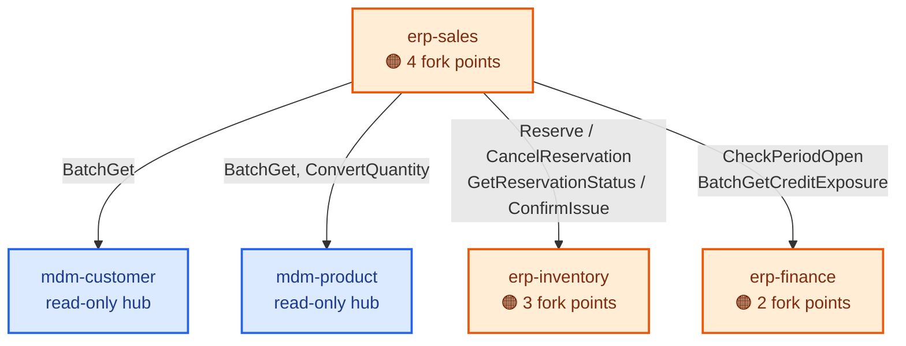
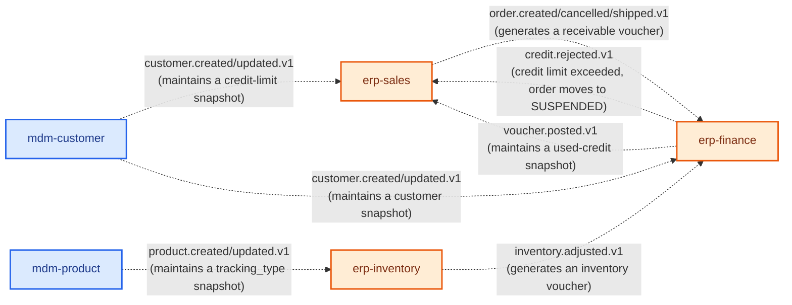

# Replaceability Map

> This document answers one question: **"If I want to swap out or customize some feature, what do I touch, and who does it drag in?"**
> The diagrams give the overall shape, the tables give the concrete list — **anything the diagram has no room for is in the tables; don't stop at the diagram alone.**
>
> Coverage: **the 14 components designed so far** (5 in the transaction chain from Phase 1 + 9 from infra/frontend/CRM in Phase 3).
> The other 48 components' slot families are already fully defined in the Design Book; this document only indexes them once, in §4, without re-transcribing them.
>
> ⚠️ **§1/§2's two diagrams only draw the 5 transaction-chain components** (Phase 1 + Phase 2). The 9 added in Phase 3 **are not drawn into the diagrams**,
> deliberately: 7 of them are zero-outbound-edge infra leaves or DAG roots (`infra-*`, `frontend-standard`,
> `infra-bff-mobile`), and **drawing them in would only bury the diagram's core message — that an arrow *is* the blast-radius path — under noise.**
> Their replaceability conclusions live entirely in §3's table and §4's index — **look there, not at the diagram.**

## 0. Read This First: What the Colors on the Diagram Mean

The three colors correspond to three **completely different kinds of "replaceable"** — conflating them is how you misread the diagram:

| Color | Name | How many repos change when you swap it | How many candidate implementations exist today |
|---|---|---|---|
| 🔵 Blue | **Read-only hub** | No reason found yet to swap it — read from every direction, carries no business divergence of its own | 1 (the default implementation) |
| 🟠 Orange | **A fork point** (inside a component) | **Only this one repo** (provided the gRPC/event contract doesn't change, see §1) | 1 (the default implementation, with the change points already noted in its design plan) |
| 🟣 Purple | **A slot family** (assembly-level) | **Just one line of `brickkit.yaml`**, no code changes at all | 2 or more (a real parallel implementation already exists, or is about to) |

**These are not three degrees of the same thing — they are three physically different mechanisms**: a slot family is "the platform picks one at assembly time," a fork point is "the customer copies the code and edits it," and a read-only hub currently needs neither. Failing to keep these three apart is how you end up asking something like "can `erp-inventory` be turned into a slot selectable in `brickkit.yaml`" — **the answer is no**, see §3.

## 1. The Synchronous-Call Graph (every arrow on this diagram is a "contract firewall")

**How to read this diagram:**

- **The arrow itself is the only path along which a change can drag something else in.** `erp-sales` only knows the rpc signatures written on the arrow — whatever picking strategy `erp-inventory` swaps to internally, `erp-sales` sees not one byte of it, because it never appeared in the contract to begin with.
- **No arrow, no blast radius.** The diagram deliberately has no `erp-inventory → mdm-product` edge (even though inventory records are kept against products) — that edge was rejected in the design plan, see `erp-inventory`'s design plan §5.
- ⚠️ **A change only actually drags something else in under two conditions:**
  1. The component an arrow points at gets swapped out entirely (not an internal strategy change, but a genuinely different implementation — but **not one slot family has been built on any of these five components yet**, see §3, so this case doesn't currently exist);
  2. A new requirement requires **the arrow itself to grow thicker** — e.g. "partial reservation plus a backorder" requires `erp-inventory` to add a new `PartialReserve` rpc. **This still isn't "swap the whole thing out"** — it's adding a backward-compatible method to the contract (§3.4 Iron Rule 3: additive only).

## 2. The Event Graph (dashed; cycles are allowed, but it's still a contract)

⚠️ **The `erp-finance → erp-sales` event edge is easy to overlook**: `credit.rejected.v1` is this phase's only edge where "the downstream sends a message to the upstream" (`erp-finance` usually only ever receives business events, never sends them). **An event's payload field names and semantics are a contract, exactly the same as an rpc signature** — renaming a field still has to go through "additive only, never change" (Decision 19); being asynchronous doesn't earn it an exemption.

## 3. What Each Fork Point Concretely Is (the part the diagram has no room for)

| Component | Fork point | The real-world divergence | What forking it concretely changes | What stays untouched (inside the contract boundary) | Design-plan source |
|---|---|---|---|---|---|
| `erp-inventory` | Costing method | ERPNext configures it per material, Odoo per product category | The internal costing module + possibly a new field | The `Reserve`/`ConfirmIssue` etc. rpc signatures; `erp.inventory.adjusted.v1`'s fields (the amount calculation lives in the consumer, `erp-finance`, not here) | §8 |
| `erp-inventory` | Backfill/correction strategy | ERPNext rewrites history (repost), Odoo appends a reversal layer (vacuum) | The write logic for `inventory_movements`; **choosing "rewrite" here would directly violate §2.1's additive-only design — it's a different architecture, not a small change** | The outward-facing rpcs stay unchanged | §2.1, §8 |
| `erp-inventory` | Picking/issuing strategy | FIFO / LIFO / FEFO / nearest-bin / wave picking | The algorithm inside `Reserve` for which batch to pick | `Reserve`'s inputs and outputs stay unchanged (the caller doesn't care which batch got picked) | §8 |
| `erp-finance` | Period-close strategy | Tryton closes at the period-entity + journal granularity, Odoo locks a date at the company level, ERPNext runs all three schemes side by side | The `accounting_periods` table structure + the internals of `ClosePeriod`/`LockPeriod` | The semantics of `CheckPeriodOpen`'s return value (`OPEN`/`CLOSED`/`NOT_FOUND`) — **this is the only part `erp-sales` knows about** | §3.1, §8 |
| `erp-finance` | Late-document strategy | Reject / roll forward to the next period / a role can force-post | The branch that handles "the period is already closed" at posting time | Same as above | §3.1, §8 |
| `erp-sales` | Reservation strictness | Full reservation on confirmation (our default) / manual reservation / reservation by date | When `ConfirmOrder` internally calls `Reserve` | The call contract to `erp-inventory` stays unchanged | §2.1, §8 |
| `erp-sales` | Stockout strategy | Fail the whole order (default) / partial shipment plus a backorder / wait until fully available | `ConfirmOrder`'s failure-handling branch; **"partial shipment" needs `erp-inventory` to cooperate by adding `PartialReserve` — this is the one divergence in this whole map where a change drags in another repo** | If partial shipment isn't implemented, `erp-inventory`'s contract needs no change | §8 |
| `erp-sales` | Invoicing basis | Invoice by order quantity / invoice by shipped quantity | When invoicing is triggered (Phase 2 doesn't implement invoicing yet; the fork point is noted for later) | —— | §9-5, §8 |
| `erp-sales` | Pricing-engine shape | First matching row in an ordered table wins (Odoo, our default) / a composable rule chain (metasfresh) | The `pricelists`/`pricelist_items` table structure + `CalculatePriceDryRun`'s internal algorithm | `CalculatePriceDryRun`'s inputs and outputs stay unchanged | §3.2, §8 |
| **`infra-print`** | **Template shape** | **HTML** (ERPNext, Odoo, our default) / **ODT + LibreOffice** (OCA's `report_py3o`, Tryton's `relatorio`) — the latter's selling point is that **business users can WYSIWYG-edit templates themselves, no developer needed** | The whole implementation behind the internal rendering interface from §3.3 | **`Render`'s inputs and outputs stay unchanged**, callers (`erp-sales` etc.) are completely unaware | §3.3, §8 |
| **`infra-print`** | **Rendering engine** | WeasyPrint (light, small image, our default) / Chromium (higher layout fidelity but heavy). ⚠️ **ERPNext is actively migrating from wkhtmltopdf to Chromium — "the engine will get swapped" is a real-world-verified event, not a hypothetical** | Same as above, just swap the implementation class behind `render(template, data) -> bytes` | Same as above | §3.3, §8 |
| **`infra-notification`** | **Multi-channel delivery strategy** | Fire every channel concurrently (our default) / degrade by priority (only SMS if DingTalk fails) / the user picks a single primary channel | The few dozen lines of routing logic + one more column on the preference table | The events it consumes and the dispatch events it emits stay unchanged | §8 |
| **`crm-opportunity`** | **Won-opportunity-to-order: automatic vs. manual confirmation** | **Odoo makes it a manual button** (after winning, sales clicks "create quotation") / automatic order creation (our default, required by Appendix E). Automatic suits standardized, low-unit-price business; manual suits large deals needing a second look at contract terms | Whether `crm.opportunity.won.v1` gets published at all (the publisher side) or whether the consumer (`erp-sales`) creates an order on receiving it | The event's subject and fields stay unchanged | §8, §9-2 |
| **`crm-opportunity`** | **Stage-progression constraints** | Jump to any stage (our default) / must progress in order / skipping a stage needs approval | The validation branch inside `ChangeStage` | The rpc signature stays unchanged | §2.2, §8 |

**How to use this table:** when a customer wants some customization, look in this table first for whether the divergence is already on record — if it is, follow the "what forking it concretely changes" column, and **as long as the "what stays untouched" column's contract really doesn't change once you're done, no other repo needs to be touched at all.** For a new divergence with no existing record, follow the Master Guide's SOP-R R-4 criterion (while reading reference implementations, "every one of them is reasonable" is the signal) — add a row to this table first, then start work.

## 4. Two Other Kinds of "Replaceable" (already written up in the Design Book — this is only an index)

| Mechanism | What changes when you swap it | Current candidates | Authoritative source |
|---|---|---|---|
| **Slot family** (pick one in `brickkit.yaml`) | One line of config, zero code | `slot:frontend` (4 mutually exclusive, **`standard` designed in Phase 3**), `slot:payroll` (by country), `slot:iam` (**`casdoor` designed in Phase 3**, `keycloak` still to be built), `channel:im` (**`dingtalk` designed in Phase 3**, 4 others still to be built) / `channel:payment` / `channel:esign` (multi-select, coexisting) | Design Book §5.11, §5.9, §5.2 |
| **Resource engine** (`brickkit.yaml`'s `resources[].engine`) | Change the `engine` field (protocol-compatible) or change `engine` plus a batch of `component.yaml` files (protocol-incompatible) | `database` (postgresql, no candidate yet), `mq` (nats → kafka, protocol-incompatible), `storage` (the capability name `s3`; RustFS/MinIO/OSS is a zero-change swap) | AGENTS.md's onboarding guide, items 11/12; Decision 105 |

⚠️ **These two are two tracks running parallel to §3's fork points — don't conflate them.** A slot family swaps "the whole component"; a fork point swaps "one piece of logic inside a component"; a resource engine swaps "infrastructure outside any component." Each of the three tracks has its own criterion, its own cost, and touches its own set of files.

### 4.1 ⭐ A Pattern That Only Became Clear at 14 Components: Whether Something Can Become a Slot Depends Entirely on Its Position in the DAG

Lay the 9 divergences from Phase 2 next to the 5 newly judged in Phase 3 (`infra-workflow`'s approval routing,
`infra-print`'s two, `infra-notification`'s one, `crm-opportunity`'s two), and **the verdict lines up more
neatly than expected**:

| Position in the dependency graph | Where the divergence lands | Examples |
|---|---|---|
| **Anything depends on it** | **Always `customer_fork`**, never a slot | `erp-*`, `crm-opportunity`, `infra-workflow`, `infra-print`, `infra-notification` |
| **Nothing depends on it** (a DAG leaf or root) | **Can become a slot** | `slot:frontend` (the frontend only ever talks to the gateway, nothing depends on it), `slot:iam` (reached via the `iamJwksUrl` config item, not a dependency edge), `channel:im` (deliberately provides no send-a-message rpc, can only be reached through events) |

**The criterion is not "how important is this feature" or "how big is the divergence" — it's a purely topological fact: does anyone hold a dependency edge on it.**
The reason is physical — the variable name the platform injects is derived from the component ID (`INFRA_IAM_CASDOOR_ENDPOINT`), **the implementation's name is baked into the variable name itself**,
so the moment anything depends on it, swapping the implementation stops being "change one line of config" and becomes "change dozens of manifests plus source code" (§5.11).

⚠️ **This yields a concrete design action**: to keep some position **swappable in the future**, the design must **deliberately cut off its inbound edges** at design time —
`slot:iam` is reached via the `iamJwksUrl` config item, `channel:im` simply provides no synchronous rpc at all, the frontend only ever talks to the gateway —
**none of these three are a coincidence; they are the design cost deliberately paid to preserve replaceability.** Conversely, `infra-print` provides a `Render` rpc,
so it can only ever be forked. **This trade-off is locked in the moment the contract is drawn — it cannot be undone afterward.**

## 5. The One-Sentence Version (for anyone in a hurry)

> **Look at the arrows on the diagram — an arrow is the answer to whether you can get away with changing just one repo.** As long as the rpc/event fields an arrow points at don't change, the components on either end of that arrow are blind to whatever changed inside each other. Only when the arrow itself needs to get thicker (a new field, a new rpc) do both sides need to move together — and even then, only additively and backward-compatibly, never a clean-slate redo.
