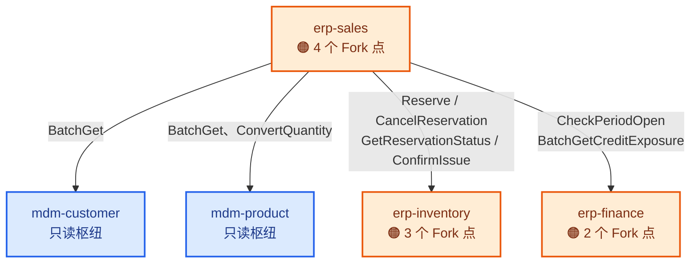
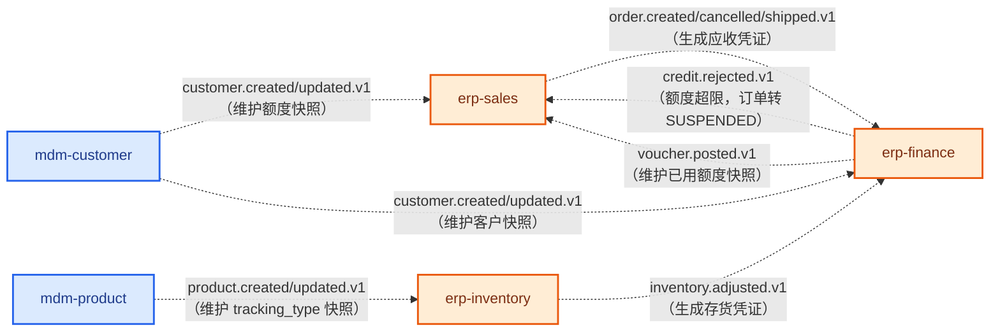

# 可替换性地图

> 这份文档回答一个问题：**"我想换掉/定制某个功能，要动哪里、会牵连到谁？"**
> 图给整体形状，表给具体清单——**图里放不下的细节，都在表里，别只看图**。
>
> 覆盖范围：**已设计的 14 个组件**（阶段一 5 个交易链 + 阶段三 9 个 infra/前端/CRM）。
> 其余 48 个组件的槽位族已经在设计书里定义完整，本文档只在 §4 做一次索引，不重复搬运。
>
> ⚠️ **§1/§2 那两张图只画交易链那 5 个**（阶段一 + 阶段二）。阶段三新增的 9 个**没有画进图里**，
> 是刻意的：它们里面 7 个是零出边的 infra 叶子或 DAG 根（`infra-*`、`frontend-standard`、
> `infra-bff-mobile`），**画进去只会让"箭头就是牵连路径"这个核心信息被噪声淹没**。
> 它们的可替换性结论集中在 §3 的表和 §4 的索引里——**看那两处，不看图**。

## 0. 先读这条：图上颜色代表什么

三种颜色对应三种**完全不同的"可替换"**，混着理解就会读错图：

| 颜色 | 叫法 | 换的时候动几个仓库 | 现在有几个候选实现 |
|---|---|---|---|
| 🔵 蓝 | **只读枢纽** | 目前没发现要换的理由——被四面八方读，自己不含业务分歧 | 1（默认实现） |
| 🟠 橙 | **Fork 点**（组件内部） | **只动这一个仓库**（前提：gRPC/事件契约不变，见 §1） | 1（默认实现 + 设计计划里记好了改动点） |
| 🟣 紫 | **槽位族**（assembly 级） | **只改 `brickkit.yaml` 一行**，不改任何代码 | 2 个以上（已经有真实的平行实现，或即将有） |

**这三种不是同一件事的三个程度，是三种物理上不同的机制**：槽位族是"平台在装配期挑一个"，Fork 点是"客户在代码里复制一份改"，只读枢纽目前两者都不需要。分不清这三种，就会问出"能不能把 `erp-inventory` 做成 `brickkit.yaml` 里选的槽位"这种问题——**答案是不能**，见 §3。

## 1. 同步调用图（这张图上的箭头就是"契约防火墙"）

**怎么读这张图：**

- **箭头本身就是"改了会牵连"的唯一路径。** `erp-sales` 只认箭头上写的那几个 rpc 签名——`erp-inventory` 内部换成哪种拣货策略，`erp-sales` 一个字节都看不见，因为它从来没在契约里出现过。
- **没有箭头就没有牵连。** 图上故意没有 `erp-inventory → mdm-product` 这条边（虽然库存记的是产品的货）——那条边被设计计划否决了，见 `erp-inventory` 设计计划 §5。
- ⚠️ **牵连只在两种情况下真的发生：**
  1. 箭头指向的组件被整个换掉（不是内部改策略，是换了一个不同的实现——但**目前一个槽位族都没建在这五个组件上**，见 §3，所以这种情况现在不存在）；
  2. 新需求要求**箭头本身变粗**——比如"部分预留+欠单"要求 `erp-inventory` 新增一个 `PartialReserve` rpc。**这仍然不是"整套换掉"**，是给契约新增一个向后兼容的方法（§3.4 铁律 3：只许追加）。

## 2. 事件图（虚线；允许环，但同样是契约）

⚠️ **`erp-finance → erp-sales` 这条事件边容易被漏看**：`credit.rejected.v1` 是本阶段唯一一条"下游发消息给上游"的边（`erp-finance` 通常只收不发业务事件）。**事件的 payload 字段名与语义，跟 rpc 签名一样是契约**——改字段名一样要走"只增不改"（决策 19），不能因为它是异步的就随便改。

## 3. 每个 Fork 点具体是什么（图放不下的部分）

| 组件 | Fork 点 | 现实中的分歧 | Fork 时具体改什么 | 不用改什么（契约边界内） | 设计计划出处 |
|---|---|---|---|---|---|
| `erp-inventory` | 成本核算法 | ERPNext 按物料配、Odoo 按产品类别配 | 内部的成本计算模块 + 可能新增字段 | `Reserve`/`ConfirmIssue` 等 rpc 签名；`erp.inventory.adjusted.v1` 的字段（金额算法在消费方 `erp-finance`，不在这） | §8 |
| `erp-inventory` | 补录历史策略 | ERPNext 改写历史（repost）、Odoo 追加冲销层（vacuum） | `inventory_movements` 的写入逻辑；**这条如果选"改写"，会直接违反 §2.1 的只增不改设计，等于换了另一套架构，不是小改** | 对外 rpc 不变 | §2.1、§8 |
| `erp-inventory` | 拣货/发料策略 | FIFO / LIFO / FEFO / 就近库位 / 波次 | `Reserve` 内部挑哪批货的算法 | `Reserve` 的入参出参不变（调用方不关心挑了哪批） | §8 |
| `erp-finance` | 关账策略 | Tryton 期间实体+日记账粒度、Odoo 公司级锁日期、ERPNext 三套并存 | `accounting_periods` 表结构 + `ClosePeriod`/`LockPeriod` 内部逻辑 | `CheckPeriodOpen` 的返回值语义（`OPEN`/`CLOSED`/`NOT_FOUND`）——**这是 `erp-sales` 唯一认识的部分** | §3.1、§8 |
| `erp-finance` | 迟到单据策略 | 拒绝 / 顺延下期 / 角色强改 | 过账时对"期间已关"的处理分支 | 同上 | §3.1、§8 |
| `erp-sales` | 预留严格度 | 确认即全额预留（我们的默认）/ 手工预留 / 按日期预留 | `ConfirmOrder` 内部何时调 `Reserve` | 对 `erp-inventory` 的调用契约不变 | §2.1、§8 |
| `erp-sales` | 缺货策略 | 整单失败（默认）/ 部分发货+欠单 / 等齐再发 | `ConfirmOrder` 的失败处理分支；**"部分发货"需要 `erp-inventory` 配合新增 `PartialReserve`，是本地图唯一一条"改了会牵连别的仓库"的分歧** | 若不做部分发货，`erp-inventory` 契约不用动 | §8 |
| `erp-sales` | 开票基准 | 按订单量开票 / 按发货量开票 | 触发开票的时机（阶段二未实现开票，Fork 点先记下） | —— | §9-5、§8 |
| `erp-sales` | 定价引擎形态 | 有序表第一条赢（Odoo，我们的默认）/ 规则链可组合（metasfresh） | `pricelists`/`pricelist_items` 表结构 + `CalculatePriceDryRun` 内部算法 | `CalculatePriceDryRun` 的入参出参不变 | §3.2、§8 |
| **`infra-print`** | **模板形态** | **HTML**（ERPNext、Odoo，我们的默认）/ **ODT + LibreOffice**（OCA `report_py3o`、Tryton `relatorio`）——后者的卖点是**业务人员自己所见即所得改模板，不用开发者** | §3.3 那个内部渲染接口的实现整个换掉 | **`Render` 的入参出参不变**，调用方（`erp-sales` 等）完全无感 | §3.3、§8 |
| **`infra-print`** | **渲染引擎** | WeasyPrint（轻、镜像小，我们的默认）/ Chromium（版式保真但重）。⚠️ **ERPNext 正在从 wkhtmltopdf 迁往 Chromium，"引擎会换"是被现实验证过的** | 同上，只换 `render(template, data) -> bytes` 的实现类 | 同上 | §3.3、§8 |
| **`infra-notification`** | **多通道到达策略** | 全通道并发发（我们的默认）/ 按优先级降级（钉钉失败才发短信）/ 用户单选一个主通道 | 路由那段几十行逻辑 + 偏好表多一列 | 消费的事件、发出的 dispatch 事件都不变 | §8 |
| **`crm-opportunity`** | **赢单转订单：自动 vs 人工确认** | **Odoo 是手工按钮**（赢单后销售点"新建报价单"）/ 自动建单（我们的默认，附录 E 要求）。自动适合标准化高、单价低的业务；人工适合要二次确认合同条款的大单 | 发不发 `crm.opportunity.won.v1`（发布方）或收到后建不建单（消费方 `erp-sales`） | 事件的 subject 与字段不变 | §8、§9-2 |
| **`crm-opportunity`** | **阶段推进约束** | 任意跳转（我们的默认）/ 必须顺序推进 / 跳阶段要审批 | `ChangeStage` 内部的校验分支 | rpc 签名不变 | §2.2、§8 |

**怎么用这张表：** 客户要什么定制，先在这张表里找有没有现成的分歧记录——有就照"Fork 时具体改什么"那栏动手，**改完只要"不用改什么"那栏列的契约没变，就不用碰任何别的仓库**。没有现成记录的新分歧，走总纲 SOP-R 的 R-4 判据（读参考实现时"每一种都合理"就是信号），先补一行到这张表，再动手。

## 4. 另外两种"可替换"（已在设计书写好，这里只做索引）

| 机制 | 换的时候动什么 | 现在的候选 | 权威出处 |
|---|---|---|---|
| **槽位族**（`brickkit.yaml` 选一个） | 一行配置，零代码 | `slot:frontend`（4 个互斥，**`standard` 阶段三已设计**）、`slot:payroll`（按国家）、`slot:iam`（**`casdoor` 阶段三已设计**，`keycloak` 待建）、`channel:im`（**`dingtalk` 阶段三已设计**，另 4 个待建）/`channel:payment`/`channel:esign`（多选并存） | 设计书 §5.11、§5.9、§5.2 |
| **资源引擎**（`brickkit.yaml` 的 `resources[].engine`） | 改 `engine` 字段（协议兼容）或改 `engine` + 一批 `component.yaml`（协议不兼容） | `database`（postgresql，暂无候选）、`mq`（nats → kafka，协议不兼容）、`storage`（s3 能力名，RustFS/MinIO/OSS 零改动） | AGENTS.md 导读第 11/12 条、决策 105 |

⚠️ **这两种和 §3 的 Fork 点是三条平行的轨道，不要混。** 槽位族换的是"整个组件"，Fork 点换的是"一个组件内部的一段逻辑"，资源引擎换的是"组件之外的基础设施"。三条轨道各自的判据、代价、动的文件完全不同。

### 4.1 ⭐ 走到 14 个组件时才看清的规律：能不能做成 slot，只取决于它在 DAG 上的位置

把阶段二那 9 条分歧、加上阶段三新判的 5 条（`infra-workflow` 的审批路由、`infra-print` 的两条、
`infra-notification` 的一条、`crm-opportunity` 的两条）摆在一起，**判定结果整齐得出乎意料**：

| 组件在依赖图上的位置 | 分歧的落点 | 例子 |
|---|---|---|
| **有任何组件依赖它** | **一律 `customer_fork`**，一条都不能做成 slot | `erp-*`、`crm-opportunity`、`infra-workflow`、`infra-print`、`infra-notification` |
| **没有任何组件依赖它**（DAG 叶子或根） | **可以做成 slot** | `slot:frontend`（前端只认网关，没人依赖它）、`slot:iam`（走 `iamJwksUrl` 配置项而非依赖边）、`channel:im`（刻意不提供发消息 rpc，只能事件进） |

**判据不是"这个功能重不重要"，也不是"分歧大不大"，而是一件纯拓扑的事：有没有人对它建依赖边。**
原因是物理的——平台注入的变量名由组件 ID 推导（`INFRA_IAM_CASDOOR_ENDPOINT`），**变量名里带着实现的名字**，
所以一旦有人依赖它，换实现就从"改一行配置"变成"改几十份 Manifest 加源码"（§5.11）。

⚠️ **由此得到一条设计动作**：想让某个位置**将来能换**，就要在设计时**主动切断入边**——
`slot:iam` 用 `iamJwksUrl` 配置项、`channel:im` 干脆不提供同步 rpc、前端只认网关，
**这三处都不是巧合，是为了保住可替换性而付的设计代价**。反过来，`infra-print` 提供了 `Render` rpc、
于是永远只能 Fork。**这个取舍在画契约的那一刻就定了，事后改不动。**

## 5. 一句话版本（给赶时间的人）

> **看图上的箭头，箭头就是能不能只改一个仓库的答案。** 箭头指向的 rpc/事件字段不变，箭头两头的组件互相看不见对方内部改了什么；箭头本身要加粗（新增字段/新增 rpc），才需要两边一起动，而且只能向后兼容地加，不能推倒重来。
